# 1주차 1교시 (W1_S1) — 강의 소개 및 Vivado·Vitis 설치

**SoC 설계** | Vivado/Vitis 2023.2 · Windows 11 · Digilent Cora Z7-07S

---

## 학습 목표

- 강의 자료가 배포되는 GitHub 저장소에 접속해 주차별 문서를 열람할 수 있다
- 이번 학기 "SoC 설계" 과목의 목표를 설명할 수 있다
- AMD(Xilinx) 계정을 만들고 Vivado/Vitis 설치 파일을 내려받을 수 있다
- 자신의 컴퓨터가 설치에 필요한 저장 공간과 사양을 충족하는지 확인할 수 있다
- Vivado/Vitis 설치 과정에서 이번 과목에 필요한 옵션(Zynq-7000 디바이스)을 올바르게 선택할 수 있다
- 설치가 정상적으로 끝났는지 스스로 확인할 수 있다

---

## 1.1 강의 자료 저장소 접근 — GitHub

이 과목의 교재와 실습 자료는 **GitHub**라는 사이트의 공개 저장소(repository)로 배포된다. 수업 중 새 주차 자료가 올라오면 각자 웹 브라우저로 접속해서 확인한다.

> **GitHub이란?** 코드와 문서의 변경 이력을 관리하는 **Git**이라는 도구를, 웹에서 편하게 쓸 수 있게 만든 사이트다. 이 과목에서는 "자료를 보고 내려받는 용도"로만 사용하며, 학생이 직접 자료를 수정해서 올릴 필요는 없다.

### GitHub 계정 만들기

1. 웹 브라우저에서 `github.com` 에 접속한다.
2. 우측 상단 **Sign up**을 클릭한다.
3. 이메일 주소, 비밀번호, 사용자명(Username)을 입력한다.
   - 사용자명은 이후 계속 쓰이므로 알아보기 쉬운 이름으로 정한다 (예: 학번을 포함한 영문 조합).
4. 이메일 인증(확인 코드 입력)을 완료하면 계정 생성이 끝난다.

📷 **캡처 필요 ⑨** — GitHub 회원가입 화면
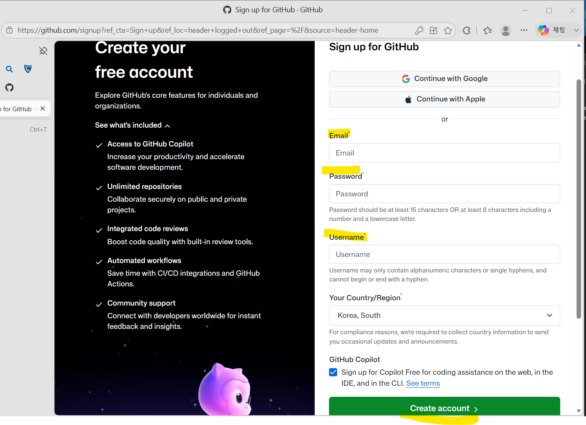

### 강의 저장소 접근 방법

1. 강의 저장소 주소로 접속한다: **https://github.com/cwhyung26/SoC_2026_2**
   - 또는 담당 교수 GitHub 프로필에서 `SoC_2026_2` 저장소를 찾아 들어간다.
2. 로그인하지 않아도 내용은 볼 수 있다 (Public 저장소). 파일 목록에서 원하는 주차 폴더(`W1_...`, `W2_...`)를 클릭해 들어간다.
3. `.md` 문서를 클릭하면 GitHub이 자동으로 보기 좋게 변환해서 보여준다.
4. 그림이 포함된 문서도 브라우저에서 그대로 렌더링되어 보인다.

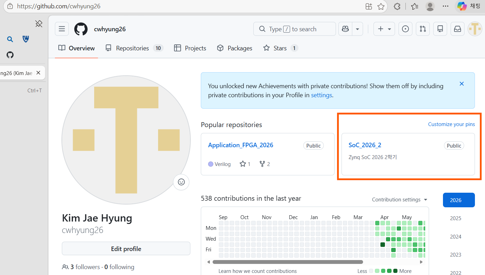

주차 폴더로 들어가면 교재 `.md` 파일과 `img/` 그림, 예제 코드가 함께 들어 있다.

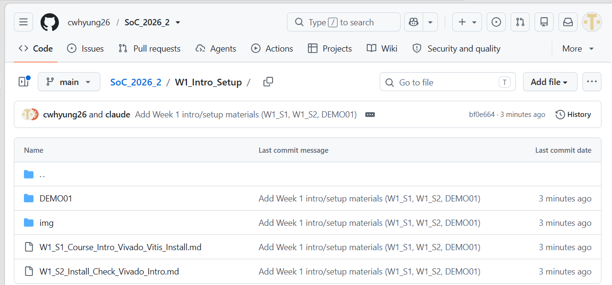

### 자료를 내 컴퓨터에 받아두기 (선택)

계속 인터넷에 접속해서 보기 번거롭다면, 저장소 전체를 압축 파일로 받아둘 수 있다.

```
저장소 페이지 → 초록색 <> Code 버튼 클릭 → Download ZIP
```

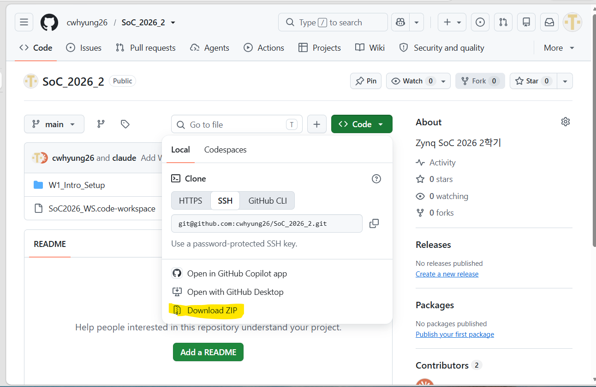

> **참고:** 저장소 내용이 자주 갱신되므로, ZIP은 그때그때의 스냅샷일 뿐이다. 최신 내용은 항상 웹사이트에서 다시 확인한다. Git 프로그램을 설치해 `git clone`/`git pull`로 최신 상태를 유지하는 방법은 필요할 때 별도로 안내한다.

### GitHub 계정 확인 체크리스트

- [ ] GitHub 계정을 만들고 이메일 인증을 완료했다.
- [ ] 강의 저장소 주소로 접속해 주차 폴더 목록을 확인했다.
- [ ] 최소 한 개의 `.md` 문서를 열어 그림까지 정상적으로 보이는지 확인했다.

---

## 1.2 과목 소개 — SoC 설계란 무엇인가

### 디지털 시스템 설계 방식의 변화

- 과거에는 프로세서 코드와 FPGA 회로를 각각 다른 사람이 설계한 뒤, 완성된 두 시스템을 케이블로 연결하는 방식이 일반적이었다.
- 최근에는 한 명의 엔지니어가 프로세서와 FPGA 회로를 하나의 칩 안에서 함께 설계하는 방식이 널리 쓰인다. 이런 설계 방식을 **Hardware/Software Co-design**이라 부른다.
- 프로세서와 FPGA 회로가 하나의 칩에 통합된 장치를 **SoC(System on a Chip)**라고 한다.

### 왜 FPGA 기반 SoC인가 — ASIC과의 비교

SoC를 만드는 방법에는 크게 두 가지가 있다.

| 구분 | ASIC 기반 SoC | FPGA 기반 SoC (Zynq 방식) |
|---|---|---|
| 회로 구성 | 반도체 공정으로 제작 후 **변경 불가** | Vivado로 **재프로그래밍 가능** |
| 개발 기간·비용 | 길고 비쌈 | 짧고 저렴 |
| 적합한 상황 | 변경이 거의 없는 대량 양산 제품 (예: 스마트폰 AP) | 빠른 개발이 필요하거나 소량 생산·연구·교육용 |

FPGA는 필요하면 내부에 프로세서 회로(Soft Processor)까지 설계해 넣을 수 있어, 이런 방식을 **SoPC(System on Programmable Chip)**라 부르기도 한다. Zynq는 이미 만들어진 ARM 프로세서(Hard Processor)와 FPGA를 함께 제공해, ASIC 없이도 프로세서 기반 SoC를 빠르게 구성할 수 있게 해준다.

### 일반적인 임베디드 시스템의 구조

Zynq를 살펴보기 전에, 프로세서가 들어간 디지털 시스템이 보통 어떻게 구성되는지 먼저 정리한다.

- **Processor** — 프로그램(소프트웨어)을 실행하며 시스템 전체의 동작을 결정한다.
- **Memory** — 실행할 프로그램과 데이터를 저장한다.
- **Peripheral** — Processor와 분리되어 특정 기능을 수행하는 부품이다. 센서, 액추에이터, LED, 스위치 등이 여기에 속한다.
- **Interconnection** — Processor, Memory, Peripheral을 서로 연결하는 통로다.

지난 학기 Quartus/DE0에서는 이 중 **Peripheral에 해당하는 회로(FPGA)만** 직접 설계했다. 이번 학기부터는 여기에 **Processor**가 추가되어, "Processor가 Peripheral(FPGA 회로)을 제어한다"는 관계까지 함께 설계한다.

### 왜 Zynq SoC인가

이 과목은 AMD(Xilinx)의 **Zynq-7000 SoC**로 Hardware/Software Co-design을 직접 실습한다. Zynq SoC는 두 영역으로 나뉜다.

- **PS(Processing System)** — ARM Cortex-A9 프로세서, DDR 메모리 컨트롤러, USB·UART 같은 표준 주변장치로 구성된 고정된 영역이다.
- **PL(Programmable Logic)** — 지난 학기 Quartus/DE0에서 다루던 FPGA와 같은 역할을 하는, 사용자가 자유롭게 회로를 설계할 수 있는 영역이다.

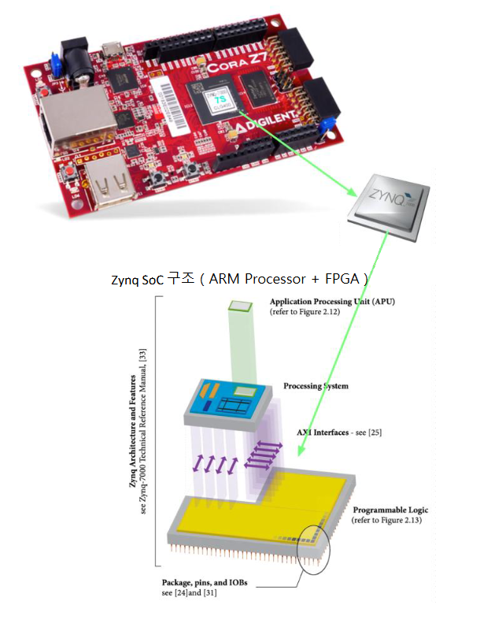

- 보드 위의 검은 칩 하나가 Zynq SoC다. 그 안에 **Processing System(PS)**과 **Programmable Logic(PL)**이 함께 들어 있다.
- **AXI Interfaces**는 PS와 PL을 연결하는 통로다. 그림의 화살표가 이 연결을 나타낸다.
- `Application Processing Unit(APU)`, `Package, pins, and IOBs` 같은 세부 항목은 Zynq-7000 Technical Reference Manual에 정의된 공식 명칭이며, 이 과목에서는 PS/PL 구분과 AXI 연결 개념만 우선 이해하면 된다.

PS와 PL은 **AXI(Advanced eXtensible Interface)**라는 표준 버스로 연결된다. PS는 AXI를 통해 PL에서 만든 회로를 레지스터 읽기/쓰기 방식으로 제어하고, PL은 속도가 중요한 연산을 프로세서 개입 없이 처리한다.

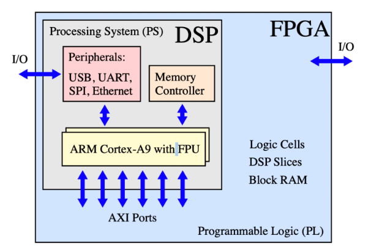

- **PS 내부**: `Peripherals`(USB, UART, SPI, Ethernet)와 `Memory Controller`가 `ARM Cortex-A9` 코어와 연결되어 있다. 이 영역은 **Vitis**로 개발한다.
- **PL 내부**: `Logic Cells`, `DSP Slices`, `Block RAM` 등 사용자가 회로를 구성할 수 있는 자원으로 채워진다. 이 영역은 **Vivado**로 개발한다.
- **AXI Ports**: PS와 PL 사이를 연결하는 포트. 4주차 이후 AXI GPIO 실습에서 직접 다룬다.

Cora Z7-07S 기준으로 정리하면 다음과 같다.

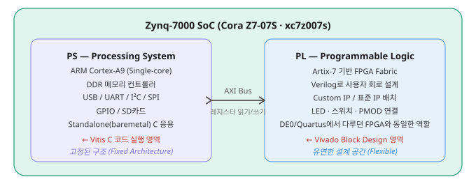

> **DE0/Quartus와 무엇이 달라지는가?** DE0는 FPGA(PL에 해당하는 부분)만 있는 보드였다. Cora Z7-07S는 여기에 ARM 프로세서(PS)가 추가되어, "회로가 프로세서의 제어를 받는" 구조를 실습할 수 있다.

### 이 과목에서 배우는 것

- FPGA(PL)에 Verilog로 하드웨어를 설계하고, 그 하드웨어를 제어하는 C 응용 프로그램을 프로세서(PS)에서 작성하는 전체 과정을 다룬다.
- 표준 인터페이스(GPIO, UART, I²C, SPI)를 이용해 센서·액추에이터와 통신하는 실습을 진행한다.
- 학기 후반에는 초음파 거리 센서, 자이로 센서, Bluetooth 통신, 모터 드라이버, AD 변환기 등 실제 주변장치를 이용한 응용 설계를 다룬다.

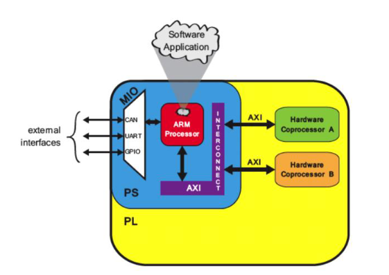

- PS는 `MIO`(Multiplexed I/O)를 통해 CAN, UART, GPIO 같은 외부 인터페이스와 직접 연결된다.
- PS의 ARM Processor는 `INTERCONNECT`(AXI Interconnect)를 거쳐 PL에 배치된 **Hardware Coprocessor**(사용자가 만든 회로, 이후 주차에서 다루는 Custom IP에 해당)를 여러 개 동시에 제어할 수 있다.

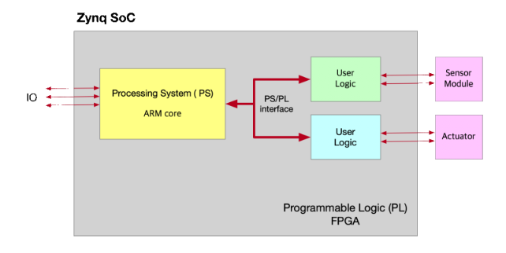

- PS(`ARM core`)는 `PS/PL interface`(AXI)를 거쳐 PL에 설계한 `User Logic`을 제어한다.
- 각 `User Logic`은 `Sensor Module`이나 `Actuator` 같은 외부 장치와 직접 연결된다. 앞서 언급한 초음파 센서·자이로 센서·모터 실습이 바로 이 구조를 따른다.

### SoC 설계 흐름

실제 SoC 시스템은 다음 단계를 거쳐 완성된다.

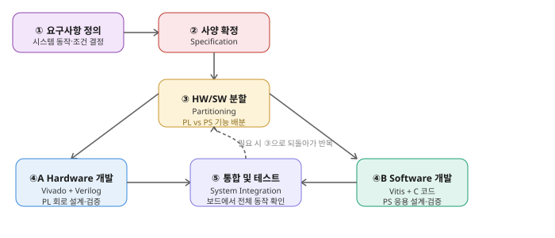

1. **요구사항 정의** — 시스템이 해야 할 동작과 필요한 조건을 정한다.
2. **사양 확정(Specification)** — 요구사항을 구체적인 수치·조건으로 정리한다.
3. **Hardware/Software 분할(Partitioning)** — 전체 기능 중 어떤 부분을 PL(하드웨어)로, 어떤 부분을 PS(소프트웨어)로 만들지 결정한다.
4. **병렬 개발** — 하드웨어(Vivado)와 소프트웨어(Vitis)를 나누어 개발하고 각각 검증한다.
5. **통합 및 테스트** — 하드웨어와 소프트웨어를 하나의 시스템으로 합쳐 보드에서 전체 동작을 확인한다.
6. 테스트 결과 문제가 있으면 ③단계로 돌아가 분할을 다시 검토한다.

이번 학기 실습은 이 흐름을 매주 작은 규모로 반복하면서 익히는 과정이다.

### 핵심 용어

| 용어 | 전체 이름 | 의미 |
|---|---|---|
| SoC | System on a Chip | 프로세서와 사용자 회로를 하나의 칩에 통합한 장치 |
| ASIC | Application Specific Integrated Circuit | 특정 용도로 제작 후 변경할 수 없는 반도체 — 대량 양산에 적합 |
| SoPC | System on Programmable Chip | FPGA처럼 재구성 가능한 회로로 구현한 SoC |
| PS | Processing System | ARM 프로세서와 고정 주변장치로 구성된 영역 |
| PL | Programmable Logic | Verilog로 사용자 회로를 구성하는 FPGA 영역 |
| Peripheral | — | Processor와 분리되어 특정 기능을 수행하는 부품(센서, LED, 스위치 등) |
| AXI | Advanced eXtensible Interface | PS와 PL을 연결하는 표준 버스 규격 |
| Co-design | Hardware/Software Co-design | 하드웨어와 소프트웨어를 함께 설계하는 방식 |

### 사용 도구와 보드 — 지난 학기와 비교

| 구분 | 이번 학기 | 지난 학기 |
|---|---|---|
| 제조사 | AMD (Xilinx) | Intel (Altera) |
| 보드 | Digilent **Cora Z7-07S** (Zynq-7000, `xc7z007s`) | DE0 |
| FPGA 설계 도구 | Vivado 2023.2 | Quartus 13 |
| 프로세서 코드 도구 | **Vitis 2023.2** (이번 학기 새로 추가) | 해당 없음 |
| HDL | Verilog (계속 사용) | Verilog |
| 실습 환경 | Windows | Windows |

### 수업 구성

| 항목 | 내용 |
|------|------|
| 전체 기간 | 14주 (강의 12주 + 중간·기말고사 2주) |
| 수업 형태 | 주 70분 × 2회(슬롯), 이론 설명 + 손으로 하는 실습 |
| 교재·실습 자료 | GitHub 공개 저장소로 배포 (1.1절 참고) |

---

## 1.3 Vivado/Vitis 다운로드 준비 — AMD 계정 만들기

Vivado와 Vitis는 **AMD 계정으로 로그인해야 다운로드**할 수 있다. 학교 계정이 아닌 개인 이메일로 미리 계정을 만들어 둔다.

1. 웹 브라우저에서 `AMD Vivado Design Suite` 로 검색해 공식 제품 페이지(`www.amd.com/.../vivado.html`)로 들어간다. (사이트 구조가 바뀔 수 있어 특정 URL을 외우는 것보다 검색이 더 안전하다.)
2. 페이지 우측 상단의 사람 모양 계정 아이콘을 클릭하면 **My Account / Create Account** 메뉴가 나타난다. **Create Account**를 클릭한다.
3. 이메일, 이름, 소속(학교명 입력 가능)을 입력해 계정을 만든다.
4. 가입 확인 이메일의 링크를 눌러 계정을 활성화한다.

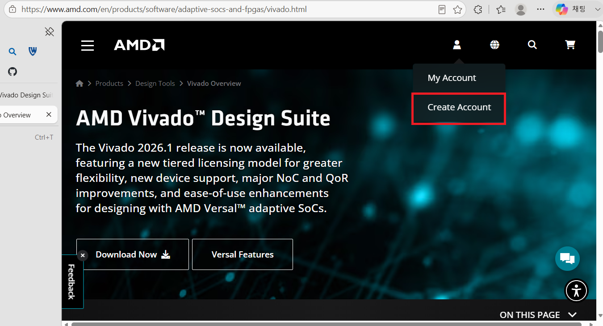

> **주의:** 계정 이메일과 비밀번호는 이후 다운로드 로그인, 라이선스 확인에도 계속 쓰이므로 반드시 본인이 접근 가능한 이메일로 만들고 기록해 둔다.

---

## 1.4 다운로드 방법과 설치 파일 선택

### 다운로드 페이지 진입

제품 페이지의 **Download Now** 버튼을 클릭하면 다운로드 페이지로 이동한다.

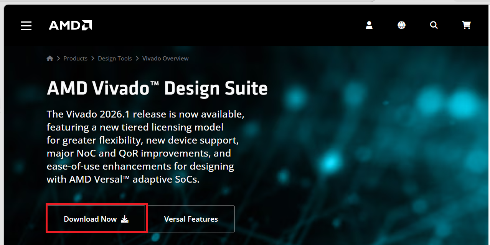

### 버전 선택 — 반드시 2023.2

AMD는 여러 버전의 Vivado/Vitis를 동시에 배포한다. 다른 버전은 이 과목의 실습 자료(LAB, XDC, 보드 파일 경로)와 호환되지 않을 수 있으므로 **반드시 2023.2 버전**을 받는다. 다운로드 페이지 상단의 **Version** 드롭다운에서 `2023.2`를 선택한다.

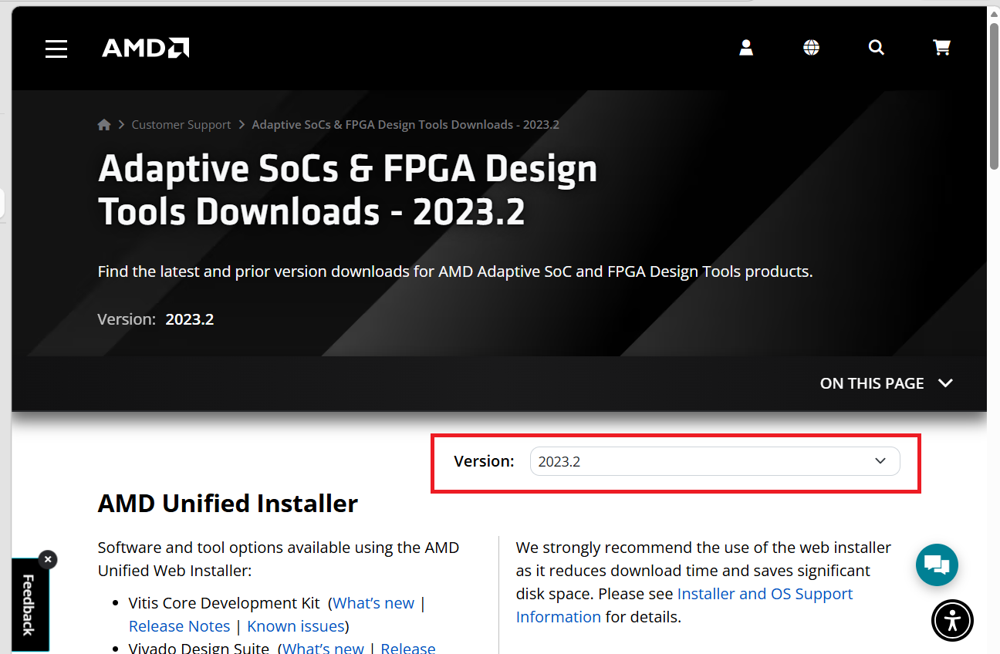

이 페이지 아래로 내려가면 **AMD Unified Installer**로 설치할 수 있는 제품 목록(Vitis Core Development Kit, Vivado Design Suite 등)이 나온다.

### 설치 파일 종류 — Windows Self Extracting Web Installer 권장

| 종류 | 특징 | 이번 과목 권장 여부 |
|------|------|------|
| **Web Installer** | 작은 실행 파일을 먼저 받고, 설치 중 필요한 부분만 인터넷에서 내려받음 | ✅ 권장 — 처음 받는 파일이 작아 시작이 빠름 |
| Full Single-File Download Image | 전체 설치 이미지(수십 GB)를 통째로 먼저 받은 뒤 오프라인 설치 | 인터넷이 느리거나 여러 대에 설치할 때만 사용 |

```
"Vivado™ ML Edition – 2023.2" 항목을 펼친다
→ Title: "AMD Unified Installer for FPGAs & Adaptive SoCs 2023.2:
   Windows Self Extracting Web Installer" 클릭
```

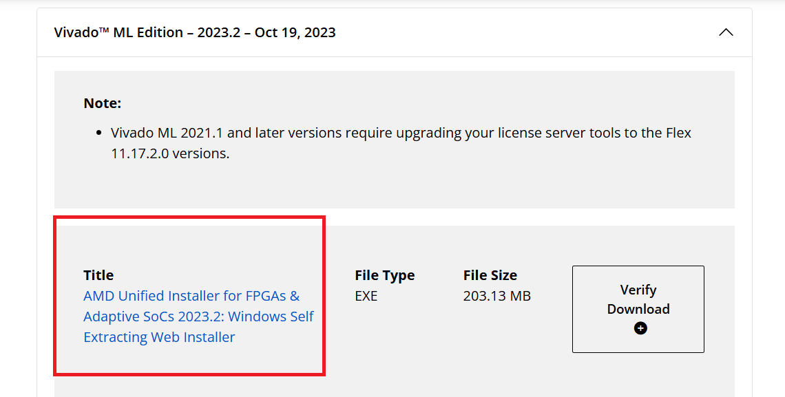

> **다운로드 시간:** Web Installer 실행 파일 자체는 약 **203 MB**로 크지 않지만, 실행 후 실제 설치 데이터(수십 GB)를 내려받는 과정이 설치 중에 별도로 진행된다. 학교/기숙사 네트워크 환경에 따라 **1~3시간 이상** 걸릴 수 있으므로 수업 시간이 아닌 별도 시간에 진행한다.

### 이름·주소 확인(수출 규정) 화면

다운로드 버튼을 클릭하면 **Download Center - Name and Address Verification** 페이지가 나타난다. 미국 수출 규정에 따라 AMD가 다운로드 전에 이름·이메일·주소를 확인하는 절차다.

```
First Name / Last Name : 본인 영문 이름
E-mail                 : 계정 이메일
```

- 영문 이름과 이메일을 정확히 입력한다. 우편사서함(P.O. Box)이나 억양 부호가 있는 비로마자 이름은 지원되지 않는다.

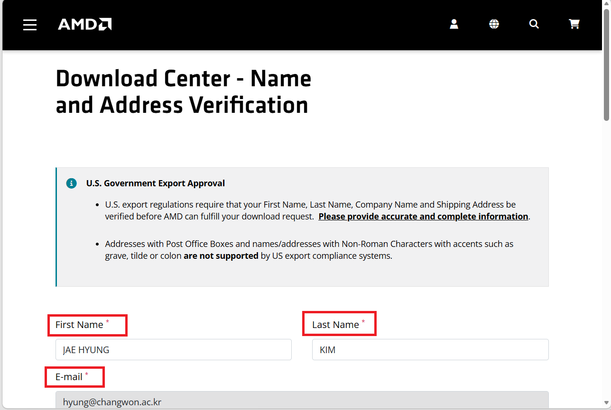

---

## 1.5 필요 저장 공간과 설치 옵션

### 디스크 여유 공간 확인

설치 전 반드시 여유 공간을 확인한다.

```
Windows 탐색기 → 내 PC → 설치할 드라이브 우클릭 → 속성 → "사용 가능한 공간" 확인
```

| 항목 | 실측값 (Vitis + Vivado + Zynq-7000C만 선택 시) | 비고 |
|------|------|------|
| Download Size | **16.77 GB** | 설치 중 실제로 내려받는 데이터 양 |
| Disk Space Required | **73.75 GB** | 설치 후 차지하는 디스크 용량 |

> **왜 이렇게 큰가?** Vivado/Vitis는 수십 종의 FPGA 디바이스 라이브러리를 포함한다. 필요한 디바이스(이 과목은 Zynq-7000C)만 선택하면 위 실측값 정도로 설치 용량을 줄일 수 있다. 다른 디바이스 계열까지 모두 선택하면 100GB를 훌쩍 넘는다.

설치 전 자신의 드라이브에 73.75 GB 이상 여유 공간이 있는지 확인한다.

```
Windows 탐색기 → 내 PC → 설치할 드라이브 우클릭 → 속성 → "사용 가능한 공간" 확인
```

---

## 1.6 설치 실행 절차 (Windows)

1. 받은 `.exe` 파일을 **관리자 권한으로 실행**한다 (우클릭 → 관리자 권한으로 실행). **Welcome** 화면이 뜬다.
2. **"A Newer Version Is Available"** 팝업이 뜰 수 있다. 최신 버전(2026.1 등)이 나와도 이 과목은 실습 자료 호환을 위해 **2023.2를 그대로 설치**해야 하므로 **Continue**를 클릭한다 (Get Latest를 누르지 않는다).

   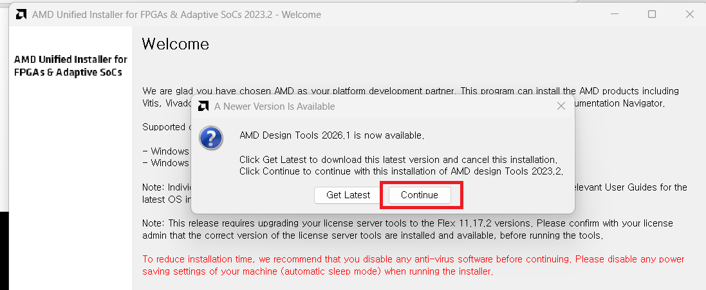

3. **Select Install Type** 화면에서 AMD 계정으로 로그인한다 (1.3절 계정: E-mail Address, Password 입력) 후 **Download and Install Now**를 선택한다.

   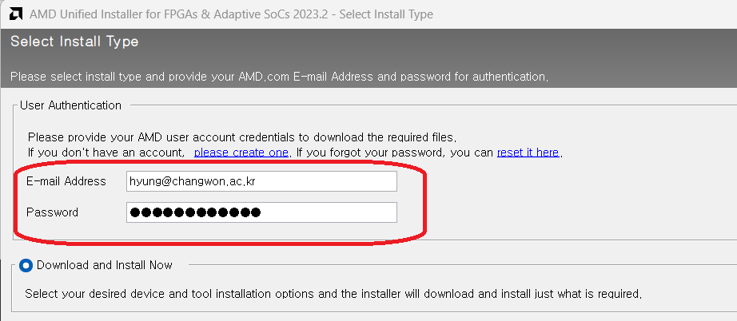

4. **Select Product to Install**에서 **Vitis**를 선택한다.
   ```
   ● Vitis                    ← 선택 — Vivado Design Suite가 함께 설치된다
   ○ Vivado                   ← Vivado 전체 기능만 설치 (Vitis Embedded Development는 별도 선택 가능)
   ○ Vitis Embedded Development ← Vivado 없이 임베디드 SW 개발 도구만 설치 (이번 과목에는 부족)
   ```

   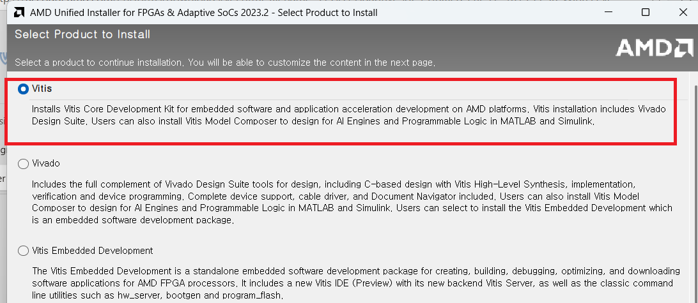

5. **Vitis Unified Software Platform** 화면(Customize 트리)에서 아래와 같이 체크한다.
   ```
   Design Tools
     ☑ Vitis Unified Software Platform
        ☑ Vitis
        ☐ Vitis IP Cache
        ☑ Vivado          ← 자동 체크됨 (Vitis 선택 시 함께 설치)
        ☑ Vitis HLS        ← 자동 체크됨
     ☐ Vitis Model Composer
   Devices
     ☑ Devices for Custom Platforms → ☑ SoCs → ☑ Zynq-7000C   ← 이 과목에 필요한 디바이스
        (7 Series / UltraScale / UltraScale+ / Versal ACAP 등 나머지는 체크 해제 상태 유지)
   Installation Options
     ☑ Install Cable Drivers   ← JTAG 케이블 사용을 위해 체크 유지
   ```
   화면 하단에 **Download Size 16.77 GB / Disk Space Required 73.75 GB**가 실시간으로 표시된다. 1.5절에서 확인한 여유 공간과 비교한다.

   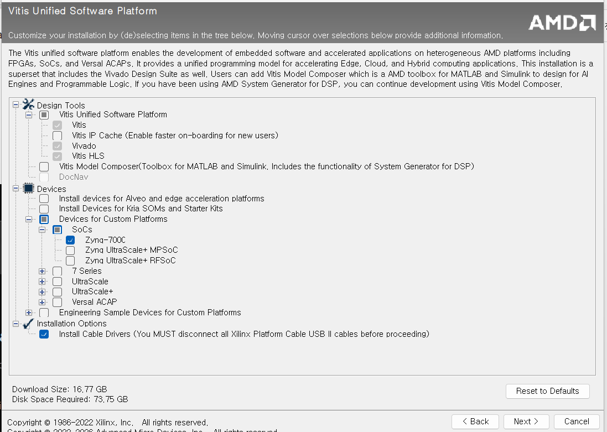

6. **License Agreement** 화면에서 4개 항목(Vitis EULA, Vivado EULA, Third Party EULA ×2)을 모두 **I Agree** 체크한다. 앞 단계에서 선택한 제품(Vitis, Vivado)에 해당하는 라이선스만 표시된다.

   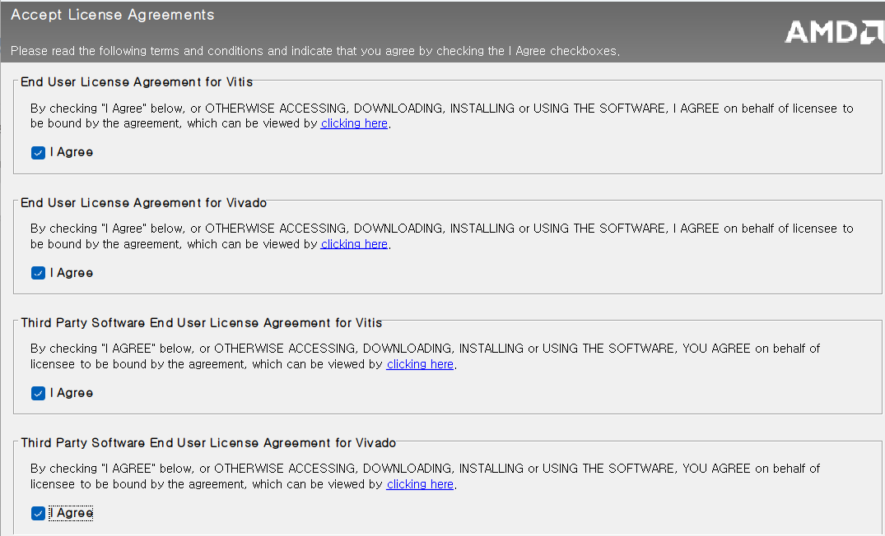

7. **Select Destination Directory** 화면에서 설치 경로를 확인한다. 특수문자·공백·한글이 없는 경로를 사용한다.
   ```
   Select the installation directory: C:\Xilinx
   ```
   - **Installation location(s)**: 실제 각 도구가 설치될 하위 경로 — `C:\Xilinx\Vitis\2023.2`, `C:\Xilinx\Vivado\2023.2`, `C:\Xilinx\Vitis_HLS\2023.2`
   - **Download location**: 설치 중 내려받는 파일이 임시로 쌓이는 경로 — `C:\Xilinx\Downloads\Vitis_2023.2`
   - **Disk Space Required**: Download Size(16.77 GB) / Disk Space Required(73.75 GB, 설치 중 최대 필요량) / **Final Disk Usage(39.74 GB, 설치 완료 후 실제 차지 용량)** / Disk Space Available(현재 드라이브 여유 공간)
   - **Disk Space Available이 Disk Space Required보다 작으면 빨간 글씨로 경고**가 뜬다 — 이 경우 설치를 진행할 수 없으므로 다른 드라이브를 선택하거나 공간을 확보해야 한다.

   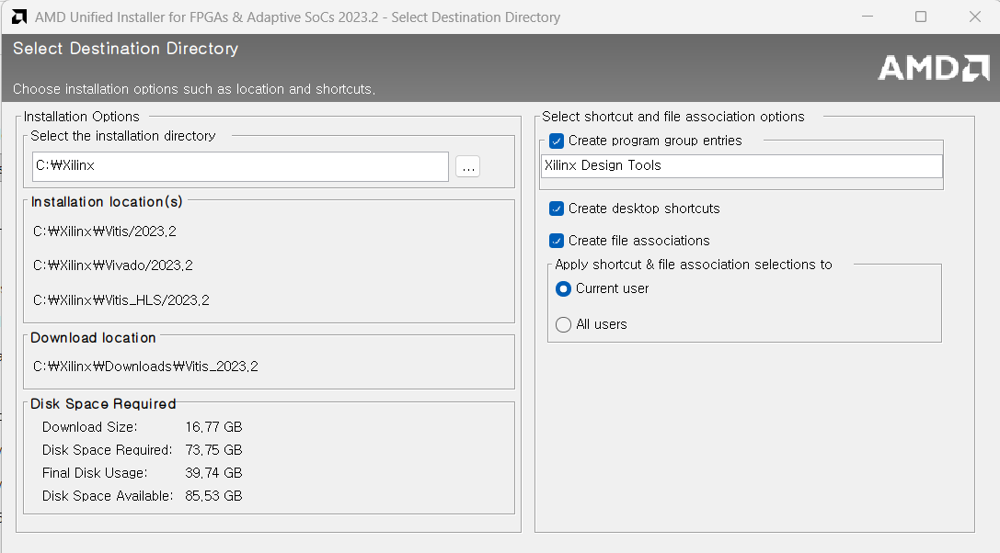

   > **Disk Space Required(73.75GB)와 Final Disk Usage(39.74GB)가 다른 이유:** 설치 도중에는 내려받은 원본 압축 파일과 풀린 파일이 동시에 존재해 일시적으로 더 많은 공간을 쓴다. 설치가 끝나면 임시 다운로드 파일이 정리되어 최종적으로는 더 적은 용량만 남는다.

8. **Summary** 화면에서 설치될 항목과 예상 용량을 최종 확인한 뒤 **Install**을 클릭하면 **Installation Progress** 화면에서 다운로드 → 설치 → 마무리 처리 순서로 진행률이 표시된다.

   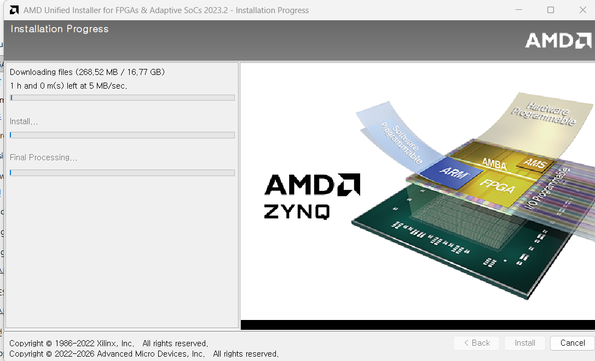

> **설치 경로에 한글·공백을 쓰면 안 되는 이유:** Vivado/Vitis 내부 도구 중 일부가 경로에 한글이나 공백이 있으면 파일을 제대로 찾지 못해 오류를 일으킨다. 사용자 이름이 한글인 계정(`C:\Users\홍길동\...`)을 쓰는 경우, 설치 위치를 `C:\Xilinx`처럼 별도 폴더로 지정한다.

> **설치 시간:** 컴퓨터 성능과 네트워크 속도에 따라 다르지만, 다운로드와 설치를 합쳐 **1~4시간** 정도로 예상하고 여유 있게 진행한다. 설치 도중 컴퓨터를 끄거나 절전 모드로 들어가지 않도록 전원 설정을 확인한다.

---

## 1.7 정상 설치 확인 방법

설치가 끝나면 다음 두 가지를 확인한다.

### ① Vivado 실행 확인

```
Windows 시작 메뉴 → "Vivado 2023.2" 검색 → 실행
```

Vivado가 열리면 시작 화면(Quick Start)의 왼쪽 하단이나, 메뉴 **Help → About Vivado**에서 버전을 확인한다.

```
확인할 값: Vivado v2023.2 (64-bit)
```

📷 **캡처 필요 ⑦** — Vivado About 창에 버전이 표시된 화면


### 라이선스 확인

Vivado를 처음 실행하면 라이선스 관련 창이 뜰 수 있다. **Cora Z7-07S(`xc7z007s`)는 AMD의 무료 WebPACK 라이선스로 지원되는 디바이스**이므로 별도로 결제하거나 라이선스 파일을 구매할 필요가 없다.

```
라이선스 창이 뜨면:
Get License → "Get Free ML Standard License" (또는 "Obtain License") 선택
→ Connect Now 클릭 (인터넷 연결 상태에서 자동 활성화)
```

- 인터넷이 연결되어 있으면 몇 초 안에 자동으로 라이선스가 발급·저장된다. 별도 계정 절차나 결제 화면이 나오면 잘못된 항목(유료 Edition)을 선택한 것이니 처음부터 다시 확인한다.
- 학교/실습실 네트워크의 방화벽이 라이선스 서버 접속을 막는 경우 창이 멈춘 것처럼 보일 수 있다. 이때는 개인 핫스팟 등 다른 네트워크로 한 번 시도해 본다.
- 라이선스가 정상 발급되면 이후 실행부터는 이 창이 다시 뜨지 않는다.

### ② Vitis 실행 확인

```
Windows 시작 메뉴 → "Vitis 2023.2" 검색 → 실행
```

Vitis가 처음 열리면 **Workspace Launcher** 창이 나타난다. 이 창이 뜨는 것 자체가 정상 설치의 첫 신호다. `Help → About` 메뉴에서 버전을 다시 확인한다.

```
확인할 값: Vitis v2023.2
```

📷 **캡처 필요 ⑧** — Vitis Workspace Launcher 창


### 정상 설치 판정 기준

| 확인 항목 | 정상 | 비정상 (재설치 필요) |
|------|------|------|
| Vivado 실행 | 오류 없이 시작 화면이 뜬다 | 실행 즉시 오류 창이 뜨거나 멈춘다 |
| Vivado 버전 | `2023.2` 표시 | 다른 버전 또는 표시 없음 |
| Vitis 실행 | Workspace Launcher 창이 뜬다 | 실행되지 않거나 오류 발생 |
| 설치 로그 | `[TODO: 설치 로그 확인 경로 — 보통 %AppData%\Xilinx\...]` | 오류(Error) 메시지 다수 |

> **문제가 있으면:** 재부팅 후 다시 실행해 본다. 그래도 안 되면 설치 프로그램을 다시 실행해 **Uninstall** 후 처음부터 다시 설치한다. 다음 시간(W1_S2)까지 반드시 해결해서 온다.

---

## 핵심 정리

| 키워드 | 내용 |
|--------|------|
| GitHub | 이 과목의 교재·실습 자료가 배포되는 공개 저장소 사이트 |
| Vivado | FPGA(PL) 회로 설계 도구 |
| Vitis | ARM(PS)에서 실행되는 C 코드 개발 도구 — Vivado와 함께 설치 |
| WebPACK | Zynq-7000 등 일부 디바이스를 무료로 지원하는 라이선스 |
| Web Installer | 설치 중 필요한 데이터만 내려받는 방식의 설치 파일 |
| `C:\Xilinx` | 한글·공백 없는 설치 경로 예시 |
| Devices → Zynq-7000 | 이번 과목에 필요한 디바이스만 선택해 설치 용량 절약 |
| Help → About | Vivado/Vitis 버전 확인 메뉴 |

---

## 과제 — 다음 시간(W1_S2) 전까지

1. Vivado/Vitis 2023.2를 설치 완료한다.
2. `Help → About`에서 두 프로그램 모두 버전이 `2023.2`로 뜨는 것을 확인한다.
3. GitHub 계정을 만들고 강의 저장소에 접속해 본다.
4. 노트북을 사용하는 경우, 다음 시간에 노트북과 전원 어댑터를 지참한다.

## 다음 시간 예고 — W1_S2

- 설치 확인 및 문제 해결
- Cora Z7-07S 보드 파일 설치
- Vivado 예제 프로젝트 열어보기 — 화면 구성과 설계 흐름

---

*SoC 설계 1주차 1교시 (W1_S1) | Vivado/Vitis 2023.2 · Windows · Cora Z7-07S*
