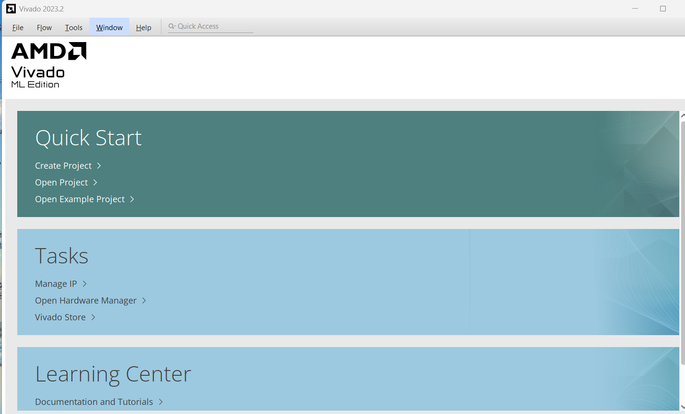
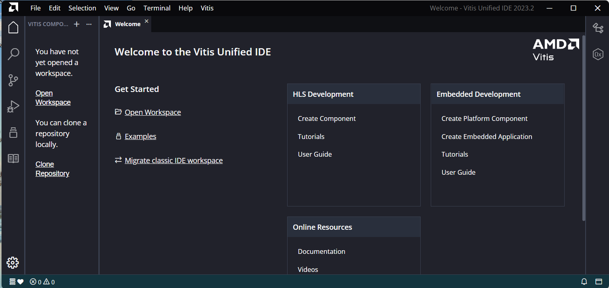

# 1주차 2교시 (W1_S2) — 설치 확인, 보드파일 설치, Vivado 소개

**SoC 설계** | Vivado/Vitis 2023.2 · Windows 11 · Digilent Cora Z7-07S

---

> **이번 시간에는 보드를 사용하지 않는다.** Cora Z7-07S 보드는 2주차에 배부된다. 오늘은 Vivado 화면과 설계 흐름을 눈으로 익히는 데 집중하고, 실제 보드 동작 확인은 2주차 LAB에서 진행한다.

---

## 학습 목표

- 자신의 컴퓨터에서 Vivado/Vitis 2023.2가 정상적으로 설치되었는지 확인하고, 문제가 있으면 해결할 수 있다
- Cora Z7-07S 보드파일을 Vivado에 설치하고 New Project 화면에서 검색되는 것을 확인할 수 있다
- Vivado IDE의 주요 화면 구성(Flow Navigator, Sources, IP Catalog 등)을 설명할 수 있다
- 예제 프로젝트를 통해 합성(Synthesis) → 구현(Implementation) → Bitstream 생성으로 이어지는 설계 흐름을 설명할 수 있다
- (시간이 허락하면) Vivado Simulator로 테스트벤치를 실행하고 파형에서 신호 변화를 읽을 수 있다

---

## 2.1 설치 확인 및 문제 해결

지난 시간(W1_S1) 과제로 설치한 Vivado/Vitis가 정상 동작하는지 확인한다.

### 확인 절차

```
① Windows 시작 메뉴 → "Vivado 2023.2" 실행 → Help → About Vivado → 버전 "2023.2" 확인
② Windows 시작 메뉴 → "Vitis 2023.2" 실행 → Vitis Unified IDE의 Welcome 화면이 뜨는지 확인
```

정상 설치라면 아래와 같은 첫 화면이 나타난다.

**Vivado 2023.2 시작 화면** — Quick Start · Tasks · Learning Center



**Vitis Unified IDE 2023.2 시작 화면** — Welcome 탭 (Get Started · Embedded Development 등)



> 두 화면이 정상적으로 뜨면 설치가 완료된 것이다. Vivado는 창 제목이 **Vivado 2023.2**, Vitis는 창 제목이 **Vitis Unified IDE 2023.2**인지 확인한다.

### 자주 발생하는 문제와 해결

| 증상 | 원인 | 해결 |
|---|---|---|
| Vivado 실행이 안 됨 | 설치 중간에 오류로 중단됨 | 설치 프로그램 재실행 → Uninstall 후 재설치 |
| 버전이 2023.2가 아님 | 다른 버전을 받음 | 기존 버전 삭제 후 2023.2로 재설치 |
| Vitis 실행 시 오류 | 설치 시 Vitis 항목 미체크 | 설치 프로그램 재실행 → Modify → Vitis 추가 설치 |
| 설치는 됐는데 디바이스가 안 보임 | Devices 선택 시 Zynq-7000 미체크 | 설치 프로그램 재실행 → Modify → Zynq-7000 추가 |
| 설치 용량 부족으로 중단 | 디스크 여유 공간 부족 | 불필요한 파일 정리 후 재설치, 또는 다른 드라이브 지정 |

> **아직 설치를 못 한 학생이 있다면:** 오늘 수업의 2.3~2.5는 옆 학생 화면이나 강의 화면을 함께 보면서 따라온다. 설치는 이번 시간 이후 최대한 빨리 완료해서 2주차 LAB 전까지 반드시 끝낸다.

---

## 2.2 Cora Z7-07S 보드파일 설치

Vivado는 기본 설치 상태에서 Zynq-7000 **디바이스**(칩)는 인식하지만, Cora Z7-07S라는 **보드**의 이름과 핀 프리셋은 별도 파일(보드파일)을 추가해야 New Project 화면에 나타난다.

### 설치 절차

```
① 강의 자료로 배포된 Cora Z7-07S 보드파일 압축을 해제한다.
② 압축을 푼 보드파일 폴더(cora-z7-07s 등 보드 이름 폴더)를 아래 경로에 복사한다.

   C:\Xilinx\Vivado\2023.2\data\boards\board_files\

③ Vivado를 재시작한다 (이미 실행 중이었다면 완전히 종료 후 재실행).
④ File → New Project → Default Part 화면에서 Boards 탭 클릭
⑤ 검색창에 "cora" 입력 → 목록에 Cora Z7-07S가 나타나는지 확인
```

📷 **캡처 필요 ①** — Vivado New Project의 Boards 탭에서 Cora Z7-07S가 검색된 화면


> **폴더 경로를 못 찾겠다면:** 설치 시 경로를 바꿨다면 `C:\Xilinx` 대신 자신이 설치한 경로 아래 `Vivado\2023.2\data\boards\board_files\`를 찾는다. `board_files` 폴더가 없다면 직접 만들어도 된다.

> **검색해도 안 나오면:** 보드파일 폴더 안에 `board.xml` 파일이 있는지 확인한다. 압축을 풀 때 폴더가 한 겹 더 씌워진 채로 복사되면(`board_files\cora-z7-07s\cora-z7-07s\board.xml`처럼 중첩) Vivado가 인식하지 못한다. `board.xml`이 `board_files\cora-z7-07s\` 바로 아래 있어야 한다.

### 확인 체크리스트

- [ ] `board_files` 폴더 아래에 Cora Z7-07S 보드파일 폴더가 있다.
- [ ] Vivado를 재시작한 뒤 Boards 탭에서 "Cora Z7-07S"가 검색된다.
- [ ] 보드를 선택하면 화면에 `xc7z007s` 계열 디바이스 정보가 표시된다.

---

## 2.3 Vivado 화면 구성 소개

Vivado를 처음 실행하면 낯선 화면이 많다. Quartus와 비교하면서 각 영역의 역할을 익힌다.

| Vivado 영역 | 위치 | 역할 | Quartus의 비슷한 기능 |
|---|---|---|---|
| **Flow Navigator** | 좌측 패널 | 합성·구현·Bitstream 생성 버튼 모음 | Compilation 흐름 아이콘 |
| **Sources** | 좌상단 탭 | 설계 파일, 제약 파일, 시뮬레이션 파일 목록 | Project Navigator의 Files 탭 |
| **IP Catalog** | Window 메뉴 | Xilinx 제공 IP 검색·추가 | IP Catalog (Qsys/Platform Designer) |
| **Tcl Console** | 하단 탭 | 명령어로 직접 제어, 자동화 스크립트 실행 | Tcl Console |
| **Messages** | 하단 탭 | Warning/Error 목록 | Messages 창 |
| **Design Runs** | 하단 탭 | 합성/구현 실행 상태와 로그 | Compilation Report |

📷 **캡처 필요 ②** — Vivado 기본 화면에 각 영역을 표시한 화면


### 설계 흐름 한눈에 보기

```
RTL 작성(Verilog)
   ↓
Synthesis(합성)        — RTL을 게이트 수준 회로로 변환
   ↓
Implementation(구현)   — 회로를 실제 칩 내부 위치에 배치·배선
   ↓
Generate Bitstream     — 칩에 넣을 최종 설정 파일 생성
   ↓
Program Device         — 보드에 Bitstream 전송 (오늘은 생략 — 2주차에 진행)
```

이 흐름은 Quartus의 Analysis & Synthesis → Fitter(Place & Route) → Assembler 흐름과 이름만 다를 뿐 순서는 같다.

---

## 2.4 예제로 보는 설계 흐름 (합성 → 구현 → Bitstream)

준비된 예제 프로젝트를 열어 실제 화면으로 위 흐름을 따라간다. 예제 소스는 저장소의 [`DEMO01/rtl/led_counter_demo.v`](DEMO01/rtl/led_counter_demo.v)이며, 클럭을 분주해 1초마다 4비트 카운터를 증가시키는 간단한 회로다 — 지난 학기 만들어 본 클럭 분주기+카운터와 같은 구조다.

### 프로젝트 열기

```
File → New Project → RTL Project
→ Add Sources: DEMO01/rtl/led_counter_demo.v 추가
→ Boards 탭: Cora Z7-07S 선택 (2.2절에서 설치 확인)
→ Finish
```

이 시연에서는 **XDC(핀 배정)를 의도적으로 추가하지 않는다.** 아직 실제 보드가 없어 어느 핀을 배정해야 할지 확인할 수 없기 때문이다. 이 상태로 흐름을 끝까지 진행하면서 무슨 일이 벌어지는지 관찰한다.

### 합성 → 구현 → Bitstream 실행

```
Flow Navigator → SYNTHESIS → Run Synthesis
  완료 후: Open Synthesized Design → Schematic으로 회로 구조 확인(선택)

Flow Navigator → IMPLEMENTATION → Run Implementation
  완료 후: Utilization Report — 자원 사용률 확인

Flow Navigator → PROGRAM AND DEBUG → Generate Bitstream
```

📷 **캡처 필요 ③** — Bitstream 생성 시 나타나는 "핀 미배정" Critical Warning 화면


> **이 경고가 왜 중요한가:** `led` 출력에 어느 핀을 쓸지 Vivado에 알려주지 않았기 때문에 나타나는 경고다. 지금은 무시하고 진행하지만, 2주차에 실제 보드를 받으면 XDC 파일로 이 핀들을 정확히 지정해야 경고 없이 정상 동작하는 Bitstream이 만들어진다. **XDC가 왜 필요한지**를 보여주는 장면이다.

### 완료 후 확인

```
Bitstream 생성 완료 팝업 → "Open Implemented Design" 선택 (Program 하지 않음)
Reports → Utilization Report, Timing Summary 확인
```

| 확인 항목 | 의미 |
|---|---|
| Utilization Report | 설계가 칩의 LUT, FF, BRAM을 얼마나 사용했는지 |
| Timing Summary — WNS | 클럭 속도 조건을 만족하는지 (WNS ≥ 0이면 통과) |

> **오늘은 여기까지.** Hardware Manager로 실제 보드에 Program하는 단계는 2주차, 실제 보드가 손에 있을 때 진행한다.

---

## 2.5 시뮬레이션 데모 (시간이 남으면)

Bitstream까지 여유 있게 끝났다면, 보드 없이도 회로 동작을 확인할 수 있는 **시뮬레이션**을 시연한다. 지난 학기 Quartus/ModelSim에서 테스트벤치로 파형을 확인했던 것과 같은 방식이다.

```
Sources 창 → Simulation Sources 우클릭 → Add Sources
→ DEMO01/sim/tb_led_counter_demo.v 추가

Flow Navigator → SIMULATION → Run Simulation → Run Behavioral Simulation
```

Vivado Simulator가 실행되며 파형(Waveform) 창이 열린다.

📷 **캡처 필요 ④** — Vivado Simulator 파형 창에서 `led`가 증가하는 모습


- 파형 창에서 `clk`, `rst_n`, `led` 신호를 확인한다.
- `rst_n`이 0일 때 `led`가 0으로 고정되고, 1이 된 뒤 시간이 지나면서 `led` 값이 1씩 증가하는 것을 확인한다.
- 테스트벤치는 시뮬레이션 시간을 줄이기 위해 실제 1초 대신 훨씬 빠른 주기로 동작하도록 만들어져 있다 ([`tb_led_counter_demo.v`](DEMO01/sim/tb_led_counter_demo.v) 참고).

> **시간이 부족하면:** 이 절은 생략하고 다음 시간으로 넘긴다. 2주차 이후 실습에서도 시뮬레이션을 계속 사용하므로 오늘 못 보더라도 기회가 있다.

---

## 핵심 정리

| 키워드 | 내용 |
|--------|------|
| board_files | Vivado가 보드 이름·프리셋을 인식하도록 추가하는 폴더 |
| Flow Navigator | 합성·구현·Bitstream 실행 버튼이 모인 좌측 패널 |
| Synthesis | RTL(Verilog)을 게이트 수준 회로로 변환하는 단계 |
| Implementation | 회로를 칩 내부에 배치·배선하는 단계 |
| Generate Bitstream | 보드에 넣을 최종 설정 파일을 만드는 단계 |
| Critical Warning (Unconstrained Port) | XDC 핀 배정이 없을 때 나타나는 경고 |
| Behavioral Simulation | 실제 칩 없이 코드 동작을 파형으로 확인하는 시뮬레이션 |
| WNS | Timing Summary에서 확인하는 타이밍 통과 기준 (≥ 0) |

---

## 과제 — 다음 시간(2주차) 전까지

1. 아직 설치를 완료하지 못했다면 반드시 끝낸다.
2. Cora Z7-07S 보드파일이 정상적으로 검색되는지 다시 한 번 확인한다.
3. 오늘 만든 예제 프로젝트를 다시 열어 Bitstream까지 스스로 재현해 본다.

## 다음 시간 예고 — 2주차

- Cora Z7-07S 보드 배부 및 실물 확인
- XDC로 실제 핀을 배정해 오늘의 경고를 해소
- 보드에 Bitstream을 Program하여 LED 동작을 직접 확인

---

*SoC 설계 1주차 2교시 (W1_S2) | Vivado/Vitis 2023.2 · Windows · Cora Z7-07S*
