# 1주차 2교시 (W1_S2) — 설치 확인, 보드파일 설치, Vivado 소개

**SoC 설계** | Vivado/Vitis 2023.2 · Windows 11 · Digilent Cora Z7-07S

---

> **이번 시간에는 보드를 사용하지 않는다.** Cora Z7-07S 보드는 2주차에 배부된다. 이번 장은 Vivado 화면과 설계 흐름을 익히는 데 집중하며, 실제 보드 동작 확인은 2주차에서 다룬다.

---

## 학습 목표

- 자신의 컴퓨터에서 Vivado/Vitis 2023.2가 정상적으로 설치되었는지 확인하고, 문제가 있으면 해결할 수 있다
- Digilent 보드파일(Cora Z7-07S, Zybo Z7-10/Z7-20)을 Vivado에 설치하고 New Project 화면에서 검색되는 것을 확인할 수 있다
- Vivado New Project 마법사로 순수 Verilog RTL 프로젝트를 만들고 소스를 추가하는 과정을 따라할 수 있다
- Vivado IDE의 주요 화면 구성(Flow Navigator, Sources, IP Catalog 등)을 설명할 수 있다
- Vivado Simulator로 테스트벤치를 실행하고 파형에서 신호 변화를 읽을 수 있다
- 합성(Synthesis) → 구현(Implementation) → Bitstream 생성으로 이어지는 설계 흐름을 설명하고, XDC(핀 배정 파일)가 무엇을 하고 왜 필요한지 이해한다

---

## 2.1 설치 확인 및 문제 해결

지난 시간(W1_S1) 과제로 설치한 Vivado/Vitis가 정상 동작하는지 확인한다.

### 확인 절차

```
① Windows 시작 메뉴 → "Vivado 2023.2" 실행 → Help → About Vivado → 버전 "2023.2" 확인
② Windows 시작 메뉴 → "Vitis 2023.2" 실행 → Vitis Unified IDE의 Welcome 화면이 뜨는지 확인
```

정상 설치라면 아래와 같은 첫 화면이 나타난다.

**Vivado 2023.2 시작 화면** — Quick Start · Tasks · Learning Center


**Vitis Unified IDE 2023.2 시작 화면** — Welcome 탭 (Get Started · Embedded Development 등)


> 두 화면이 정상적으로 뜨면 설치가 완료된 것이다. Vivado는 창 제목이 **Vivado 2023.2**, Vitis는 창 제목이 **Vitis Unified IDE 2023.2**인지 확인한다.

### 자주 발생하는 문제와 해결

| 증상 | 원인 | 해결 |
|---|---|---|
| Vivado 실행이 안 됨 | 설치 중간에 오류로 중단됨 | 설치 프로그램 재실행 → Uninstall 후 재설치 |
| 버전이 2023.2가 아님 | 다른 버전을 받음 | 기존 버전 삭제 후 2023.2로 재설치 |
| Vitis 실행 시 오류 | 설치 시 Vitis 항목 미체크 | 설치 프로그램 재실행 → Modify → Vitis 추가 설치 |
| 설치는 됐는데 디바이스가 안 보임 | Devices 선택 시 Zynq-7000 미체크 | 설치 프로그램 재실행 → Modify → Zynq-7000 추가 |
| 설치 용량 부족으로 중단 | 디스크 여유 공간 부족 | 불필요한 파일 정리 후 재설치, 또는 다른 드라이브 지정 |

> **설치가 아직 끝나지 않았다면:** 2.3~2.6의 Vivado 화면은 우선 그림으로 따라 읽고, 설치를 최대한 빨리 완료한 뒤 2주차 전까지 직접 재현해 둔다.

---

## 2.2 Digilent 보드파일 설치

Vivado는 기본 설치 상태에서 Zynq-7000 **디바이스**(칩)는 인식하지만, Cora Z7이나 Zybo Z7 같은 **보드**의 이름과 핀 프리셋은 별도 파일(보드파일)을 추가해야 New Project 화면에 나타난다.

이 수업은 학기 중 여러 보드를 함께 사용한다 — 처음에는 **Cora Z7-07S**(2인 1조), 중간고사 전 **Zybo Z7-10 / Z7-20**을 추가해 1인 1보드로 진행한다. 어느 학생에게 어느 보드가 배정될지 미리 알 수 없으므로, **지금 세 보드파일을 한 번에 모두 설치**해 둔다. 그러면 어떤 보드를 받든 바로 실습할 수 있고 이후 다시 손댈 일이 없다.

| 보드파일 폴더 | 보드 | 디바이스 | 리비전 폴더 |
|---|---|---|---|
| `cora-z7-07s` | Cora Z7-07S | `xc7z007s` | `B.0` |
| `zybo-z7-10` | Zybo Z7-10 | `xc7z010` | `A.0` |
| `zybo-z7-20` | Zybo Z7-20 | `xc7z020` | `A.0` |

### 보드파일을 넣는 두 가지 방법

| 방법 | 설명 | 이 수업에서는 |
|---|---|---|
| **① Vivado 내장 다운로드** | New Project·Settings의 Boards 화면에서 다운로드 아이콘(↓)을 눌러 AMD 서버(Xilinx Board Store)에서 자동 설치 | 사용하지 않음 |
| **② 파일 직접 복사** | 강의 저장소에 포함된 보드파일 폴더를 Vivado 설치 폴더 안에 복사 | **이 방법으로 진행** |

> **왜 직접 복사인가:** ① 방법은 실습실 네트워크에서 AMD 서버 접속이 막히면 실패하고, 학생마다 받는 보드파일 리비전이 달라질 수 있다. 강의에서 배포한 보드파일을 모두가 똑같이 넣으면 이후 실습에서 "내 화면만 다르다"는 문제가 생기지 않는다. 집에서 개인 PC에 설치할 때는 ① 방법을 써도 되지만, 실습·과제 기준은 배포 파일이다.

### 보드파일 위치 — 강의 저장소에 포함됨

보드파일은 **강의 저장소(SoC_2026_2)의 `boards/` 폴더에 이미 들어 있다.** W1_S1에서 저장소를 내려받았다면 별도로 받을 것이 없다.

```
SoC_2026_2\
└─ boards\
   └─ vivado-boards-master\
      └─ new\board_files\        ← 여기에 보드별 폴더가 있다
         ├─ cora-z7-07s\B.0\
         ├─ zybo-z7-10\A.0\
         └─ zybo-z7-20\A.0\
```

이 폴더는 Digilent 공식 저장소 [`Digilent/vivado-boards`](https://github.com/Digilent/vivado-boards)의 `new/board_files/`를 그대로 받아 둔 것이다(아래 화면의 노란색 표시가 이 수업에서 쓰는 보드).

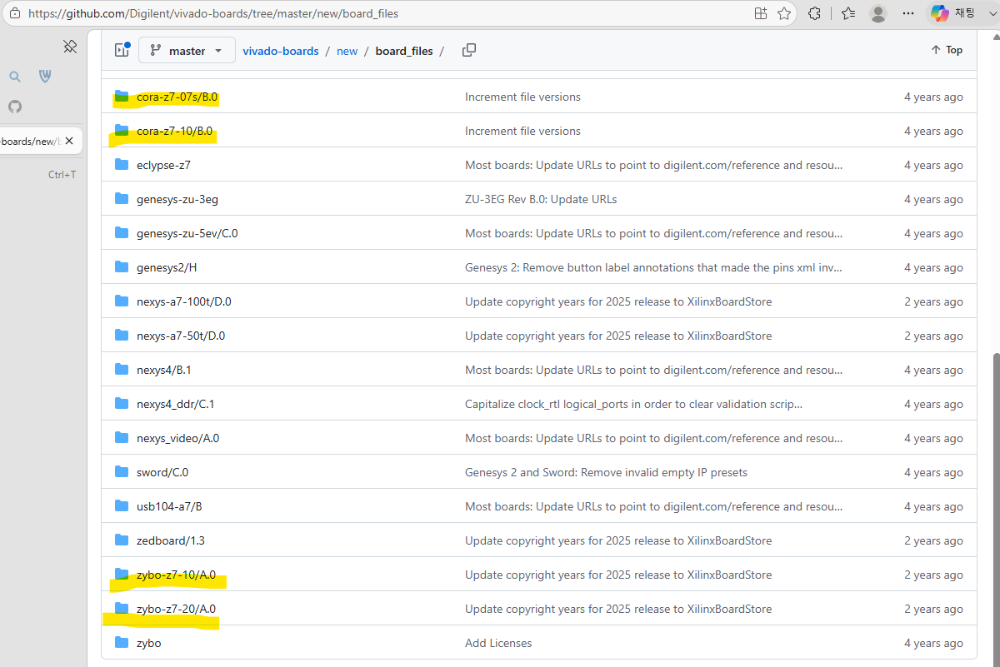

> 저장소를 아직 안 받았다면 W1_S1의 저장소 내려받기 절차를 먼저 끝낸다. 개인 PC에서 원본을 직접 받고 싶으면 위 GitHub 페이지에서 `[Code] → Download ZIP` 으로 master 전체를 받아 `vivado-boards-master\new\board_files\` 안의 세 폴더를 쓰면 된다.

### 설치 절차 (파일 직접 복사)

```
① 저장소의 아래 폴더에서 cora-z7-07s, zybo-z7-10, zybo-z7-20 세 폴더를
   통째로 복사한다.

   ...\SoC_2026_2\boards\vivado-boards-master\new\board_files\

② 아래 경로에 붙여넣는다.

   C:\Xilinx\Vivado\2023.2\data\boards\board_files\

   복사가 끝나면 이런 구조가 된다:
   ...\board_files\cora-z7-07s\B.0\board.xml
   ...\board_files\zybo-z7-10\A.0\board.xml
   ...\board_files\zybo-z7-20\A.0\board.xml
       └ 보드 폴더 → 리비전 폴더(B.0 / A.0) → board.xml 순서

③ Vivado를 재시작한다 (이미 실행 중이었다면 완전히 종료 후 재실행).
④ File → New Project → Default Part 화면에서 Boards 탭 클릭
⑤ 검색창에 "cora" 또는 "zybo" 입력 → 목록에 해당 보드가 나타나는지 확인
```

붙여넣기가 끝나면 `C:\Xilinx\Vivado\2023.2\data\boards\board_files\` 안이 아래처럼 보인다.

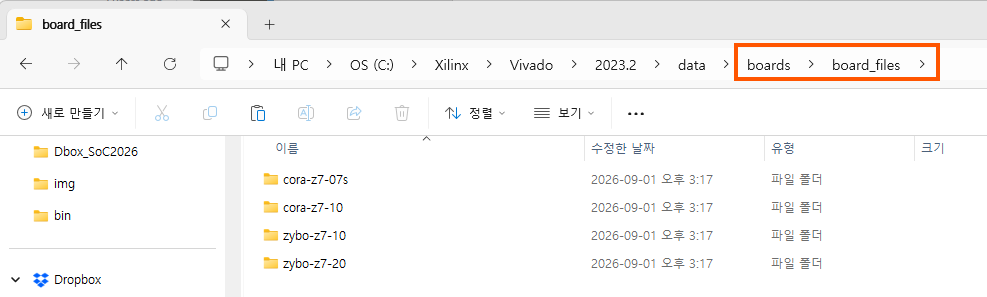

> 위 화면처럼 `cora-z7-10`까지 함께 복사해도 상관없다 — 쓰지 않는 보드파일이 들어 있어도 Vivado 동작에는 영향이 없다. 최소한 `cora-z7-07s`, `zybo-z7-10`, `zybo-z7-20` 세 개만 있으면 된다.

Vivado를 재시작한 뒤 **File → New Project → Default Part → Boards** 탭을 열면, 방금 복사한 보드들이 **Status = Installed** 로 표시된다.

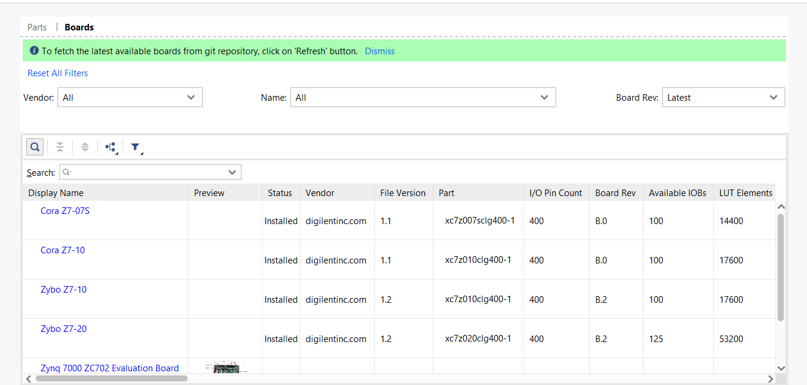

> `digilentinc.com` 벤더의 **Cora Z7-07S · Cora Z7-10 · Zybo Z7-10 · Zybo Z7-20** 가 모두 `Installed` 이면 정상이다. Part 열에서 각각 `xc7z007s` / `xc7z010` / `xc7z020` 디바이스가 매핑된 것을 확인할 수 있다.

> **폴더 경로를 못 찾겠다면:** 설치 시 경로를 바꿨다면 `C:\Xilinx` 대신 자신이 설치한 경로 아래 `Vivado\2023.2\data\boards\board_files\`를 찾는다. `board_files` 폴더가 없다면 직접 만들어도 된다.

> **검색해도 안 나오면:** 복사한 폴더 안에서 `board.xml` 파일의 위치를 확인한다. Digilent 보드파일은 `board_files\cora-z7-07s\B.0\board.xml`처럼 **리비전 폴더(`B.0`·`A.0` 등) 한 겹 아래**에 `board.xml`이 있어야 한다. 압축을 풀 때 폴더가 한 겹 더 씌워져 `board_files\cora-z7-07s\cora-z7-07s\B.0\board.xml`처럼 중첩되면 Vivado가 인식하지 못한다. 이때는 안쪽 `cora-z7-07s` 폴더를 한 단계 위로 옮긴다.

### 확인 체크리스트

- [ ] `board_files\` 아래에 `cora-z7-07s`, `zybo-z7-10`, `zybo-z7-20` 세 폴더가 있다.
- [ ] 각 폴더 안에 리비전 폴더(`B.0` 또는 `A.0`)가 있고, 그 안에 `board.xml`이 있다.
- [ ] Vivado를 재시작한 뒤 Boards 탭에서 "Cora Z7-07S", "Zybo Z7-10", "Zybo Z7-20"이 모두 검색된다.
- [ ] Cora Z7-07S를 선택하면 화면에 `xc7z007s` 디바이스 정보가 표시된다.

---

## 2.3 예제 프로젝트 생성

**① 프로젝트 생성 → ② 화면 구성 → ③ 시뮬레이션 → ④ Bitstream 생성**의 순서로 Vivado의 기본 설계 흐름을 따라간다.

예제 소스는 저장소의 [`DEMO01/rtl/led_counter_demo.v`](DEMO01/rtl/led_counter_demo.v)이며, 클럭을 분주해 1초마다 4비트 카운터를 증가시키는 회로다 — 지난 학기 DE0/Quartus에서 만든 클럭 분주기 + 카운터와 같은 구조다.

> 이 예제는 순수 **Verilog RTL 프로젝트**다. Block Design(Zynq PS)·AXI는 2주차에서 다룬다. XDC(핀 배정)는 Cora Z7-07S 기준으로 [`DEMO01/constraints/led_counter_demo.xdc`](DEMO01/constraints/led_counter_demo.xdc) 에 넣어 두었다.

### New Project 마법사 진행

```
① File → Project → New…   (또는 시작 화면의 Create Project)
② Project name: demo01_led_counter
   Project location: 한글·공백 없는 경로 (예: C:\SoC2026\work)
③ Project Type: RTL Project
   — "Do not specify sources at this time" 체크 해제
④ Add Sources → [+] Add Files → DEMO01/rtl/led_counter_demo.v 선택
   — "Copy sources into project" 체크 (원본은 두고 사본으로 작업)
⑤ Add Constraints → [+] Add Files → DEMO01/constraints/led_counter_demo.xdc 선택
⑥ Default Part → 상단 Boards 탭 → 검색창 "cora" → Cora Z7-07S 선택
⑦ Summary 확인 → Finish
```

각 페이지는 다음과 같다.

**① 시작 화면에서 Create Project → New Project 마법사 시작 (Next)**

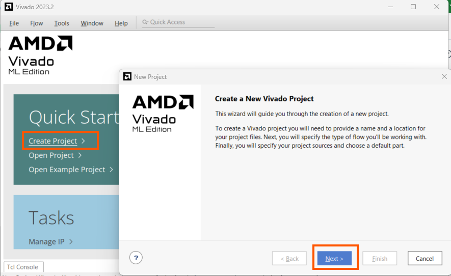

**② Project Name — 프로젝트 이름과 저장 위치를 지정하고 "Create project subdirectory" 체크**

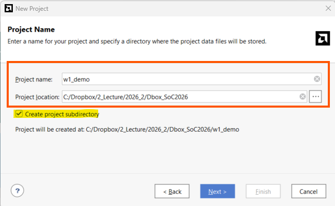

**③ Project Type — "RTL Project" 선택 ("Do not specify sources at this time" 는 해제)**

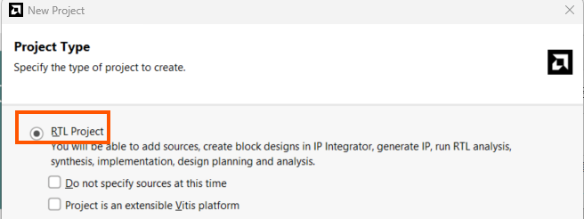

**④ Add Sources — [+] → Add Files 로 `led_counter_demo.v` 추가**

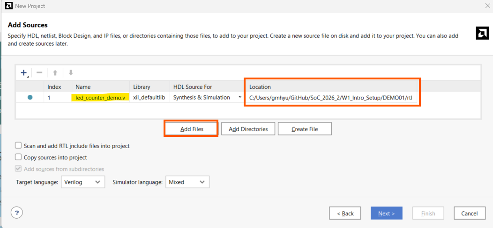

**⑥ Default Part — 상단 Boards 탭 → 검색창 "cora" → Cora Z7-07S 선택**  (⑤ Add Constraints 에서 `led_counter_demo.xdc` 추가)

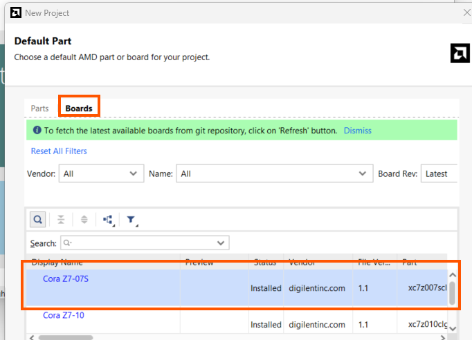

> **Quartus와 비교:** Quartus의 "New Project Wizard"와 하는 일이 같다 — 프로젝트 이름, 소스 파일, 타깃 디바이스를 정하는 것. 다른 점은 Vivado는 **보드(Board)** 를 고르면 디바이스뿐 아니라 클럭·핀 프리셋 정보까지 함께 잡아 준다는 것이다.

Finish를 누르면 Vivado 메인 화면이 열리고 Sources 창에 `led_counter_demo` 가 Top 모듈로 표시된다.

**⑦ Summary 확인 → Finish → Vivado 메인 화면이 열림 (Sources 창에 `led_counter_demo` 가 Top 모듈)**

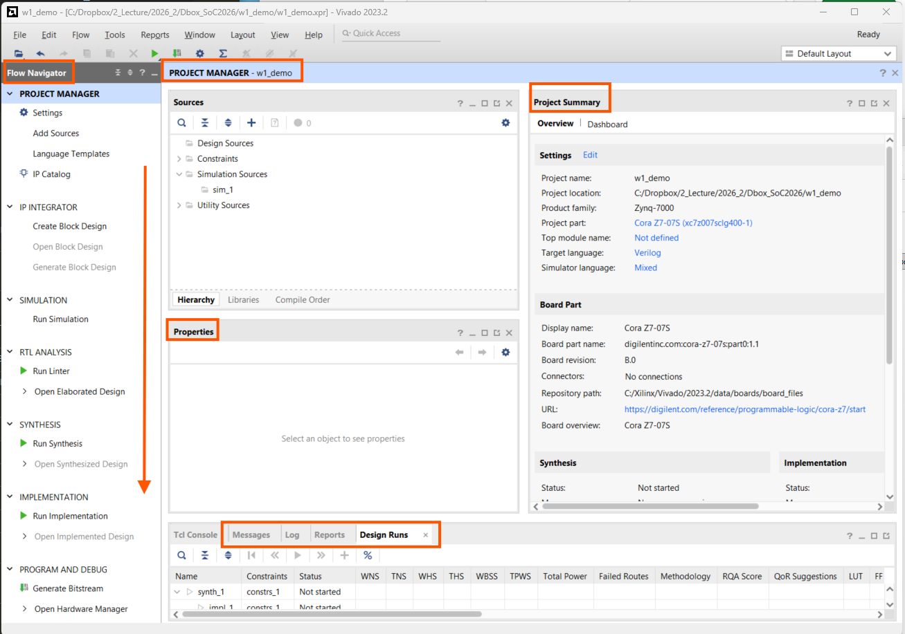

> **빠르게 만들려면:** 저장소의 [`DEMO01/create_demo01_project.tcl`](DEMO01/create_demo01_project.tcl) 을 Vivado Tcl Console에서 `source` 하면 위 마법사 단계를 거치지 않고 같은 프로젝트가 한 번에 만들어진다. 자세한 내용은 [`DEMO01/README.md`](DEMO01/README.md).

---

## 2.4 Vivado 화면 구성

프로젝트가 열린 상태에서 각 영역의 역할을 Quartus와 비교하며 익힌다.

| Vivado 영역 | 위치 | 역할 | Quartus의 비슷한 기능 |
|---|---|---|---|
| **Flow Navigator** | 좌측 패널 | 합성·구현·Bitstream 생성 버튼 모음 | Compilation 흐름 아이콘 |
| **Sources** | 좌상단 탭 | 설계 파일, 제약 파일, 시뮬레이션 파일 목록 | Project Navigator의 Files 탭 |
| **IP Catalog** | Window 메뉴 | Xilinx 제공 IP 검색·추가 | IP Catalog (Qsys/Platform Designer) |
| **Tcl Console** | 하단 탭 | 명령어로 직접 제어, 자동화 스크립트 실행 | Tcl Console |
| **Messages** | 하단 탭 | Warning/Error 목록 | Messages 창 |
| **Design Runs** | 하단 탭 | 합성/구현 실행 상태와 로그 | Compilation Report |


### 설계 흐름 한눈에 보기

```
RTL 작성(Verilog)
   ↓
Behavioral Simulation  — 보드 없이 코드 동작을 파형으로 확인   ← 2.5
   ↓
Synthesis(합성)        — RTL을 게이트 수준 회로로 변환         ← 2.6
   ↓
Implementation(구현)   — 회로를 실제 칩 내부 위치에 배치·배선
   ↓
Generate Bitstream     — 칩에 넣을 최종 설정 파일 생성
   ↓
Program Device         — 보드에 Bitstream 전송 (오늘은 생략 — 2주차)
```

합성 이후 흐름은 Quartus의 Analysis & Synthesis → Fitter(Place & Route) → Assembler와 이름만 다를 뿐 순서는 같다.

---

## 2.5 시뮬레이션 — 보드 없이 동작 확인

지난 학기 Quartus/ModelSim에서 테스트벤치로 파형을 확인했던 것과 같은 방식이다.

```
① Sources 창 → Simulation Sources > sim_1 우클릭 → Add Sources
   → Add or create simulation sources → DEMO01/sim/tb_led_counter_demo.v 추가
② Flow Navigator → SIMULATION → Run Simulation → Run Behavioral Simulation
```

> **Design Sources vs Simulation Sources:** `led_counter_demo.v` 는 칩에 들어갈 회로(Design), `tb_led_counter_demo.v` 는 그 회로를 흔들어 보는 테스트 코드(Simulation)다. 합성·구현에는 Design Sources만 쓰이고, 테스트벤치는 시뮬레이션에서만 쓰인다.

**② Run Simulation → Run Behavioral Simulation → 파형 창이 열리고 `led[3:0]` 이 0 → 1 → 2 … 로 증가**

![Vivado Simulator 파형 — clk / rst_n / led[3:0] 증가](img/w1_s2_f17.png)

- 파형 창에서 `clk`, `rst_n`, `led` 신호를 확인한다.
- `rst_n`이 0일 때 `led`가 0으로 고정되고, 1이 된 뒤 시간이 지나면서 `led` 값이 1씩 증가하는 것을 확인한다.
- 테스트벤치는 파형에서 보기 쉽도록 `CLK_FREQ_HZ` 를 20으로 줄여 tick을 자주 내도록 만들어져 있다 ([`tb_led_counter_demo.v`](DEMO01/sim/tb_led_counter_demo.v) 참고).

---

## 2.6 합성 → 구현 → Bitstream 생성

시뮬레이션으로 동작을 확인했으니, 실제 칩에 넣을 설정 파일까지 만들어 본다.

```
Flow Navigator → SYNTHESIS → Run Synthesis
  완료 팝업 → Open Synthesized Design → Schematic으로 회로 구조 확인(선택)

Flow Navigator → IMPLEMENTATION → Run Implementation

Flow Navigator → PROGRAM AND DEBUG → Generate Bitstream
```


### 핵심 — XDC 핀 배정

`clk`·`rst_n`·`led` 는 Verilog 상의 이름일 뿐, 칩의 어느 물리 핀으로 나가고 들어올지는 별도 파일로 알려 줘야 한다. 그 파일이 **XDC(제약 파일)** 이고, 이 예제에서는 [`DEMO01/constraints/led_counter_demo.xdc`](DEMO01/constraints/led_counter_demo.xdc) 다.

```
# 클럭 — Cora Z7-07S의 125 MHz sysclk 핀
set_property -dict { PACKAGE_PIN H16  IOSTANDARD LVCMOS33 } [get_ports { clk }];
create_clock -period 8.00 [get_ports { clk }];        # 8 ns = 125 MHz

# 리셋 — 푸시버튼 BTN0
set_property -dict { PACKAGE_PIN D20  IOSTANDARD LVCMOS33 } [get_ports { rst_n }];

# LED — Cora Z7-07S는 단색 LED가 없어 RGB LED(LD0/LD1) 채널에 매핑
set_property -dict { PACKAGE_PIN L15  IOSTANDARD LVCMOS33 } [get_ports { led[0] }];  # LD0 Blue
set_property -dict { PACKAGE_PIN G17  IOSTANDARD LVCMOS33 } [get_ports { led[1] }];  # LD0 Green
set_property -dict { PACKAGE_PIN N15  IOSTANDARD LVCMOS33 } [get_ports { led[2] }];  # LD0 Red
set_property -dict { PACKAGE_PIN G14  IOSTANDARD LVCMOS33 } [get_ports { led[3] }];  # LD1 Blue
```

- `PACKAGE_PIN` — 신호를 칩의 어느 물리 핀에 연결할지
- `IOSTANDARD` — 그 핀의 전기 규격(전압 레벨 등). Cora의 이 핀들은 3.3 V CMOS
- `create_clock` — `clk` 가 125 MHz라고 알려 줘야 Timing Summary가 의미를 가진다

⑤에서 추가한 XDC는 Sources 창의 **Constraints > constrs_1** 아래에 나타나고, 더블클릭하면 내용을 볼 수 있다.

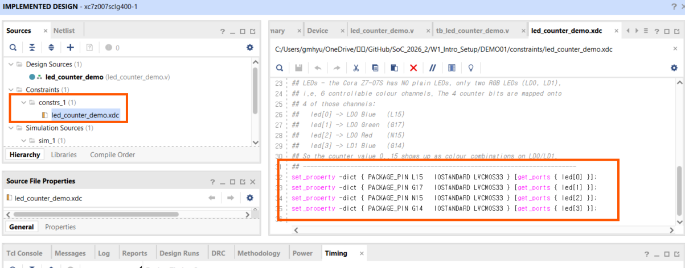

> **XDC가 없으면:** Synthesis·Implementation까지는 통과하지만, **Generate Bitstream 단계에서 DRC 에러(`UCIO-1` 배정 안 된 포트, `NSTD-1` I/O 표준 미지정)로 멈춘다.** `.bit` 파일이 안 만들어진다. 즉 XDC는 "있으면 좋은 것"이 아니라 보드에 올리려면 **반드시 필요한** 파일이다.

> **2주차에 정리할 것:** 이 XDC의 두 가지 임시 처리 — ① Cora 버튼은 눌렀을 때 1(active-high)인데 `rst_n`은 active-low라 극성이 반대, ② 4비트 카운터를 RGB LED 채널에 억지로 매핑 — 을 실제 보드를 보며 제대로 다듬는다.

### 결과 확인

```
Bitstream 완료 팝업 → Open Implemented Design   (Program 하지 않음)
Reports → Utilization Report, Timing Summary
```

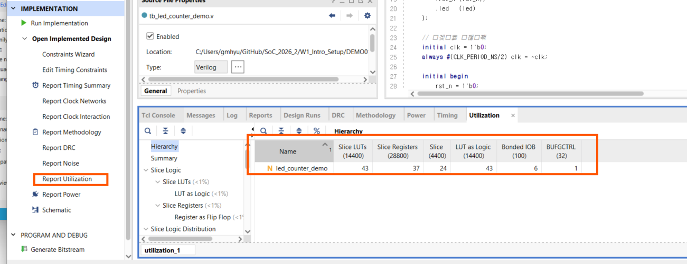

| 확인 항목 | 의미 |
|---|---|
| Utilization Report | 설계가 칩의 LUT·FF·BRAM을 얼마나 사용했는지 |
| Timing Summary — WNS | 클럭 속도 조건을 만족하는지 (WNS ≥ 0이면 통과) |

> **오늘은 여기까지.** Hardware Manager로 실제 보드에 Program하는 단계는 2주차, 실제 보드가 손에 있을 때 진행한다.

---

## 핵심 정리

| 키워드 | 내용 |
|--------|------|
| board_files | Vivado가 보드 이름·프리셋을 인식하도록 추가하는 폴더 |
| New Project 마법사 | 프로젝트 이름·소스·타깃 디바이스를 정하는 곳. 보드를 고르면 핀·클럭 프리셋까지 잡힌다 |
| Design Sources / Simulation Sources | 칩에 들어갈 회로 / 그 회로를 시험하는 테스트벤치. 합성엔 Design만 쓰인다 |
| Flow Navigator | 합성·구현·Bitstream 실행 버튼이 모인 좌측 패널 |
| Synthesis | RTL(Verilog)을 게이트 수준 회로로 변환하는 단계 |
| Implementation | 회로를 칩 내부에 배치·배선하는 단계 |
| Generate Bitstream | 보드에 넣을 최종 설정 파일을 만드는 단계 |
| XDC (제약 파일) | `clk`·`rst_n`·`led` 를 칩의 물리 핀·I/O 표준에 연결. 없으면 Generate Bitstream이 DRC 에러(`UCIO-1`/`NSTD-1`)로 멈춘다 |
| Behavioral Simulation | 실제 칩 없이 코드 동작을 파형으로 확인하는 시뮬레이션 |
| WNS | Timing Summary에서 확인하는 타이밍 통과 기준 (≥ 0) |

---

## 과제 — 다음 시간(2주차) 전까지

1. 아직 설치를 완료하지 못했다면 반드시 끝낸다.
2. Cora Z7-07S 보드파일이 정상적으로 검색되는지 다시 한 번 확인한다.
3. New Project부터 Bitstream 생성까지 **직접 해 본다.** 막히면 저장소의 [`DEMO01/create_demo01_project.tcl`](DEMO01/create_demo01_project.tcl) 로 프로젝트를 만든 뒤 합성·구현·Bitstream만 실행해도 된다.

## 다음 시간 예고 — 2주차

- Cora Z7-07S 보드 배부 및 실물 확인
- 오늘 XDC의 임시 처리(버튼 극성, RGB LED 매핑)를 실물 기준으로 정리
- 보드에 Bitstream을 Program하여 LED 동작을 직접 확인

---

*SoC 설계 1주차 2교시 (W1_S2) | Vivado/Vitis 2023.2 · Windows · Cora Z7-07S*
