# 제3장 PL 설계 (1) — Block Design과 시뮬레이션

**SoC 설계** · 2주차 1교시(W2_S1) | Vivado 2023.2 · Windows 11 · Digilent Cora Z7-07S

---

지난 학기 Verilog 수업에서 우리는 DE0 보드와 Quartus로 카운터를 설계했다. 이 장에서는 같은 카운터를 **Xilinx Zynq-7000S** 기반의 Cora Z7-07S 보드에 올린다. 다만 이번 주에는 Zynq의 PS(ARM 프로세서)는 사용하지 않고, **PL(프로그래머블 로직) 부분만** 다룬다. Zynq를 하나의 큰 FPGA라고 생각하면 된다.

Cora Z7-07S에는 카운터 값을 표시할 LED가 없다. 그래서 이 장의 설계는 카운터의 출력을 보드의 핀으로 내보내지 않고, **System ILA**라는 디버그 IP에 연결해 JTAG로 관찰한다. ILA는 지난 학기에 쓰던 Quartus SignalTap과 같은 역할을 한다.

이번 1교시(W2_S1)에서는 다음 순서로 진행한다. 2교시(W2_S2)에서 합성 이후 단계를 이어서 한다.

> **Block Design 구성** → **System ILA 삽입(Debug 표시)** → **HDL Wrapper 생성** → **Behavioral Simulation**

> **참고 — 이번 설계는 의도적으로 단순하게 만든다.** 실무에서는 클럭이 안정된 뒤 리셋을 푸는 Processor System Reset IP를 함께 쓰지만, 이 장에서는 버튼 하나를 리셋에 바로 연결한다. 그 결과 Vivado가 경고 하나를 띄우는데, 그 의미는 3.7절에서 설명한다. 정식 리셋 구조는 PS를 배우는 이후 장에서 다룬다.

> **보드 공유 안내.** 실습 보드는 2인 1조로 사용한다. 이 장의 Block Design 구성과 시뮬레이션까지는 각자 자신의 PC에서 진행하고, 하드웨어 다운로드(W2_S2)는 조별로 한다.

---

## 학습 목표

이 장을 마치면 다음을 할 수 있다.

- Cora Z7-07S의 주요 자원(125 MHz PL 클럭, 푸시버튼, USB-JTAG)의 위치와 역할을 설명한다.
- 파라미터를 가진 카운터 모듈(`counter_n`)과 이를 감싸는 래퍼(`pl_counter`)의 계층 구조를 읽는다.
- "느린 클럭을 새로 만들지 않고 **clock-enable 펄스**로 카운트 속도를 조절한다"는 설계 원칙을 설명한다.
- Block Design에 사용자 RTL(Module Reference)과 IP(Clocking Wizard)를 추가하고 연결한다.
- **Run Connection Automation**으로 외부 클럭 포트와 리셋 포트를 만든다.
- Block Design의 net을 우클릭해 **Debug**로 표시하고 System ILA를 삽입한다.
- HDL Wrapper를 만들고 Behavioral Simulation에서 `tick`, `div_count`, `count`의 관계를 읽는다.

---

## 3.1 Cora Z7-07S 실물 살펴보기

실습에 앞서 이 장에서 사용할 보드의 자원을 확인한다. 세 실습 보드(Cora Z7-07S · Zybo Z7-10 · Z7-20)의 전체 비교는 강의 자료 「1.5 실습 보드 개요」를 참고한다.

| 자원 | 이름·위치 | 이 장에서의 용도 |
|---|---|---|
| Zynq-7000S | `xc7z007s` (Cortex-A9 1코어 + PL) | 이번 주는 PL만 사용 |
| 125 MHz 시스템 클럭 | 온보드 오실레이터 → 패키지 핀 `H16` | Clocking Wizard의 입력 클럭 |
| 푸시버튼 `BTN0` | 패키지 핀 `D20`, **active-high**(누르면 1) | 이 설계의 리셋 |
| 푸시버튼 `BTN1` | 패키지 핀 `D19`, active-high | 이 장에서는 사용하지 않음 |
| micro-USB 커넥터 | USB-JTAG와 USB-UART 겸용 | Bitstream 다운로드, ILA 파형 관찰 |
| RGB LED · Pmod · Arduino 헤더 | 보드 가장자리 | 이 장에서는 사용하지 않음 |

두 가지를 특히 기억한다.

첫째, **이 보드에는 카운터 값을 표시할 LED가 없다.** 4비트 카운터를 붙일 단색 LED 4개가 없으므로, `count`·`tick`·`div_count`를 핀으로 빼지 않고 System ILA로 관찰한다.

둘째, **푸시버튼은 active-high다.** 누르면 논리 1이 입력된다. 지난 학기 DE0 보드와 극성이 반대일 수 있으니, 리셋 포트를 만들 때 극성을 active-high로 맞춘다.

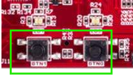

**그림 3-1** Cora Z7-07S의 두 푸시버튼 `BTN0`(D20)·`BTN1`(D19). 이 장에서는 `BTN0`을 리셋으로 사용한다.

---

## 3.2 이 장에서 만들 회로

W2_S1과 W2_S2에 걸쳐 완성할 회로의 전체 구조는 그림으로 나타내면 다음과 같다.

```text
   Cora 125 MHz 클럭 (핀 H16)
            │
            ▼
      sys_clock  ───────────────▶  Clocking Wizard  (125 MHz → 100 MHz)
   (외부 입력 포트)                        │  clk_out1 (100 MHz)
                            ┌──────────────┼──────────────┐
                            ▼              ▼              ▼
                    pl_counter_0/clk  system_ila_0/clk   (locked: 미사용)

   BTN0 ─────▶  reset_rtl  ─┬─────▶  Clocking Wizard/reset
          (외부 입력 포트)    └─────▶  pl_counter_0/rst

   pl_counter_0
     ├─ 분주기 : 100 MHz → 10 Hz clock-enable 펄스 (tick)
     └─ counter_n : tick마다 4비트 카운트
            │  count[3:0] · tick · div_count[23:0]
            ▼
      System ILA  ── JTAG ──▶  Hardware Manager 파형   ← 하드웨어 확인
```

Vivado에서 이 회로를 완성하면 그림 3-2와 같은 Block Design이 된다. 왼쪽에 외부 입력 포트 `sys_clock`·`reset_rtl`이 있고, `clk_wiz_0`(Clocking Wizard) · `pl_counter_0`(Module Reference) · `system_ila_0`(System ILA) 세 블록으로 이루어진다.

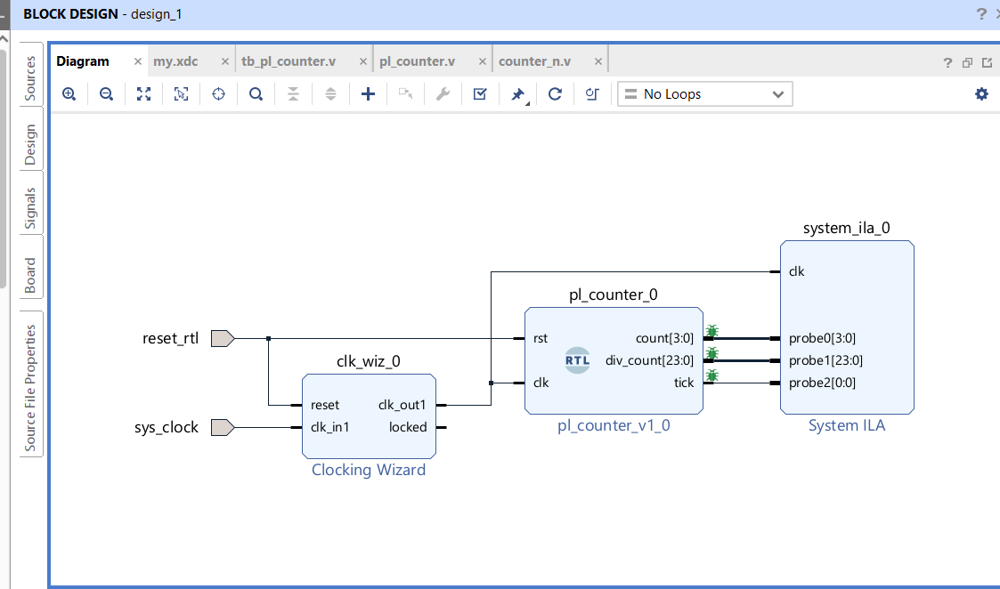

**그림 3-2** 이 장에서 완성할 Block Design. 외부 포트는 `sys_clock`·`reset_rtl` 둘뿐이고, `pl_counter_0`의 `count[3:0]`·`div_count[23:0]`·`tick`이 `system_ila_0`의 `probe0`·`probe1`·`probe2`에 연결된다.

보드 핀으로 나가는 신호는 **입력 2개**(`sys_clock`, `reset_rtl`)뿐이고, 카운터의 출력 3개는 모두 System ILA로 들어간다.

1교시(W2_S1)에서 실제로 완성하는 것은 위 그림의 Block Design 전체와 HDL Wrapper, 그리고 `pl_counter`의 동작을 확인하는 시뮬레이션까지다. 합성·핀 배정·비트스트림·하드웨어 다운로드는 2교시에서 한다.

---

## 3.3 재사용하는 카운터 — 계층 구조

지난 학기에 만든 카운터를 **다시 작성하지 않는다.** 새 시스템에 맞는 속도 조절 로직만 래퍼에 추가해 감싼다. 계층 구조는 다음과 같다.

```text
pl_counter                       ← 이번 주 래퍼 (Block Design에 블록으로 올라감)
├── 분주기 (clock-enable divider) : 100 MHz → 10 Hz tick
└── u_counter_n : counter_n      ← 지난 학기 파라미터 카운터를 그대로 재사용
```

### 3.3.1 `counter_n.v` — 파라미터 카운터 (재사용)

파일: [`LAB01/rtl/counter_n.v`](LAB01/rtl/counter_n.v)

```verilog
module counter_n #(
    parameter WIDTH   = 8,
    parameter MAX_VAL = (1 << WIDTH) - 1
)(
    input                  clk,
    input                  rst,   // 비동기, active-high
    input                  en,    // clock enable — en=1인 클럭에서만 카운트
    output reg [WIDTH-1:0] count,
    output                 max_tick
);
    always @(posedge clk or posedge rst)
        if (rst)
            count <= {WIDTH{1'b0}};
        else if (en)
            count <= (count == MAX_VAL[WIDTH-1:0]) ?
                     {WIDTH{1'b0}} : count + 1'b1;

    assign max_tick = (count == MAX_VAL[WIDTH-1:0]) && en;
endmodule
```

지난 학기 코드와 동작이 같다. 핵심은 `en` 입력이다. `clk`는 항상 100 MHz로 들어오지만, `count`는 `en=1`인 클럭에서만 1씩 증가한다.

### 3.3.2 `pl_counter.v` — 래퍼

파일: [`LAB01/rtl/pl_counter.v`](LAB01/rtl/pl_counter.v)

```verilog
module pl_counter #(
    parameter integer CLK_HZ  = 100_000_000,  // Clocking Wizard 출력 주파수
    parameter integer STEP_HZ = 10             // 초당 카운트 증가 횟수
)(
    input  wire        clk,
    input  wire        rst,
    output wire [3:0]  count,                  // 4비트 카운터 값
    output wire        tick,                   // 1클럭 폭의 enable 펄스
    output wire [23:0] div_count               // 분주 카운터 (자유 진행)
);
    localparam integer DIVIDE_COUNT = CLK_HZ / STEP_HZ;   // 10,000,000
    localparam integer DIV_WIDTH    = 24;

    reg  [DIV_WIDTH-1:0] div_cnt = 0;
    wire                 tick_i;

    assign tick_i = (div_cnt == DIVIDE_COUNT - 1);

    always @(posedge clk or posedge rst)
        if (rst)             div_cnt <= 0;
        else if (tick_i)     div_cnt <= 0;
        else                 div_cnt <= div_cnt + 1'b1;

    counter_n #(.WIDTH(4), .MAX_VAL(15)) u_counter_n (
        .clk(clk), .rst(rst), .en(tick_i),
        .count(count), .max_tick()
    );

    assign tick      = tick_i;
    assign div_count = div_cnt;
endmodule
```

`count`, `tick`, `div_count`는 보드 핀으로 나가지 않는다. 3.6절에서 Block Design의 이 net들을 우클릭해 System ILA에 연결한다.

### 3.3.3 설계 원칙 — 느린 클럭 대신 clock-enable

카운터를 초당 10회만 증가시키려면 10 Hz 클럭이 필요할 것 같지만, 그렇게 하지 않는다.

- `div_cnt`는 100 MHz `clk`로 0부터 계속 증가하다가 `DIVIDE_COUNT-1`(9,999,999)에 도달하면 `tick`을 **한 클럭 동안만** 1로 만들고 0으로 되돌아간다.
- `counter_n`은 계속 100 MHz `clk`를 사용하고, `tick=1`인 클럭에서만 카운트한다. 결과적으로 초당 `STEP_HZ`(=10)회 증가한다.
- **별도의 분주된 클럭(fabric clock)을 만들지 않는다.** 새 클럭을 만들면 Clock Tree와 타이밍 분석이 복잡해지고 `create_clock` 제약을 추가로 관리해야 한다. clock-enable 방식은 모든 레지스터가 같은 100 MHz 클럭 도메인에 있어 단순하다.

| 값 | 이 설계에서 | 의미 |
|---|---|---|
| `STEP_HZ` | 10 | `count` 값이 초당 10번 증가 |
| `count[0]` | 5 Hz로 토글 | ILA 파형에서 가장 빠르게 바뀌는 비트 |
| 4비트 전체 | 약 1.6초에 한 바퀴 | `0000` → `1111` → `0000` |

---

## 3.4 프로젝트 만들기

### 방법 A — New Project 마법사 (권장)

화면을 익히기 위해 처음에는 마법사로 만든다.

1. `File → Project → New…`
2. **Project name**: 예) `lab1`. **Location**: 한글과 공백이 없는 짧은 로컬 경로(예: `C:\SoC2026\work`). OneDrive·Dropbox 등 동기화 폴더 아래는 피한다.
3. **Project Type**: `RTL Project` 선택. "Do not specify sources at this time" 체크를 해제한다.
4. **Add Sources → Add Files**: `LAB01/rtl/counter_n.v`와 `LAB01/rtl/pl_counter.v`를 추가하고 "Copy sources into project"를 체크한다.
5. **Add Constraints**: 지금은 추가하지 않는다. 핀 배정용 XDC는 2교시에서 GUI로 직접 만든다.
6. **Default Part → Boards 탭**: "cora"로 검색해 Cora Z7-07S를 선택한다.
7. **Finish**.

프로젝트가 열리면 시뮬레이션 소스를 별도로 추가한다.

8. `Sources` 창에서 `Simulation Sources > sim_1`을 우클릭 → `Add Sources` → "Add or create simulation sources" → `LAB01/tb/tb_pl_counter.v`를 추가한다.

`Sources` 창의 계층이 그림 3-3처럼 보이면 정상이다. `Design Sources` 아래에 `pl_counter`가 top으로, 그 아래에 `u_counter_n : counter_n`이 보이고, `Simulation Sources` 아래에 `tb_pl_counter`가 보인다.

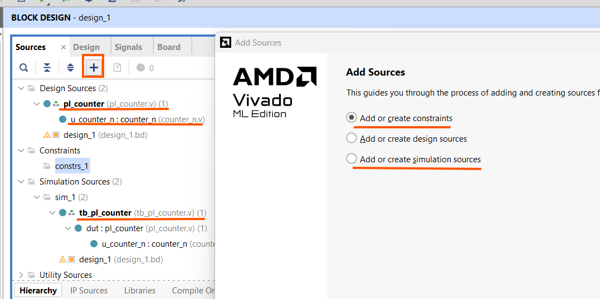

**그림 3-3** `Add Sources` 대화상자와 소스 계층. `pl_counter → u_counter_n` 설계 계층, `sim_1`의 `tb_pl_counter` 시뮬레이션 소스가 구분되어 있다.

### 방법 B — 제공 Tcl 스크립트

빠르게 같은 출발점에 도달하려면 Tcl 콘솔에서 다음을 실행한다.

```tcl
cd <저장소>/W2_PL_Design/LAB01
source create_project.tcl
```

RTL·테스트벤치 추가와 top 설정(`pl_counter`)까지 자동으로 처리된다. Block Design은 아래에서 직접 만든다. 자세한 설명은 [`LAB01/README.md`](LAB01/README.md)에 있다.

> **경로 주의.** Vivado 프로젝트는 한글·공백이 없는 **짧은** 로컬 경로에 만든다. OneDrive·Dropbox 동기화 폴더 아래에 만들면 빌드 도중 파일 잠금·권한 오류(`[Common 17-1293]`)가 나고, 경로가 길면 Windows의 260자 제한(`[Common 17-680]`)에 걸린다.

---

## 3.5 Block Design 구성

**Block Design**은 IP와 사용자 RTL을 캔버스 위에서 블록으로 배치하고 선으로 연결해 시스템을 구성하는 화면이다. 지난 학기 Quartus의 Platform Designer(Qsys)와 비슷하지만, Vivado에서는 우리가 작성한 Verilog 모듈도 이 캔버스에 블록으로 넣을 수 있다.

### 3.5.1 Block Design 생성

`Flow Navigator → IP INTEGRATOR → Create Block Design`을 누르고, 이름을 `design_1`로 두고 `OK`를 누른다(그림 3-4). 빈 캔버스가 열린다.

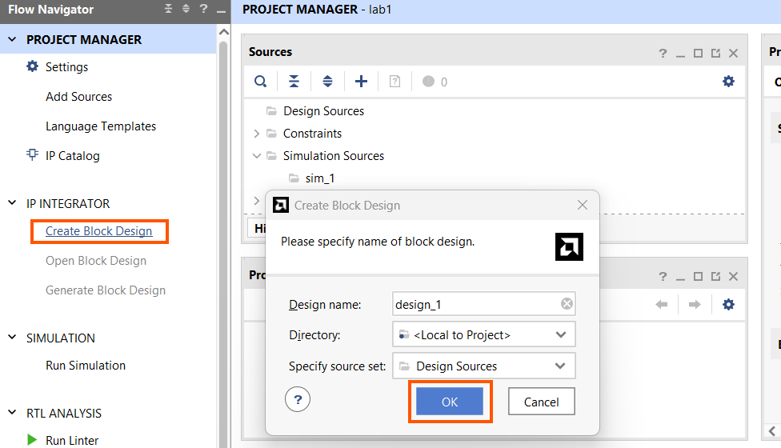

**그림 3-4** `Create Block Design` 대화상자. 설계 이름을 `design_1`로 지정한다.

### 3.5.2 카운터 모듈을 Module Reference로 추가

우리가 만든 Verilog 모듈을 Block Design에 넣을 때는 **Module Reference**를 사용한다. 모듈을 미리 IP로 패키징할 필요 없이, 소스에 있는 모듈 이름을 그대로 참조한다.

1. 캔버스의 빈 곳에서 우클릭 → `Add Module…` (그림 3-5)
2. Module type을 `RTL`로 두고, 목록에서 `pl_counter`를 선택 → `OK` (그림 3-6)

`pl_counter_0` 블록이 캔버스에 생긴다. 왼쪽에 입력 `clk`·`rst`, 오른쪽에 출력 `count[3:0]`·`tick`·`div_count[23:0]`가 나타난다. 3.3.2절의 모듈 선언과 정확히 일치한다.

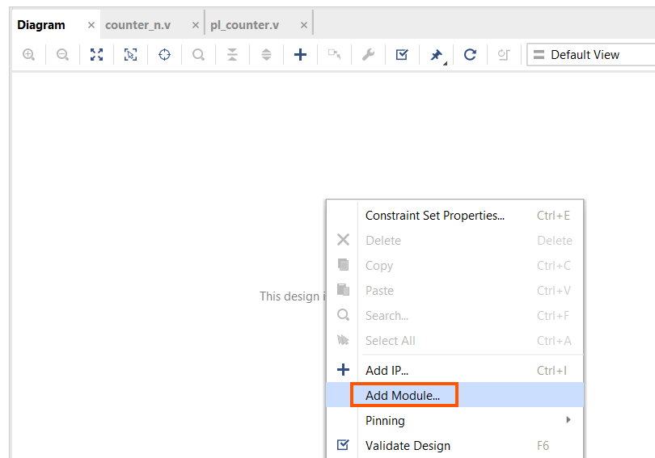

**그림 3-5** 캔버스 빈 곳 우클릭 → `Add Module…`.

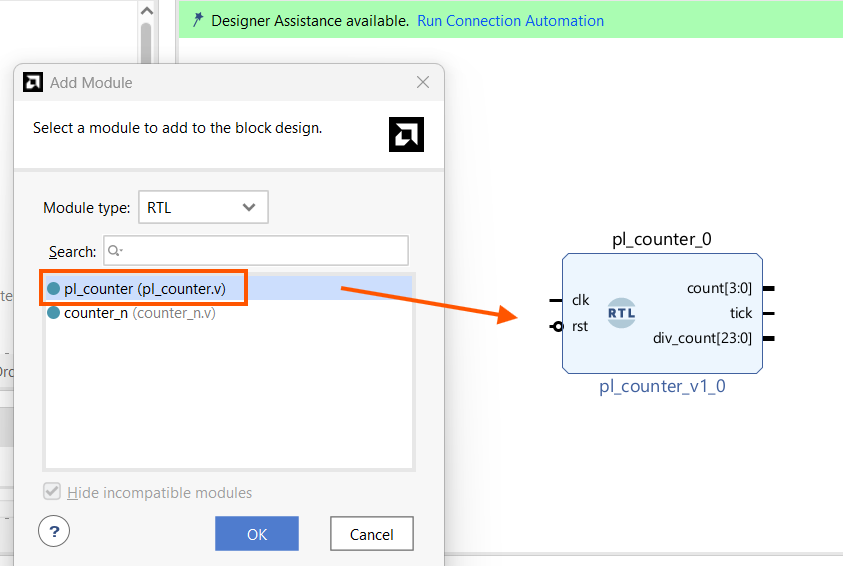

**그림 3-6** `Add Module` 대화상자. `pl_counter`를 선택하면 오른쪽에 블록 모양이 미리 보인다.

### 3.5.3 Clocking Wizard 추가와 설정

**Clocking Wizard**는 PL 안의 MMCM/PLL을 설정해 입력 클럭에서 다른 주파수의 클럭을 만들어 주는 IP다. 여기서는 보드의 125 MHz를 100 MHz로 바꾼다.

1. `Add IP`(+)를 누르고 "Clocking Wizard"를 검색해 캔버스에 추가한다(그림 3-7). `clk_wiz_0` 블록이 생기고 `reset`·`clk_in1`·`clk_out1`·`locked` 포트가 보인다.
2. `clk_wiz_0`을 더블클릭해 `Re-customize IP` 창을 연다.
3. **Clocking Options** 탭 → `Input Clock Information`의 Primary `clk_in1`을 **125.000** MHz로 둔다(그림 3-8).
4. **Output Clocks** 탭 → `clk_out1`의 Requested를 **100.000** MHz로 입력한다. Actual이 `100.000`으로 잡히는지 확인한다(그림 3-9).
5. `OK`.

> **`locked` 출력에 대하여.** MMCM/PLL은 전원이 들어온다고 바로 안정되지 않는다. 목표 주파수·위상에 도달하면 `locked` 신호가 1이 된다. 실무에서는 이 `locked`를 리셋 회로에 연결해 "클럭이 안정된 뒤에" 회로를 동작시키지만, 이 장의 단순 설계에서는 `locked`를 사용하지 않고 열어 둔다.

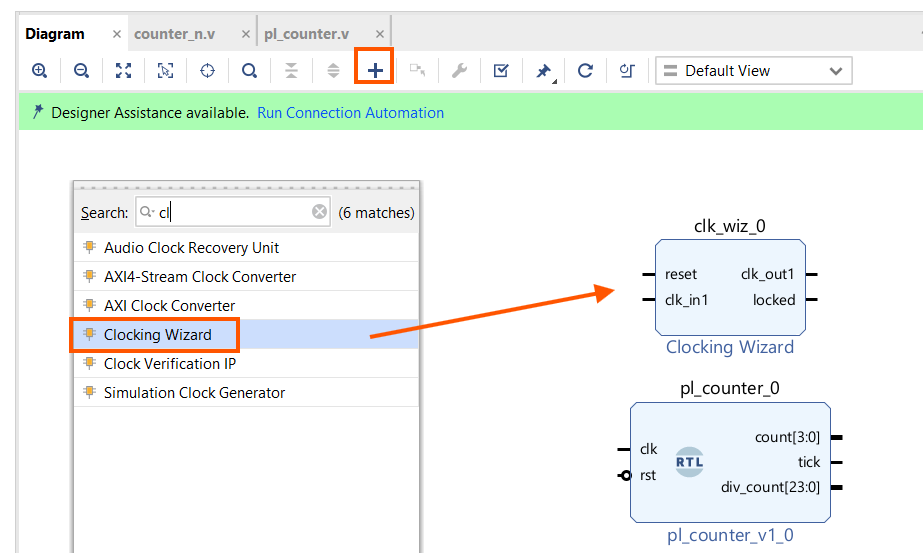

**그림 3-7** `Add IP`로 Clocking Wizard를 검색해 추가한 모습.

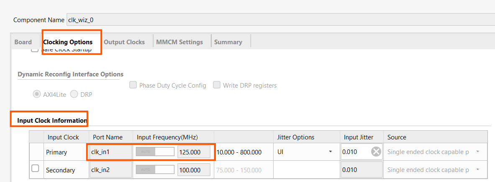

**그림 3-8** 입력 클럭 `clk_in1`을 125.000 MHz로 설정.

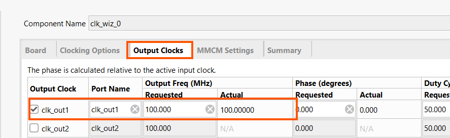

**그림 3-9** 출력 클럭 `clk_out1`을 100.000 MHz로 설정.

### 3.5.4 외부 포트 만들기 — Run Connection Automation

Clocking Wizard를 추가하면 캔버스 위에 **"Designer Assistance available. Run Connection Automation"** 배너가 나타난다. 이 기능은 보드 정의를 참고해 포트를 자동으로 연결하고 외부 포트를 만들어 준다. 배너를 클릭한다.

**① 입력 클럭 포트**

`clk_wiz_0 → clk_in1`을 체크하고, Options의 `Select Board Part Interface`에서 **`sys_clock ( System Clock )`** 을 선택한 뒤 `OK`를 누른다(그림 3-10). 보드 정의에 등록된 125 MHz 클럭(패키지 핀 `H16`)에 연결되고, 같은 이름의 외부 입력 포트 `sys_clock`이 만들어진다.

> 이 자동 연결 덕분에 **클럭 핀은 XDC에 직접 쓰지 않아도 된다.** 핀 위치와 125 MHz 타이밍 제약이 보드 정의에서 자동으로 적용된다. (2교시 4.2절에서 다시 확인한다.)

**② 리셋 포트**

배너를 다시 눌러 `clk_wiz_0 → reset`을 체크하고, Options의 `Select Reset Source`에서 **`New External Port ( ACTIVE_HIGH )`** 를 선택한 뒤 `OK`를 누른다(그림 3-11). `reset_rtl`이라는 외부 입력 포트가 생기고 `clk_wiz_0/reset`에 연결된다. 극성이 ACTIVE_HIGH이므로 Cora 버튼(누르면 1)과 맞다.

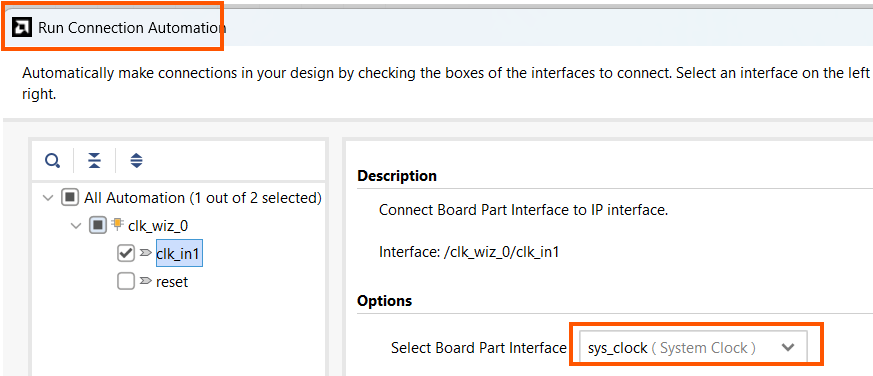

**그림 3-10** `clk_in1`을 보드의 `sys_clock` 인터페이스에 자동 연결.

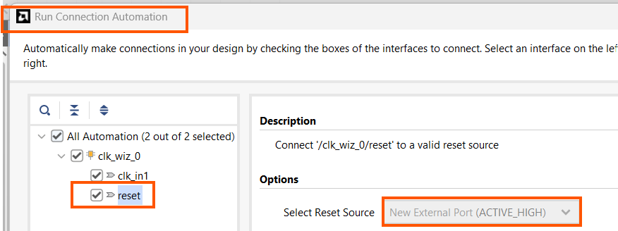

**그림 3-11** `reset`을 `New External Port (ACTIVE_HIGH)`로 만들어 `reset_rtl` 포트 생성.

### 3.5.5 나머지 연결

자동 연결로 처리되지 않은 나머지는 포트에서 포트로 선을 끌어 직접 잇는다.

| 출발 | 도착 | 설명 |
|---|---|---|
| `clk_wiz_0/clk_out1` | `pl_counter_0/clk` | 100 MHz 클럭 공급 |
| `reset_rtl` | `pl_counter_0/rst` | 버튼 리셋을 카운터에도 연결 |

결과적으로 `reset_rtl`은 `clk_wiz_0/reset`과 `pl_counter_0/rst` **양쪽**에 연결된다. 버튼 하나로 클럭과 카운터를 함께 리셋하는 구조다. `clk_wiz_0/locked`와 `pl_counter_0`의 출력 3개(`count`·`tick`·`div_count`)는 **아직 연결하지 않는다.** 다음 절에서 ILA로 뺀다.

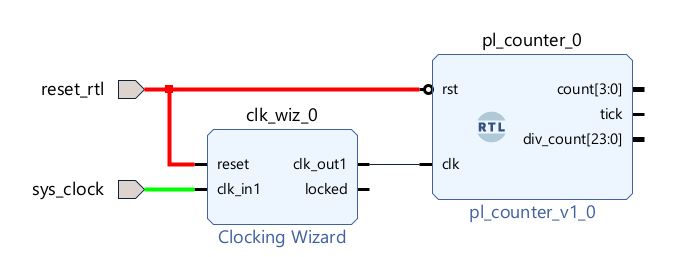

**그림 3-12** 외부 포트 `sys_clock`·`reset_rtl`이 연결된 상태. `reset_rtl`(빨간 net)이 `clk_wiz_0/reset`과 `pl_counter_0/rst`로 갈라진다.

---

## 3.6 System ILA 삽입 — Debug 표시

LED가 없으므로 카운터가 실제로 도는지 확인할 방법이 필요하다. **ILA(Integrated Logic Analyzer)** 는 FPGA 내부 신호를 ILA 클럭마다 on-chip BRAM에 저장했다가 Hardware Manager로 보여 주는 디버그 IP다. 지난 학기 Quartus의 SignalTap과 같은 역할을 한다. Block Design에서는 net을 우클릭해 **Debug**로 표시하면 Vivado가 System ILA를 자동으로 삽입한다.

### 3.6.1 관찰할 net 선택 후 Debug

`Ctrl` 키를 누른 채 다음 세 net을 함께 선택한다.

- `pl_counter_0/count`
- `pl_counter_0/tick`
- `pl_counter_0/div_count`

선택한 상태에서 우클릭 → **Debug**를 누른다(그림 3-13).

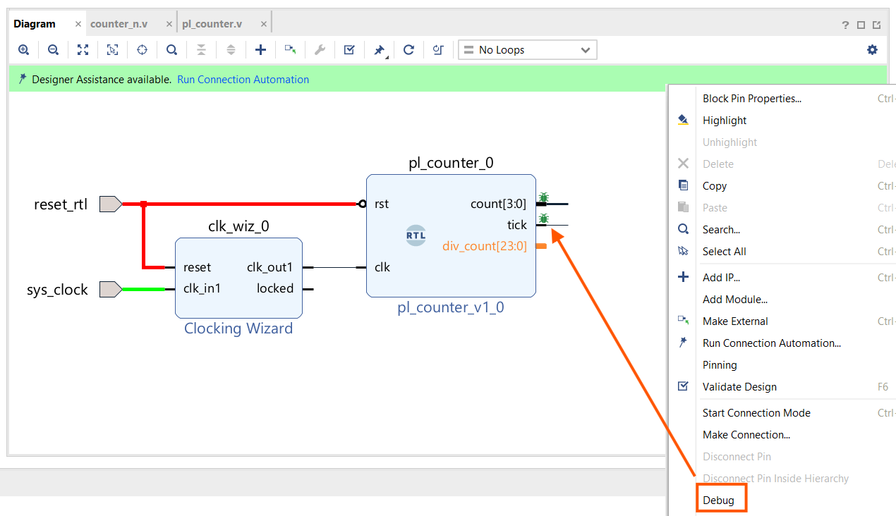

**그림 3-13** 관찰할 net 세 개를 선택하고 우클릭 → `Debug`.

### 3.6.2 Run Connection Automation

캔버스 위에 다시 배너가 나타난다. 클릭하고 다음과 같이 설정한다(그림 3-14).

- `Net Connections`에서 `count` · `div_count` · `tick`을 모두 체크
- **Probe Type**: `Data and Trigger`
- **Clock Source**: `/clk_wiz_0/clk_out1` (100 MHz)
- **System ILA**: `Auto`
- `OK`

Vivado가 **System ILA** 블록(`system_ila_0`)과 `dbg_hub`(디버그 허브)을 자동으로 삽입하고 probe를 연결한다. probe 번호와 신호의 대응은 다음과 같다.

| Probe | 신호 | 폭 | 관찰 목적 |
|---|---|---:|---|
| probe0 | `count` | 4 | tick마다 +1, `1111`→`0000` 순환 |
| probe1 | `div_count` | 24 | 100 MHz로 0→9,999,999 증가 후 wrap |
| probe2 | `tick` | 1 | enable 펄스가 1클럭만 뜨는지 |

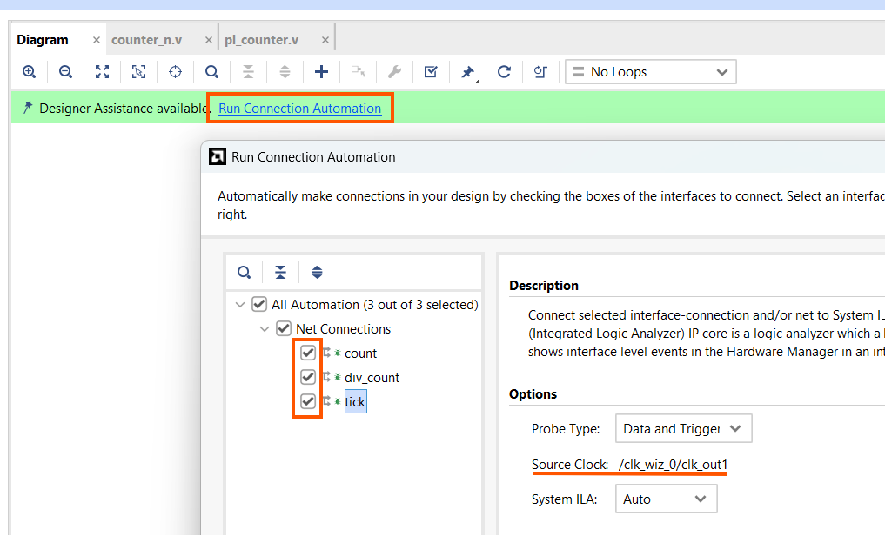

**그림 3-14** 세 net을 System ILA에 연결. Clock Source는 `/clk_wiz_0/clk_out1`.

### 3.6.3 System ILA 설정

`system_ila_0`을 더블클릭해 `General Options`에서 두 가지를 설정한다(그림 3-15).

- **Sample Data Depth**: `2048`
- **Capture Control**: 체크

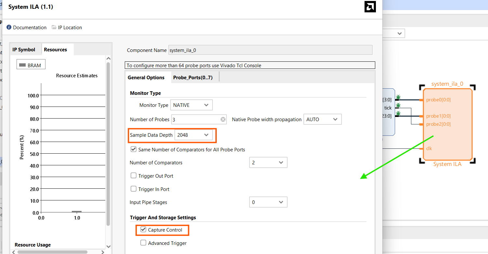

**그림 3-15** System ILA. probe 3개, Sample Data Depth 2048, Capture Control 체크.

> **Capture Control을 체크하는 이유.** 2교시에서 "`tick`이 1인 클럭만 저장"하는 **BASIC 캡처 모드**를 사용하는데, 그 기능이 이 옵션에 딸려 있다.
>
> **왜 트리거가 필요한가.** ILA는 100 MHz로 샘플링한다. 깊이가 2048이면 캡처 창은 약 **20 µs**에 불과하다. 그런데 `tick`은 0.1초(100 ms)마다 한 번뿐이므로, 트리거 없이 아무 때나 캡처하면 창 안에 `tick`이 거의 들어오지 않는다. 2교시에서 `tick`을 트리거·캡처 조건으로 걸어 원하는 순간을 잡는다.

---

## 3.7 Validate Design과 BD 41-1348 경고

캔버스 빈 곳에서 우클릭 → **Validate Design**(단축키 F6)을 실행해 연결 오류를 점검한다.

이 설계에서는 **Critical Warning `[BD 41-1348]`** 이 하나 나타난다(그림 3-16).

> Reset pin `/pl_counter_0/rst` (associated clock `/pl_counter_0/clk`) is connected to asynchronous reset source `/reset_rtl`. This may prevent design from meeting timing. Please add Processor System Reset module …

버튼에서 오는 **비동기 리셋을 카운터에 그대로 연결**했기 때문이다. 정석은 Processor System Reset IP를 넣어 클럭에 동기화된 리셋을 만들고, `locked`가 1이 된 뒤에 리셋을 푸는 것이다. 이 장에서는 학습을 위해 단순함을 택했고, 다음 이유로 이 경고를 **확인만 하고 넘어간다.**

- `pl_counter`의 리셋은 비동기로 즉시 0을 만들어 주면 충분하다. 초당 10회로 느리게 도는 회로라 리셋 해제 시점의 타이밍이 빡빡하지 않다.
- 이 회로에는 서로 다른 클럭 도메인이 없다.
- Processor System Reset과 `locked`의 정식 연결은 PS를 다루는 이후 장에서 배운다.

결과 창에 이 **경고만 있고 Error가 없으면** 다음 단계로 진행한다.

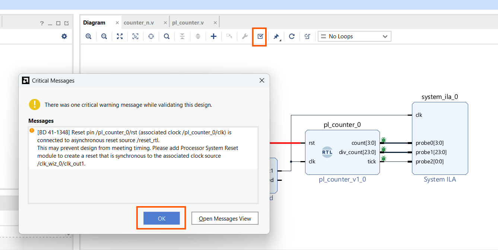

**그림 3-16** `Validate Design` 결과. `[BD 41-1348]` 경고 하나. 배경에 System ILA까지 연결된 Block Design이 보인다.

---

## 3.8 HDL Wrapper 생성

Block Design(`.bd`)은 그 자체로 합성할 수 없다. 최상위가 될 Verilog 모듈로 감싸야 하는데, 이를 **HDL Wrapper**라고 한다.

1. `Sources → Design Sources → design_1 (design_1.bd)`을 우클릭 → `Create HDL Wrapper…` (그림 3-17)
2. "Let Vivado manage wrapper and auto-update"를 선택 → `OK`
3. 생성된 `design_1_wrapper`가 top인지 확인한다. 아니면 우클릭 → `Set as Top` (그림 3-18)

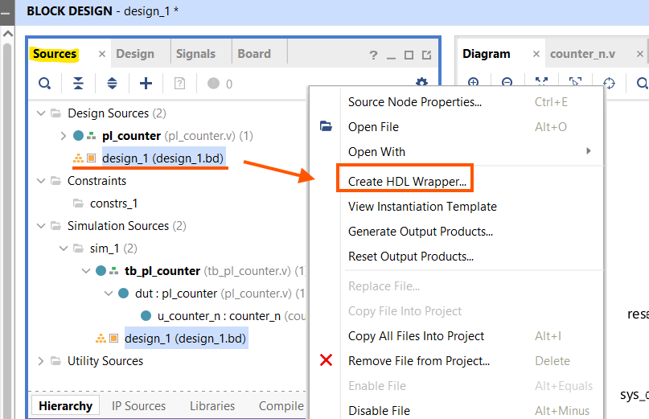

**그림 3-17** `design_1` 우클릭 → `Create HDL Wrapper…`.

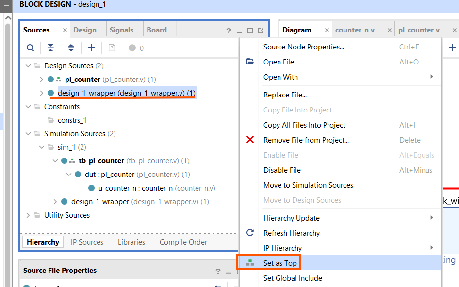

**그림 3-18** `design_1_wrapper`를 top으로 설정.

---

## 3.9 Behavioral Simulation

파일: [`LAB01/tb/tb_pl_counter.v`](LAB01/tb/tb_pl_counter.v)

실제 회로에서 `tick`은 0.1초마다 한 번 나온다. 시뮬레이션에서 이를 그대로 기다릴 수는 없으므로, 테스트벤치는 `CLK_HZ`와 `STEP_HZ`를 작게 오버라이드해 **10클럭마다 한 번 `tick`** 이 나오도록 만들어져 있다.

```verilog
pl_counter #(
    .CLK_HZ (1000),   // 10으로 분주 → 10클럭마다 tick
    .STEP_HZ(100)
) dut ( .clk(clk), .rst(rst),
        .count(count), .tick(tick), .div_count(div_count) );
```

> 이 시뮬레이션은 `pl_counter`만 직접 검증한다. Block Design이나 HDL Wrapper와는 무관하므로, 설계 소스만 있으면 3.5절보다 먼저 실행해도 된다. 이 장에서는 순서상 여기서 다룬다.

### 실행

`Flow Navigator → SIMULATION → Run Simulation → Run Behavioral Simulation`을 실행한다(그림 3-19). 파형 창에서 `clk`, `rst`, `div_count`, `tick`, `count`를 확인한다.

- `rst=1`인 동안 `div_count`와 `count`가 0으로 고정된다.
- `rst=0`이 된 뒤 `div_count`가 0→9로 증가하다가 9에서 `tick`이 **1클럭 동안** 1이 되고 `div_count`가 0으로 돌아간다.
- `tick`이 뜰 때마다 `count`가 1씩 증가하고, `1111` 다음에 `0000`으로 순환한다.

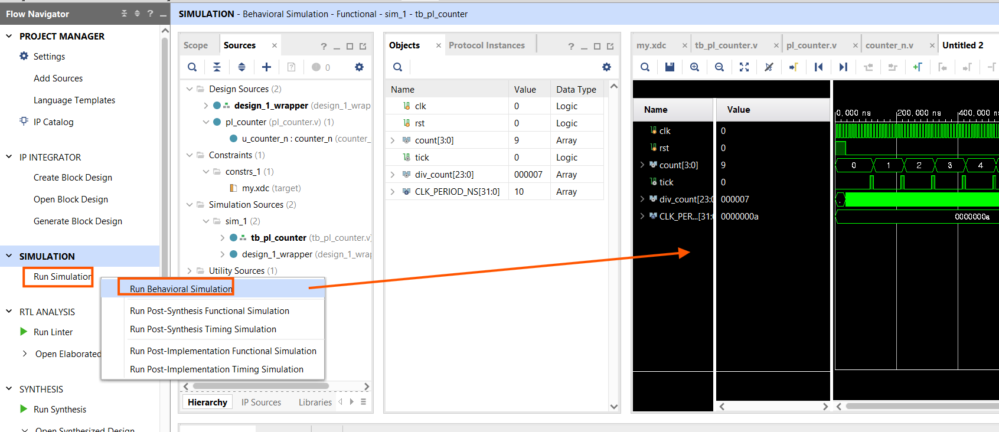

**그림 3-19** `Run Simulation → Run Behavioral Simulation`.

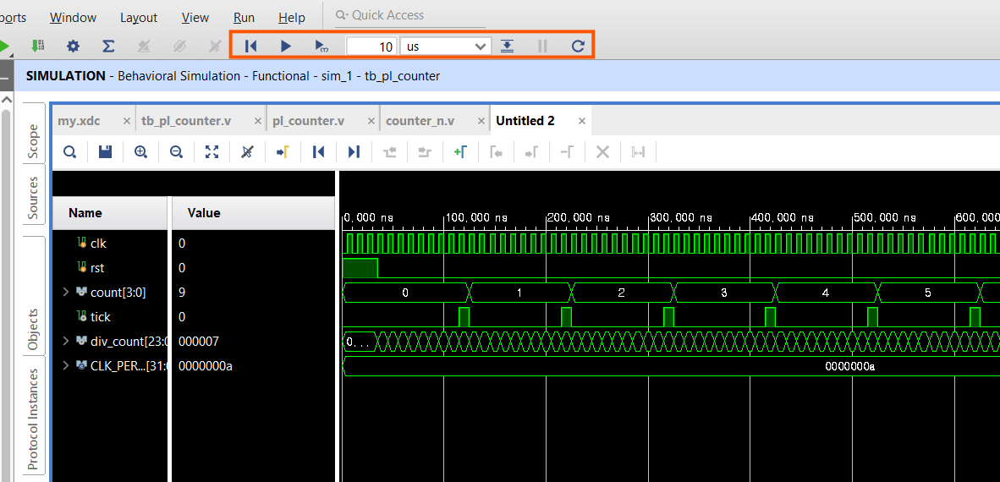

**그림 3-20** Behavioral Simulation 파형. `count`가 0→5로 증가하고, 그 사이마다 `tick` 펄스가 뜨며, `div_count`는 톱니 모양으로 진행한다.

> **검증됨.** 이 테스트벤치는 Vivado 2023.2의 `xsim`에서 위 동작이 그대로 나오는 것을 확인했다. `rst` 해제 후 `count`가 `0000 → 0001 → 0010 → …` 순으로 증가한다.

> **Design Sources와 Simulation Sources.** `counter_n.v`·`pl_counter.v`는 칩에 들어갈 회로(Design)이고, `tb_pl_counter.v`는 그 회로를 흔들어 보는 코드(Simulation)다. 합성·구현에는 Design Sources만 사용된다. 지난 학기 ModelSim에서 테스트벤치를 따로 관리하던 것과 같다.

---

## 3.10 정리

| 키워드 | 내용 |
|---|---|
| Module Reference | 기존 Verilog 모듈을 `Add Module…`로 Block Design에 블록으로 재사용 |
| Clocking Wizard | MMCM/PLL로 125 MHz → 100 MHz 생성. `locked`는 이 장에서 미사용 |
| Run Connection Automation | 보드 `sys_clock`에 자동 연결(핀 자동), 리셋은 New External Port(ACTIVE_HIGH)로 생성 |
| Debug 표시 | net 우클릭 → Debug → System ILA 자동 삽입. probe0=`count`, probe1=`div_count`, probe2=`tick` |
| Sample Depth / Capture Control | 캡처 창 ≈ 20 µs. BASIC 캡처 모드를 위해 Capture Control 체크 |
| BD 41-1348 | 비동기 리셋 직결 경고. 이 장에서는 확인만 하고 진행. 정석은 Processor System Reset |
| HDL Wrapper | Block Design을 합성 가능하게 감싸는 최상위 Verilog. top으로 설정 |
| clock-enable 원칙 | 느린 클럭을 새로 만들지 않고 `en=1`인 클럭에서만 카운트해 속도를 조절 |

---

## 과제 — W2_S2 전까지

1. `pl_counter`의 `STEP_HZ`를 20으로 바꿔 시뮬레이션을 다시 실행하고, `tick` 간격이 어떻게 바뀌는지 파형으로 확인한다.
2. `rst`를 시뮬레이션 도중에 다시 1로 올렸다가 내리면 `count`와 `div_count`가 어떻게 되는지 확인한다.
3. Cora Z7-07S의 `BTN0`·`BTN1`이 각각 어느 패키지 핀인지 Digilent의 `Cora-Z7-07S-Master.xdc`에서 찾아 정리한다.

## 다음 장 예고 — 제4장 (W2_S2)

- Synthesis 실행 후 I/O Planning으로 `reset_rtl`을 핀 `D20`에 배정
- `Save Constraints`로 `my.xdc` 저장 → Implementation → Bitstream 생성
- 조별로 Cora Z7-07S에 다운로드하고 System ILA로 카운터 동작 확인
- ILA의 **ALWAYS** 캡처 모드와 **BASIC** 캡처 모드 비교

---

*SoC 설계 · 2주차 1교시(W2_S1) | Vivado 2023.2 · Windows · Cora Z7-07S*
