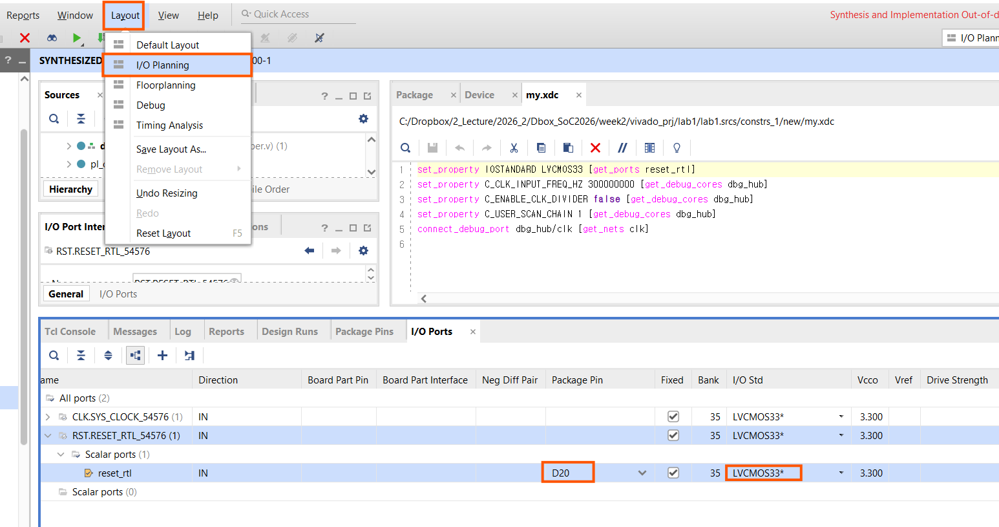
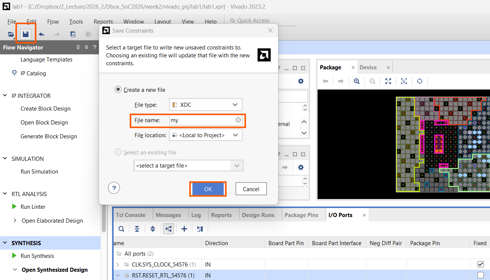
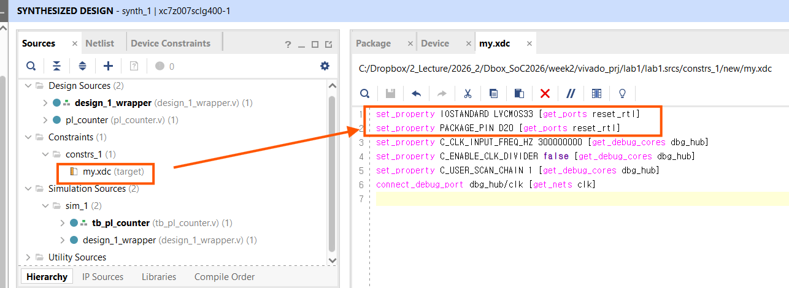
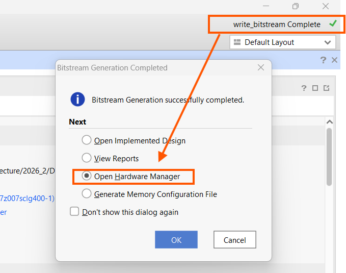
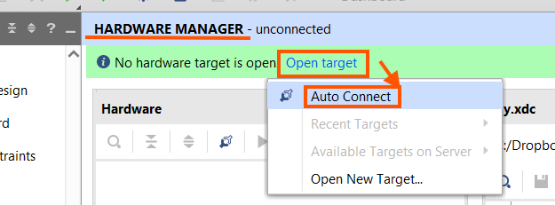
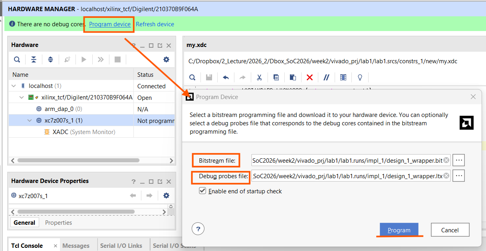
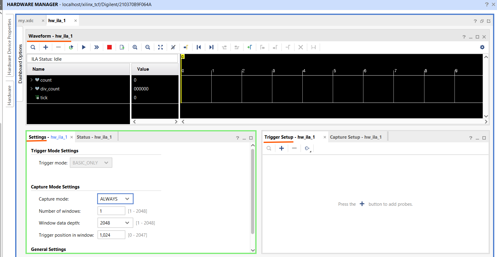
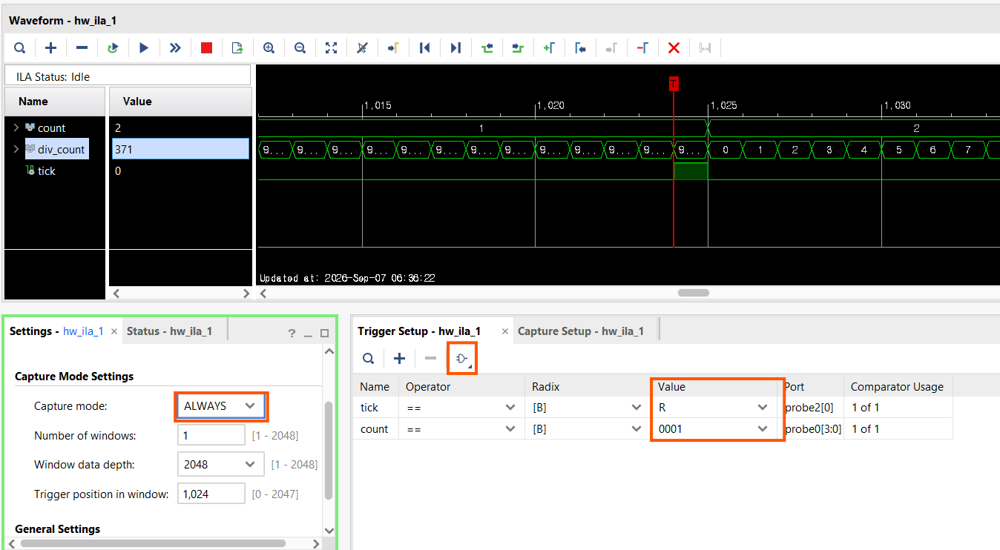
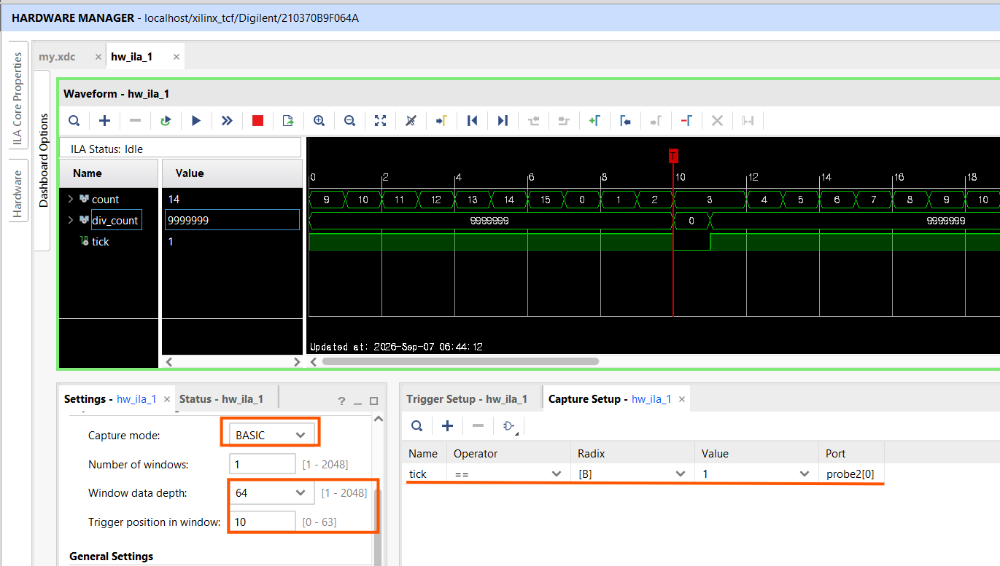

# 제4장 PL 설계 (2) — 합성부터 하드웨어 관찰까지

**SoC 설계** · 2주차 2교시(W2_S2) | Vivado 2023.2 · Windows 11 · Digilent Cora Z7-07S

---

제3장에서 Block Design을 만들고 System ILA를 삽입한 뒤 HDL Wrapper까지 생성했다. 이 장에서는 그 설계(`design_1_wrapper`)를 실제 칩에서 동작시킨다. 순서는 다음과 같다.

> **Synthesis** → **핀 배정(I/O Planning)** → **XDC 저장** → **Implementation** → **Bitstream 생성** → **하드웨어 프로그래밍** → **System ILA 관찰(ALWAYS · BASIC 캡처 모드)**

이 설계에는 데이터 출력 핀이 없으므로(보드에 LED가 없음), 하드웨어에서의 확인은 전적으로 System ILA로 한다. 이 장에서는 특히 ILA의 두 가지 캡처 모드를 직접 비교해 본다.

> **참고.** 이 회로에는 Zynq PS(ARM) 블록을 넣지 않는다. PS는 다음 주부터 다룬다. 제3장에서 본 `BD 41-1348` 경고(비동기 리셋 직결)는 이 장에서도 그대로 두고 진행한다.

---

## 학습 목표

이 장을 마치면 다음을 할 수 있다.

- Synthesis를 실행하고 `Open Synthesized Design`으로 넘어간다.
- `I/O Planning` 화면에서 포트에 패키지 핀과 IOSTANDARD를 지정한다.
- `sys_clock`은 핀을 지정하지 않아도 되고 `reset_rtl`만 지정하면 되는 이유를 설명한다.
- 핀 배정을 XDC 파일로 저장하고, Vivado가 자동으로 추가하는 `dbg_hub` 제약을 구분한다.
- Bitstream(`.bit`)과 probe 파일(`.ltx`)을 하드웨어에 다운로드한다.
- System ILA의 **ALWAYS** 캡처 모드와 **BASIC** 캡처 모드의 차이를 파형으로 설명한다.

---

## 4.1 Synthesis 실행

`Flow Navigator → SYNTHESIS → Run Synthesis`를 실행한다. 완료되면 나타나는 대화상자에서 `Open Synthesized Design`을 선택한다.

합성이 끝나면 논리 회로가 실제 셀과 배선으로 변환된 **넷리스트**가 만들어진다. 다만 아직 어떤 신호를 보드의 어느 핀에 연결할지 정하지 않았다. 이 상태로 Bitstream을 만들면 배치 규칙 검사(DRC)에서 `UCIO-1`(핀 미지정), `NSTD-1`(IOSTANDARD 미지정) 오류로 멈춘다. 다음 절에서 핀을 배정한다.

---

## 4.2 핀 배정 — I/O Planning

`Open Synthesized Design` 상태에서 상단 메뉴 `Layout → I/O Planning`을 선택하면 핀 배정에 맞춘 화면 구성으로 바뀐다(그림 4-1). 화면 아래쪽 **I/O Ports** 탭에 설계의 외부 포트가 나온다. 이 회로의 외부 포트는 두 개다.

| 포트 | 방향 | 패키지 핀 | IOSTANDARD |
|---|---|---|---|
| `sys_clock` | 입력 | (자동) | (자동) |
| `reset_rtl` | 입력 | **`D20`** | **`LVCMOS33`** |

**`sys_clock`은 지정할 필요가 없다.** 제3장 3.5.4절에서 `Run Connection Automation`으로 보드의 `sys_clock` 인터페이스에 연결했기 때문에, 핀 위치(`H16`)와 125 MHz 타이밍 제약이 보드 정의 파일에서 자동으로 들어온다.

**`reset_rtl`만 지정한다.** `I/O Ports` 표에서 `reset_rtl` 행을 찾아, `Package Pin` 칸에 `D20`(Cora `BTN0`), `I/O Std` 칸에 `LVCMOS33`을 입력한다.



**그림 4-1** `Layout → I/O Planning`. `I/O Ports`에서 `reset_rtl`에 핀 `D20`, I/O Std `LVCMOS33`을 지정한다.

---

## 4.3 핀 배정을 XDC 파일로 저장

`Ctrl+S`(또는 `File → Constraints → Save`)를 누르면 **Save Constraints** 창이 뜬다. 아직 제약을 저장할 파일이 없으므로 새로 만든다(그림 4-2).

1. `Create a new file` 선택
2. File type: `XDC`
3. File name: `my`
4. File location: `<Local to Project>`
5. `OK`

`my.xdc`가 만들어지고, 방금 지정한 핀 정보가 이 파일에 기록된다.



**그림 4-2** `Save Constraints`에서 새 제약 파일 `my.xdc`를 만든다.

저장된 `my.xdc`를 열어 보면 성격이 다른 두 묶음의 줄이 들어 있다(그림 4-3).

```tcl
## (1) 내가 지정한 핀 제약
set_property IOSTANDARD LVCMOS33 [get_ports reset_rtl]
set_property PACKAGE_PIN D20     [get_ports reset_rtl]

## (2) Vivado가 자동으로 추가한 디버그 허브(dbg_hub) 제약 — 지우지 않는다
set_property C_CLK_INPUT_FREQ_HZ 300000000 [get_debug_cores dbg_hub]
set_property C_ENABLE_CLK_DIVIDER false     [get_debug_cores dbg_hub]
set_property C_USER_SCAN_CHAIN 1            [get_debug_cores dbg_hub]
connect_debug_port dbg_hub/clk [get_nets clk]
```

| 줄 | 의미 |
|---|---|
| `PACKAGE_PIN D20` | `reset_rtl` 신호를 칩의 물리 핀 `D20`(Cora `BTN0`)에 배정 |
| `IOSTANDARD LVCMOS33` | 그 핀의 전기 규격을 3.3 V LVCMOS로 지정 |
| `... [get_debug_cores dbg_hub]` | System ILA를 넣으면 생기는 디버그 허브의 설정. Vivado가 만든다 |
| `connect_debug_port dbg_hub/clk [get_nets clk]` | 디버그 허브의 클럭을 100 MHz net(`clk`)에 연결 |

> `sys_clock`에 대한 줄이 없는 것이 정상이다(4.2절). 보드 자동 연결이 그 역할을 대신한다.



**그림 4-3** 저장된 `my.xdc`. `reset_rtl`의 핀 제약과, Vivado가 자동으로 추가한 `dbg_hub` 제약이 함께 들어 있다.

---

## 4.4 Implementation과 Bitstream 생성

`Flow Navigator → PROGRAM AND DEBUG → Generate Bitstream`을 실행한다. 합성 결과가 있으면 Vivado가 **Implementation**(배치·배선)을 먼저 자동으로 수행하고, 이어서 Bitstream을 만든다. System ILA와 `dbg_hub`이 BRAM과 LUT를 사용하므로 시간이 조금 걸린다.

완료되면 `…/<프로젝트>.runs/impl_1/` 폴더에 두 파일이 생긴다.

- **`design_1_wrapper.bit`** — 비트스트림(칩에 쓰는 설정 데이터)
- **`design_1_wrapper.ltx`** — probe 정보 파일. Hardware Manager가 ILA 신호 이름을 아는 데 필요하다

| 확인 항목 | 이 설계에서 확인된 값 |
|---|---|
| DRC `UCIO-1` / `NSTD-1` | 없음 (핀 배정 완료) |
| Timing `WNS` | 0 이상 (여유 있음) |
| 생성물 | `design_1_wrapper.bit` + `design_1_wrapper.ltx` |

> `dbg_hub` 관련 `PDCN-1569`, `RTSTAT-10` 같은 Warning은 디버그 IP에서 항상 나오는 정상 경고다.

완료 대화상자에서 **`Open Hardware Manager`** 를 선택하고 `OK`를 누른다(그림 4-4).



**그림 4-4** Bitstream 생성 완료. `Open Hardware Manager`를 선택한다.

---

## 4.5 하드웨어 프로그래밍

조별로 Cora Z7-07S를 준비한다.

1. Cora Z7-07S에 micro-USB 케이블을 연결한다(PC와 연결).
2. Hardware Manager 상단의 `Open target → Auto Connect`를 누른다(그림 4-5). `localhost` 아래에 `xc7z007s_1` 디바이스가 잡힌다.
3. `Program device`를 누른다(그림 4-6).
   - **Bitstream file**: `…/impl_1/design_1_wrapper.bit`
   - **Debug probes file**: `…/impl_1/design_1_wrapper.ltx` (자동으로 채워지지 않으면 `impl_1` 폴더에서 직접 선택한다)
4. `Program`.

프로그래밍이 끝나면 ILA 대시보드(`hw_ila_1`)가 자동으로 열린다.



**그림 4-5** `Open target → Auto Connect`로 보드에 연결.



**그림 4-6** `Program Device`. 비트스트림(`.bit`)과 probe 파일(`.ltx`)을 함께 지정한다.

---

## 4.6 System ILA로 카운터 관찰

### 4.6.1 ILA 대시보드

`hw_ila_1` 탭의 `Waveform` 창에 probe `count`, `div_count`, `tick`이 보인다. `ILA Status`는 `Idle`이다. 아직 캡처를 하지 않은 상태다.



**그림 4-7** ILA 대시보드. 왼쪽에 probe 세 개, 아래 `Settings`에 캡처 모드와 창 깊이가 있다.

ILA의 동작은 크게 두 가지 설정으로 정해진다.

- **Trigger(트리거)**: 캡처를 *언제 시작·정렬*할지 정하는 조건.
- **Capture mode(캡처 모드)**: 트리거 이후 *어떤 클럭의 샘플을 버퍼에 저장*할지 정하는 규칙. `ALWAYS`와 `BASIC` 두 가지를 아래에서 비교한다.

### 4.6.2 ALWAYS 캡처 모드 — 사건을 클럭 단위로 보기

`Settings` 창에서 다음과 같이 둔다.

- **Capture mode**: `ALWAYS`
- **Window data depth**: `2048`
- **Trigger position in window**: `1024`

`ALWAYS`는 **모든 ILA 클럭의 샘플을 저장**한다. 버퍼가 2048샘플이고 클럭이 100 MHz이므로, 한 번의 캡처가 담는 시간은 약 **20 µs**다. `tick`은 0.1초마다 한 번뿐이라 이 창 안에서 우연히 잡히기 어렵다. 그래서 트리거를 건다.

`Trigger Setup` 창에서 `+`로 probe를 추가해 조건을 만든다(그림 4-8).

- `tick` `==` `R` — `tick`의 **상승(rising)** 순간
- `count` `==` `0001` — `count`가 1이 되는 순간

상단의 ▶(`Run Trigger`)를 누르면, `count`가 `0001`이 되는 그 클럭을 창의 1024번째 위치에 놓고 앞뒤 20 µs를 저장한다. 파형에서 `div_count`가 `9,999,999`에서 `0`으로 되돌아가는 바로 그 클럭에 `tick`이 1클럭 뜨고 동시에 `count`가 +1 되는 과정이 **클럭 하나 단위로** 보인다.



**그림 4-8** ALWAYS 캡처 모드. 트리거 조건은 `tick` 상승 그리고 `count == 0001`. `tick` 순간 주변이 사이클 단위로 보인다.

### 4.6.3 BASIC 캡처 모드 — 오랜 시간을 압축해서 보기

이번에는 `Settings`를 다음과 같이 바꾼다.

- **Capture mode**: `BASIC`
- **Window data depth**: `64`
- **Trigger position in window**: `10`

그리고 `Capture Setup` 창(트리거가 아니라 **캡처** 설정)에 조건을 하나 건다(그림 4-9).

- `tick` `==` `1`

`BASIC` 캡처 모드는 **캡처 조건이 참인 클럭의 샘플만 저장**한다. 조건이 `tick == 1`이므로, 버퍼에 들어가는 모든 샘플은 `tick`이 뜬 순간이다. 즉 **한 샘플이 곧 한 번의 tick**이다. 64칸짜리 버퍼가 tick 64개, 다시 말해 카운터가 64번 증가하는 **약 6.4초**를 담는다.

파형에서 확인할 것.

- 저장된 모든 샘플에서 `div_count = 9,999,999`이다. `tick`을 만드는 값이 바로 이 값이기 때문이다.
- `count`는 한 칸마다 정확히 +1 된다: `… 9  10  11  12  13  14  15  0  1  …`.
- `tick`은 늘 1이다. 그렇게 저장했으니 당연하다.



**그림 4-9** BASIC 캡처 모드. 캡처 조건 `tick == 1`, 깊이 64. `count`가 한 칸마다 증가해 4비트 순환이 한눈에 보인다.

### 4.6.4 두 캡처 모드 비교

| | ALWAYS | BASIC (조건 `tick == 1`) |
|---|---|---|
| 저장 기준 | 모든 클럭 | 조건이 참인 클럭만 |
| 버퍼가 담는 실제 시간 | 2048샘플 ≈ 20 µs | 64샘플 ≈ 6.4 초 |
| 잘 보이는 것 | `div_count` wrap · `tick` 폭 · `count` 증가를 **클럭 단위**로 | `count`가 **길게 증가·순환**하는 흐름 |
| 언제 쓰나 | 한 사건의 타이밍을 정밀하게 볼 때 | 느린 신호의 전체 흐름을 볼 때 |

두 모드를 번갈아 실행하며, 같은 카운터가 관점에 따라 어떻게 달리 보이는지 확인한다.

### 4.6.5 리셋 버튼 확인

`BTN0`(핀 `D20`, 신호 `reset_rtl`)을 눌러 본다.

- `reset_rtl`이 `clk_wiz_0/reset`과 `pl_counter_0/rst`에 함께 연결돼 있으므로, **클럭과 카운터가 동시에 리셋**된다.
- `count`와 `div_count`가 0에서 다시 시작한다.
- 버튼을 누르는 동안 `clk_out1`이 잠깐 흔들리므로 ILA·디버그 연결도 잠시 끊길 수 있다. 버튼을 떼고 다시 `Run Trigger`를 누른다.

> `BTN1`(핀 `D19`)은 이 설계에서 아무 곳에도 연결돼 있지 않다. 제3장에서 언급한 Processor System Reset IP를 넣으면, "클럭은 그대로 두고 사용자 회로만 리셋"하는 보조 리셋을 이 버튼에 따로 둘 수 있다.

---

## 4.7 정리

| 키워드 | 내용 |
|---|---|
| I/O Planning | 합성 넷리스트 상태에서 외부 포트에 패키지 핀과 IOSTANDARD를 지정하는 화면 |
| `sys_clock` 자동 제약 | 보드 인터페이스에 연결했으므로 핀·타이밍이 자동. `reset_rtl`만 `D20`/`LVCMOS33` 지정 |
| `my.xdc` | 내가 지정한 핀 제약 + Vivado가 자동 추가한 `dbg_hub` 제약. 후자는 지우지 않는다 |
| `.ltx` | Bitstream과 함께 생성되는 probe 정보 파일. 프로그래밍 시 함께 로드 |
| ALWAYS 캡처 | 모든 클럭 저장. 창 ≈ 20 µs. 한 사건을 클럭 단위로 정밀하게 |
| BASIC 캡처 | 조건이 참인 클럭만 저장. `tick == 1`이면 한 샘플 = 한 tick. 긴 흐름을 압축해서 |
| 리셋 동작 | `reset_rtl` = `BTN0`이 클럭과 카운터를 동시에 리셋. `BTN1`은 미사용 |

---

## 과제 — 제5장 전까지

1. BASIC 캡처 모드로 `count`가 `0000 → 1111 → 0000` 한 바퀴 도는 과정을 캡처해 화면을 저장한다. 깊이를 16으로 줄이면 어떻게 보이는가?
2. `pl_counter`의 `STEP_HZ`를 5로 바꿔 Bitstream을 다시 만들고, ALWAYS 캡처 모드에서 `tick` 사이의 클럭 수가 어떻게 달라지는지 확인한다.
3. 제3장에서 나온 `BD 41-1348` 경고를 없애려면 어떤 IP가 필요한지, 그 IP가 `locked` 신호를 어떻게 사용하는지 조사해 정리한다.

## 다음 장 예고 — 제5장 (W3)

- Zynq PS(ARM Cortex-A9) 블록을 Block Design에 추가
- PS가 AXI 버스로 PL의 레지스터를 읽고 쓰는 구조
- Processor System Reset과 `locked`의 정식 연결
- Vitis에서 PS 프로그램 작성 시작

---

*SoC 설계 · 2주차 2교시(W2_S2) | Vivado 2023.2 · Windows · Cora Z7-07S*
