# 제5장 PS 설계 (1) — Zynq PS 아키텍처와 Vitis 첫걸음

**SoC 설계** · 3주차 1교시(W3_S1) | Vivado/Vitis 2023.2 · Windows 11 · Digilent Cora Z7-07S

---

지난 2주 동안 우리는 Zynq의 **PL(프로그래머블 로직)** 만 사용했다. 이번 주부터는 Zynq의 다른 절반, **PS(Processing System)** 를 다룬다. PS는 PL 없이도 그 자체로 완전한 ARM 기반 컴퓨터다 — 이 장에서는 PL에 커스텀 로직을 단 한 줄도 넣지 않고, PS만으로 Cora Z7-07S를 동작시켜 본다.

이번 1교시(W3_S1)의 흐름은 다음과 같다.

> **PS 블록 추가 → Block Automation** → **PS 내부 구조 살펴보기** → **HDL Wrapper·Bitstream** → **Vitis로 Hello World 실행** → **터미널로 확인**

> **참고.** 이 장에서 만드는 회로에는 사용자 로직이 하나도 없다. PL에는 ZYNQ7 Processing System IP 블록 하나만 있고, 나머지는 전부 Vitis에서 실행하는 소프트웨어다. 버튼·LED를 만지는 실습은 2교시(W3_S2)에서 **EMIO**를 통해 진행한다 — 그 이유는 5.4절에서 설명한다.

---

## 학습 목표

- Zynq-7000 SoC가 PS와 PL 두 부분으로 이루어져 있음을 설명한다.
- PS 내부의 주요 블록(APU, 캐시, 인터럽트 컨트롤러, 타이머, 메모리 컨트롤러, 페리페럴 컨트롤러)의 역할을 설명한다.
- **MIO**와 **EMIO**의 차이를 설명하고, Cora Z7-07S에서 어떤 자원이 PS(MIO)에, 어떤 자원이 PL 핀에 연결되어 있는지 구분한다.
- Vivado에서 PS만으로 이루어진 최소 Block Design을 만들고 Bitstream을 생성한다.
- Vivado 설계를 Vitis로 넘겨(Export Hardware) 플랫폼·애플리케이션 프로젝트를 만들고 Hello World를 실행한다.
- 터미널 프로그램으로 PS의 UART 출력을 확인한다.

---

## 5.1 Zynq-7000 SoC의 구조 — PS와 PL

Zynq-7000은 **PS(Processing System)** 와 **PL(Programmable Logic)** 이 하나의 칩에 들어 있는 SoC(System on Chip)다. 지난 2주는 PL만 썼다. 이 장에서는 PS 쪽을 들여다본다.

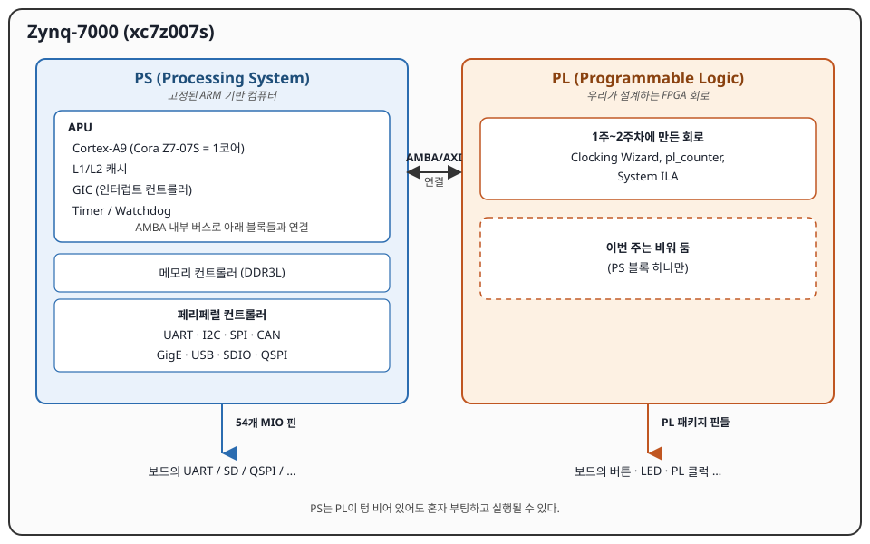

**그림 5-1** Zynq-7000 SoC의 PS/PL 구조. PS는 APU·메모리 컨트롤러·페리페럴 컨트롤러를 갖춘 고정 블록이고, PL은 우리가 설계하는 영역이다. 둘은 AMBA/AXI로 연결되지만, 이번 주는 PL이 비어 있다.

핵심은 이것이다. **PS는 PL이 텅 비어 있어도 혼자 부팅하고 실행될 수 있다.** 이 장에서 그 사실을 직접 확인한다.

| 구분 | PS (Processing System) | PL (Programmable Logic) |
|---|---|---|
| 정체 | 고정된 하드웨어 — ARM 프로세서와 표준 페리페럴 | 우리가 게이트 단위로 설계하는 FPGA 회로 |
| 프로그래밍 언어 | C/C++ (Vitis) | Verilog/VHDL (Vivado) |
| 지난 2주 | 사용 안 함 | Clocking Wizard, `pl_counter`, System ILA |
| 이번 주 | Vitis 애플리케이션 실행 | ZYNQ7 PS 블록 하나만 배치 (로직 없음) |

---

## 5.2 최소 PS 프로젝트 만들기

### 5.2.1 프로젝트와 Block Design 생성

새 프로젝트를 만든다. `File → Project → New…`에서 Project name을 `lab01`로 두고(그림 5-2), 한글·공백 없는 짧은 로컬 경로에 만든다. Board는 Cora Z7-07S.

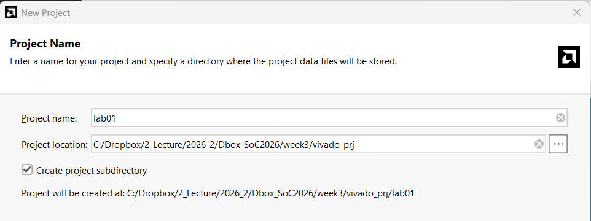

**그림 5-2** New Project 마법사의 Project Name 페이지. 이번 장의 프로젝트 이름은 `lab01`.

이어서 `Flow Navigator → IP INTEGRATOR → Create Block Design`을 눌러 이름 `design_1`로 Block Design을 만든다(그림 5-3).

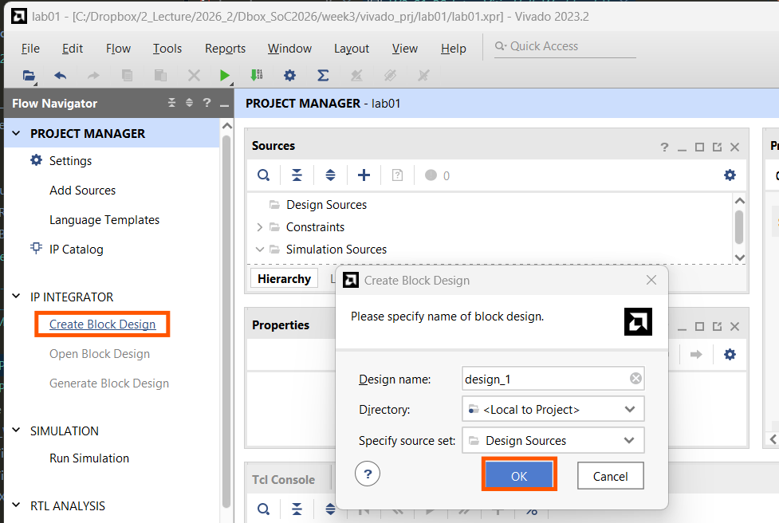

**그림 5-3** `Create Block Design` 대화상자. 설계 이름 `design_1`.

### 5.2.2 ZYNQ7 Processing System 추가

`Add IP`(+)를 누르고 "zynq"를 검색해 **ZYNQ7 Processing System**을 캔버스에 추가한다(그림 5-4). PS 블록 하나만 놓인 상태가 된다 — 포트로 `DDR`, `FIXED_IO`, `M_AXI_GP0`, `FCLK_CLK0`, `FCLK_RESET0_N`이 보이지만 아직 아무것도 연결되어 있지 않다.

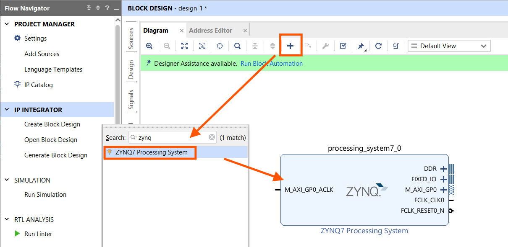

**그림 5-4** Add IP에서 "zynq" 검색 → ZYNQ7 Processing System 추가.

### 5.2.3 Run Block Automation

캔버스 위에 **"Designer Assistance available. Run Block Automation"** 배너가 뜬다. 2주차의 "Run **Connection** Automation"과 이름이 비슷하지만 역할이 다르다.

| | Block Automation | Connection Automation |
|---|---|---|
| 언제 뜨나 | IP 블록을 캔버스에 막 추가했을 때 | 두 개 이상의 블록 사이에 연결이 필요할 때 |
| 하는 일 | 그 IP 자체를 **보드에 맞게 통째로 설정** | net과 net을 **연결** |

배너를 클릭하면 대화상자가 뜬다(그림 5-5). 설명에 "Zynq block automation applies current board preset and generates external connections for FIXED_IO, Trigger and DDR interfaces"라고 적혀 있다. `Apply Board Preset`이 이미 체크된 것을 확인하고 `OK`를 누른다. (프로젝트를 만들 때 Cora Z7-07S 보드를 이미 선택했으므로, 여기서는 어떤 보드인지 다시 고르지 않는다 — 그 보드의 프리셋을 적용할지만 묻는다.)

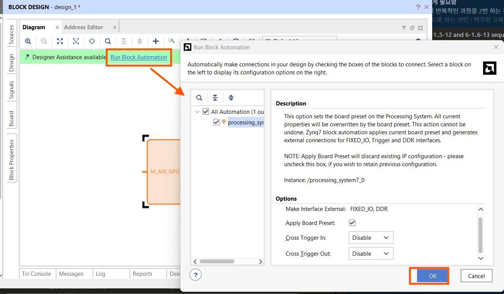

**그림 5-5** Run Block Automation. `Apply Board Preset`이 체크되어 있으면 Cora Z7-07S 보드 정의값이 PS에 그대로 적용된다. `Make Interface External: FIXED_IO, DDR`도 함께 적용된다.

적용 후 PS 블록에서 `DDR`, `FIXED_IO` 인터페이스가 외부 포트로 빠져나간다(그림 5-6, 노란 배경). `USBIND_0`, `M_AXI_GP0`, `FCLK_CLK0`, `FCLK_RESET0_N`은 이번 주에 쓰지 않으므로 그대로 둔다. 우리가 직접 그린 선은 하나도 없다 — Block Automation이 전부 했다.

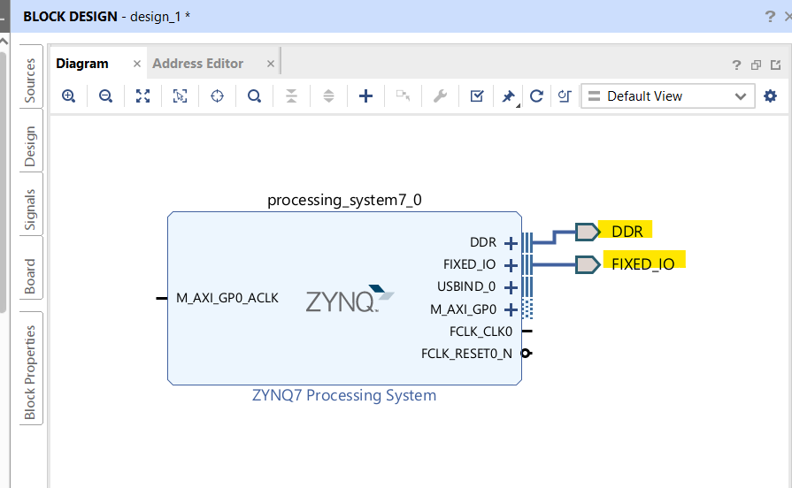

**그림 5-6** Block Automation 적용 후. `DDR`·`FIXED_IO`가 자동으로 외부 포트가 되었다.

---

## 5.3 PS 내부 구조

PS 블록을 더블클릭하면 `Re-customize IP` 창이 열린다. 왼쪽에 `Page Navigator`가 있고, 그중 **`Zynq Block Design`** 페이지가 PS 내부 구조를 통째로 보여주는 그림이다(그림 5-7).

### 5.3.1 전체 구조 — `Zynq Block Design` 페이지

이 그림은 5.1절의 개념도를 실제 Zynq 문서의 블록 다이어그램으로 보여준다. 왼쪽부터 짚어 본다.

- **I/O MUX / MIO**: 54개의 MIO 핀(Bank0 16개 + Bank1 38개)을 `SPI`·`I2C`·`CAN`·`UART`·`GPIO`·`SD`·`USB`·`ENET`(Ethernet) 같은 페리페럴들이 나눠 쓴다.
- **Central Interconnect**: 이 모든 페리페럴과 **APU**(`ARM Cortex-A9 CPU`, 주황 테두리)를 연결하는 내부 버스.
- **APU 옆의 GIC**: 인터럽트 컨트롤러 — 여러 페리페럴의 인터럽트를 모아 CPU에 전달한다.
- **256 KB On-Chip Memory(OCM)**, **512 KB L2 Cache**: CPU 옆의 온칩 메모리.
- **Memory Interfaces → DDR2/3, LPDDR2 Controller**: 보드의 DDR3L을 붙이는 컨트롤러.
- **오른쪽 아래 `Programmable Logic(PL)`**: 우리가 2주차에 설계하던 바로 그 영역 — 지금은 비어 있다.
- **`Extended MIO(EMIO)`**: 그림 아래쪽 "Extended MIO (EMIO)" 표시 — 5.4절에서 쓸 통로다.

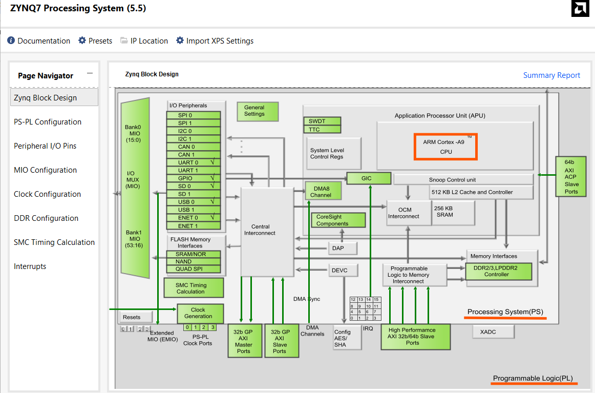

**그림 5-7** `Re-customize IP`의 `Zynq Block Design` 페이지. PS 내부 블록 전체와 PS/PL 경계를 한 그림으로 보여준다.

### 5.3.2 MIO Configuration — 보드에 활성화된 페리페럴

`MIO Configuration` 페이지를 연다(그림 5-8). Cora Z7-07S 보드 프리셋이 다음 네 페리페럴을 이미 활성화해 두었다.

| 페리페럴 | 배정된 MIO |
|---|---|
| `ENET 0` (Gigabit Ethernet) | MIO 16..27 |
| `USB 0` | MIO 28..39 |
| `SD 0` (microSD) | MIO 40..45 |
| `UART 0` | MIO 14..15 |

> Cora Z7-07S에서는 이 `UART 0`이 보드의 micro-USB(USB-JTAG/UART 콤보 회로)로 연결되어 있다 — 5.8절에서 이 UART로 "Hello World"를 받는다. 부팅에 쓰이는 Quad-SPI Flash 같은 자원은 `Memory Interfaces` 항목에 별도로 있다.

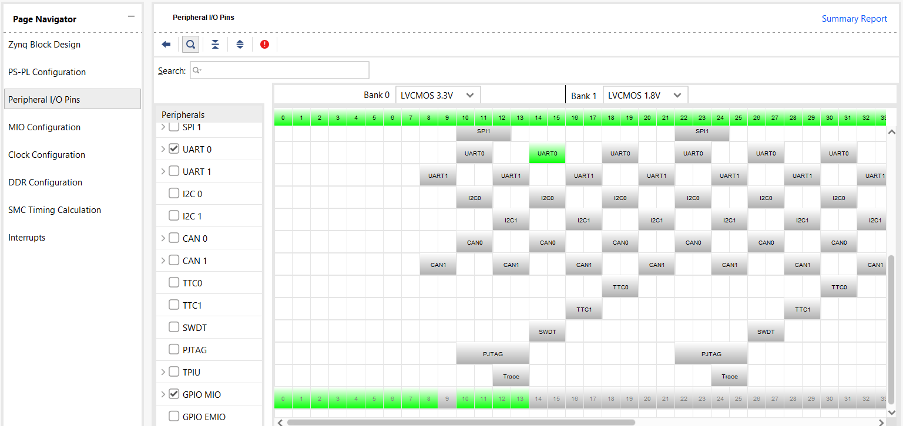

**그림 5-8** MIO Configuration. Cora Z7-07S 보드 프리셋이 ENET0·USB0·SD0·UART0을 활성화해 두었다.

### 5.3.3 (참고) Peripheral I/O Pins — 핀 배치 상세

`Peripheral I/O Pins` 페이지는 같은 정보를 Bank0/Bank1의 실제 핀 배치표로 보여준다(그림 5-9). 지금 당장 조작할 필요는 없으나, MIO가 뱅크별로 물리적으로 어떻게 배열되는지 확인할 때 이 화면을 참고한다.

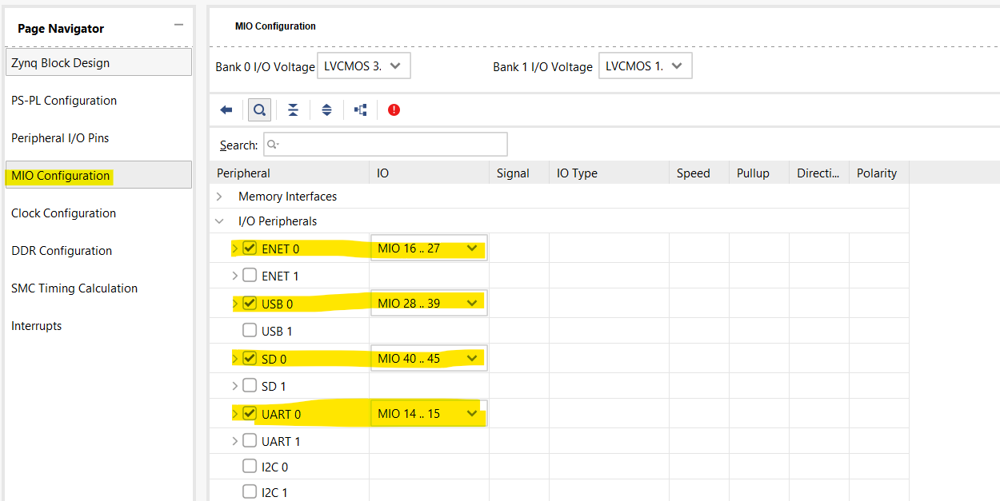

**그림 5-9** Peripheral I/O Pins. MIO 핀이 Bank0(3.3V)·Bank1(1.8V)에 물리적으로 배치된 모습.

### 5.3.4 Clock Configuration — PS와 PL의 클럭 분리

`Clock Configuration` 페이지를 연다(그림 5-10). PS의 기준 클럭(`Input Frequency`)이 **50 MHz**로 표시되고, `CPU Clock Ratio 6:2:1`을 거쳐 `CPU` 클럭이 **650 MHz**(범위 50.0~667.0 MHz 안에서 이 보드는 650 MHz를 요청)로 계산된다. `DDR`은 525 MHz다.

> **2주차의 125 MHz와 헷갈리지 않는다.** PL의 125 MHz 클럭(핀 `H16`)과 PS의 50 MHz 클럭은 **완전히 다른 오실레이터**에서 나온다. PS는 자신만의 PLL로 50 MHz를 곱해 CPU·DDR 클럭을 만든다. PL이 텅 비어 있어도 PS는 아무 영향을 받지 않는다 — 이것이 "PS만으로 동작"이 성립하는 이유 중 하나다.
>
> **`PL Fabric Clocks`도 눈여겨본다.** 같은 화면 아래쪽에 `FCLK_CLK0`이 50 MHz로 활성화되어 있다. 이건 거꾸로 **PS가 PL에 클럭을 공급**할 수도 있다는 뜻이다(PS 블록의 `FCLK_CLK0` 포트가 이것이다). 이번 주는 PL이 비어 있어 쓰지 않지만, PS와 PL이 클럭을 주고받는 두 방향이 다 있다는 것만 기억해 둔다.

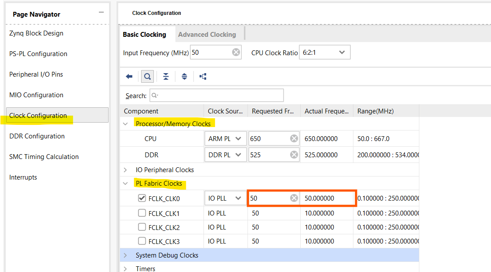

**그림 5-10** Clock Configuration. `PS_CLK` 50 MHz → `CPU` 650 MHz, `DDR` 525 MHz. `FCLK_CLK0`(PS→PL 클럭)도 50 MHz로 활성화되어 있다.

### 5.3.5 (미리 보기) PS-PL Configuration — AXI 연결 스위치

`PS-PL Configuration` 페이지를 열어 본다(그림 5-11). `GP Master AXI Interface` 아래 `M AXI GP0 interface` 체크박스가 있다 — **이번 주는 일부러 꺼 둔다.**

> 이 체크박스가 바로 "PS가 PL의 레지스터를 읽고 쓰게 해 주는 AXI 연결"이다. 지금은 PL에 아무 IP도 없으니 켤 이유가 없다 — 켜 봤자 연결할 대상이 없다. **껐다는 사실 자체가 이번 주 설계의 핵심이다**: PS가 PL과 데이터를 주고받는 통로를 아예 막아 두고도(즉 PL을 완전히 배제하고도) PS 혼자 잘 동작한다는 것을 보여 준다. **4주차에 AXI GPIO를 PL에 추가할 때 이 체크박스를 켠다** — 지금 본 이 화면이 그때 다시 등장한다.

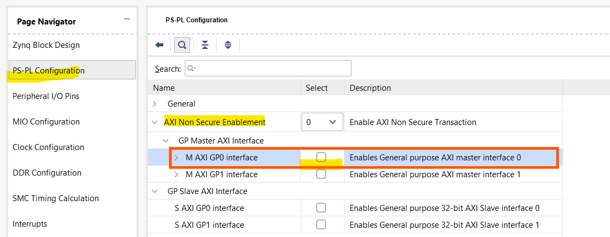

**그림 5-11** PS-PL Configuration. `M AXI GP0 interface`를 이번 주는 의도적으로 꺼 둔다 — PS-PL을 AXI로 잇는 스위치는 다음 주에 켠다.

`OK`를 눌러 창을 닫는다. 지금은 어떤 값도 바꾸지 않는다 — 보드 프리셋 그대로 사용한다.

---

## 5.4 MIO와 EMIO — Cora Z7-07S의 자원 배치

Zynq PS에는 **MIO(Multiplexed I/O) 54개**가 있다. 이 핀들은 PS 내부에서 UART·I2C·SPI·SD·QSPI·Ethernet 같은 페리페럴들이 나눠 쓴다. 54개뿐이라 부족할 수 있는데, 이때 PS 신호를 **PL 패브릭을 거쳐** 밖으로 빼는 경로가 **EMIO(Extended MIO)** 다 — 5.3.1절 그림 5-7 아래쪽에 있던 바로 그 통로다. EMIO를 쓴다고 PL에 로직이 생기는 것은 아니다 — 신호가 PL 핀을 통과해 나갈 뿐이다.

Cora Z7-07S에서 실제로 어디에 무엇이 연결되어 있는지 정리하면 다음과 같다.

| PS의 MIO에 연결된 것 (이 장에서 다루는 것) | PL 핀에 연결된 것 (PS만으로는 접근 불가) |
|---|---|
| UART 0 (micro-USB의 USB-UART) — 그림 5-8 | 푸시버튼 `BTN0`(`D20`)·`BTN1`(`D19`) |
| ENET 0 — Gigabit Ethernet PHY | RGB LED 2개 |
| SD 0 — microSD 카드 | PL 125 MHz 클럭(`H16`) |
| USB 0 | (2주차에서 이미 사용한 자원들) |

> **버튼과 LED는 PS의 MIO가 아니라 PL 핀이다.** 그래서 순수하게 "PL에 아무 배선도 없이" 버튼을 읽거나 LED를 켤 수는 없다. 대신 **EMIO로 PS의 GPIO 신호를 PL 핀까지 통과시키면**(로직 0개, 배선만) 소프트웨어(Vitis)에서 여전히 제어할 수 있다 — 이것을 W3_S2에서 직접 해 본다.

이 장(W3_S1)에서는 위 표의 왼쪽 칸, 그중에서도 **UART** 하나만 사용한다.

---

## 5.5 HDL Wrapper와 Bitstream

### 5.5.1 HDL Wrapper 생성

`Sources → design_1 (design_1.bd)` 우클릭 → `Create HDL Wrapper…` → `Let Vivado manage wrapper and auto-update`를 선택한다(그림 5-12).

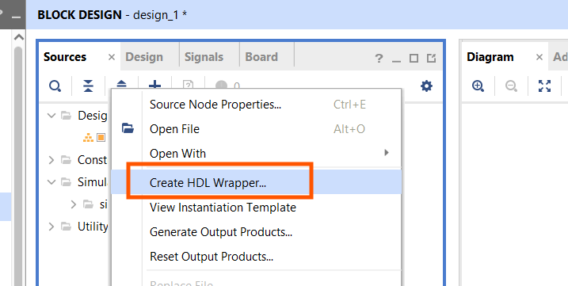

**그림 5-12** `design_1` 우클릭 → `Create HDL Wrapper…`.

Vivado가 관리하도록 두면 `design_1_wrapper`가 자동으로 top으로 지정된다. Sources 트리에서 `design_1_wrapper`가 굵게 표시되고 그 아래 `design_1_i : design_1 → processing_system7_0`까지 계층이 그대로 보인다(그림 5-13). 따로 `Set as Top`을 누를 필요가 없다.

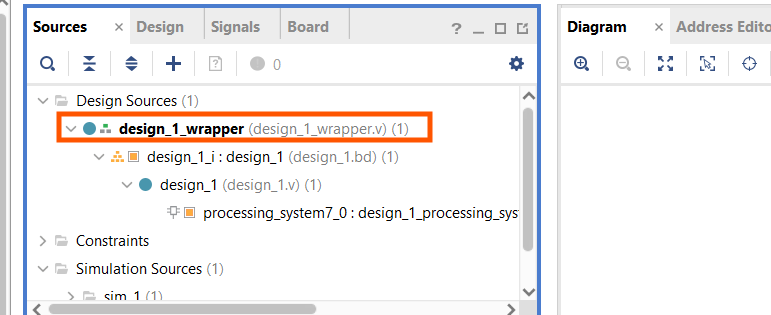

**그림 5-13** `design_1_wrapper`가 top(굵은 글씨)으로 자동 지정되었다. 계층: `design_1_wrapper → design_1_i → processing_system7_0`.

### 5.5.2 Bitstream 생성

`Flow Navigator → PROGRAM AND DEBUG → Generate Bitstream`을 누른다. Synthesis·Implementation이 먼저 자동으로 돌고 이어서 Bitstream이 만들어진다(그림 5-14).

> **합성·구현·Bitstream 생성 시간을 측정해 둔다.** 이번 설계에는 사용자 로직이 전혀 없다(PS 블록 하나뿐). 2주차의 System ILA·`dbg_hub`이 들어간 설계와 비교하면 소요 시간이 눈에 띄게 짧다.

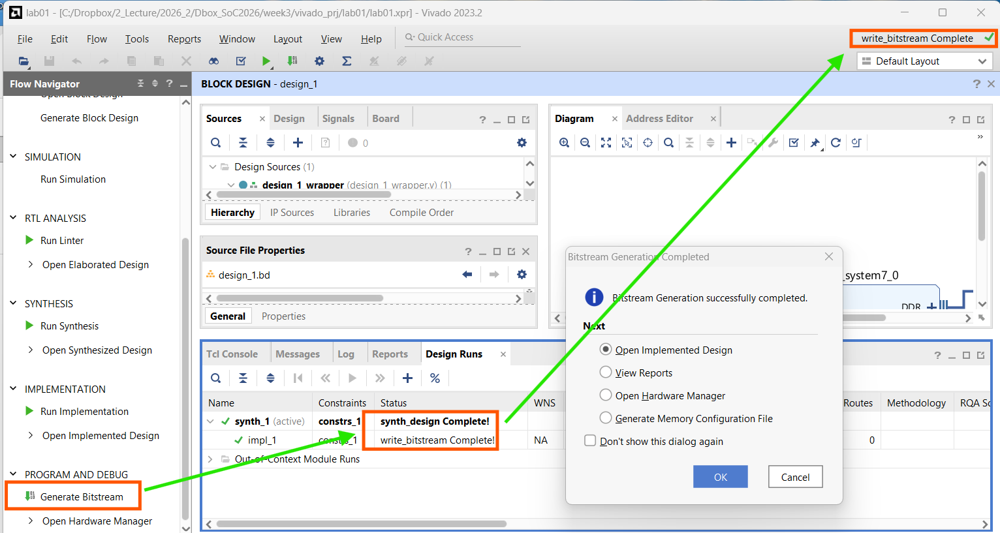

**그림 5-14** `write_bitstream Complete!` — Bitstream 생성 완료.

---

## 5.6 Vivado에서 Vitis로 — Export Hardware

지금까지는 Vivado(하드웨어) 작업이었다. 이제 이 하드웨어 설계를 **Vitis**(소프트웨어 개발 도구)로 넘긴다. 이때 쓰는 파일이 **XSA**(Xilinx Support Archive)다 — PS 설정, PL의 비트스트림, 주소맵 등을 하나로 묶은 파일이다.

`File → Export → Export Hardware…`를 누른다(그림 5-15).

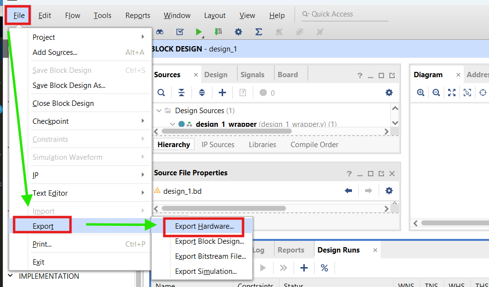

**그림 5-15** `File → Export → Export Hardware…`.

마법사의 `Output` 페이지에서 **`Include bitstream`** 을 선택한다(그림 5-16) — Bitstream까지 포함해야 Vitis가 바로 하드웨어를 프로그래밍할 수 있다.

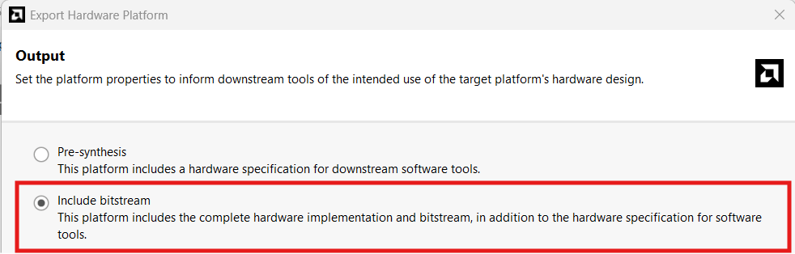

**그림 5-16** `Include bitstream` 선택. Pre-synthesis만으로는 소프트웨어 개발용 정보만 담긴다.

`Files` 페이지에서 XSA 파일 이름(`design_1_wrapper`)과 저장 경로를 확인하고 `Finish`를 누른다(그림 5-17).

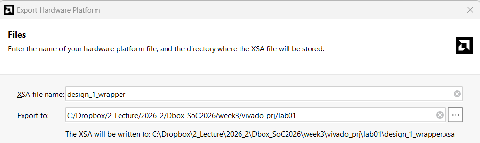

**그림 5-17** XSA 파일 이름과 내보낼 경로. `design_1_wrapper.xsa`로 저장된다.

---

## 5.7 Vitis Unified IDE — Workspace와 Platform Component

Vitis 창 구성은 Vivado와 전혀 다르다. **Workspace**(작업 공간 폴더) 하나 안에 **Component**(플랫폼 하나, 애플리케이션 하나 …)들이 들어간다. 이 절에서는 Platform Component 1개와 Application Component 1개를 만든다.

### 5.7.1 Workspace 준비

Vivado 프로젝트 폴더(`lab01`)에 5.6절에서 만든 `design_1_wrapper.xsa`가 있는지 먼저 확인한다(그림 5-18).

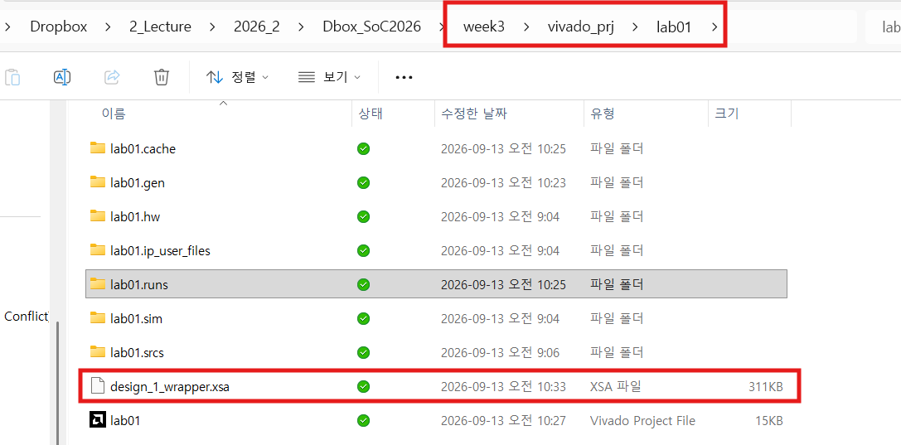

**그림 5-18** `lab01` 프로젝트 폴더에 `design_1_wrapper.xsa`가 생성되어 있다.

Vitis는 Vivado 프로젝트와 별개로 자기만의 작업 폴더가 필요하다. `week3` 폴더 아래 `vitis_workspace`라는 새 폴더를 만든다(그림 5-19). 한글·공백 없는 짧은 로컬 경로를 쓰는 원칙은 여기도 같다.

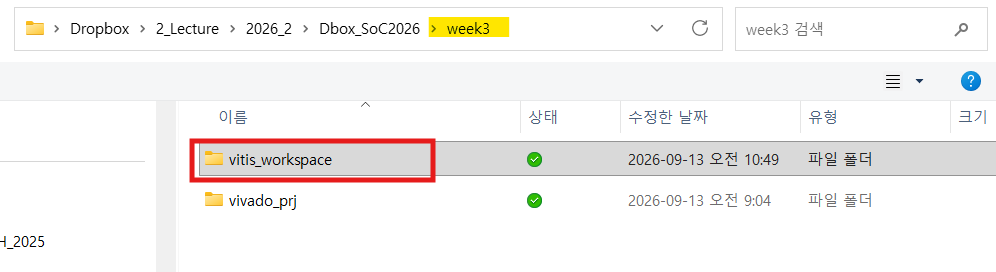

**그림 5-19** `week3` 폴더 아래 `vitis_workspace` 폴더를 새로 만든다.

Vitis를 실행하면 `Welcome to the Vitis Unified IDE` 화면이 뜬다. `Open Workspace`를 눌러 방금 만든 `vitis_workspace` 폴더를 선택한다(그림 5-20).

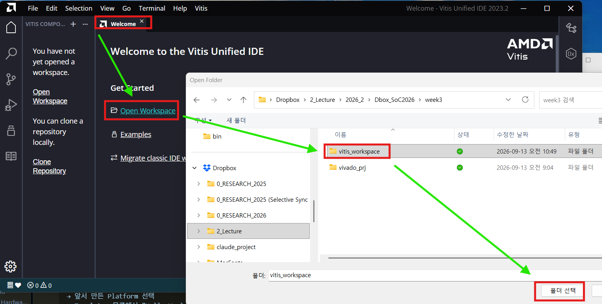

**그림 5-20** `Open Workspace` → `vitis_workspace` 폴더 선택.

### 5.7.2 Platform Component 만들기

Workspace를 열면 Welcome 화면에 `Embedded Development` 메뉴가 보인다. **`Create Platform Component`** 를 누른다(그림 5-21).

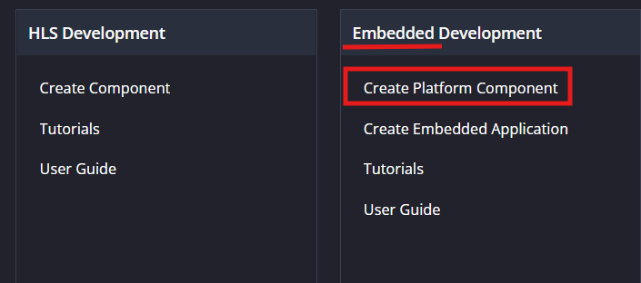

**그림 5-21** Welcome → `Embedded Development` → `Create Platform Component`.

마법사가 `Name and Location → Flow → OS and Processor → Summary` 순서로 진행된다.

1. **Name and Location**: Component name을 예) `w3s1_platform`으로 입력한다(그림 5-22). Component location은 Workspace 폴더 그대로 둔다.

   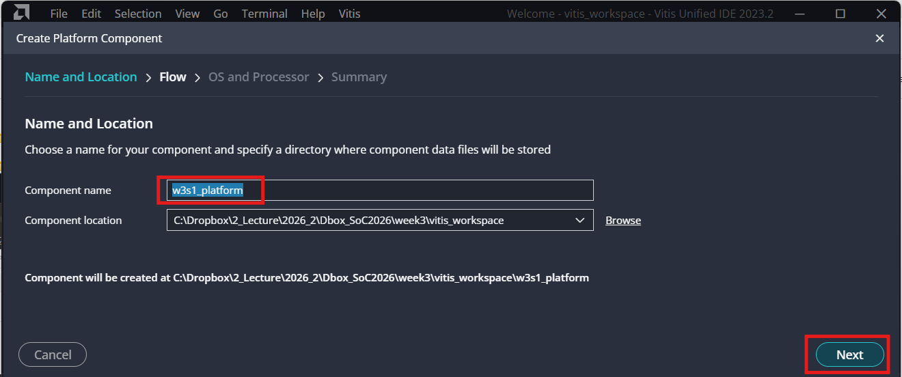

   **그림 5-22** Component name `w3s1_platform`.

2. **Flow**: 하드웨어 설계를 지정하는 단계다. `Select Hardware Design (XSA)` 대화상자가 뜨면 5.6절에서 만든 `design_1_wrapper.xsa`를 선택한다(그림 5-23).

   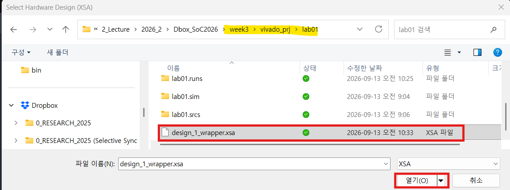

   **그림 5-23** `lab01` 프로젝트 폴더에서 `design_1_wrapper.xsa` 선택.

3. **OS and Processor**: `Operating system: standalone`, `Processor: ps7_cortexa9_0`이 자동으로 채워진다. `Generate Boot artifacts`를 체크한 채로 둔다(그림 5-24).

   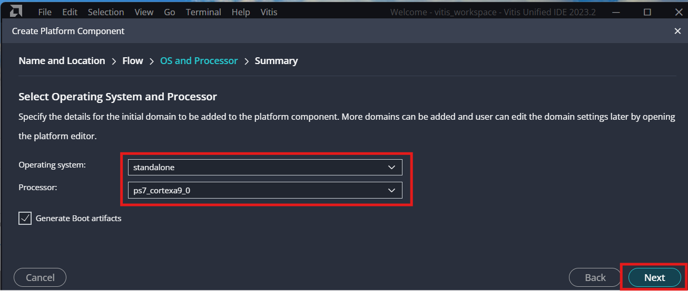

   **그림 5-24** Operating system `standalone`, Processor `ps7_cortexa9_0`.

4. **Summary**: 만들어질 내용을 확인하고 `Finish`를 누른다(그림 5-25).

   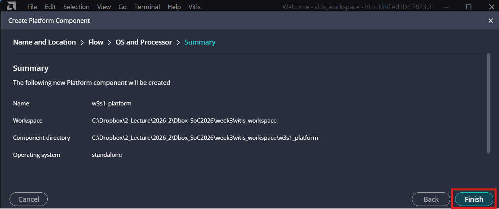

   **그림 5-25** Summary 확인 후 `Finish`.

> **standalone이란?** 리눅스 같은 운영체제 없이, PS의 부트롬 → FSBL → 우리 프로그램이 바로 실행되는 방식이다. 지난 학기 DE0에서 마이크로프로세서 없이 순수 RTL만 다뤘던 것과 달리, 여기서는 "OS는 없지만 C 프로그램이 ARM 코어 위에서 직접 도는" 가장 단순한 형태의 임베디드 소프트웨어다.

### 5.7.3 Platform 빌드

Platform Component를 만들었다고 끝이 아니다. **직접 Build를 눌러야** FSBL 등이 실제로 컴파일된다. 왼쪽 `FLOW` 패널에서 Component가 `w3s1_platform`으로 선택된 상태로 `Build`를 누른다. 출력 창에 `Platform Build Finished successfully.`가 뜨면 완료다(그림 5-26).

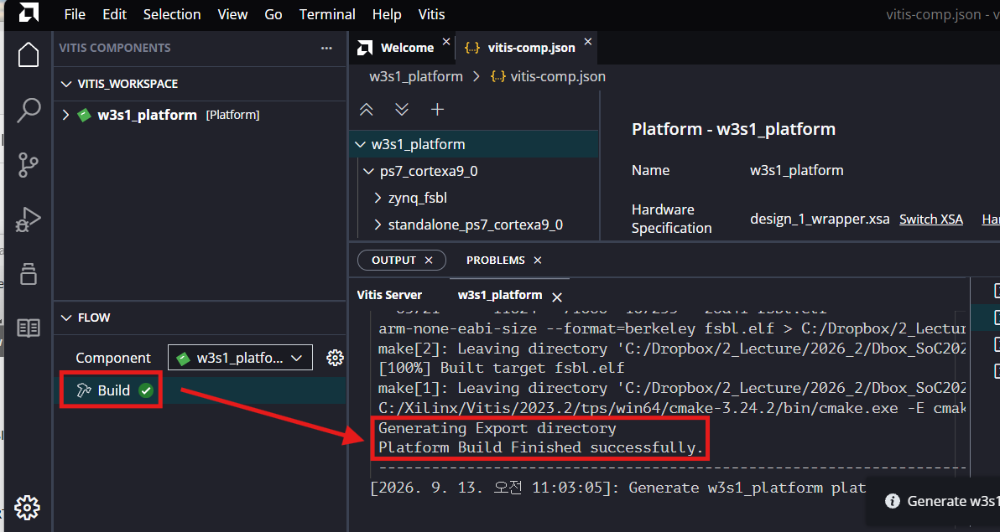

**그림 5-26** `vitis-comp.json` 편집 화면과 `FLOW → Build`. `Platform Build Finished successfully.`

---

## 5.8 Application Component 만들기 — Hello World (Import)

Welcome 화면(또는 `File → New Component`)에서 `Embedded Development → Create Embedded Application`을 누른다(그림 5-27).

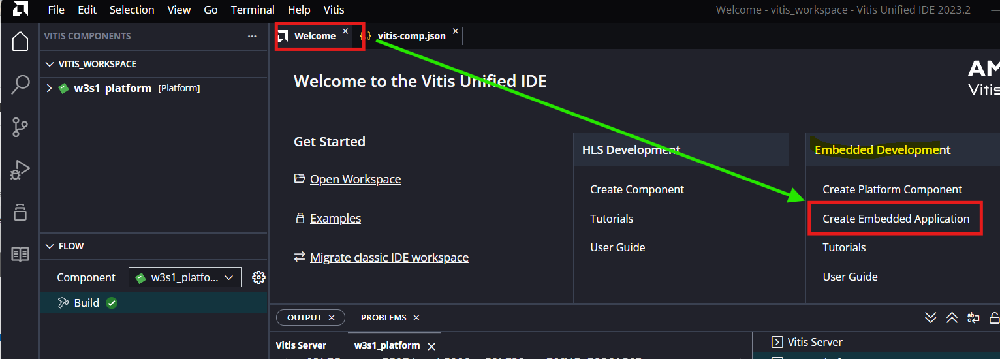

**그림 5-27** Welcome → `Embedded Development` → `Create Embedded Application`.

마법사가 `Name and Location → Hardware → Domain → Sysroot → Summary` 순서로 진행된다.

1. **Name and Location**: Component name을 예) `w3s1_app`으로 입력한다(그림 5-28).

   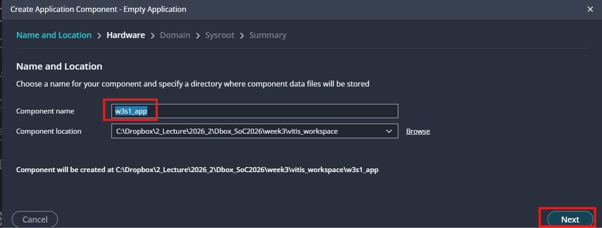

   **그림 5-28** Component name `w3s1_app`.

2. **Hardware → Select Platform**: 5.7절에서 만든 `w3s1_platform`(Board: `cora-z7-07s`)을 선택한다(그림 5-29).

   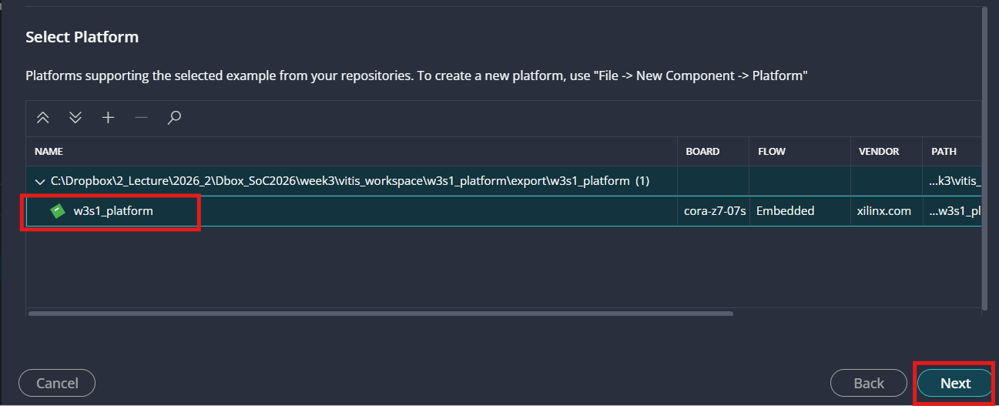

   **그림 5-29** `w3s1_platform`을 이 애플리케이션이 올라갈 플랫폼으로 선택.

3. **Domain → Select Domain**: 플랫폼에 이미 있는 `standalone_ps7_cortexa9_0`이 자동으로 선택된다(그림 5-30). 그대로 둔다.

   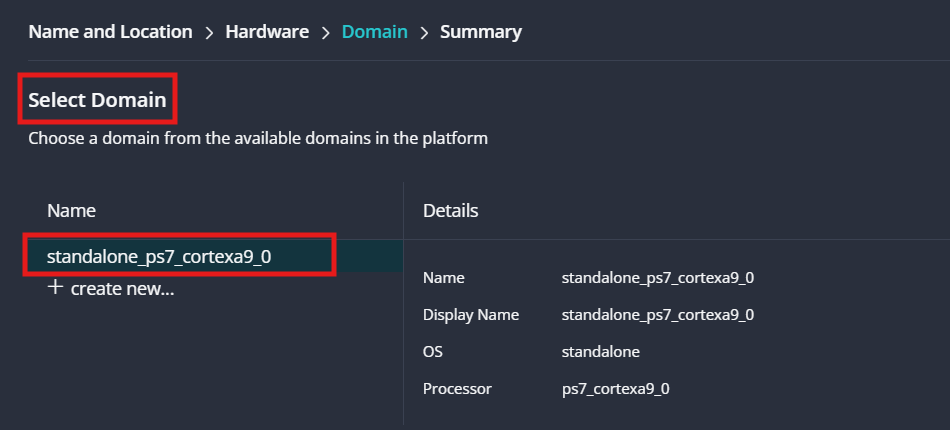

   **그림 5-30** Domain `standalone_ps7_cortexa9_0` (OS=standalone, Processor=ps7_cortexa9_0).

4. **Sysroot·Summary**는 기본값 그대로 두고 `Finish`.

### 소스 가져오기 (Import)

Vitis가 기본 제공하는 "Hello World" 템플릿을 그대로 쓰지 않고, 미리 준비한 소스 파일을 **가져오기(Import)** 한다 — 그래야 이 교재에 실린 코드와 학생이 빌드하는 코드가 정확히 같아진다.

왼쪽 `VITIS_WORKSPACE` 트리에서 `w3s1_app [Application] → Sources → src`를 우클릭 → `Import → Files…`를 누른다(그림 5-31).

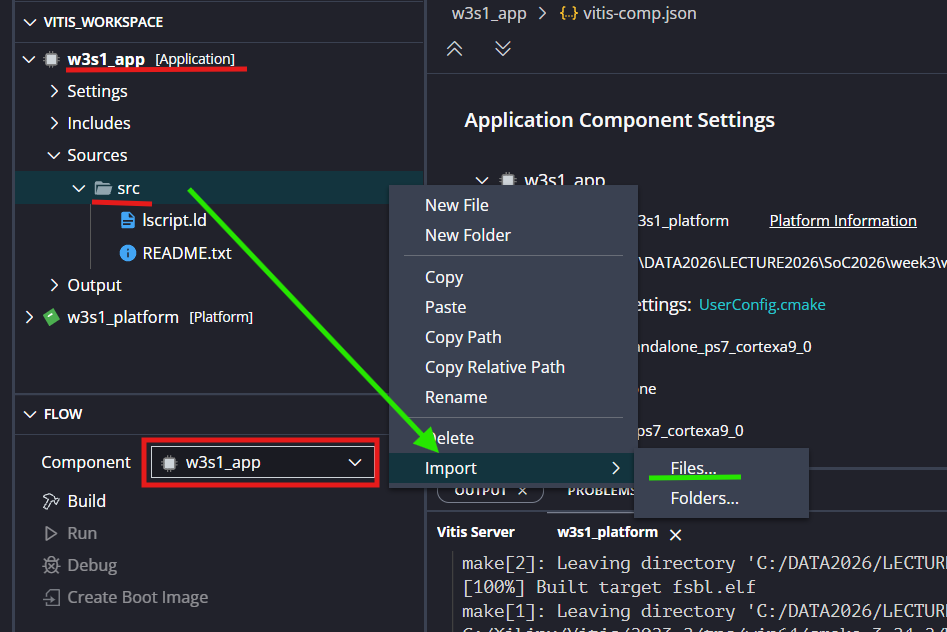

**그림 5-31** `src` 폴더 우클릭 → `Import` → `Files…`.

`Files…`를 누르면 파일 선택 창이 뜬다. `LAB01/src` 폴더에서 [`helloworld.c`](LAB01/src/helloworld.c)를 선택해 가져온다(그림 5-32).

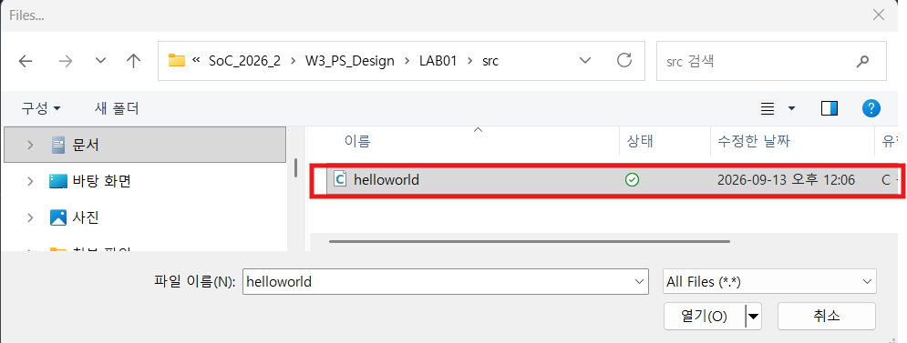

**그림 5-32** `LAB01/src/helloworld.c`를 선택해 Import.

가져온 파일의 내용은 다음과 같다.

```c
#include "xil_printf.h"

int main(void)
{
    print("Hello World\n\r");

    return 0;
}
```

| 함수 | 역할 |
|---|---|
| `print(...)` | UART로 문자열 하나를 그대로 내보냄. `xil_printf.h`가 선언하며, 이 헤더는 standalone BSP가 기본 제공한다 |

> **`platform.h`를 쓰지 않는 이유.** Vitis의 "Hello World" **템플릿**을 선택하면 `helloworld.c` 옆에 `platform.c`/`platform.h`(그 안에서 `init_platform()`/`cleanup_platform()`을 정의)가 함께 생성된다. 그런데 우리는 "Empty Application" + Import 방식을 쓰므로 그 보조 파일이 없다. `platform.h`를 인클루드하면 `fatal error: platform.h: No such file or directory`로 빌드가 실패한다 — `print()`만으로도 이 실습에는 충분하므로 아예 빼는 것으로 통일한다.

---

## 5.9 빌드와 실행

`FLOW` 패널에서 Component가 애플리케이션으로 선택된 상태로 `Build`를 누른다(그림 5-33). 코드 편집기에 열린 `helloworld.c`가 5.8절의 최종 버전(`xil_printf.h`만 include, `print()`만 호출)인지 확인한다 — `Build` 옆에 초록색 체크가 뜨면 성공이다.

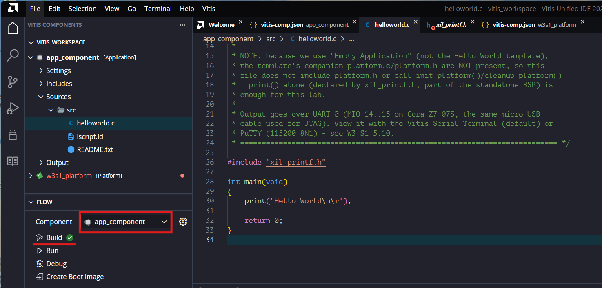

**그림 5-33** `helloworld.c` 편집 화면과 `FLOW → Build`. 초록 체크 표시로 빌드 성공을 확인한다.

Cora Z7-07S를 micro-USB로 연결한 상태에서 `FLOW → Run`을 누른다. 빌드가 끝나면 Vitis가 보드에 비트스트림을 프로그래밍하고(필요한 경우), 이어서 애플리케이션을 PS에 올려 실행한다. 실행 결과(터미널에 찍히는 "Hello World")는 5.10절에서 함께 확인한다.

> **막히면 확인할 것.** "Program FPGA" 관련 오류가 나면, 5.5절의 Bitstream이 최신 상태인지, Platform Component(5.7.2절 Flow 단계)가 가리키는 XSA가 최신인지 확인한다.

---

## 5.10 터미널로 확인하기

### 5.10.1 COM 포트 확인 (공통)

Vitis Serial Terminal이든 PuTTY든 먼저 Cora Z7-07S가 어느 COM 포트로 잡혔는지 알아야 한다. 윈도우 검색창에서 **장치관리자**를 열고 `포트(COM & LPT)`를 펼친다(그림 5-34). `USB Serial Port (COM5)`처럼 표시되는 것이 UART 포트다. (USB-JTAG/UART가 콤보 케이블이라 포트가 여러 개 보일 수 있다.)

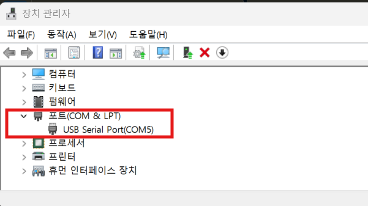

**그림 5-34** 장치관리자에서 확인한 UART 포트. 이 보드는 `COM5`.

### 5.10.2 PuTTY로 연결하기

PuTTY는 실무에서도 아주 자주 쓰이는 시리얼 터미널이다. 이번 학기는 이 도구로 UART 출력을 확인한다.

- **다운로드**: 공식 사이트 [putty.org](https://www.putty.org/)에서 64-bit MSI 설치 파일(`putty-64bit-<버전>-installer.msi`)을 받는다. *(설치 파일은 강의 배포 폴더(Dropbox)에도 함께 올려 둔다.)*
- **연결 설정**: PuTTY 실행 → `Connection type`: **Serial** → `Serial line`: 5.10.1절에서 확인한 포트(예: `COM5`) → `Speed`: **115200** → `Open`(그림 5-35).

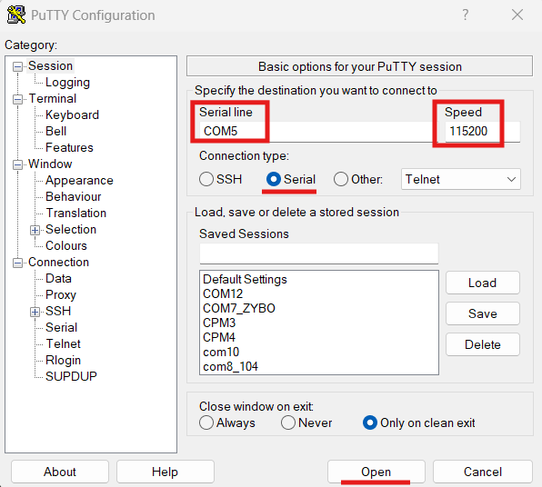

**그림 5-35** PuTTY 설정. `Serial line COM5`, `Speed 115200`, `Connection type: Serial`.

`Open`으로 연결해 둔 채로 Vitis의 `FLOW → Run`을 누르면, PuTTY 창에 바로 "Hello World"가 찍힌다(그림 5-36).

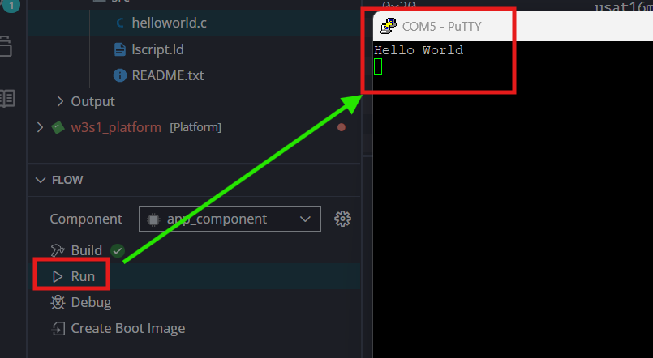

**그림 5-36** `FLOW → Run` 실행 → PuTTY(`COM5`) 창에 `Hello World` 출력 확인.

---

## 5.11 정리

| 키워드 | 내용 |
|---|---|
| PS / PL | Zynq 한 칩 안의 고정 ARM 컴퓨터(PS)와 재구성 가능한 회로(PL). PS는 PL 없이도 부팅·실행된다 |
| Block Automation | IP 블록 하나를 보드 프리셋에 맞게 통째로 설정. Connection Automation(net 연결)과 다름 |
| `Zynq Block Design` 페이지 | PS 내부 구조 전체를 한 그림으로 보여주는 Re-customize IP의 첫 페이지 |
| MIO Configuration | Cora Z7-07S 보드 프리셋이 ENET0·USB0·SD0·UART0을 MIO에 배정해 둔 것을 보여주는 탭 |
| PS_CLK / FCLK_CLK0 | PS 전용 50 MHz 입력 클럭(→CPU 650MHz)과, 거꾸로 PS가 PL에 줄 수 있는 50MHz 출력 클럭. 둘 다 PL의 125MHz와 무관 |
| PS-PL Configuration / M AXI GP0 | PS가 PL 레지스터를 AXI로 읽고 쓰게 하는 스위치. 이번 주는 꺼둠 — 4주차에 켠다 |
| EMIO | MIO가 부족할 때 PS 신호를 PL 패브릭을 "통과"시켜 밖으로 빼는 경로. 로직은 추가되지 않음 |
| Cora Z7-07S 자원 배치 | UART·Ethernet·SD·USB = PS(MIO) / 버튼·LED·PL클럭 = PL 핀 |
| Export Hardware (.xsa) | Vivado의 하드웨어 설계를 Vitis로 넘기는 파일. Include bitstream 필수 |
| Vitis Unified IDE | Workspace 안에 Platform/Application **Component**를 만드는 구조. Eclipse 기반 Vitis Classic과 메뉴·용어가 다르다 |
| Platform Component 빌드 | 만들기만 하고 끝이 아니라, `FLOW → Build`를 직접 눌러야 FSBL 등이 실제로 컴파일된다 |
| standalone | OS 없이 FSBL이 곧바로 실행하는 베어메탈 소프트웨어 방식 |
| PuTTY | PS의 UART 출력을 확인하는 터미널. 장치관리자에서 확인한 COM 포트 + Baud 115200으로 연결한다 |

---

## 과제 — W3_S2 전까지

1. `helloworld.c`의 `print("Hello World\n\r");` 줄을 자신의 학번을 출력하도록 바꿔 다시 빌드·실행해 본다.
2. `MIO Configuration` 탭에서 `UART 0`에 배정된 MIO 번호가 몇 번인지 확인해 온다. (그림 5-8 참고)
3. Zynq PS 내부의 **GIC(인터럽트 컨트롤러)** 와 **Private Timer**가 각각 무슨 일을 하는지 한 문단으로 조사해 온다. (다음 학기 또는 이후 주차에서 다룰 내용의 예습)

## 다음 시간 예고 — 제6장 (W3_S2)

- **EMIO**로 PS의 GPIO 신호 1비트를 PL 핀까지 빼서 RGB LED 하나를 켠다.
- Vitis에서 GPIO 레지스터에 값을 써서 LED를 켜고 끄는 코드를 작성한다.
- Zynq-7000 GPIO가 몇 개의 뱅크로 나뉘어 있고, EMIO 비트가 그중 어디에 속하는지 확인한다.

> **이 장에서 만든 프로젝트는 여기서 끝이다.** 2교시는 회로가 이 장과 거의 같더라도 **새 프로젝트(`LAB02`)를 처음부터 다시 만든다.** 이 프로젝트를 이어 쓰지 않는 이유는 [`LAB01/README.md`](LAB01/README.md)에 적어 두었다 — 한 문장으로 요약하면, "절차를 반복해서 손에 익히는 것"이 이번 학기 초반의 목표이기 때문이다.

---

*SoC 설계 · 3주차 1교시(W3_S1) | Vivado/Vitis 2023.2 · Windows · Cora Z7-07S*
