# 제6장 PS 설계 (2) — EMIO로 LED 제어하기

**SoC 설계** · 3주차 2교시(W3_S2) | Vivado/Vitis 2023.2 · Windows 11 · Digilent Cora Z7-07S

---

1교시(W3_S1, `LAB01`)에서 PS만으로 "Hello World"를 실행했다. 이번 2교시는 **새 프로젝트(`LAB02`)를 처음부터 다시 만든다.** 회로는 1교시와 거의 같다 — PS 블록 하나에 Block Automation을 적용하는 것까지는 동일하다. 그런데도 처음부터 다시 만드는 이유는 다음과 같다.

> **왜 또 처음부터 만드나.** 1교시의 프로젝트를 이어 써도 되지만, 일부러 **New Project → Block Design → PS 추가 → Block Automation → Export Hardware → Vitis Platform/Application**이라는 전체 절차를 이 장에서 한 번 더 손으로 반복한다. 학기 초반에는 "설계를 확장하는 효율"보다 "툴체인 절차 자체가 몸에 붙는 것"이 더 중요하다. 두 번째로 진행하는 이번에는 1교시보다 훨씬 빠르게 넘어갈 수 있다 — 그 차이를 확인하는 것이 이 실습의 목적이다.

같은 절차 위에 이 장에서 **새로** 추가하는 것은 딱 하나, PS의 GPIO 신호 1비트를 **EMIO**로 PL 핀까지 빼서 RGB LED 하나를 소프트웨어로 켜고 끄는 것이다. PL에는 여전히 커스텀 로직을 한 줄도 추가하지 않는다.

> **이 장에서 만들 회로**
> ```text
> Vitis (C 코드, GPIO 레지스터 직접 접근)
>        │  GPIO 출력 1비트
>        ▼
> ZYNQ7 PS  ── EMIO ──▶  GPIO_0 인터페이스  (PL 핀 통과, 로직 없음)
>        │
>        ▼
> led_out  (외부 인터페이스, 합성 후 포트명 led_out_tri_io[0]) ──▶ 핀 N15 (RGB LED0의 R 채널)
> ```

이번 교시의 흐름은 다음과 같다.

> **새 프로젝트·Block Design·PS·Block Automation (반복)** → **EMIO GPIO 1비트 추가 (신규)** → **핀 배정·XDC** → **Bitstream·Export** → **Vitis 새 Platform·Application** → **GPIO 레지스터 직접 접근으로 LED 제어 코드 작성** → **실행하여 LED 확인**

---

## 학습 목표

- New Project부터 Vitis 실행까지의 전체 절차를 **처음부터 다시** 수행해 손에 익힌다.
- MIO가 부족할 때 PS 신호를 PL로 통과시키는 **EMIO**의 동작 원리를 실습으로 설명한다.
- Vivado에서 ZYNQ7 PS의 GPIO를 EMIO로 활성화하고, 필요한 비트 수만 외부 포트로 만든다.
- EMIO로 나온 포트에 패키지 핀을 배정하고 XDC로 저장한다.
- Vitis에서 `DIRM`·`OEN`·`DATA` 세 레지스터 주소에 값을 써서 EMIO 출력을 제어하는 코드를 작성한다.
- Zynq-7000 GPIO가 **32비트씩 4개 뱅크로 나뉘며, EMIO 0번째 비트가 Bank 2에 있다**는 점을 이해한다.

---

## 6.1 LAB01과 LAB02의 관계

1교시(`LAB01`)와 2교시(`LAB02`)의 관계를 표로 정리하면 다음과 같다.

| | LAB01 (1교시, 제5장) | LAB02 (2교시, 이 장) |
|---|---|---|
| 프로젝트 | 새로 생성 | **또 새로 생성** — LAB01을 이어 쓰지 않음 |
| Block Design | PS 블록 + Block Automation | **동일한 절차를 그대로 반복** |
| 추가되는 것 | 없음 (PS만) | EMIO GPIO 1비트 → `led_out` → 핀 `N15` |
| Vitis | Platform + Hello World(Import) | **새 Platform** + Empty Application + `led_emio.c`(Import) |

절차가 겹치는 부분은 최대한 간단히 짚고, **새로 추가되는 EMIO 부분에 집중**한다. (자세한 설명이 필요하면 5장을 다시 펼친다.)

---

## 6.2 새 프로젝트와 Block Design 다시 만들기

### 6.2.1 프로젝트 생성

5.2.1절과 같은 방식으로 **완전히 새로운** 프로젝트를 만든다. `File → Project → New…`에서 Project name을 `lab02`로 두고(그림 6-1), 짧은 로컬 경로에 만든다. Board는 Cora Z7-07S.

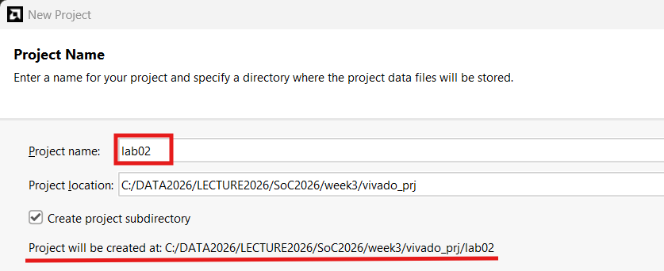

**그림 6-1** New Project 마법사의 Project Name 페이지. 이번 장의 프로젝트 이름은 `lab02`.

이어서 `Flow Navigator → IP INTEGRATOR → Create Block Design`으로 `design_1`을 만든다.

### 6.2.2 PS 블록 추가와 Block Automation (복습)

5.2.2~5.2.3절과 같은 절차를 그대로 반복한다.

1. `Add IP`(+) → "ZYNQ7 Processing System" 검색·추가.
2. **"Run Block Automation"** 배너 클릭 → `Apply Board Preset` 체크 확인 → `OK`.

결과는 1교시와 같다. `DDR`, `FIXED_IO` 인터페이스가 자동으로 외부 포트가 된다(그림 6-2).

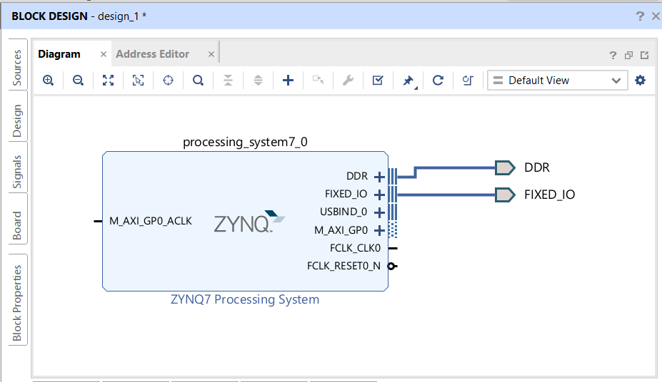

**그림 6-2** Block Automation 적용 후 PS 블록. 1교시(그림 5-6)와 같은 결과다.

> **여기까지 걸린 시간을 1교시와 비교해 본다.** 같은 절차를 한 번 더 밟으면 소요 시간이 확실히 줄어든다 — 그 차이를 확인하는 것이 이 절의 목적이다.

---

## 6.3 PS 내부 구조 (복습)

PS 블록을 더블클릭해 `Re-customize IP` 창을 열어 본다. `MIO Configuration`·`Clock Configuration` 탭의 내용은 5.3절에서 본 것과 같다 — ENET0/USB0/SD0/UART0이 이미 체크되어 있고, `PS_CLK`은 여전히 50 MHz다.

`PS-PL Configuration` 페이지도 다시 확인한다(그림 6-3). `M AXI GP0 interface`는 지난 시간과 마찬가지로 꺼져 있다 — 이 장에서도 PL에 AXI로 데이터를 주고받을 IP를 두지 않으므로 그대로 둔다.

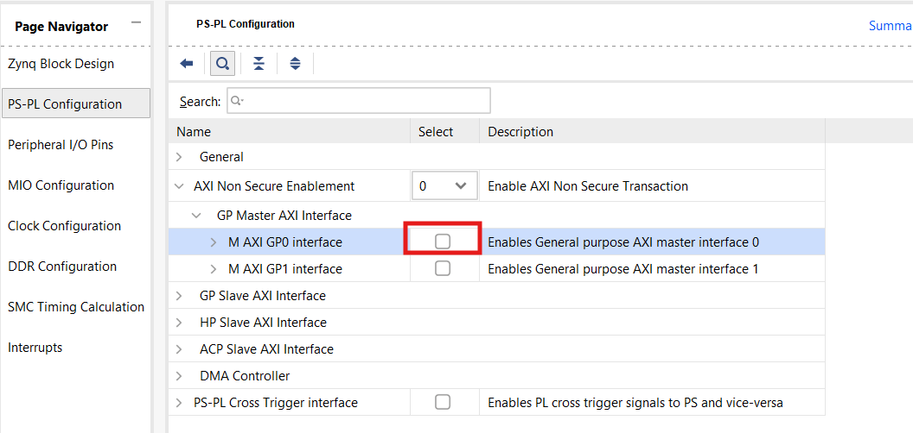

**그림 6-3** PS-PL Configuration. `M AXI GP0 interface`는 이 장에서도 꺼 둔 채로 진행한다.

이 창은 닫지 않고 **그대로 열어 둔 채** 6.4절의 설정을 이어서 한다.

---

## 6.4 EMIO GPIO 1비트 추가 (신규 내용)

여기부터가 이 장에서 실제로 새로 배우는 부분이다.

### 6.4.1 EMIO GPIO Width 설정

`MIO Configuration` 탭에서 `GPIO` 항목을 펼치면 다음 두 줄이 있다(그림 6-4).

| 항목 | 설정값 |
|---|---|
| `GPIO MIO` | 체크됨 (보드 프리셋 기본값, 변경하지 않는다) |
| **`EMIO GPIO (Width)`** | 체크 → **`1`** |

`EMIO GPIO`를 체크하고 폭을 `1`로 입력하면, PS 블록에 **1비트짜리** `GPIO_0` 인터페이스가 새로 생긴다. 폭을 굳이 64(기본 최대치)로 두고 자르는 게 아니라, 처음부터 1비트만 요청하는 것이라 별도의 슬라이스(Slice) IP가 필요 없다 — 여전히 로직 0개다.

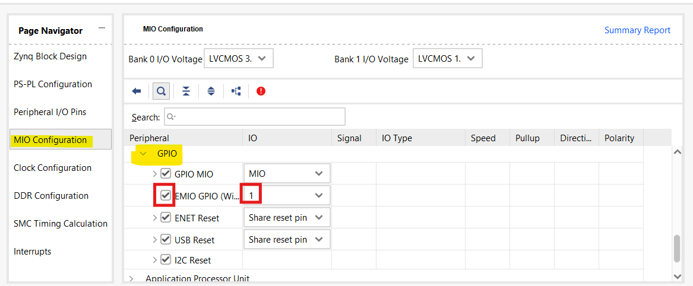

**그림 6-4** MIO Configuration의 GPIO 항목. `EMIO GPIO`를 체크하고 폭을 1로 설정.

`OK`를 눌러 닫으면 PS 블록에 `GPIO_0` 인터페이스가 생긴 것이 보인다(그림 6-5). 그 아래로 `GPIO_I[0:0]`(입력) · `GPIO_O[0:0]`(출력) · `GPIO_T[0:0]`(3-상태 출력 인에이블) 세 신호가 묶여 있다 — GPIO는 방향을 소프트웨어로 바꿀 수 있어야 하므로, 입력·출력·출력 인에이블 세 가닥이 한 인터페이스로 다닌다.

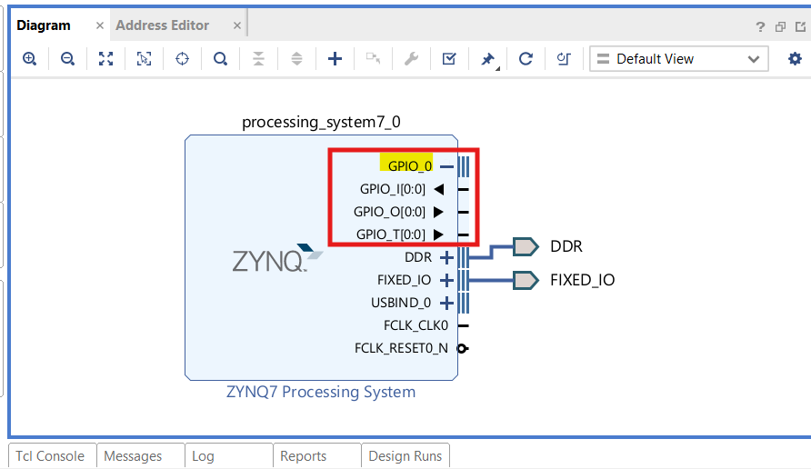

**그림 6-5** `GPIO_0` 인터페이스(`GPIO_I`/`GPIO_O`/`GPIO_T`)가 PS 블록에 생겼다.

### 6.4.2 외부 포트로 빼기

`GPIO_0` 인터페이스를 우클릭 → `Make External`을 누른다(그림 6-6).

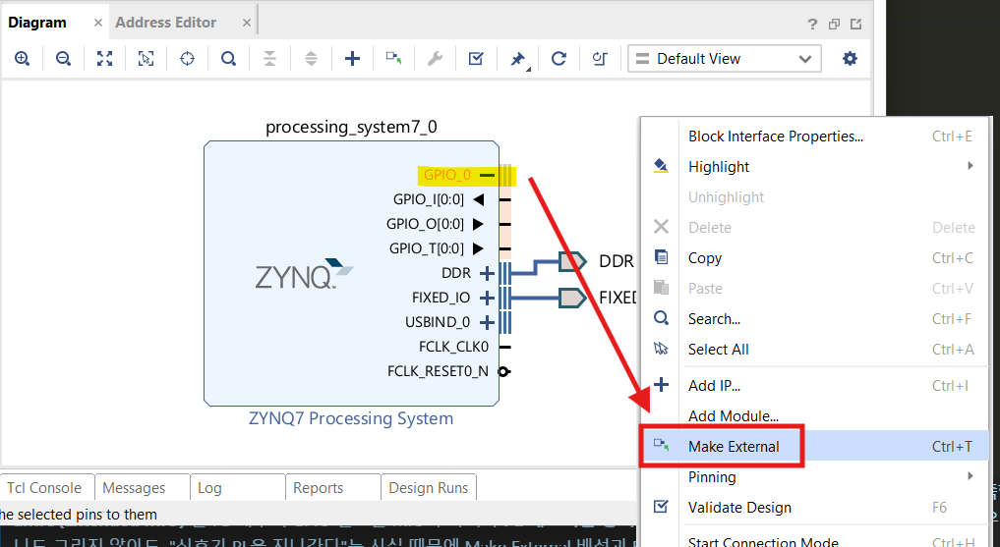

**그림 6-6** `GPIO_0` 인터페이스를 우클릭 → `Make External`.

`External Interface Properties` 패널에서 이름을 `led_out`으로 바꾼다. Mode는 `MASTER`, Connection은 `processing_system7_0_GPIO_0`으로 표시된다(그림 6-7).

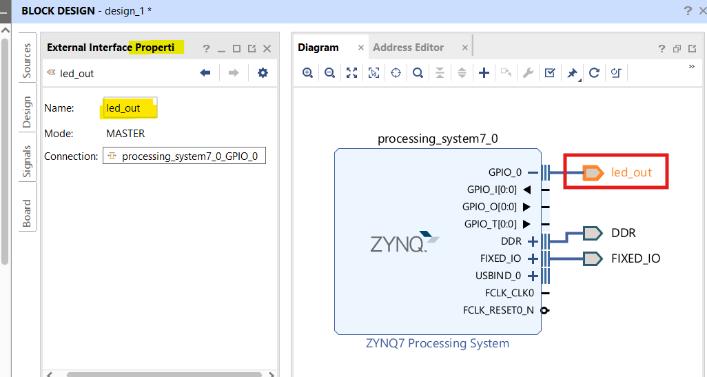

**그림 6-7** 외부 인터페이스 이름을 `led_out`으로 지정.

> **EMIO 개념 복습.** Zynq PS에는 MIO 핀이 54개뿐이다. 이미 UART·SD·USB·Ethernet이 여러 개를 나눠 쓰고 있어 GPIO용 MIO가 부족할 수 있다. **EMIO(Extended MIO)** 는 PS 내부의 GPIO 신호를 MIO가 아니라 **PL 패브릭을 통과**시켜 원하는 PL 패키지 핀으로 빼내는 경로다. PL에 게이트를 하나도 그리지 않아도, "신호가 PL을 지나간다"는 사실 때문에 Make External 배선과 Bitstream 재생성이 필요하다.
>
> **`led_out`은 지금은 인터페이스 이름이다.** 아직 물리적인 핀 하나짜리 신호가 아니라 `GPIO_I`/`GPIO_O`/`GPIO_T` 세 신호를 묶은 이름이다. 6.5절에서 합성을 거치면 이 인터페이스가 실제 top-level 포트로 바뀌는데, 그때 이름이 살짝 달라진다.

---

## 6.5 핀 배정과 XDC 저장

### 6.5.1 Validate Design과 HDL Wrapper

`Validate Design`(F6)으로 연결을 확인한다(그림 6-8). 이 설계는 리셋 경로가 없으므로 5장과 달리 경고도 뜨지 않는다.

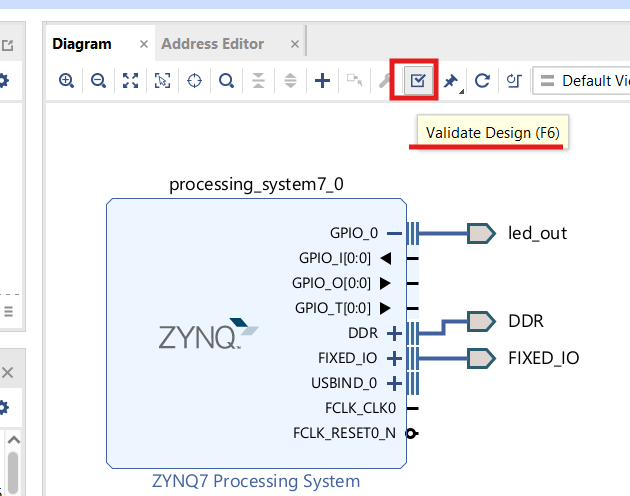

**그림 6-8** `Validate Design`(F6).

`Sources → design_1` 우클릭 → `Create HDL Wrapper…`를 실행한다(그림 6-9).

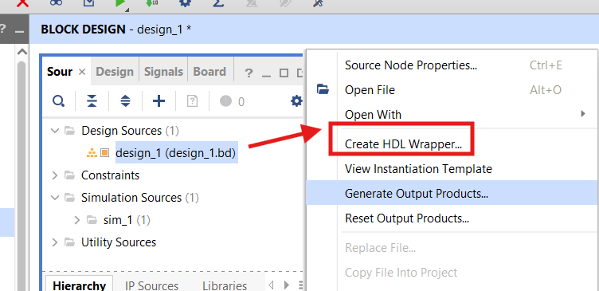

**그림 6-9** `design_1` 우클릭 → `Create HDL Wrapper…`.

### 6.5.2 합성과 핀 배정

`Run Synthesis`를 실행하고, 완료되면 `Open Synthesized Design`을 선택한다(그림 6-10).

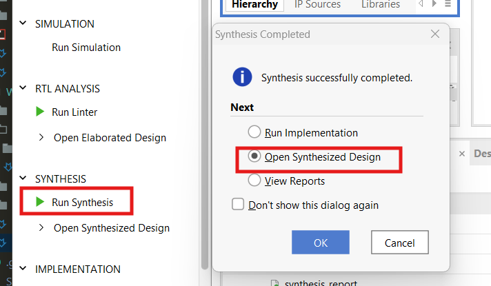

**그림 6-10** Synthesis 완료 후 `Open Synthesized Design`.

`Layout → I/O Planning`을 연다. `I/O Ports` 표에 `led_out` 인터페이스가 **`led_out_tri_io[0]`** 이라는 이름의 실제 포트로 나타난다(그림 6-11) — 6.4.2절에서 짚었듯, `GPIO_I`/`GPIO_O`/`GPIO_T`를 하나로 묶은 3-상태(tri-state) 신호라서 합성 후에는 관례적으로 `_tri_io`가 붙는다. 이 행에 **Package Pin `N15`**(RGB LED0의 R 채널), **I/O Std `LVCMOS33`** 을 입력한다.

![I/O Planning — led_out_tri_io[0] → N15](img/w3s2_11.png)

**그림 6-11** `led_out_tri_io[0]`을 패키지 핀 `N15`, `LVCMOS33`으로 배정.

`Ctrl+S` → `Save Constraints` → 새 XDC 파일 `my`를 만든다(그림 6-12).

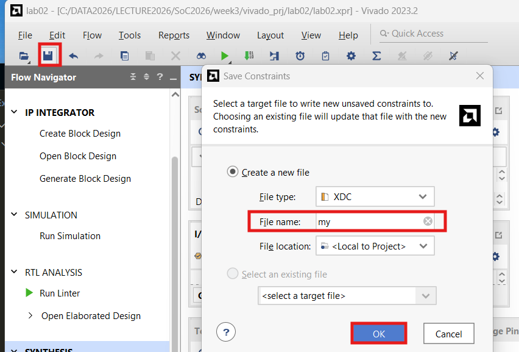

**그림 6-12** `Save Constraints`에서 새 제약 파일 `my.xdc`를 만든다.

저장된 `my.xdc`의 내용은 다음과 같다(그림 6-13).

```tcl
set_property IOSTANDARD LVCMOS33 [get_ports {led_out_tri_io[0]}]
set_property PACKAGE_PIN N15     [get_ports {led_out_tri_io[0]}]
```

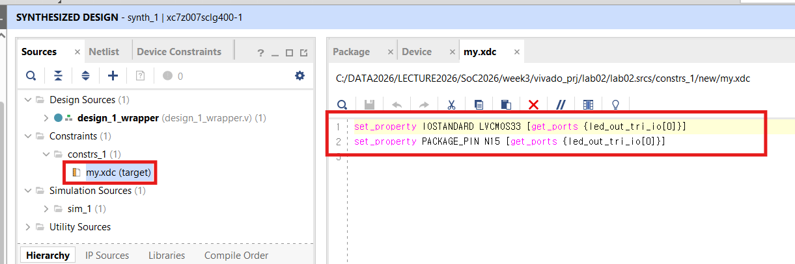

**그림 6-13** 저장된 `my.xdc`. 포트 이름이 `led_out_tri_io[0]`으로 나온다.

> 참고용 XDC는 [`LAB02/xdc/cora_z7_07s_week03.xdc`](LAB02/xdc/cora_z7_07s_week03.xdc)에 있다.

---

## 6.6 Bitstream 생성과 Export Hardware

`Generate Bitstream`을 실행한다(그림 6-14).

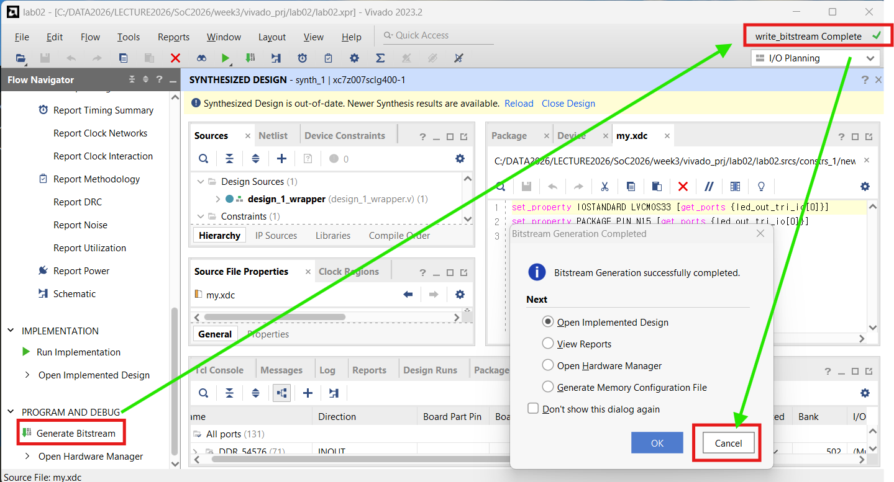

**그림 6-14** `write_bitstream Complete!` — Bitstream 생성 완료.

`File → Export → Export Hardware…`를 실행한다. `Output` 페이지에서 **`Include bitstream`** 을 선택하고(그림 6-15), `Files` 페이지에서 XSA 이름과 경로를 확인한 뒤 `Finish`를 누른다(그림 6-16).

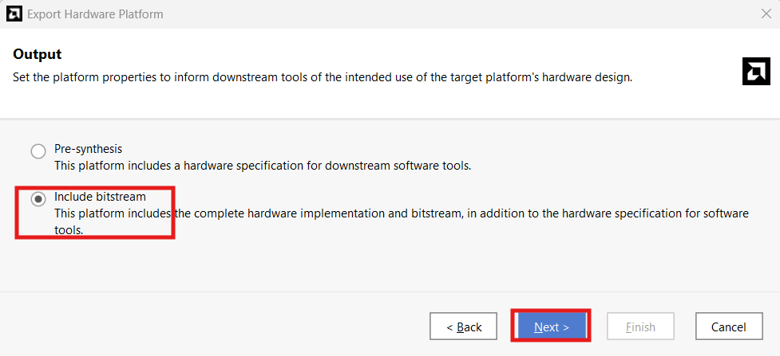

**그림 6-15** Export Hardware의 `Output` 페이지. `Include bitstream` 선택.

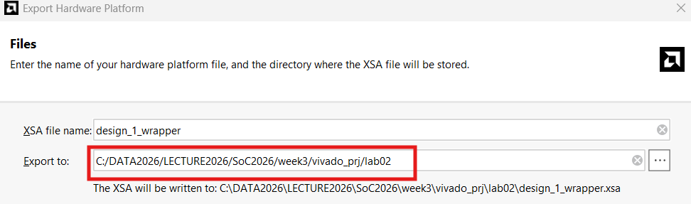

**그림 6-16** Export Hardware의 `Files` 페이지. `design_1_wrapper.xsa`로 저장된다.

---

## 6.7 Vitis: 새 Platform·Application Component

Vitis는 Workspace 안에 Platform/Application **Component**를 만드는 구조다(W3_S1 5.7절 참고). **LAB01의 Platform Component를 갱신하지 않는다.** 이 장에서도 처음부터 새로 만든다 — 필요하면 Workspace(`vitis_workspace`)는 LAB01과 같은 것을 이어 써도 되지만, Component 자체는 새로 만든다.

### 6.7.1 새 Platform Component

Welcome 화면 → `Embedded Development → Create Platform Component`. 마법사가 `Name and Location → Flow → OS and Processor → Summary` 순서로 진행된다 — 5.7.2절과 같다.

1. **Name and Location**: Component name을 예) `w3s2_platform`으로 입력한다(그림 6-17).

   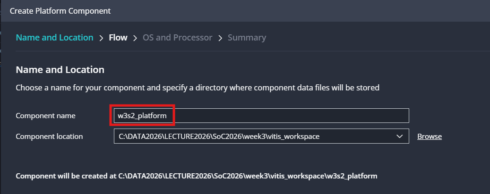

   **그림 6-17** Component name `w3s2_platform`.

2. **Flow**: `Select Hardware Design (XSA)` 대화상자에서 `lab02` 프로젝트 폴더의 `design_1_wrapper.xsa`를 선택한다(그림 6-18).

   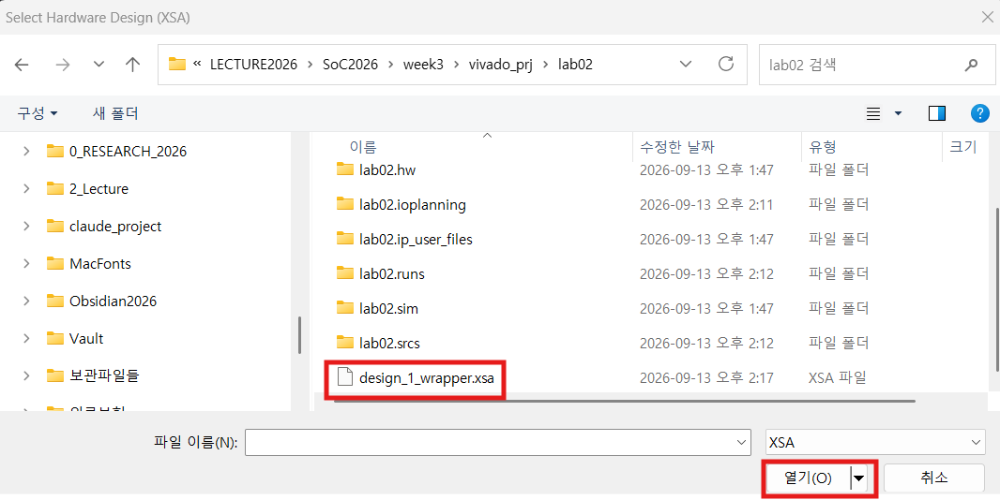

   **그림 6-18** `lab02` 프로젝트 폴더에서 `design_1_wrapper.xsa` 선택.

3. **OS and Processor**: `Operating system: standalone`, `Processor: ps7_cortexa9_0`이 자동으로 채워진다(그림 6-19).

   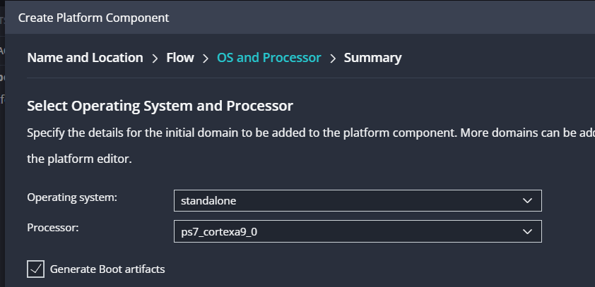

   **그림 6-19** Operating system `standalone`, Processor `ps7_cortexa9_0`.

4. **Summary** → `Finish`.

생성 후 `FLOW → Build`를 **직접 눌러야** 실제로 빌드된다 — W3_S1 5.7.3절과 같다. 출력 창에 `Platform Build Finished successfully.`가 뜨면 완료다(그림 6-20).

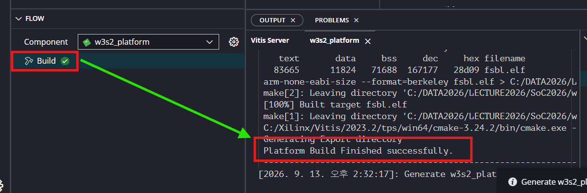

**그림 6-20** `FLOW → Build`. `Platform Build Finished successfully.`

### 6.7.2 새 Application Component — Empty Application + Import

Welcome 화면 → `Embedded Development → Create Embedded Application`. 마법사가 `Name and Location → Hardware → Domain → Sysroot → Summary` 순서로 진행된다 — 5.8절과 같다.

1. **Name and Location**: Component name을 예) `w3s2_app`으로 입력한다(그림 6-21).

   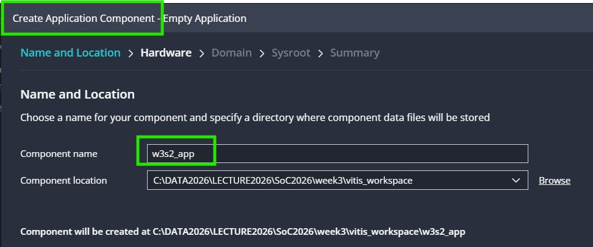

   **그림 6-21** Component name `w3s2_app`.

2. **Hardware → Select Platform**: 방금 만든 `w3s2_platform`을 선택한다(그림 6-22).

   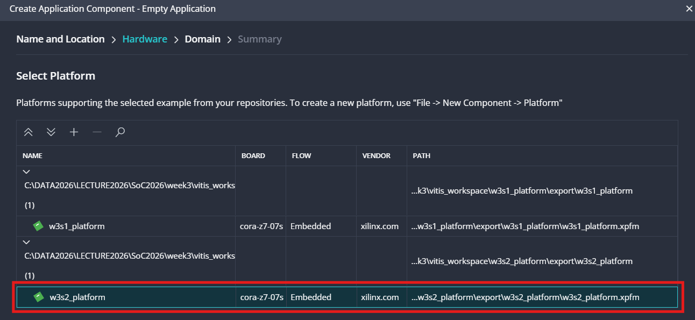

   **그림 6-22** `w3s2_platform`을 이 애플리케이션이 올라갈 플랫폼으로 선택.

3. **Domain → Select Domain**: `standalone_ps7_cortexa9_0`이 자동으로 선택된다(그림 6-23). 그대로 둔다.

   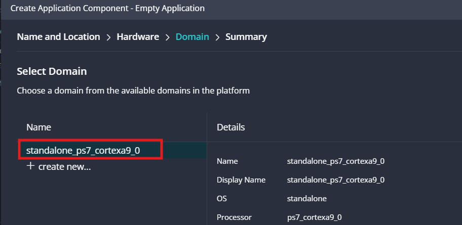

   **그림 6-23** Domain `standalone_ps7_cortexa9_0`.

4. **Sysroot·Summary**는 기본값 그대로 두고 `Finish`.

Vitis 템플릿을 그대로 쓰지 않고, 미리 준비한 소스 파일을 **가져오기(Import)** 한다 — W3_S1의 Hello World와 같은 방식이다. `VITIS_WORKSPACE` 트리에서 `w3s2_app → Sources → src`를 우클릭 → `Import → Files…`를 누른다(그림 6-24).

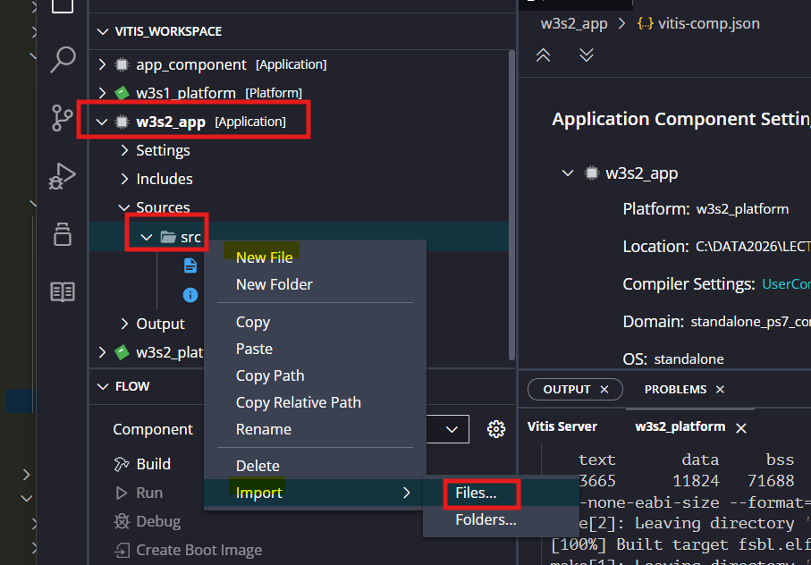

**그림 6-24** `src` 폴더 우클릭 → `Import` → `Files…`.

`Files…`를 누르면 파일 선택 창이 뜬다. `LAB02/src` 폴더에서 [`led_emio.c`](LAB02/src/led_emio.c)를 선택해 가져온다(그림 6-25).

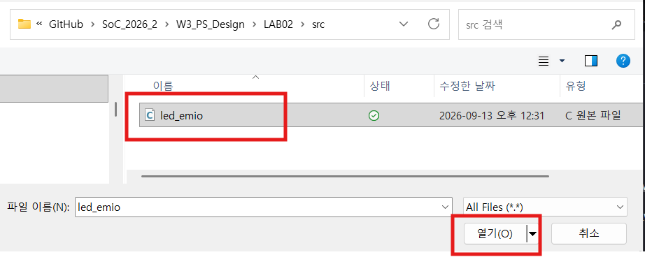

**그림 6-25** `LAB02/src/led_emio.c`를 선택해 Import.

---

## 6.8 코드 — 레지스터 3개로 LED 점멸

복잡한 드라이버 설정 없이, **딱 3개의 주소**에 값을 쓰고 읽는 것만으로 LED를 켜고 끈다.

| 주소 | 이름 | 하는 일 |
|---|---|---|
| `0xE000A284` | `DIRM_2` | 이 핀을 출력으로 쓸지 입력으로 쓸지 정한다 |
| `0xE000A288` | `OEN_2` | 출력을 켠다(이걸 안 하면 값을 써도 핀에 안 나간다) |
| `0xE000A048` | `DATA_2` | 여기에 1을 쓰면 LED가 켜지고, 0을 쓰면 꺼진다 |

가져온 `led_emio.c`의 내용은 다음과 같다.

```c
#include "xil_io.h"       // Xil_Out32
#include "xil_printf.h"
#include "sleep.h"

#define DIRM_2   0xE000A284U   // 방향: 1 = 출력
#define OEN_2    0xE000A288U   // 출력 켜기: 1 = 켬
#define DATA_2   0xE000A048U   // 값: 1 = LED ON, 0 = LED OFF

int main(void)
{
    Xil_Out32(DIRM_2, 1);   // 출력으로 설정
    Xil_Out32(OEN_2,  1);   // 출력 켜기

    print("LED blink start\n\r");

    while (1) {
        Xil_Out32(DATA_2, 1);   // LED ON
        print("LED ON\n\r");
        usleep(500000);

        Xil_Out32(DATA_2, 0);   // LED OFF
        print("LED OFF\n\r");
        usleep(500000);
    }

    return 0;
}
```

`Xil_Out32(주소, 값)`은 그 주소에 값을 쓰는 함수다(`xil_io.h`에 있다). 처음에 `DIRM_2`·`OEN_2`에 한 번씩 1을 써서 준비하고, 그다음엔 `while(1)` 안에서 `DATA_2`에 1과 0을 번갈아 써서 LED를 점멸시킨다.

> **`xil_printf.h`를 잊지 않는다.** `print()`를 쓰려면 이 헤더가 있어야 한다 — W3_S1에서 `platform.h`를 빼먹어 빌드가 실패했던 것과 같은 종류의 문제다.

### 6.8.1 빌드와 실행

1. `FLOW` 패널에서 Component가 `w3s2_app`으로 선택된 상태로 `Build`.
2. Cora Z7-07S를 micro-USB로 연결한 상태에서 `FLOW → Run`(Run on Hardware).

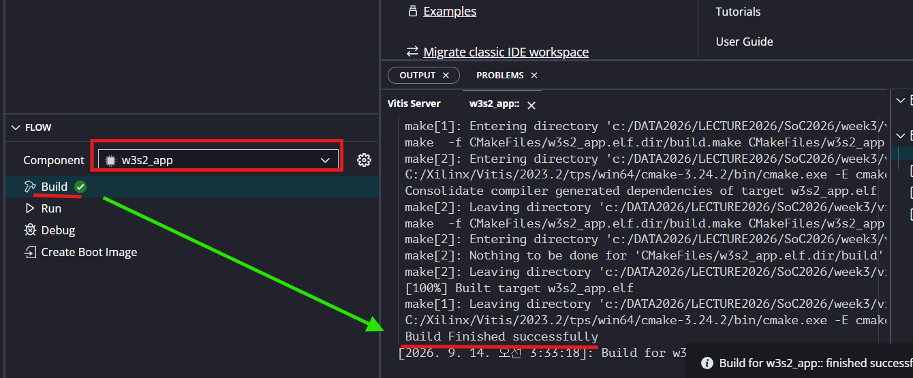

**그림 6-26** `w3s2_app` `FLOW → Build`. `Build Finished successfully.`

---

## 6.9 결과 확인

### 6.9.1 LED로 확인

Cora Z7-07S의 RGB LED0(빨간색 채널)이 **0.5초 간격으로 켜졌다 꺼졌다** 하는 것을 육안으로 확인한다.

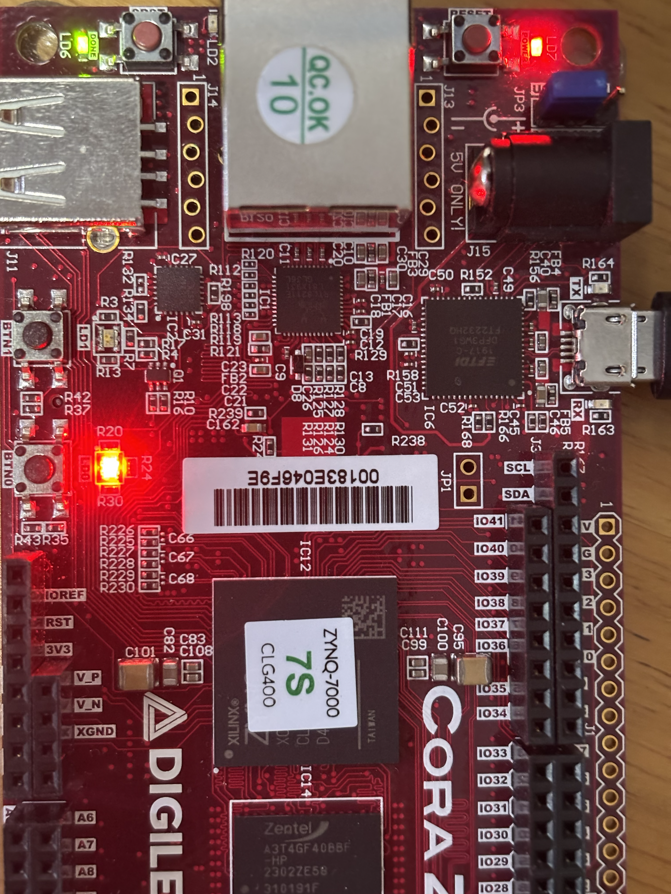

**그림 6-27** Cora Z7-07S 실물. `led_out`에 연결된 RGB LED0가 켜진 모습.

### 6.9.2 UART 로그로도 확인

W3_S1 5.10절에서 연결해 둔 PuTTY 창에는 다음이 반복해서 찍힌다.

```text
LED blink start
LED ON
LED OFF
LED ON
LED OFF
...
```

**LED가 켜지는 순간과 `LED ON`이 찍히는 순간이 같다.** PS의 GPIO 출력이 실제로 그 물리 핀까지 그대로 나가고 있음을 두 가지 방법(눈으로, 로그로)으로 함께 확인한 것이다.

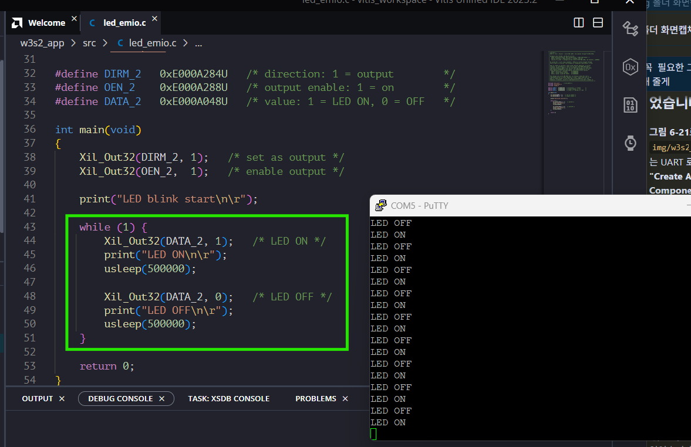

**그림 6-28** `led_emio.c` 코드와 PuTTY(`COM5`) 창을 함께 캡처. `LED ON`/`LED OFF`가 반복해서 찍힌다.

---

## 6.10 정리

| 키워드 | 내용 |
|---|---|
| 반복 학습 | LAB01과 회로가 거의 같아도 프로젝트·Platform을 처음부터 다시 만들었다 — 절차를 손에 익히는 것이 목적 |
| EMIO | PS 신호(GPIO 등)를 PL 패브릭을 통과시켜 밖으로 빼는 경로. 로직은 추가되지 않고 배선만 늘어남 |
| EMIO GPIO Width | PS Re-customize의 MIO Configuration 탭에서 설정. 필요한 비트 수만 직접 지정 가능(슬라이스 IP 불필요) |
| 핀 배정 | EMIO로 나온 외부 포트도 2주차와 동일하게 I/O Planning → XDC로 패키지 핀에 배정. BD 이름(`led_out`)과 합성 후 포트 이름(`led_out_tri_io[0]`)이 다르다 |
| GPIO 뱅크 구조 | Zynq-7000 GPIO는 32비트씩 4개 뱅크(0~31/32~53/54~85/86~117). EMIO 0번째 비트(핀 54)는 **Bank 2의 0번 비트** |
| 레지스터 직접 접근 | `DIRM_2`(방향)·`OEN_2`(출력 인에이블)·`DATA_2`(값) 세 레지스터 주소에 `Xil_Out32`로 직접 쓴다 — 드라이버 인스턴스도, `xparameters.h`도 필요 없다 |
| 통째로 쓰기(비 read-modify-write) | EMIO 비트가 1개뿐이라 안전하다. 비트를 2개 이상 쓰면 read-modify-write로 바꿔야 한다 |
| 이 장의 회로 | PL 로직 0개 유지 — PS GPIO가 배선 하나로 LED까지 이어짐 |

---

## 과제 — 다음 주 전까지

1. `usleep()` 값을 바꿔 점멸 주기를 바꿔 보고, LED와 UART 로그가 함께 바뀌는지 확인한다.
2. `EMIO GPIO Width`를 2로 늘려 RGB LED0의 R·G 두 채널(`N15`, `G17`)을 함께 제어해 본다. 비트가 2개가 되면 `Xil_Out32(DATA_2, 1)`처럼 통째로 쓰면 안 되고(다른 비트를 꺼 버린다), 두 비트를 함께 담은 값(예: `0b01`, `0b10`, `0b11`, `0b00`)을 써야 한다는 점에 주의한다.
3. 이번 장에서는 출력(LED)만 다뤘다. `BTN0`을 EMIO 입력으로 읽으려면 `DIRM_2`를 어떻게 설정해야 하는지, 값은 어느 레지스터에서 읽어야 하는지 생각해 온다. (다음 주 예고와 연결)
4. 이 장에서 New Project부터 Run on Hardware까지 걸린 시간을 1교시(LAB01)와 비교해 적어 온다.

## 다음 시간 예고 — 제4주

- PS와 PL을 **AXI 버스**로 연결하는 첫 실습 (AXI GPIO IP 소개)
- PS가 PL의 레지스터를 읽고 쓰는 구조
- 버튼 입력을 EMIO가 아니라 AXI GPIO로 받아, PS+PL이 함께 동작하는 설계로 확장

---

*SoC 설계 · 3주차 2교시(W3_S2) | Vivado/Vitis 2023.2 · Windows · Cora Z7-07S*
