# 제7장 PS-PL 연결 (1) — AXI GPIO와 레지스터 직접 접근

**SoC 설계** · 4주차 1교시(W4_S1) | Vivado/Vitis 2023.2 · Windows 11 · Digilent Cora Z7-07S

---

3주차는 PS만 썼다. PL에는 로직이 없었고, PS의 GPIO 신호가 EMIO를 통해 PL 핀으로 통과해 나가는 정도였다. 이번 장에서는 처음으로 **PL 안에 진짜 하드웨어(IP)** 를 놓고, PS가 **AXI 버스**로 그 하드웨어의 레지스터를 읽고 쓴다 — "SoC 설계"라는 과목 이름에 가장 가까운 순간이다.

> **3주차와 무엇이 다른가**
> ```text
>            EMIO (3주차)                      AXI GPIO (이번 장)
>   PS 레지스터 ──신호만 통과──▶ PL 핀     PS ──AXI 버스──▶ PL 안의 GPIO 하드웨어 ──▶ 핀
>   (PL에는 로직이 없다)                  (PL에 실제 레지스터를 가진 IP가 있다)
> ```

이번 장의 흐름은 다음과 같다.

> **M AXI GP0 켜기 → AXI GPIO #1 추가(2채널)** → **직접 핀 배정** → **Address Editor로 주소 확인** → **레지스터 직접 접근 코드 작성**

---

## 학습 목표

- PS가 AXI 버스로 PL의 레지스터를 읽고 쓰는 구조를 설명한다.
- Vivado에서 `M AXI GP0 interface`를 켜고, AXI GPIO IP를 추가해 2채널(입력·출력)로 구성한다.
- Address Editor에서 IP에 배정된 **베이스 주소**를 확인한다.
- AXI GPIO의 레지스터 맵(`GPIO_DATA`/`GPIO_TRI`, 채널별)을 이해하고, `Xil_Out32`/`Xil_In32`로 직접 제어하는 코드를 작성한다.
- AXI GPIO의 방향 레지스터 극성(1=입력)이 PS GPIO(1=출력, 3주차)와 반대라는 점을 확인한다.

---

## 7.1 AXI4-Lite — PS가 PL을 읽고 쓰는 길

PS와 PL은 **AXI**(Advanced eXtensible Interface)라는 버스로 연결된다. PS가 **마스터**(요청하는 쪽), PL의 IP가 **슬레이브**(응답하는 쪽)다. GPIO처럼 간단한 레지스터 몇 개짜리 IP는 그중 가장 단순한 형태인 **AXI4-Lite**를 쓴다.

핵심은 **주소**다. PL의 각 IP는 PS 입장에서 "메모리의 어느 주소에 있는 레지스터 묶음"으로 보인다. PS가 그 주소에 값을 쓰면 IP의 레지스터가 바뀌고, 그 주소를 읽으면 IP의 현재 상태가 돌아온다. 3주차에 PS 자신의 GPIO 레지스터 주소(`0xE000A000`)를 직접 만졌던 것과 원리는 같다 — 다만 이번엔 그 레지스터가 **PS 안이 아니라 PL 안에** 있고, 그 사이를 AXI 버스가 잇는다는 점이 다르다.

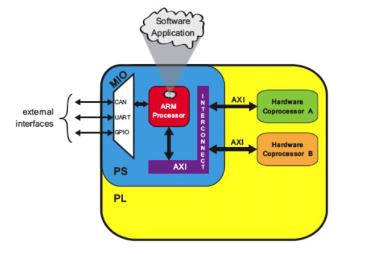

**그림 7-1** PS(ARM Processor) 위에서 Software Application이 돌아가고, PL의 하드웨어(Hardware Coprocessor A/B)는 **AXI**로 연결된다. 왼쪽의 CAN/UART/GPIO는 PS가 MIO로 직접 내보내는 인터페이스(3주차 방식)이고, 오른쪽의 AXI 연결이 이번 장의 주제다.

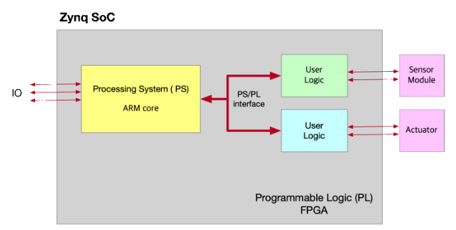

**그림 7-2** PS와 PL(Programmable Logic/FPGA) 사이는 **PS/PL interface**(AXI)로 연결된다. PL 안의 User Logic이 Sensor Module·Actuator 같은 외부 장치를 제어하고, PS는 그 User Logic의 레지스터를 AXI로 읽고 쓴다 — 이번 장에서 추가할 AXI GPIO가 바로 이 User Logic 자리에 해당한다.

Zynq PS에는 이런 용도의 마스터 포트가 몇 개 있는데, 그중 하나가 3주차 5.3.5절에서 **일부러 꺼 두었던** `M AXI GP0 interface`다. 이번 장에서 그 스위치를 켠다.

---

## 7.2 프로젝트 만들기와 M AXI GP0 켜기

새 프로젝트를 만든다. `File → Project → New…`에서 Project name을 `lab01`로 두고, 짧은 로컬 경로에 만든다.

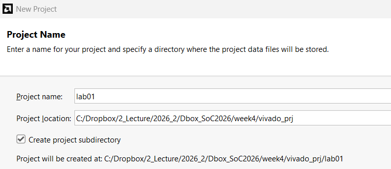

**그림 7-3** Project name을 `lab01`로 준다. 이 이름은 8장에서 이 프로젝트를 다시 열 때도 쓴다.

Project location과 Board 선택 등 나머지 New Project 단계, `Flow Navigator → IP INTEGRATOR → Create Block Design`으로 `design_1`을 만드는 것, `Add IP` → **ZYNQ7 Processing System** 추가 → **Run Block Automation**(Apply Board Preset)까지는 3주차와 같다.

PS 블록을 더블클릭해 `Re-customize IP` 창을 연다. **`PS-PL Configuration`** 페이지로 이동한다(3주차 5.3.5절에서 본 화면이다). `GP Master AXI Interface` 아래 `M AXI GP0 interface`를 **체크**한다.

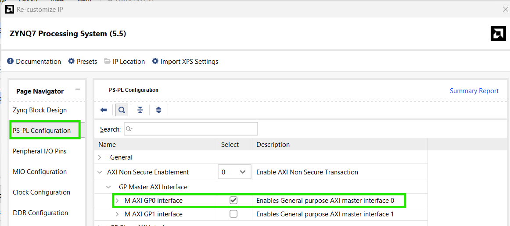

**그림 7-4** `M AXI GP0 interface`를 켠다. 3주차에는 이 체크박스를 일부러 꺼 뒀다.

`OK`로 닫으면 PS 블록에 `M_AXI_GP0` 포트가 새로 생긴다(아직 아무것도 연결되어 있지 않다).

---

## 7.3 AXI GPIO #1 추가 — 2채널 구성

### 7.3.1 IP 추가

`Add IP`(+)를 누르고 "AXI GPIO"를 검색해 캔버스에 추가한다. 추가된 인스턴스의 이름은 `axi_gpio_0`이다.

### 7.3.2 채널 설정

`axi_gpio_0`을 더블클릭해 `Re-customize IP` 창을 연다. 위쪽 `Board` / `IP Configuration` 탭 중 `IP Configuration`을 고르면, 그 안에 `GPIO`(채널 1)와 `GPIO 2`(채널 2) 두 구역이 위아래로 있다.

| 구역 | 항목 | 설정 |
|---|---|---|
| `GPIO`(채널 1) | `All Inputs` | 체크 (채널 1을 입력 전용으로) |
| `GPIO`(채널 1) | `GPIO Width` | `2` |
| `GPIO`(채널 1) | `Enable Dual Channel` | 체크 (채널 2 사용) |
| `GPIO 2`(채널 2) | `All Outputs` | 체크 (채널 2를 출력 전용으로) |
| `GPIO 2`(채널 2) | `GPIO Width` | `3` |

즉 이 IP 하나가 **입력 2비트(채널1) + 출력 3비트(채널2)** 를 동시에 갖는다.

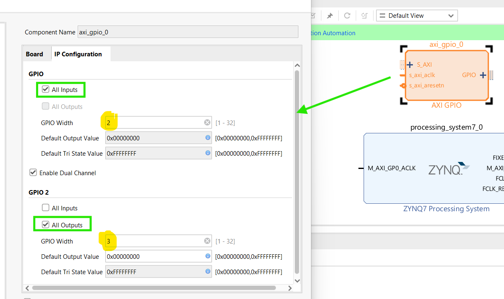

**그림 7-5** `IP Configuration` 탭 한 화면 안에 채널 1(`GPIO`: All Inputs, Width 2, Enable Dual Channel)과 채널 2(`GPIO 2`: All Outputs, Width 3) 설정이 함께 보인다.

### 7.3.3 Run Connection Automation

캔버스 위의 **"Run Connection Automation"** 배너를 클릭한다. 왼쪽 트리에서 `axi_gpio_0` 아래 `GPIO`/`GPIO2`는 **체크하지 않고, `S_AXI`만 체크**한다.

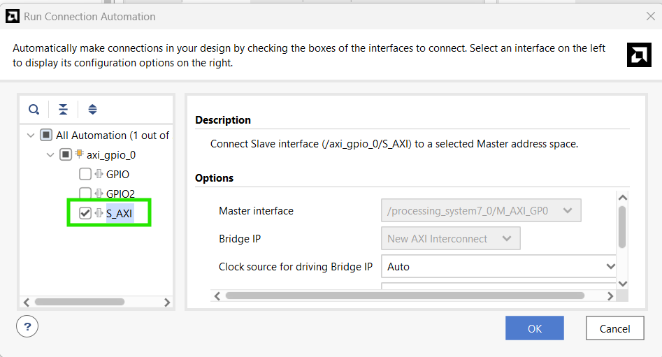

**그림 7-6** `axi_gpio_0`의 `S_AXI`(AXI4-Lite 슬레이브 인터페이스)만 체크한다. 오른쪽에 `Master interface = /processing_system7_0/M_AXI_GP0`, `Bridge IP = New AXI Interconnect`가 자동으로 채워진다.

> **`GPIO`/`GPIO2`는 왜 체크하지 않는가.** 이 두 체크박스를 켜면 Vivado가 채널을 보드 프리셋 핀에 자동으로 연결해 버린다. 이번 장에서는 7.3.4절·7.5절에서 **직접** 포트 이름을 정하고 핀을 배정하는 과정을 연습하는 게 목적이므로, `S_AXI`(버스 연결)만 자동화하고 `GPIO`/`GPIO2`(외부 핀 연결)는 수동으로 남겨 둔다.

`OK`를 누른다. 자동화가 끝나면 캔버스에 **`axi_gpio_0` 외에 블록이 몇 개 더 생긴다** — `AXI Interconnect`(인스턴스 이름 `ps7_0_axi_periph`)와 `Processor System Reset`(인스턴스 이름 `rst_ps7_0_50M`)이다. 둘 다 직접 추가한 것이 아니라 Connection Automation이 자동으로 채워 넣은 것이다.

> **처음 보는 블록 두 개.**
> - **AXI Interconnect**(`ps7_0_axi_periph`): PS의 AXI 마스터 포트 하나를 여러 AXI 슬레이브(지금은 하나뿐이지만, 8장에서 두 번째 AXI GPIO를 추가하면 둘이 된다)에 나눠 연결해 주는 버스 라우터다.
> - **Processor System Reset**(`rst_ps7_0_50M`): 3주차 5.3.5절에서 잠깐 언급했던 그 IP다. AXI 쪽 로직에는 클럭에 동기화된 리셋이 필요해서, PL에 뭔가(AXI IP)를 연결하는 순간부터는 Vivado가 자동으로 넣어 준다.
>
> 둘 다 지금 당장 설정을 건드릴 필요는 없다 — Connection Automation이 알아서 맞는 값으로 채운다.

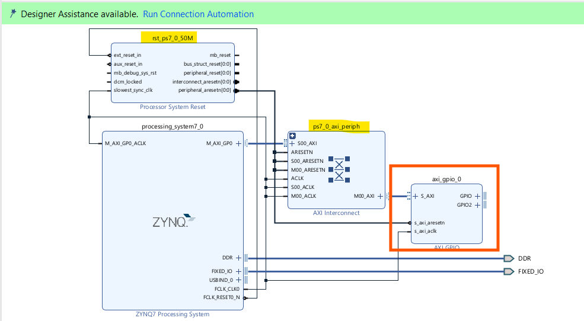

**그림 7-7** 자동으로 추가된 `rst_ps7_0_50M`(Processor System Reset)·`ps7_0_axi_periph`(AXI Interconnect)와 함께 `axi_gpio_0`이 `M_AXI_GP0`에 연결된 모습. 위쪽에 "Designer Assistance available" 배너가 여전히 보이는데, `GPIO`/`GPIO2`를 아직 연결하지 않았기 때문이다 — 신경 쓰지 않고 다음 절로 넘어간다.

### 7.3.4 외부 포트 이름 정하기

`axi_gpio_0`의 `GPIO`(채널1)와 `GPIO2`(채널2) 포트를 각각 우클릭 → `Make External`한다. 이름을 다음과 같이 바꾼다.

| 포트 | 이름 |
|---|---|
| 채널 1(입력) | `btn` |
| 채널 2(출력) | `led0` |

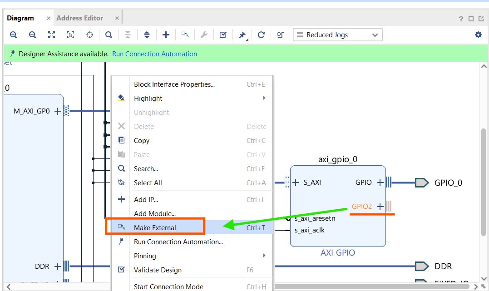

**그림 7-8** `GPIO2` 포트를 우클릭해 `Make External`. `GPIO`(→`btn`)는 이미 같은 방식으로 처리한 뒤라 오른쪽 위에 `GPIO_0`으로 보인다.

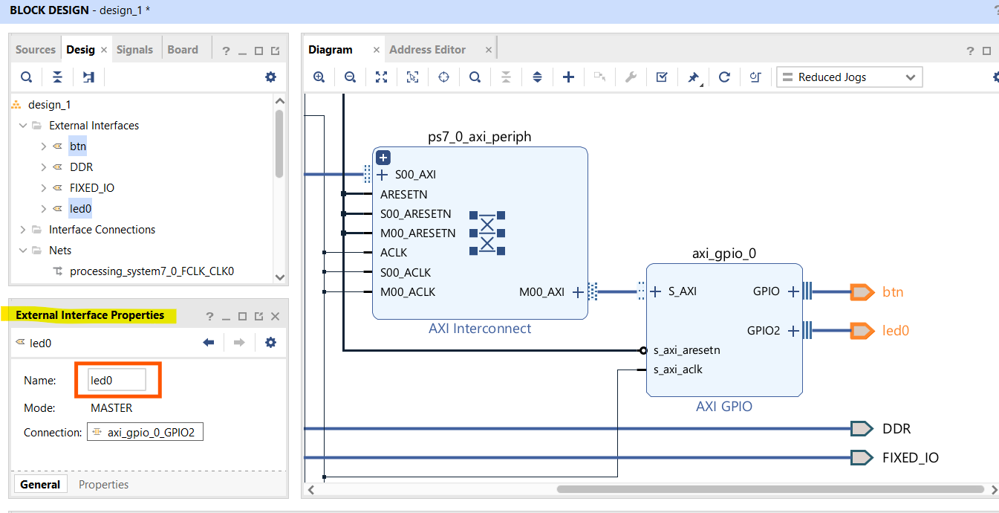

**그림 7-9** `Sources` 트리의 `External Interfaces`에 `btn`, `led0`가 생겼다(아래 `External Interface Properties`에 `led0`의 `Mode: MASTER`, `Connection: axi_gpio_0_GPIO2`가 보인다). 캔버스에서도 `axi_gpio_0`의 `GPIO`→`btn`, `GPIO2`→`led0`가 외부 포트로 나간 것을 확인할 수 있다.

> **합성 후 이름이 달라질 수 있다.** 2주차·3주차에서 본 것처럼, GPIO 스타일 포트는 합성을 거치면 `_tri_i`/`_tri_o` 같은 접미사가 붙는다(`btn`→`btn_tri_i`, `led0`→`led0_tri_o`). 지금 붙인 이름(`btn`, `led0`)은 Block Design 안에서의 이름이고, 실제 최종 이름은 7.5절에서 다시 확인한다.

---

## 7.4 Address Editor — 이 IP는 어느 주소에 있나

캔버스 위쪽 탭에서 **`Address Editor`** 를 연다(또는 `Window → Address Editor`).

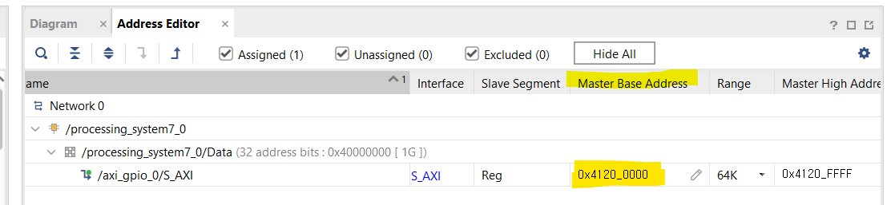

**그림 7-10** Address Editor. `/axi_gpio_0/S_AXI`가 `/processing_system7_0/Data` 안에 **`0x4120_0000`**번지(Range `64K`, High Address `0x4120_FFFF`)로 배정된 것이 보인다.

여기 보이는 **베이스 주소를 반드시 적어 둔다** — 7.6절의 C 코드에서 그대로 쓴다. 지금은 IP가 하나뿐이라 주소도 한 줄이다. 8장에서 두 번째 AXI GPIO를 추가하면 이 표에 줄이 하나 더 생기고, IP마다 서로 다른 주소를 갖는다는 점이 분명해진다.

---

## 7.5 핀 배정과 Bitstream

1. 캔버스 우클릭 → `Validate Design`(F6).
2. `Sources → design_1` 우클릭 → `Create HDL Wrapper…`. 대화상자가 뜨면 기본값인 **"Let Vivado manage wrapper and auto-update"** 를 그대로 둔다(2주차부터 계속 쓴 방식) — 이렇게 해 두면 나중에 Block Design이 바뀌었을 때 Vivado가 이 래퍼를 **out-of-date로 표시**하고, `Generate Output Products`(또는 `Run Synthesis`)를 실행하는 시점에 새 내용으로 다시 만들어 준다. **단, Block Design을 저장(`Ctrl+S`)하는 것만으로 래퍼 파일이 즉시 갱신되지는 않는다** — 8.4절에서 다시 다룬다.

이 시점에 생성되는 `design_1_wrapper.v`를 열어 보면, `btn`/`led0`가 실제로 어떤 이름으로 꼭대기 레벨(top module) 포트가 되는지 미리 볼 수 있다.

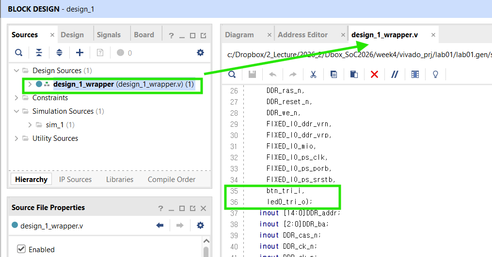

**그림 7-11** `design_1_wrapper.v`의 포트 목록 마지막 두 줄에 `btn_tri_i`, `led0_tri_o`가 보인다 — 7.3.4절에서 붙인 이름 뒤에 각각 `_tri_i`(입력)·`_tri_o`(출력)가 자동으로 붙었다.

3. `Run Synthesis` → 완료되면 `Open Synthesized Design`.

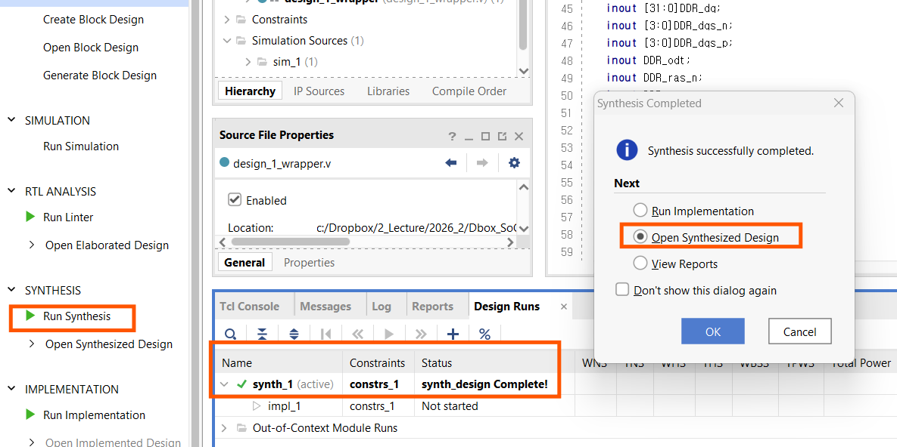

**그림 7-12** Synthesis Completed 대화상자에서 `Open Synthesized Design`을 선택하고 `OK`.

4. `Layout → I/O Planning`으로 이동한다.

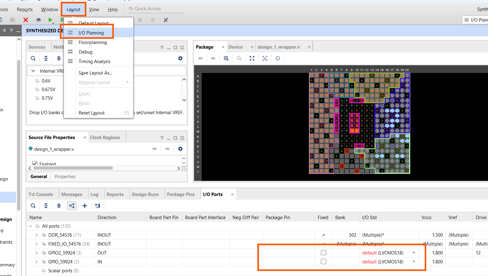

**그림 7-13** `Layout → I/O Planning`. 아래 `I/O Ports` 표에 아직 핀이 배정되지 않은 `GPIO_...(2)`(입력, `btn`)와 `GPIO2_...(3)`(출력, `led0`)가 보인다 — 이 단계에서는 아직 그림 7-11에서 본 `btn_tri_i`/`led0_tri_o`라는 이름 대신, 인터페이스 단위로 묶인 이름으로 보인다. 행을 펼쳐야 실제 개별 포트 이름이 나온다.

5. 먼저 두 포트의 `I/O Std`를 `LVCMOS33`으로 지정한다.

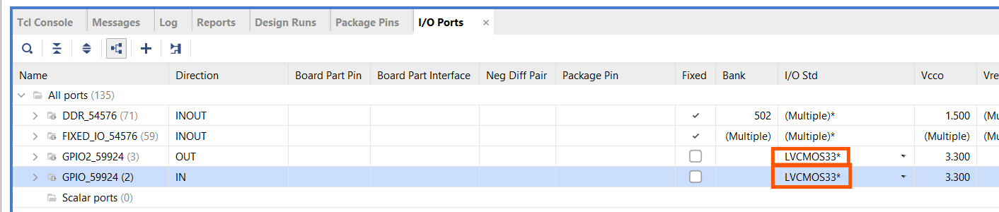

**그림 7-14** `GPIO2_...`(출력)·`GPIO_...`(입력) 두 행의 `I/O Std`를 `LVCMOS33`으로 맞춘다.

6. 각 행을 펼쳐 다음 5핀을 개별 `Package Pin`에 직접 배정한다.

| 신호 | 패키지 핀 | I/O Std |
|---|---|---|
| `btn_tri_i[0]` (`BTN0`) | `D20` | `LVCMOS33` |
| `btn_tri_i[1]` (`BTN1`) | `D19` | `LVCMOS33` |
| `led0_tri_o[0]` (R) | `N15` | `LVCMOS33` |
| `led0_tri_o[1]` (G) | `G17` | `LVCMOS33` |
| `led0_tri_o[2]` (B) | `L15` | `LVCMOS33` |

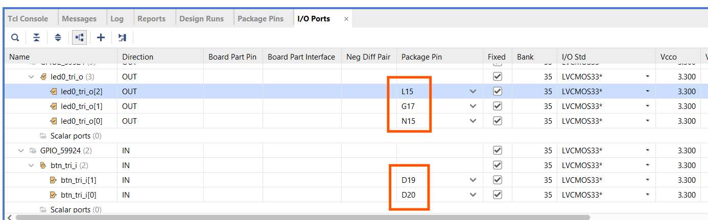

**그림 7-15** 행을 펼치면 실제 포트 이름 `led0_tri_o[2:0]`, `btn_tri_i[1:0]`가 나온다. 여기서 위 표의 5핀을 개별적으로 배정한다.

7. `Ctrl+S` → `Save Constraints` → 새 XDC 파일로 저장한다.

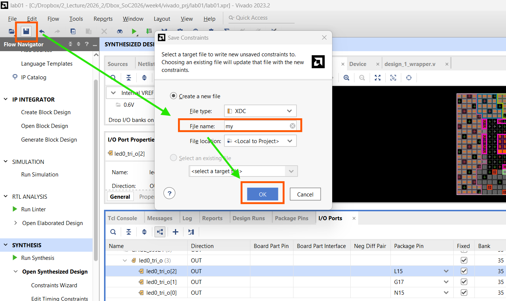

**그림 7-16** `Save Constraints` 대화상자에서 `File name`을 `my`로 두고 `OK`. `my.xdc` 파일이 새로 생긴다.

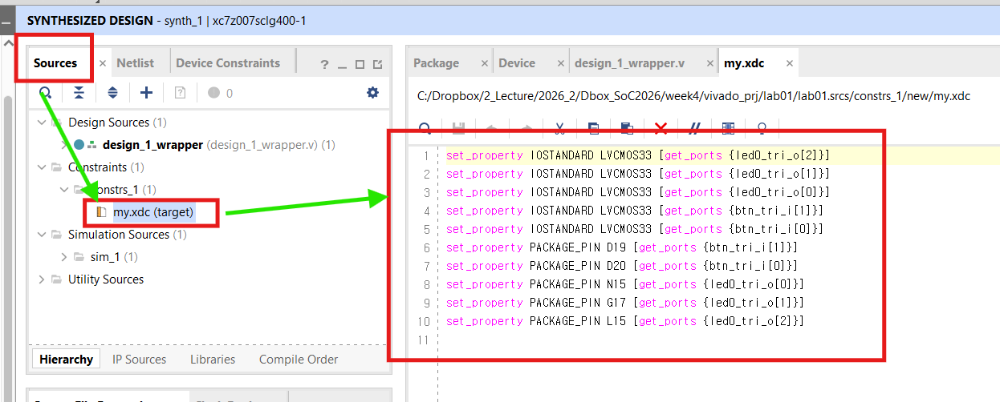

**그림 7-17** 생성된 `my.xdc`. `IOSTANDARD`와 `PACKAGE_PIN`이 각 포트마다 자동으로 채워졌다.

> 참고용 완성 XDC는 [`LAB01/xdc/cora_z7_07s_week04_lab01.xdc`](LAB01/xdc/cora_z7_07s_week04_lab01.xdc)에 있다 — 방금 직접 만든 `my.xdc`와 비교해 본다.

8. `Generate Bitstream`.

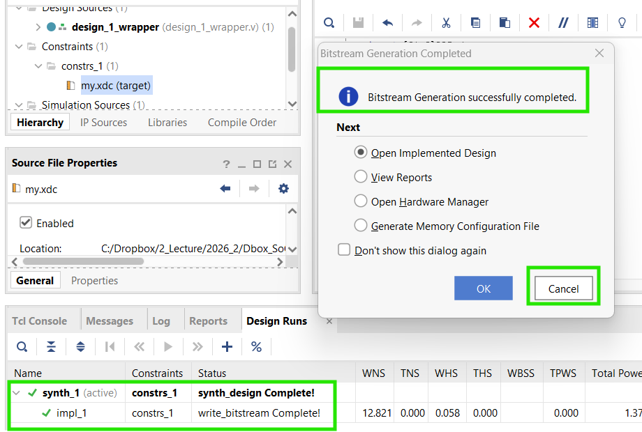

**그림 7-18** `Bitstream Generation Completed`. `synth_1`은 `synth_design Complete!`, `impl_1`은 `write_bitstream Complete!`.

9. `File → Export → Export Hardware…`.

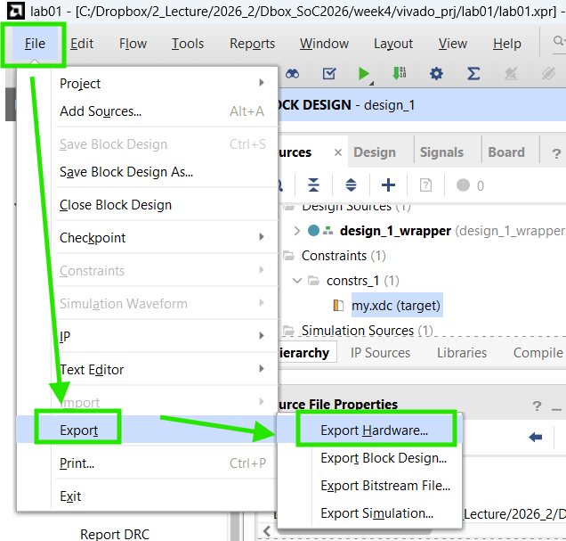

**그림 7-19** `File → Export → Export Hardware…`를 선택한다.

10. `Output` 단계에서 **`Include bitstream`** 을 선택한다.

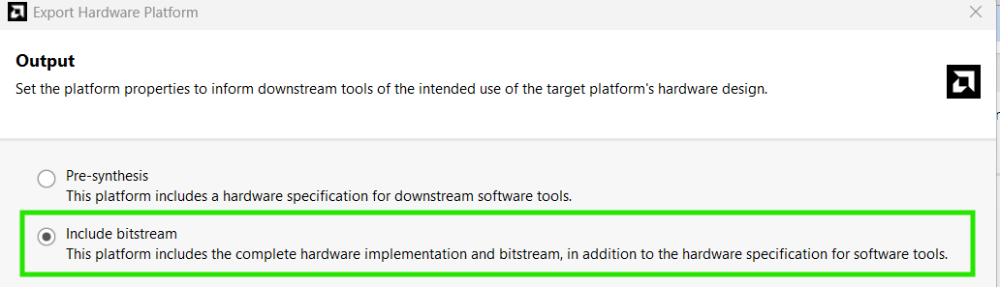

**그림 7-20** `Include bitstream`(비트스트림까지 포함해서 내보내기)을 선택한다 — 하드웨어 스펙만 필요한 `Pre-synthesis`가 아니라, Vitis에서 바로 보드에 프로그래밍까지 할 수 있어야 하므로 이쪽을 고른다.

11. `Files` 단계에서 XSA 파일 이름과 저장 위치를 확인하고 `Finish`.

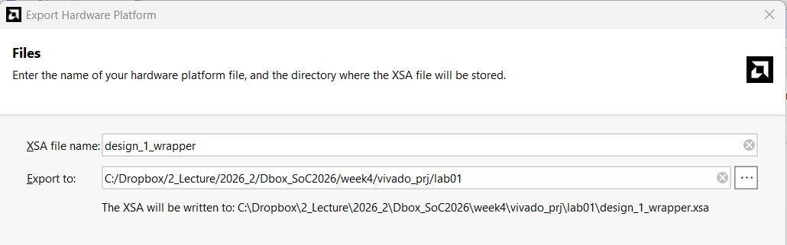

**그림 7-21** `XSA file name`은 `design_1_wrapper`, 저장 경로는 프로젝트 폴더 아래(`.../lab01/design_1_wrapper.xsa`)다. 이 `.xsa` 파일이 7.6절에서 Vitis Platform을 만들 때 쓰는 **하드웨어 스펙 파일**이다.

---

## 7.6 Vitis — 레지스터 직접 접근으로 제어

### 7.6.1 Platform·Application 준비

3주차와 같은 Vitis Unified IDE 흐름이다. 먼저 `Open Workspace`로 이번 주차의 `vitis_workspace` 폴더를 연다.

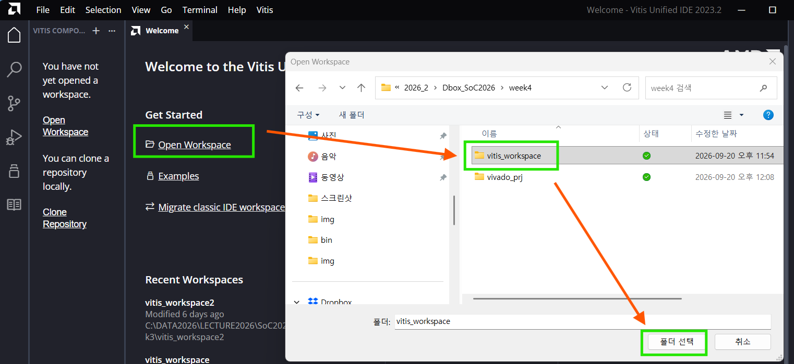

**그림 7-22** `Open Workspace`에서 `vitis_workspace` 폴더를 선택한다.

`Embedded Development → Create Platform Component`로 새 Platform을 만든다.

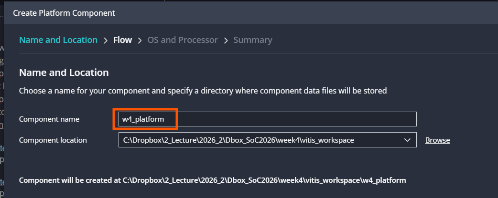

**그림 7-23** `Name and Location`. Component name을 `w4_platform`으로 준다.

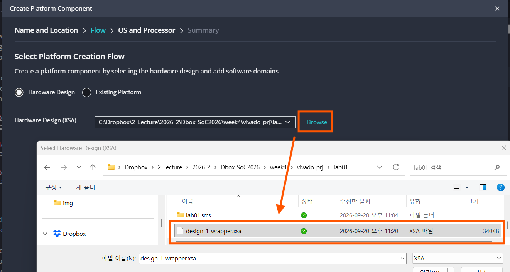

**그림 7-24** `Flow`에서 `Hardware Design`을 선택하고, `Browse`로 7.5절에서 Export한 `design_1_wrapper.xsa`(`lab01.srcs` 아래)를 고른다.

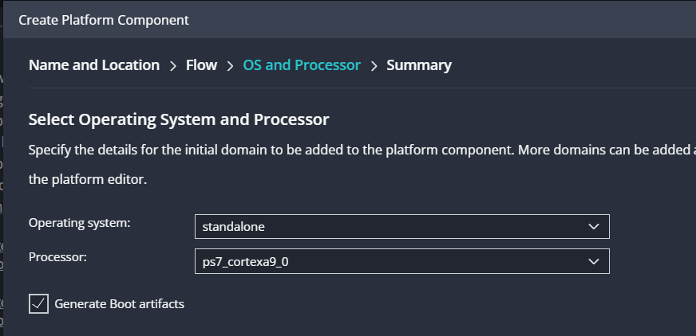

**그림 7-25** `OS and Processor`. Operating system은 `standalone`, Processor는 `ps7_cortexa9_0`, `Generate Boot artifacts`는 체크된 채로 둔다.

`Summary`까지 확인하고 완료한 뒤, `FLOW → Build`로 Platform을 빌드한다.

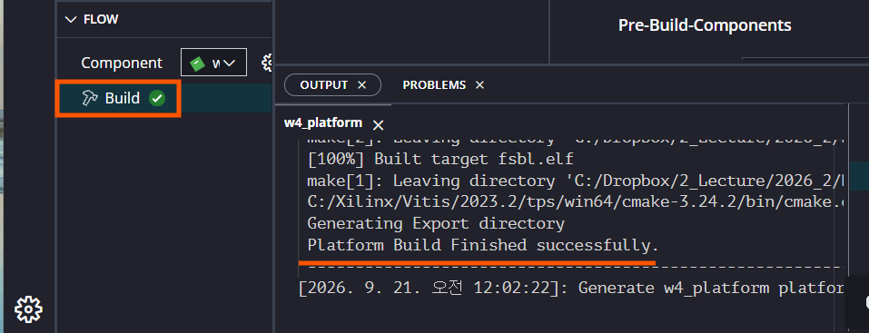

**그림 7-26** `Build`를 눌러 Platform Build까지 마친다. 로그 마지막 줄에 `Platform Build Finished successfully.`가 보이면 성공이다.

이어서 `Create Embedded Application`으로 `Empty Application (C)`을 만든다.

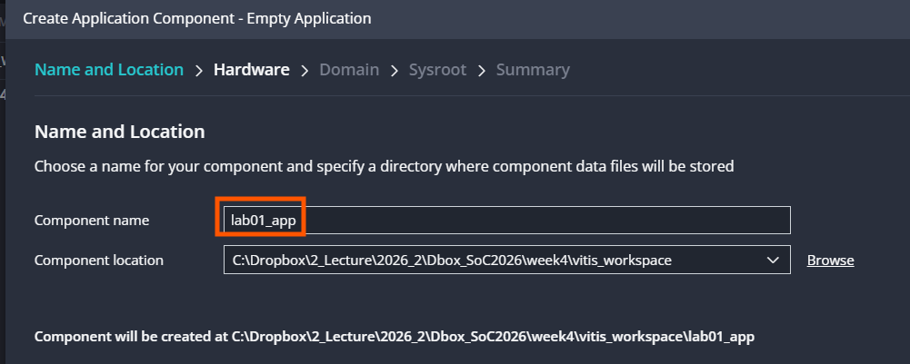

**그림 7-27** `Name and Location`. Component name을 `lab01_app`으로 준다.

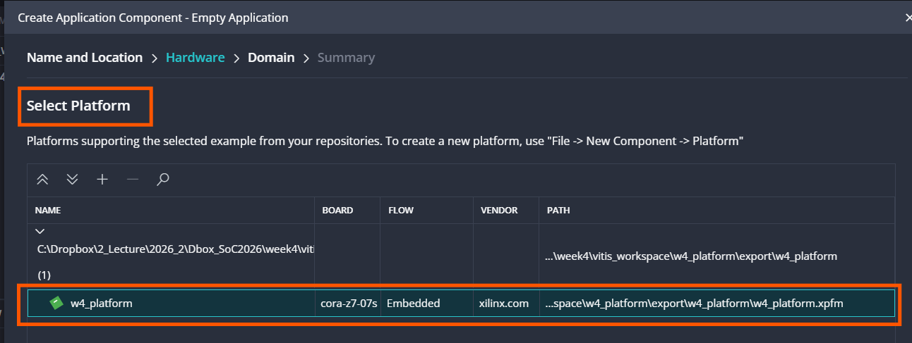

**그림 7-28** `Hardware` 단계에서 방금 만든 `w4_platform`(Board: cora-z7-07s)을 선택한다.

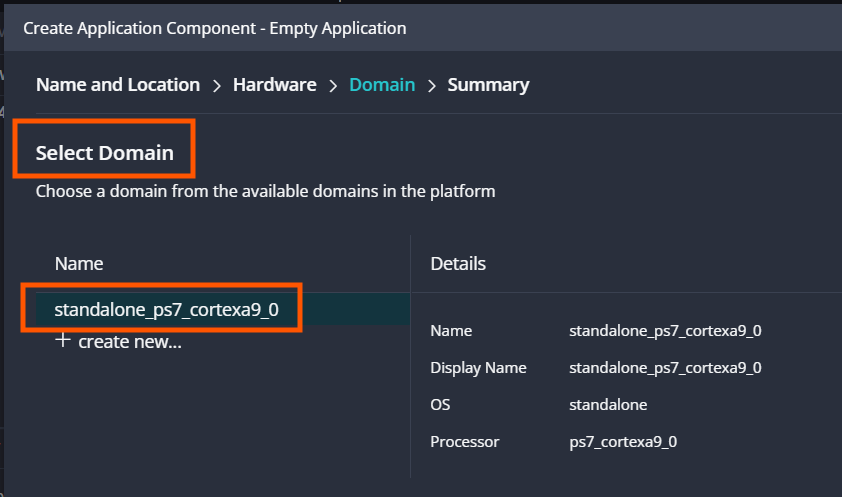

**그림 7-29** `Domain` 단계에서 `standalone_ps7_cortexa9_0`을 선택한다. `Summary`까지 확인하고 완료한다.

`src` 우클릭 → `Import → Files…` → [`LAB01/src/btn_led_reg.c`](LAB01/src/btn_led_reg.c)를 가져온다.

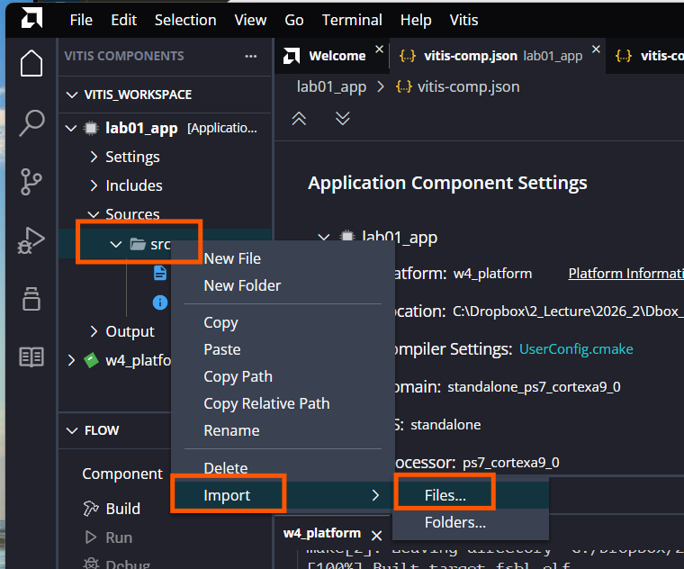

**그림 7-30** `src` 우클릭 → `Import → Files…`로 `btn_led_reg.c`를 가져온다.

### 7.6.2 AXI GPIO의 레지스터 맵

AXI GPIO는 채널마다 데이터 레지스터와 방향 레지스터가 하나씩 있다. 베이스 주소를 기준으로 한 오프셋은 IP 스펙(Xilinx PG144)에 고정되어 있다 — 어떤 보드에서든 같다.

| 레지스터 | 오프셋 | 역할 |
|---|---|---|
| `GPIO_DATA` | `+0x0` | 채널 1 데이터 |
| `GPIO_TRI` | `+0x4` | 채널 1 방향 (**1 = 입력**, 0 = 출력) |
| `GPIO2_DATA` | `+0x8` | 채널 2 데이터 |
| `GPIO2_TRI` | `+0xC` | 채널 2 방향 (**1 = 입력**, 0 = 출력) |

> **극성 주의.** 3주차 PS GPIO의 `DIRM` 레지스터는 **1이 출력**이었다. AXI GPIO의 `TRI` 레지스터는 **1이 입력**이다 — 정반대다. 같은 회사(Xilinx) IP인데도 레지스터마다 관례가 다를 수 있다는 걸 보여 주는 좋은 예다. 코드를 옮겨 쓸 때 "지난번과 같겠지"라고 넘겨짚지 않고, 항상 그 IP의 스펙을 확인하는 습관이 중요하다.

### 7.6.3 코드

```c
#include "xil_io.h"
#include "xil_printf.h"
#include "sleep.h"

#define AXI_GPIO_BASEADDR   0x41200000U   /* 7.4절 Address Editor에서 확인한 값으로 수정 */

#define GPIO_DATA    (AXI_GPIO_BASEADDR + 0x0)   /* 채널 1: btn  (입력)  */
#define GPIO_TRI     (AXI_GPIO_BASEADDR + 0x4)
#define GPIO2_DATA   (AXI_GPIO_BASEADDR + 0x8)   /* 채널 2: led0 (출력)  */
#define GPIO2_TRI    (AXI_GPIO_BASEADDR + 0xC)

int main(void)
{
    u32 btn;

    Xil_Out32(GPIO_TRI,  0x3);   /* 채널 1: bit0,bit1 = 입력 */
    Xil_Out32(GPIO2_TRI, 0x0);   /* 채널 2: bit0~2    = 출력 */

    print("AXI GPIO #1 (register access) start\n\r");

    while (1) {
        btn = Xil_In32(GPIO_DATA) & 0x3;   /* bit0=BTN0, bit1=BTN1 */
        Xil_Out32(GPIO2_DATA, btn);         /* BTN0→R, BTN1→G */

        xil_printf("btn = %d\n\r", btn);
        usleep(200000);
    }

    return 0;
}
```

> **`AXI_GPIO_BASEADDR`를 7.4절에서 확인한 값으로 바꾼다.** 코드의 `0x41200000`은 흔히 배정되는 기본값의 예시일 뿐, 실제 값은 프로젝트마다 다를 수 있다 — Address Editor에 뜬 값을 반드시 그대로 옮겨 쓴다.

### 7.6.4 빌드와 실행

`FLOW → Build` → Cora Z7-07S 연결 후 `FLOW → Run`. PuTTY(3주차 5.10절에서 연결한 COM 포트, Baud 115200)를 열어 둔 채로 실행한다.

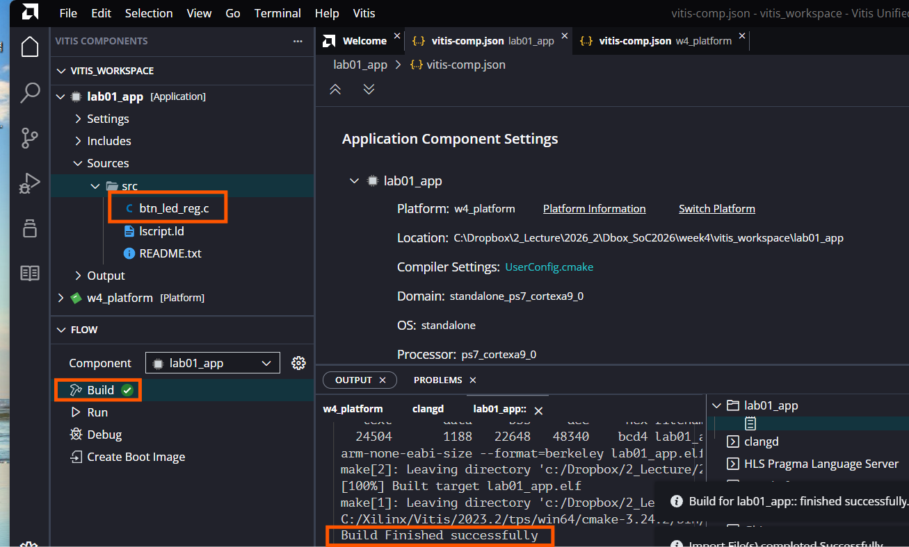

**그림 7-31** `lab01_app`(`src/btn_led_reg.c`) 빌드 완료. 출력 마지막 줄에 `Build Finished successfully`.

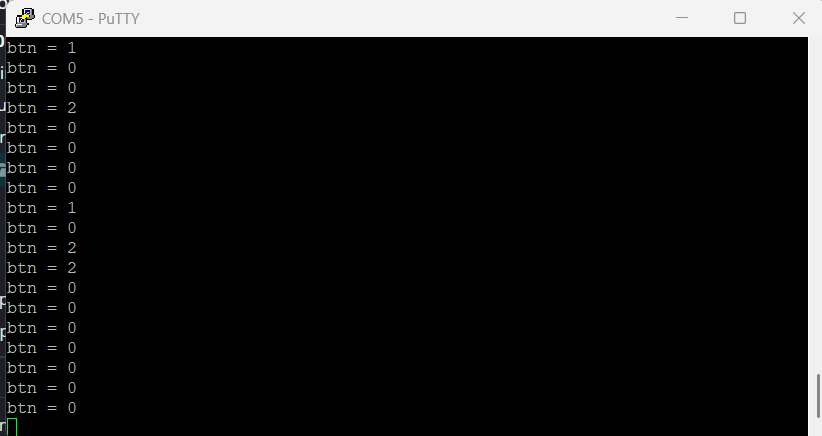

**그림 7-32** `BTN0`을 누르면 `btn = 1`, `BTN1`을 누르면 `btn = 2`가 PuTTY에 찍힌다(둘 다 누르면 `btn = 3`). 이 값이 그대로 `GPIO2_DATA`에 쓰여 LED의 R/G를 켠다.

---

## 7.7 정리

| 키워드 | 내용 |
|---|---|
| AXI4-Lite | PS(마스터)가 PL의 IP(슬레이브)를 주소로 읽고 쓰는 단순한 버스 |
| M AXI GP0 | PS-PL Configuration의 AXI 마스터 스위치. 3주차엔 꺼 두고, 이번 장에서 켠다 |
| AXI Interconnect / Processor System Reset | Connection Automation이 AXI 연결 시 자동으로 추가하는 버스 라우터와 리셋 IP |
| AXI GPIO 듀얼 채널 | IP 하나로 입력(채널1)·출력(채널2)을 동시에 구성 가능 |
| Address Editor | PL의 각 IP가 배정받은 베이스 주소를 확인하는 화면 |
| AXI GPIO 레지스터 맵 | `GPIO_DATA`(+0x0)/`GPIO_TRI`(+0x4), `GPIO2_DATA`(+0x8)/`GPIO2_TRI`(+0xC) |
| TRI 극성 | AXI GPIO는 **1=입력**. 3주차 PS GPIO의 DIRM(1=출력)과 반대이니 주의 |

---

## 과제 — 다음 시간 전까지

1. `GPIO2_DATA`에 쓰는 값을 바꿔 LED가 파란색(비트2)으로도 켜지도록 코드를 확장해 본다.
2. Address Editor에 보이는 `axi_gpio_0`의 주소 범위(Range)가 몇 바이트인지 확인하고, 왜 그 크기인지(레지스터 몇 개가 몇 바이트씩 차지하는지) 생각해 온다.
3. `boards/board_summary.pdf` 13~14페이지에서 shield의 LED 4개·스위치 4개가 어느 핀에 연결되어 있는지 미리 확인해 온다. (다음 시간에 그대로 쓴다)

## 다음 시간 예고 — 제8장

- 이 프로젝트에 **AXI GPIO #2**를 추가해 shield의 LED 4개·스위치 4개를 연결한다.
- IP가 2개가 되면서 Address Editor에 주소가 2줄이 되는 것을 확인한다.
- shield 핀 8개는 손으로 배정하는 대신 **XDC 파일을 Import**하는 방법을 배운다.
- 방금 레지스터로 직접 짠 코드를 **`XGpio` 드라이버**로 다시 써서, 드라이버가 무엇을 대신해 주는지 비교한다.

> **이 장에서 만든 `lab01` 프로젝트를 8장에서 복사해 이어서 쓴다.** 2~3주차와 달리 처음부터 새로 만들지 않는다 — 기존 설계를 확장해 나가는 것이 실제 개발에 더 가까운 방식이다.

---

*SoC 설계 · 4주차 1교시(W4_S1) | Vivado/Vitis 2023.2 · Windows · Cora Z7-07S*
