# 제8장 PS-PL 연결 (2) — AXI GPIO 확장과 드라이버

**SoC 설계** · 4주차 2교시(W4_S2) | Vivado/Vitis 2023.2 · Windows 11 · Digilent Cora Z7-07S

---

7장에서 만든 프로젝트를 **복사**해서 이어서 쓴다 — `lab01`은 그대로 두고, 복사본 `lab02b`에서 작업한다. 이 장에서 하는 일은 두 가지다.

1. **AXI GPIO #2**를 추가해 shield의 LED 4개·스위치 4개를 연결한다 — 이제 PL 안에 슬레이브가 2개가 되어, Address Editor의 주소가 의미 있게 비교된다.
2. 7장에서 레지스터로 직접 짠 코드를 **`XGpio` 드라이버**로 다시 써서, 드라이버가 대신 해 주는 일이 무엇인지 확인한다.

> **이번 장에서 만들 회로**
> ```text
> AXI GPIO #1 (7장)              AXI GPIO #2 (이 장, 신규)
>   ch1(입력,2) = btn               ch1(입력,4) = shield 스위치 4개
>   ch2(출력,3) = led0(RGB)         ch2(출력,4) = shield LED 4개
> ```

이번 장의 흐름은 다음과 같다.

> **프로젝트 복사(lab01→lab02b) → AXI GPIO #2 추가 → Address Editor 비교** → **shield 배선 → XDC Import** → **Bitstream·Export** → **`XGpio` 드라이버로 코드 재작성**

---

## 학습 목표

- 기존 Block Design에 AXI 슬레이브를 하나 더 추가하고, Connection Automation이 이를 같은 Interconnect에 붙이는 과정을 확인한다.
- Address Editor에서 **서로 다른 두 베이스 주소**를 비교하고, 그 의미를 설명한다.
- 여러 핀을 XDC 파일 **Import**로 한 번에 배정하는 방법을 익힌다.
- `XGpio` 드라이버(`Initialize`/`SetDataDirection`/`DiscreteWrite`/`DiscreteRead`)로 GPIO를 제어하는 코드를 작성한다.
- 레지스터 직접 접근 코드와 드라이버 코드를 나란히 비교해, 드라이버가 대신해 주는 일을 설명한다.

---

## 8.1 7장 프로젝트를 복사해서 열기

`lab01` 프로젝트를 연다. 2·3주차와 다르게, 이번 장부터는 **처음부터 새로 만들지 않고** 기존 설계를 이어서 확장하는 방식으로 진행한다 — 다만 `lab01`을 직접 고치는 대신, 아래처럼 **복사본을 만들어 그 위에서 작업**한다.

`File → Save Project As…`를 실행해 다음과 같이 저장한다.

- Project name: `lab02b`
- Project location: `lab01`과 같은 상위 폴더(`.../week4/vivado_prj/`) — 즉 `lab01` 옆에 새 프로젝트가 생긴다.
- `Create project subdirectory`는 체크, `Include run results`는 **체크 해제**(합성·구현 결과까지 복사할 필요는 없다. 어차피 IP를 추가하면 다시 합성한다).

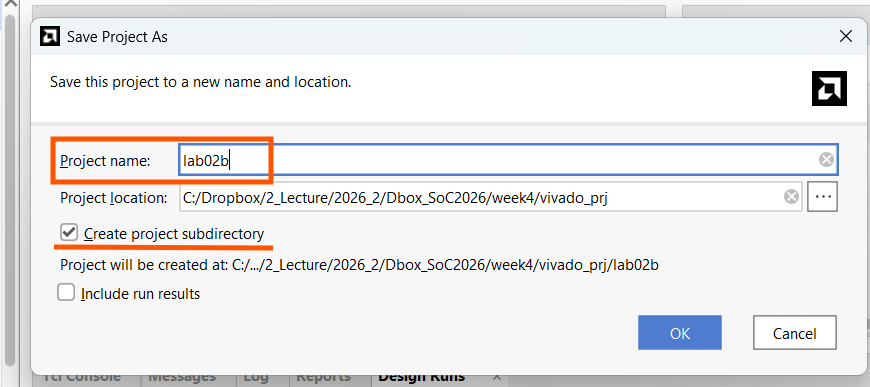

**그림 8-1** `Save Project As` 대화상자. `Project name`을 `lab02b`로 주면 아래 "Project will be created at: `.../vivado_prj/lab02b`"에 최종 경로가 표시된다. `OK`를 누르면 Vivado는 자동으로 새 `lab02b` 프로젝트를 열어 준다.

> **왜 직접 고치지 않고 복사하는가.** `lab01`을 그대로 열어서 AXI GPIO #2를 추가할 수도 있지만, 그러면 7장에서 완성한 `lab01`(그리고 그 위에서 만든 Vitis Platform·Application)이 8장 작업 중 실수로 망가질 수 있다. `Save Project As`로 복사해 두면 `lab01`은 항상 되돌아갈 수 있는 체크포인트로 남고, `lab02b`에서 마음 놓고 확장할 수 있다 — Block Design(`design_1`)은 그대로 복제되므로, "처음부터 새로 만들지 않고 이어서 확장한다"는 이번 장의 목표는 똑같이 달성된다.

이제 `lab02b`의 Block Design(`design_1`)이 편집 상태로 열려 있다. 이어지는 절부터는 이 `lab02b`를 기준으로 진행한다.

---

## 8.2 AXI GPIO #2 추가 — shield 연결

### 8.2.1 IP 추가와 채널 설정

`Add IP`(+) → "AXI GPIO" 검색 → 캔버스에 두 번째 인스턴스(`axi_gpio_1`)를 추가하고 더블클릭해 `Re-customize IP` 창을 연다. 7.3.2절과 같이 `IP Configuration` 탭 안에 `GPIO`(채널1)·`GPIO 2`(채널2) 두 구역이 있다.

| 구역 | 항목 | 설정 |
|---|---|---|
| `GPIO`(채널 1) | `All Inputs` | 체크, `GPIO Width` = `4` (shield 스위치 4개) |
| `GPIO`(채널 1) | `Enable Dual Channel` | 체크 |
| `GPIO 2`(채널 2) | `All Outputs` | 체크, `GPIO Width` = `4` (shield LED 4개) |

7.3.2절과 같은 방식이다 — 이번엔 폭이 2·3이 아니라 4·4다.

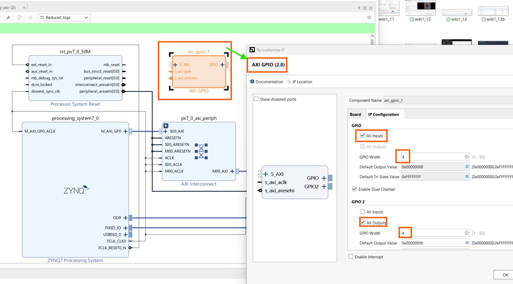

**그림 8-2** `axi_gpio_1`의 `IP Configuration`. `GPIO`(채널1)는 `All Inputs`·Width `4`, `GPIO 2`(채널2)는 `All Outputs`·Width `4`.

### 8.2.2 Run Connection Automation

배너를 클릭해 `Run Connection Automation`을 연다. 7.3.3절과 같이, `axi_gpio_1` 아래 `GPIO`/`GPIO2`는 체크하지 않고 **`S_AXI`만 체크**한다.

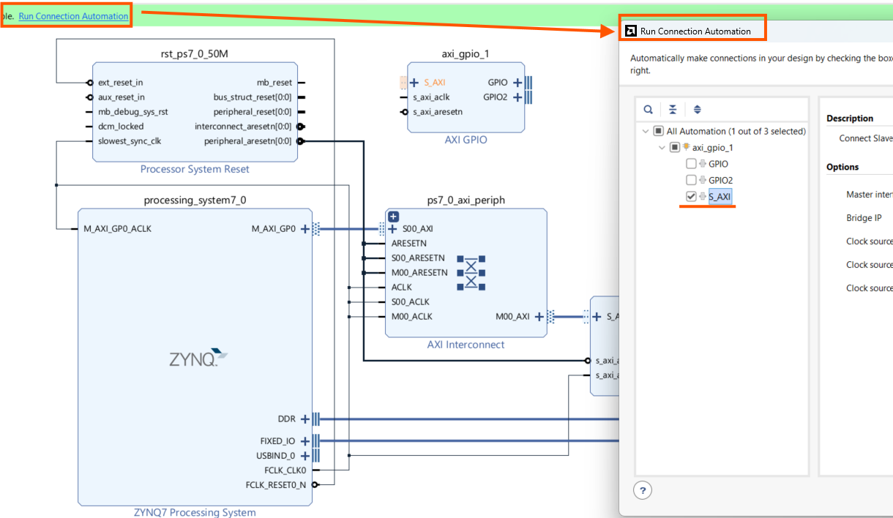

**그림 8-3** `axi_gpio_1`의 `S_AXI`만 체크한다(`GPIO`/`GPIO2`는 8.2.3절에서 직접 Make External 하므로 비워 둔다).

`OK`를 누르면 `axi_gpio_1`이 **이미 있는 `ps7_0_axi_periph`(AXI Interconnect)에 두 번째 슬레이브로** 붙는다 — 새 Interconnect가 또 생기는 게 아니라, 기존 것에 `M01_AXI` 포트가 하나 늘어난다.

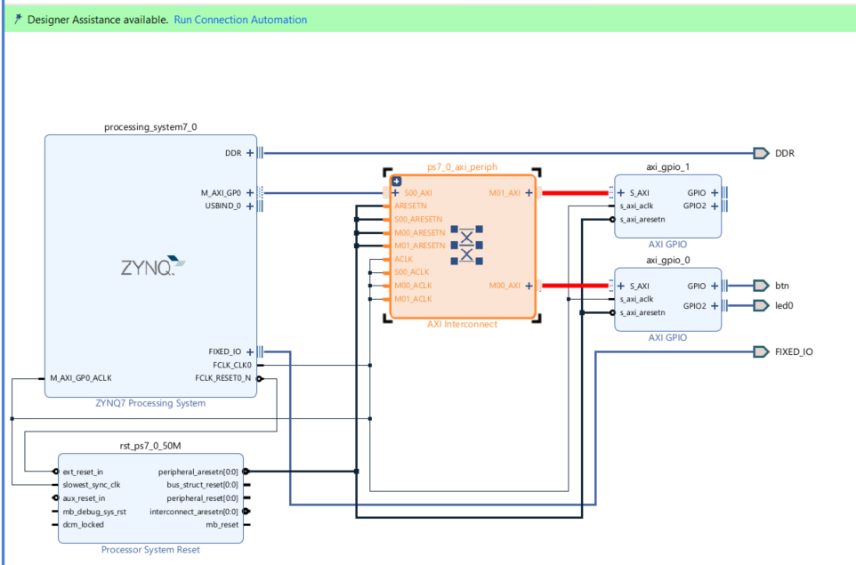

**그림 8-4** `ps7_0_axi_periph`의 `M01_AXI`가 `axi_gpio_1`에, `M00_AXI`가 `axi_gpio_0`(7장)에 각각 연결된 모습. 하나의 Interconnect가 슬레이브 둘을 나눠 맡는다.

### 8.2.3 외부 포트 이름 정하기

`axi_gpio_1`의 블록에서 `GPIO`·`GPIO2` 옆의 **`+`를 눌러 펼친다.** 그러면 그 안의 **멤버 신호**인 `gpio_io_i[3:0]`(채널1, 입력)과 `gpio2_io_o[3:0]`(채널2, 출력)이 나온다. 이번에는 인터페이스가 아니라 **이 멤버 신호를 각각 우클릭 → `Make External`** 하고, 이름을 **`sw4`**, **`led4`** 로 짓는다.

| Make External 할 핀 | 이름 | 합성 후 포트 |
|---|---|---|
| `gpio_io_i[3:0]`(채널1, shield 스위치) | `sw4` | `sw4[3:0]` |
| `gpio2_io_o[3:0]`(채널2, shield LED) | `led4` | `led4[3:0]` |

![Make External 결과 — gpio_io_i가 sw4[3:0]으로, gpio2_io_o가 led4[3:0]으로 외부 포트가 됨](img/w4s2_03.png)

**그림 8-5** `axi_gpio_1`의 `gpio_io_i[3:0]`→`sw4[3:0]`, `gpio2_io_o[3:0]`→`led4[3:0]`. 위쪽 `axi_gpio_0`(7장)은 인터페이스 방식이라 `GPIO`→`btn`, `GPIO2`→`led0`로 연결되어 있다 — 한 설계 안에 두 방식이 같이 있는 셈이다.

> **`GPIO`(인터페이스)를 Make External 하는 것과 `gpio_io_i`(멤버 신호)를 Make External 하는 것의 차이.** 어느 쪽을 내보내느냐에 따라 **최종 top 포트 이름이 달라진다.** 회로는 완전히 같다.
>
> - **`GPIO`(인터페이스)** — `GPIO`는 신호 하나가 아니라 `gpio_io_i`(입력)·`gpio_io_o`(출력)·`gpio_io_t`(tristate enable)를 묶은 인터페이스다. 통째로 내보내면 살아 있는 멤버에 맞춰 **접미사가 자동으로 붙는다**: `btn`→`btn_tri_i[1:0]`, `led0`→`led0_tri_o[2:0]`. 7장에서 이 방식을 썼다.
> - **`gpio_io_i`(멤버 신호)** — 멤버를 직접 꺼내는 것이라 접미사 없이 **입력한 이름 그대로** top 포트가 된다: `sw4`→`sw4[3:0]`, `led4`→`led4[3:0]`.
>
> `All Inputs`/`All Outputs`로 설정했으니 실제로 쓰이는 멤버는 어차피 하나뿐이라 **회로 자체는 똑같다.** 차이는 이름뿐이지만 **XDC가 그 이름과 정확히 일치해야** 하므로 중요하다. 이번 절에서 멤버 신호 방식을 쓰는 이유도 그것이다 — 이름이 `sw4[3:0]`처럼 **입력한 그대로** 나와서 XDC를 쓸 때 헷갈릴 일이 없다. 8.4절에서 Import할 XDC도 이 이름을 전제로 작성되어 있다.

---

## 8.3 Address Editor — 주소가 두 개가 되다

`Address Editor`를 다시 연다.

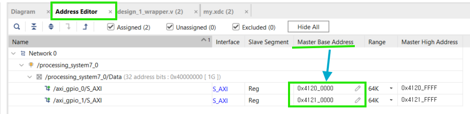

**그림 8-6** 이제 표에 `axi_gpio_0/S_AXI`(`0x4120_0000`, 7장과 동일)와 `axi_gpio_1/S_AXI`(**`0x4121_0000`**) **두 줄**이 있다. 둘 다 Range `64K`로, 서로 겹치지 않는 주소 범위를 갖는다.

7장에서는 IP가 하나뿐이라 주소도 한 줄이었다. 지금은 **두 IP가 겹치지 않는 서로 다른 주소 범위**를 갖는다는 것을 직접 확인한다 — PS가 `0x4120_0000` 쪽 주소로 쓰면 `axi_gpio_0`만 반응하고, `0x4121_0000` 쪽 주소로 쓰면 `axi_gpio_1`만 반응하는 이유가 이것이다. 두 주소를 모두 적어 둔다 — 8.5절 코드에서 쓴다.

---

## 8.4 shield 배선과 XDC Import

Cora Z7-07S에 Arduino/ChipKit shield를 얹고, `boards/board_summary.pdf` 13페이지를 따라 브레드보드에 LED 4개·스위치 4개를 연결한다.

| shield 디지털 핀 | 연결 | FPGA 핀 |
|---|---|---|
| 8, 6, 4, 2 | LED 4개 (`led4[0..3]`) | T14, V17, R17, N18 |
| 13, 12, 11, 10 | 스위치 4개 (`sw4[0..3]`) | U15, K18, J18, G15 |

**GND 연결을 빠뜨리지 않는다.** 실제로 배선한 모습은 8.5.3절의 동작 사진(그림 8-25)에서 확인할 수 있다 — 브레드보드에 LED·스위치를 어떻게 꽂고 shield에 어느 핀으로 연결했는지가 그대로 보이므로, 배선할 때 같이 참고한다.

### 8.4.1 Block Design 저장과 HDL Wrapper 갱신

1. `Validate Design`(F6) → Block Design을 저장(`Ctrl+S`). 탭 제목의 별표(`design_1 *`)가 사라지는지 확인한다 — 래퍼는 **디스크에 저장된 `.bd` 파일**을 읽어 만들어지므로, 저장하지 않으면 화면에 `sw4`/`led4`가 보여도 래퍼에는 들어가지 않는다.
2. `Flow Navigator → RTL ANALYSIS → **Open Elaborated Design**` 을 실행한다.
3. 열어 둔 `design_1_wrapper.v` 탭 위의 노란 막대에서 **`Reload`** 를 누른다.

> **여기가 가장 많이 막히는 지점이다.** `Create HDL Wrapper`는 다시 할 필요가 없고(7장에서 Vivado 자동 관리로 만들었다), Block Design도 저장했는데 **`design_1_wrapper.v`에 `sw4`/`led4`가 계속 안 보이는** 일이 흔하다. 이유는 두 가지가 겹쳐서다.
>
> - `Generate Output Products`만으로는 래퍼가 갱신되지 않는 경우가 있다 → **`Open Elaborated Design`** 을 실행하면 Vivado가 Block Design을 다시 읽어 래퍼를 새로 만든다.
> - 래퍼 파일이 새로 만들어져도, **편집기에 이미 열려 있던 탭은 예전 내용을 그대로 보여 준다** → 파일 위에 `This file has been changed.` **`Reload`** 막대가 뜨는데, 이걸 눌러야 새 내용이 보인다.
>
> 즉 **"저장 → Open Elaborated Design → Reload"** 세 단계를 다 거쳐야 한다.

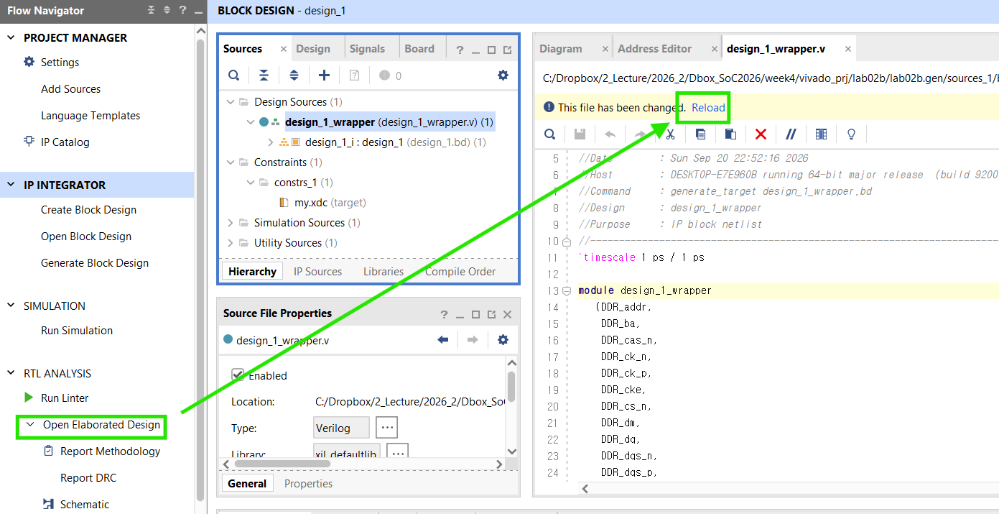

**그림 8-7** `Open Elaborated Design`(왼쪽 아래)을 실행한 뒤, `design_1_wrapper.v` 탭 위에 뜬 `Reload`를 누른다. 경로가 `.../lab02b/lab02b.gen/...`인지도 같이 확인한다(복사 전 `lab01`의 래퍼를 보고 있으면 당연히 안 바뀐다).

`Reload` 후 `module design_1_wrapper`의 포트 목록을 보면 네 개가 모두 들어와 있다.

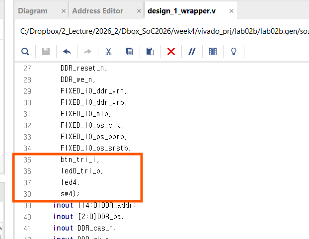

**그림 8-8** `btn_tri_i`, `led0_tri_o`(7장, 인터페이스 방식)와 `led4`, `sw4`(이번 절, 멤버 신호 방식)가 함께 보인다. 8.2.3절에서 설명한 이름 차이가 실제로 이렇게 나타난다.

4. `Run Synthesis` → `Open Synthesized Design`.

### 8.4.2 XDC Import

핀을 하나씩 입력하는 대신, **`Add Sources` → `Add or create constraints` → `Add Files`** 로 미리 준비된 XDC 파일을 프로젝트에 추가한다.

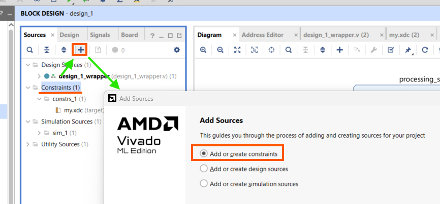

**그림 8-9** `Sources` 패널의 `+` → `Add Sources` → `Add or create constraints`를 고른다. 이 시점의 `Constraints`에는 7장의 `my.xdc` 하나뿐이다.

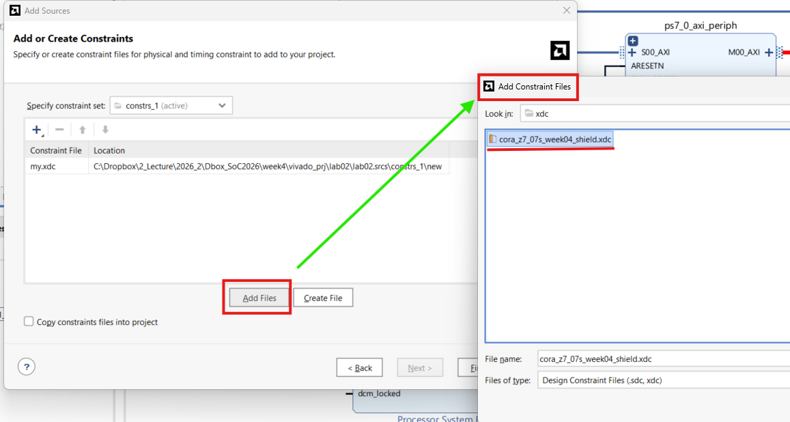

**그림 8-10** `Add Files`를 눌러 [`LAB02/xdc/cora_z7_07s_week04_shield.xdc`](LAB02/xdc/cora_z7_07s_week04_shield.xdc)를 고른다. 이 파일은 `board_summary.pdf`의 핀 배정(shield LED = T14/V17/R17/N18, shield 스위치 = U15/K18/J18/G15)을 `sw4[3:0]`/`led4[3:0]` 이름으로 담고 있다.

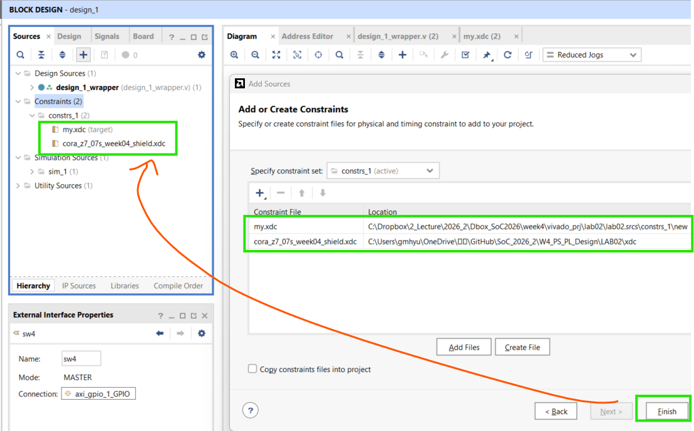

**그림 8-11** `Finish`를 누르면 `constrs_1`에 `my.xdc (target)`와 `cora_z7_07s_week04_shield.xdc` **두 개**가 들어간다. `Copy constraints files into project`를 체크하지 않으면 파일이 프로젝트 안으로 복사되지 않고, 원래 위치(`LAB02/xdc/`)를 그대로 참조한다.

> **핀을 왜 하나씩 안 찾아도 되는가.** 핀 배정 자체는 2·3주차에서 이미 두 번 했다. 이번엔 "핀이 많아지면 파일로 관리한다"는 실무 방식을 배우는 것이 목적이다. **단, XDC의 포트 이름이 실제 Block Design의 포트 이름과 정확히 일치해야** 제대로 적용된다 — 2주차에서 XDC 이름이 안 맞으면 적용이 안 됐던 것과 같은 원리다. I/O Planning에서 확인한 이름이 `sw4[3:0]`/`led4[3:0]`과 다르면, XDC 파일의 포트 이름을 그 이름에 맞게 고친다.

> **이미 `my.xdc`가 있는데, 겹쳐도 되는가.** `lab02b`는 `lab01`을 복사한 것이므로 `constrs_1`에 7장에서 만든 `my.xdc`(`btn_tri_i`/`led0_tri_o` 핀 배정)가 그대로 들어 있다. 새로 Import하는 `cora_z7_07s_week04_shield.xdc`는 **다른 포트**(`sw4`/`led4`)를 배정하므로 겹치지 않는다 — 한 프로젝트(`constrs_1`)에 XDC 파일 여러 개를 두고, Vivado가 이들을 전부 합쳐서 적용하는 것은 정상적인 방식이다(오히려 회로가 커질수록 기능별로 XDC 파일을 나누는 쪽이 실무에 가깝다). **문제가 되는 경우는 같은 포트가 서로 다른 두 XDC 파일에서 다른 핀으로 배정될 때뿐**이다 — 이번엔 두 파일이 다루는 포트가 아예 다르므로 그럴 일이 없다.

![cora_z7_07s_week04_shield.xdc 내용 — sw4[0..3], led4[0..3]](img/w4s2_05d.png)

**그림 8-12** Import한 XDC의 내용. `get_ports`에 적힌 이름(`sw4[0]`…, `led4[0]`…)이 8.2.3절에서 Make External로 정한 이름과 정확히 같다.

`Open Synthesized Design` → `Layout → I/O Planning`의 `I/O Ports` 표에서 핀이 실제로 배정됐는지 확인한다.

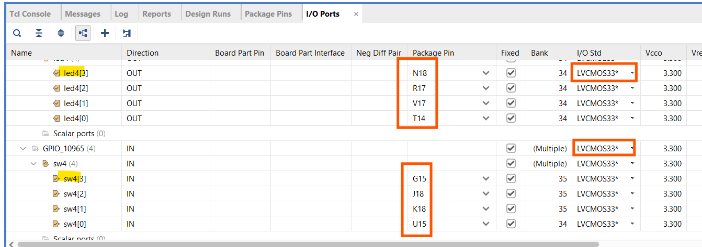

**그림 8-13** XDC Import 후 shield 핀 8개(`led4[3:0]` = N18/R17/V17/T14, `sw4[3:0]` = G15/J18/K18/U15)가 한 번에 배정된 모습. 손으로 입력한 핀은 하나도 없다.

### 8.4.3 Bitstream과 Export

`Generate Bitstream` → 완료되면 `File → Export → Export Hardware…`(`Include bitstream` 선택).

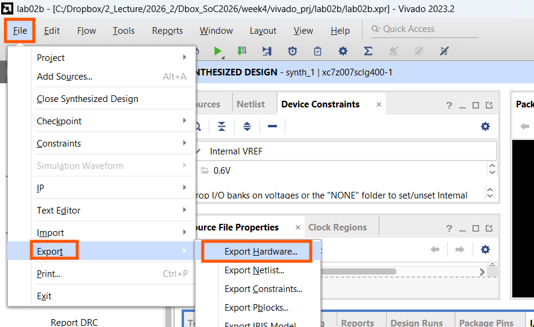

**그림 8-14** `lab02b` 프로젝트에서 `File → Export → Export Hardware…`.

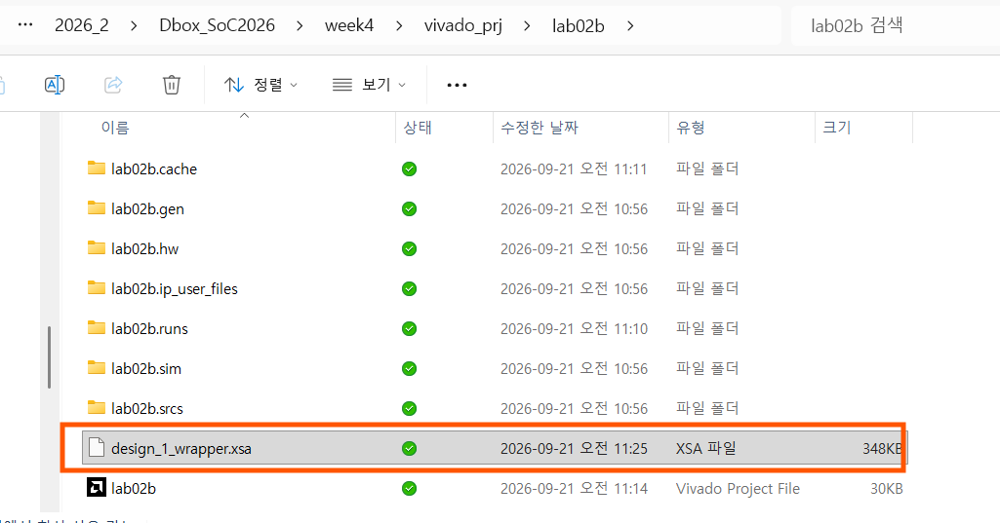

**그림 8-15** Export가 끝나면 `.../vivado_prj/lab02b/` 아래에 `design_1_wrapper.xsa`가 생긴다. **7장의 `lab01`이 만든 `.xsa`와는 다른 파일**이며, 8.5절에서 이 파일로 새 Platform을 만든다.

---

## 8.5 Vitis — `XGpio` 드라이버로 다시 쓰기

### 8.5.1 새 Platform·Application 만들기

`lab01`을 `lab02b`로 복사했던 것과 같은 이유로, Vitis 쪽도 7장의 `w4_platform`/`lab01_app`을 그대로 고치지 않는다 — **`lab02b`의 새 `.xsa`를 가리키는 새 Platform Component**를 만든다.

7장에서 쓰던 `vitis_workspace`를 그대로 열면 `lab01_app`과 `w4_platform`이 남아 있다. 여기에 **Platform을 하나 더** 만든다 — `Embedded Development → Create Platform Component`.

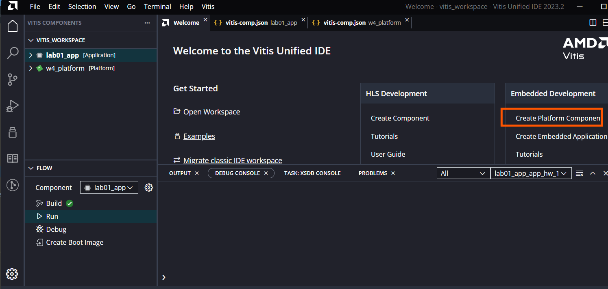

**그림 8-16** 기존 workspace에 `lab01_app`·`w4_platform`이 그대로 있는 상태에서 `Create Platform Component`를 누른다.

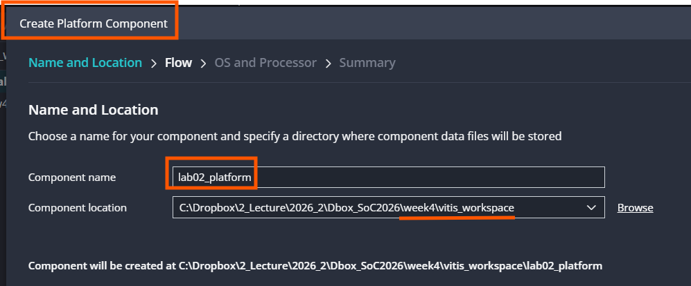

**그림 8-17** Component name을 `lab02_platform`으로 준다(위치는 같은 `vitis_workspace`).

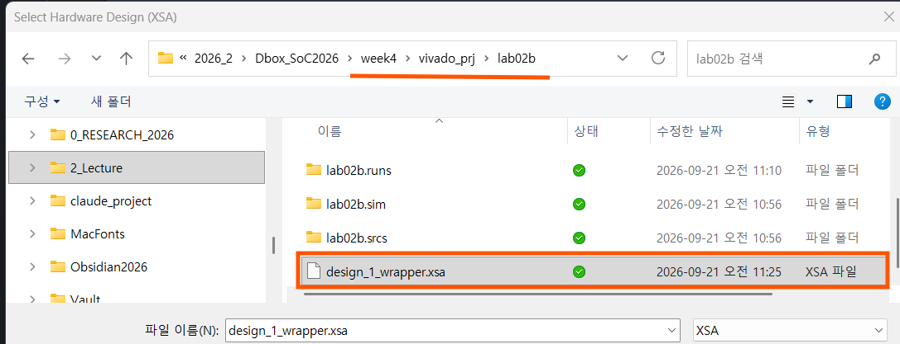

**그림 8-18** `Flow` 단계에서 `Browse`로 **`vivado_prj/lab02b/`의 `design_1_wrapper.xsa`** 를 고른다. 7장의 `lab01` 폴더가 아니라 **`lab02b`** 폴더라는 점이 중요하다 — AXI GPIO가 두 개 들어 있는 쪽이다.

`OS and Processor`는 7.6.1절과 같이 `standalone` / `ps7_cortexa9_0`으로 두고 완료한 뒤, `FLOW → Build`로 Platform을 빌드한다.

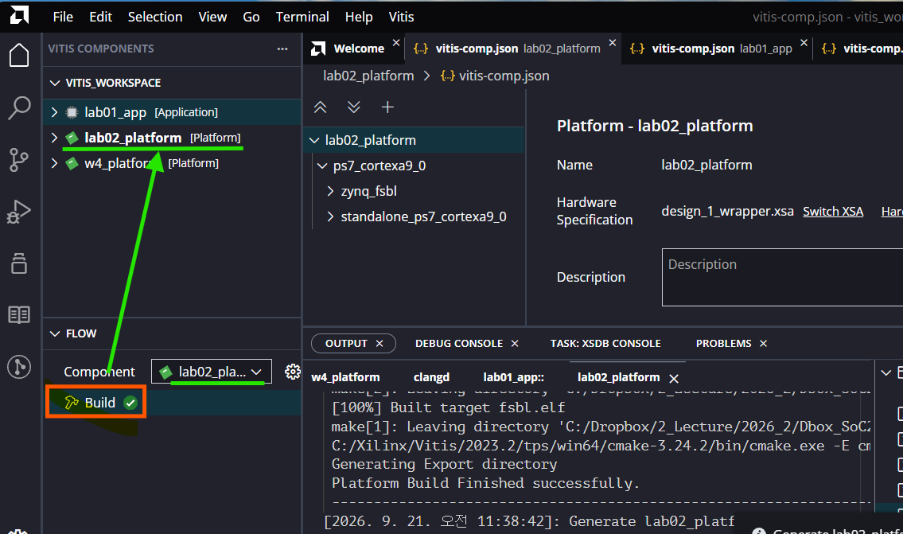

**그림 8-19** `lab02_platform` 빌드 완료. `Hardware Specification`이 `design_1_wrapper.xsa`로 잡혀 있고, 도메인(`standalone_ps7_cortexa9_0`)과 `zynq_fsbl`이 생성된다. 이 `.xsa`에 AXI GPIO가 두 개 들어 있으므로 BSP에 `xgpio` 드라이버가 포함된다.

이어서 새 `Empty Application (C)`을 만든다.

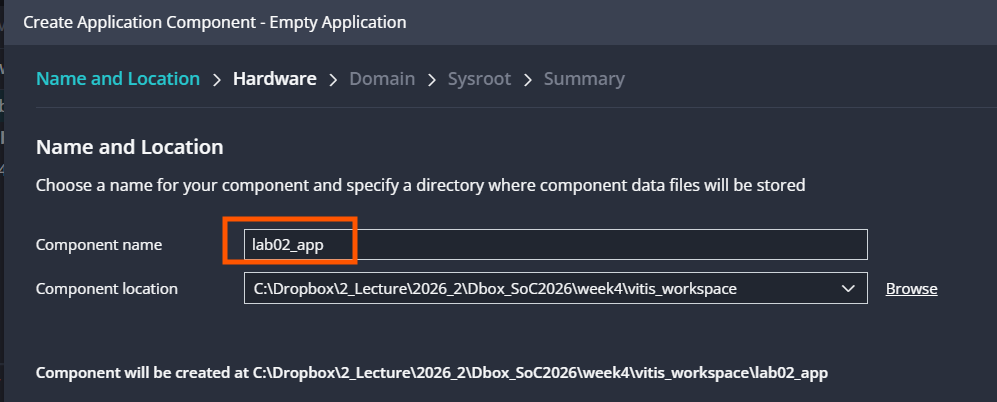

**그림 8-20** Component name을 `lab02_app`으로 준다.

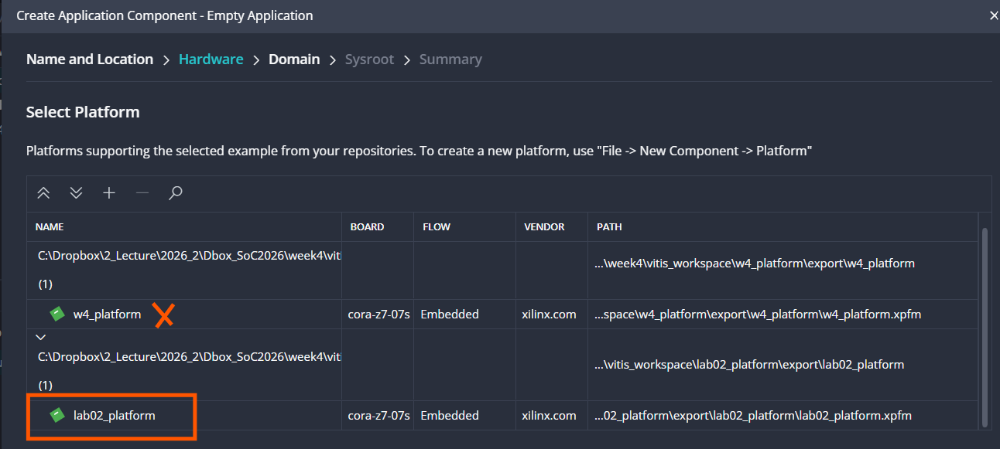

**그림 8-21** `Hardware` 단계에서 **`lab02_platform`** 을 고른다. 목록에 7장의 `w4_platform`도 같이 보이는데, 그걸 고르면 AXI GPIO가 하나뿐인 예전 하드웨어로 빌드되므로 주의한다.

`Domain`은 `standalone_ps7_cortexa9_0`으로 두고 완료한다. 이제 `src` 우클릭 → `Import → Files…` → [`LAB02/src/btn_led_sw_driver.c`](LAB02/src/btn_led_sw_driver.c)를 가져온다.

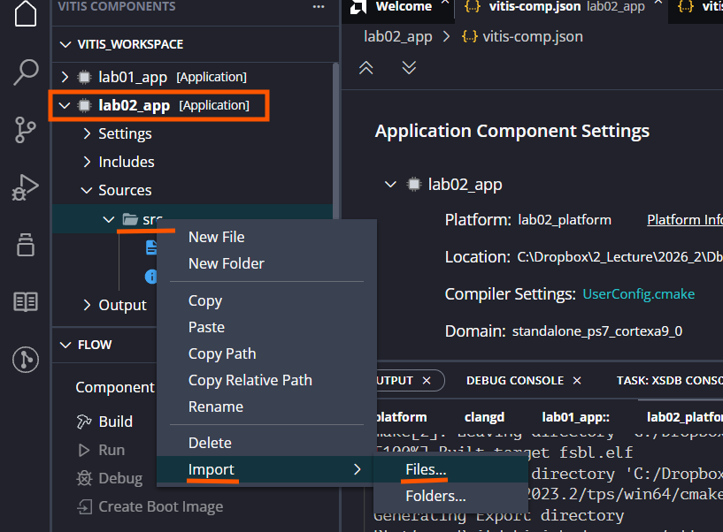

**그림 8-22** `lab02_app → Sources → src` 우클릭 → `Import → Files…`.

> **7장의 `w4_platform`/`lab01_app`은 그대로 남는다.** 새 Platform·Application을 만들었으니, `lab01`(레지스터 버전)과 `lab02b`(드라이버 버전, shield 포함) 둘 다 언제든 다시 빌드·실행해 비교해 볼 수 있다.

### 8.5.2 레지스터 코드와 드라이버 코드, 나란히 비교

7장의 `btn_led_reg.c`와 이 장의 `btn_led_sw_driver.c`는 **AXI GPIO #1에 대해서는 똑같은 동작**을 한다. 코드만 비교해 본다.

| 하는 일 | 7장: 레지스터 직접 접근 | 이 장: `XGpio` 드라이버 |
|---|---|---|
| 준비 | 베이스 주소 + 오프셋을 손으로 계산 | `XGpio_Initialize(&gpio, 베이스주소)` |
| 방향 설정 | `Xil_Out32(GPIO_TRI, 0x3)` | `XGpio_SetDataDirection(&gpio, 1, 0x3)` |
| 읽기 | `Xil_In32(GPIO_DATA) & 0x3` | `XGpio_DiscreteRead(&gpio, 1)` |
| 쓰기 | `Xil_Out32(GPIO2_DATA, btn)` | `XGpio_DiscreteWrite(&gpio, 2, btn)` |

드라이버 쪽은 **오프셋(`+0x0`, `+0x4`, `+0x8`, `+0xC`)을 어디에도 직접 쓰지 않는다** — 채널 번호(`1`, `2`)만 넘기면 드라이버 내부에서 그 오프셋 계산을 대신한다. 7장에서 그 계산을 직접 해 봤기 때문에, 드라이버가 정확히 무엇을 생략해 주는지 알고 쓰는 것이다.

```c
#include "xparameters.h"
#include "xgpio.h"
#include "xil_printf.h"
#include "sleep.h"

#define GPIO1_BASEADDR   XPAR_AXI_GPIO_0_BASEADDR   /* board:  btn / led0 (0x4120_0000) */
#define GPIO2_BASEADDR   XPAR_AXI_GPIO_1_BASEADDR   /* shield: sw4 / led4 (0x4121_0000) */

#define CH_IN    1
#define CH_OUT   2

int main(void)
{
    XGpio gpio1, gpio2;

    XGpio_Initialize(&gpio1, GPIO1_BASEADDR);
    XGpio_Initialize(&gpio2, GPIO2_BASEADDR);

    XGpio_SetDataDirection(&gpio1, CH_IN,  0x3);   /* btn:        입력 */
    XGpio_SetDataDirection(&gpio1, CH_OUT, 0x0);   /* led0:       출력 */
    XGpio_SetDataDirection(&gpio2, CH_IN,  0xF);   /* shield sw:  입력 */
    XGpio_SetDataDirection(&gpio2, CH_OUT, 0x0);   /* shield led: 출력 */

    print("AXI GPIO driver demo start\n\r");

    while (1) {
        u32 btn = XGpio_DiscreteRead(&gpio1, CH_IN) & 0x3;
        u32 sw  = XGpio_DiscreteRead(&gpio2, CH_IN) & 0xF;

        XGpio_DiscreteWrite(&gpio1, CH_OUT, btn);   /* board LED  <- board BTN  */
        XGpio_DiscreteWrite(&gpio2, CH_OUT, sw);    /* shield LED <- shield SW  */

        xil_printf("btn=%d sw=%d\n\r", btn, sw);
        usleep(200000);
    }

    return 0;
}
```

> **AXI GPIO 두 개를 다루는 방식도 비교해 본다.** 레지스터 방식이었다면 `axi_gpio_1`용으로 `GPIO_DATA`/`GPIO_TRI` 주소 세트를 또 하나 정의해야 했을 것이다. 드라이버 방식에서는 `XGpio` 구조체 변수(`gpio1`, `gpio2`)를 하나 더 두고 같은 네 함수를 다시 부르기만 하면 된다 — IP가 늘어날수록 이 차이가 더 커진다.

### 8.5.3 빌드와 실행

`FLOW`의 `Component`가 **`lab02_app`** 인지 확인하고 `Build`. 이어서 Cora Z7-07S를 연결하고 `Run`. PuTTY(COM 포트, Baud 115200)를 열어 둔 채로 확인한다.

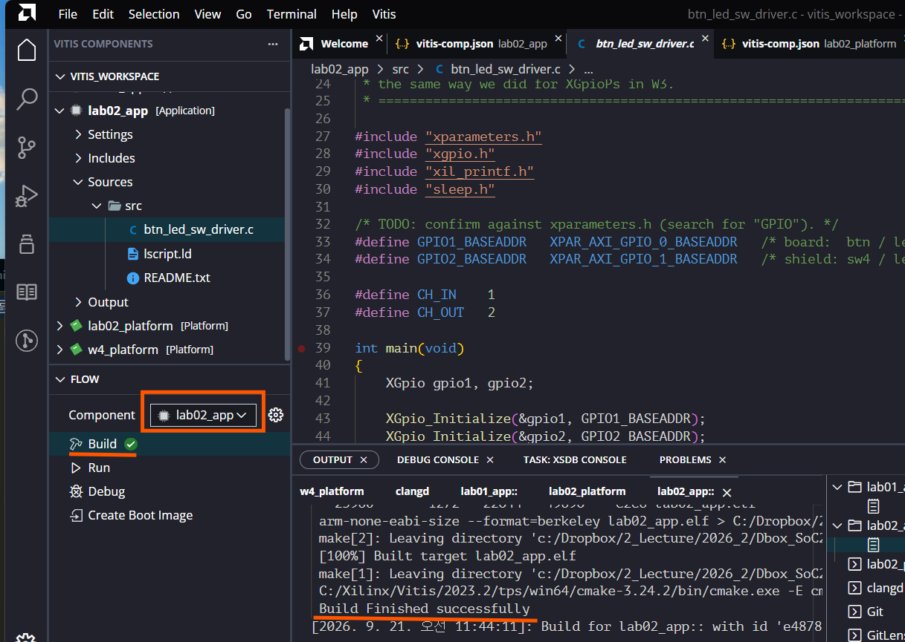

**그림 8-23** `btn_led_sw_driver.c`가 `src`에 들어온 뒤 `lab02_app` 빌드 완료. 출력 마지막에 `Build Finished successfully`.

> **`XPAR_AXI_GPIO_0_BASEADDR` / `XPAR_AXI_GPIO_1_BASEADDR`가 그대로 통한다.** 3주차 `XGpioPs`에서는 SDT 방식 때문에 `*_DEVICE_ID` 매크로가 없어 코드를 고쳐야 했는데, AXI GPIO는 위 두 매크로와 `XGpio_Initialize(&gpio, 베이스주소)` 형태가 그대로 빌드된다.

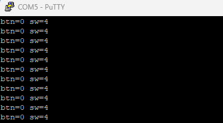

**그림 8-24** PuTTY에 `btn=`, `sw=` 값이 계속 찍힌다. 보드의 `BTN0`/`BTN1`을 누르면 `btn` 값이, shield의 스위치를 올리면 `sw` 값이 바뀌고, 그 값이 그대로 board RGB LED와 shield LED에 나타난다.

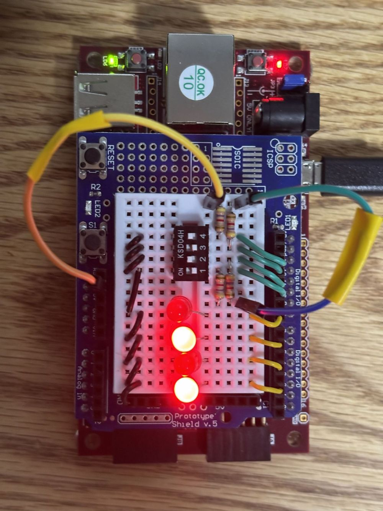

**그림 8-25** 실제 동작 모습. shield 위 브레드보드에 LED 4개·스위치 4개를 어떻게 배선했는지가 함께 보이므로, **8.4절에서 배선할 때 이 사진을 참고**한다.

---

## 8.6 더 해 보기 — 레지스터 방식으로 shield 제어

여유가 있다면 `axi_gpio_1`(shield)도 8.5.2절의 표를 거꾸로 적용해 **레지스터 직접 접근**으로 짜 본다. Address Editor에서 확인한 `axi_gpio_1`의 베이스 주소에 같은 오프셋(`+0x0`, `+0x4`, `+0x8`, `+0xC`)을 적용하면 된다. 두 방식으로 같은 동작을 다 만들어 보면, "드라이버는 결국 이 레지스터 접근을 함수로 포장한 것"이라는 게 확실해진다.

---

## 8.7 정리

| 키워드 | 내용 |
|---|---|
| AXI 슬레이브 여러 개 | 같은 Interconnect에 슬레이브를 추가로 연결할 수 있다. 각자 다른 베이스 주소를 받는다 |
| Address Editor(2개) | IP가 여러 개면 주소도 여러 줄 — 주소로 어느 IP인지 구분된다 |
| XDC Import | `Add Sources → Add or create constraints`로 기존 제약 파일을 프로젝트에 추가. 핀이 많을 때 유용 |
| 포트 이름 일치 | Import한 XDC의 포트 이름이 Block Design의 실제 포트 이름과 정확히 같아야 적용된다 |
| `XGpio` 드라이버 | `Initialize` → `SetDataDirection` → `DiscreteWrite`/`DiscreteRead`. 오프셋 계산을 대신해 준다 |
| 레지스터 vs 드라이버 | 같은 동작, 같은 레지스터를 만지지만 드라이버는 채널 번호만 넘기면 되도록 감싸 준다 |

---

## 과제 — 다음 주 전까지

4주차 전체(7장·8장)에서 배운 것을 **처음부터 끝까지 혼자 한 번 다시** 해 보는 과제다. 지금까지는 본문의 그림을 따라갔지만, 이번에는 요구사항만 주어진다.

### Vivado — 프로젝트 이름 `homework`

1. **새 프로젝트**를 `homework`라는 이름으로 만든다(8장처럼 복사하지 않는다). 보드는 Cora Z7-07S, ZYNQ7 PS를 올리고 `M AXI GP0`을 켠다 — 7.2절과 같다.
2. **AXI GPIO를 1개만** 추가하고 듀얼 채널로 구성한다.

   | 채널 | 방향 | 폭 | 연결 |
   |---|---|---|---|
   | 채널 1 (`GPIO`) | **출력** (`All Outputs`) | 4 | `led4` — shield LED 4개 |
   | 채널 2 (`GPIO 2`) | **입력** (`All Inputs`) | 4 | `sw4` — shield 스위치 4개 |

   > **8장과 채널이 뒤바뀌어 있다.** 8.2.1절의 `axi_gpio_1`은 채널1이 입력(`sw4`)·채널2가 출력(`led4`)이었다. 이번 과제는 그 반대다 — 채널 번호는 입력/출력이 정해져 있는 것이 아니라 **내가 설정하는 것**임을 확인하는 것이 이 과제의 첫 번째 포인트다. 이 뒤바뀜이 코드(방향 설정·레지스터 오프셋)까지 그대로 따라온다.

3. **Make External**은 8.2.3절의 **멤버 신호 방식**을 쓰고, 이름을 `led4`(채널1 출력)·`sw4`(채널2 입력)로 준다. 접미사 없이 `led4[3:0]`·`sw4[3:0]`이 top 포트가 된다.
4. 핀 배정은 손으로 하지 말고 [`LAB02/xdc/cora_z7_07s_week04_shield.xdc`](LAB02/xdc/cora_z7_07s_week04_shield.xdc)를 **Import** 한다(8.4.2절). 채널이 바뀌어도 **포트 이름은 `led4`/`sw4` 그대로**이므로 이 파일을 고칠 필요가 없다 — 왜 그런지 설명할 수 있어야 한다.
5. `Generate Bitstream` → `File → Export → Export Hardware…` → **`Include bitstream`** 으로 `.xsa`를 내보낸다(7.5절 8~11).

### Vitis

6. `homework`의 `.xsa`를 가리키는 Platform Component **`homework_platform`** 을 만들고 `FLOW → Build`로 빌드한다(8.5.1절).
7. Empty Application (C) **`homework_app`** 을 만든다. Platform은 반드시 `homework_platform`을 고른다.
8. `homework_app → Sources → src` 우클릭 → **`New File`** 로 **`main.c`를 새로 만든다.** 이번에는 저장소의 파일을 `Import` 하는 것이 아니라 **직접 작성한다.**
9. `main.c`가 할 일:
   - `sw4`(채널 2)를 읽어 그 값을 그대로 `led4`(채널 1)로 출력하는 것을 **무한 반복**한다.
   - **단, `sw4`가 `0x0F`(스위치 4개 모두 ON)이면 `exit`로 프로그램을 종료한다.**
10. 빌드 → 보드에서 `Run` → 스위치를 하나씩 올려 LED가 따라오는지 확인하고, 4개를 모두 올려 프로그램이 실제로 끝나는지 확인한다.

### 확인해 볼 것

- 방향 설정이 8장과 반대가 된다. `XGpio_SetDataDirection`(또는 `GPIO_TRI`/`GPIO2_TRI`)에 **어느 채널에 어떤 값**을 써야 하는지 직접 따져 본다.
- 레지스터 방식으로 짠다면 **`led4`가 `+0x0`, `sw4`가 `+0x8`** 이다 — 8.5.2절 표의 채널-오프셋 대응이 그대로 뒤집힌다. `XGpio` 드라이버로 짜도 되고 `Xil_Out32`/`Xil_In32`로 짜도 된다. 여유가 있으면 두 가지로 다 짜서 비교해 본다.
- `exit()`를 쓰려면 `#include <stdlib.h>`가 필요하다. 종료 직전에 `xil_printf`로 한 줄 남기면 PuTTY에서 종료 시점을 볼 수 있다. **프로그램이 끝난 뒤 LED는 어떤 상태로 남는가?** 관찰하고 이유를 생각해 본다.
- 스위치 4개를 **모두 올린 채로** `Run`을 누르면 어떻게 되는가?

## 다음 주 예고 — 인터럽트

- 지금까지는 PS가 계속 값을 **폴링**(반복해서 읽기)했다 — 스위치를 안 눌러도 쉬지 않고 읽는다.
- 5주차에는 **인터럽트**를 다룬다: PL의 이벤트(버튼이 눌린 순간 등)가 PS에 신호를 보내고, PS는 그 신호가 올 때까지 다른 일을 할 수 있다.
- AXI GPIO도 인터럽트 출력을 가지고 있다 — 이번 장에서 만든 회로를 그대로 확장해서 쓴다.

---

*SoC 설계 · 4주차 2교시(W4_S2) | Vivado/Vitis 2023.2 · Windows · Cora Z7-07S*
