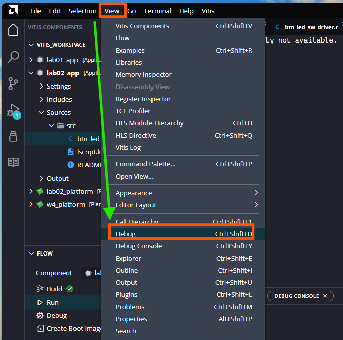
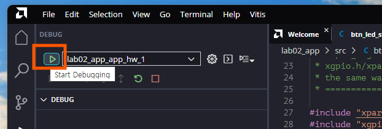
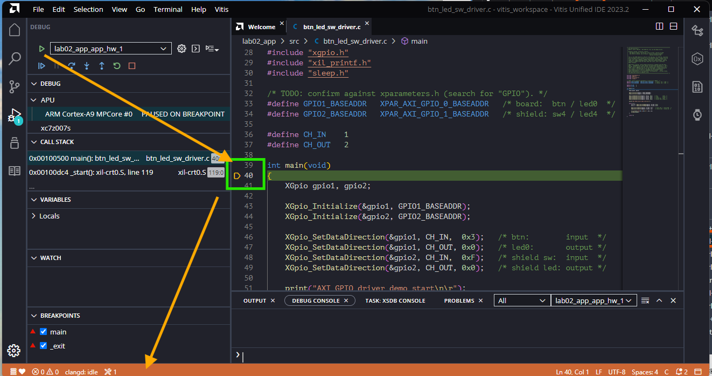
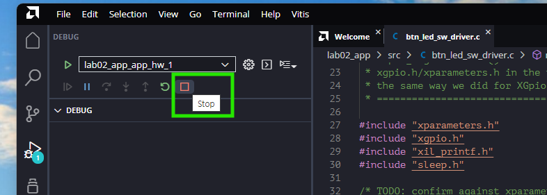
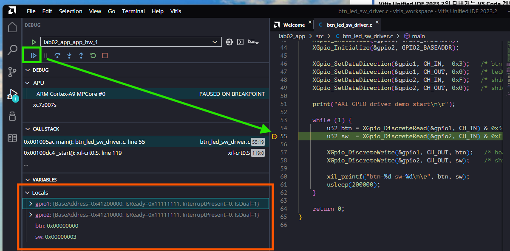
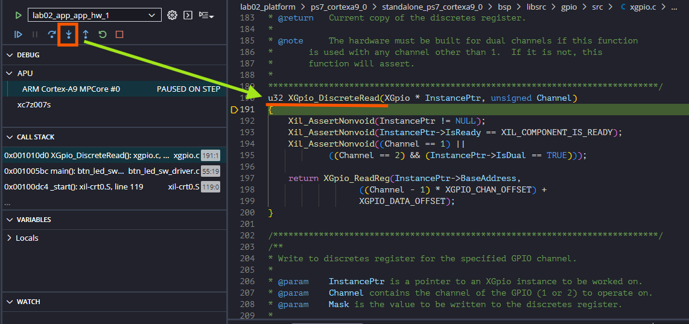
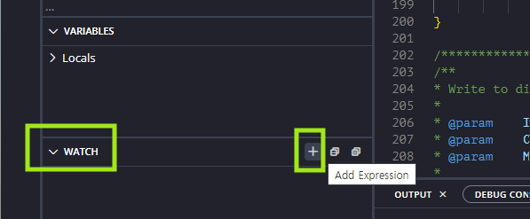
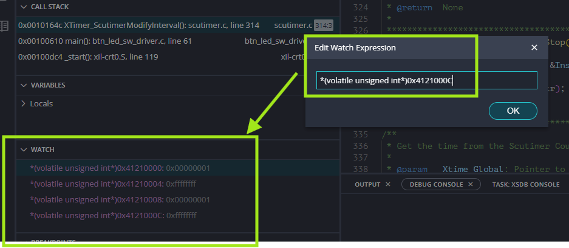
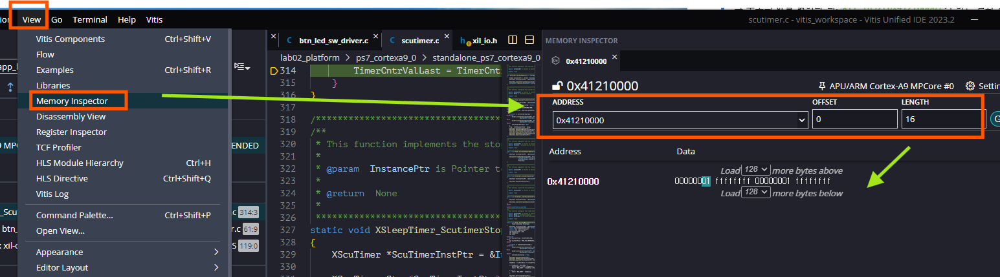

# 제9장 디버깅 — Vitis 디버거로 레지스터 들여다보기

**SoC 설계** · 4주차 3교시(W4_S3) | Vivado/Vitis 2023.2 · Windows 11 · Digilent Cora Z7-07S

---

3주차부터 프로그램이 뭘 하는지 알아내는 방법은 하나였다 — **`xil_printf`로 찍어 보는 것**이다. 값이 이상하면 출력을 한 줄 더 넣고, 또 이상하면 또 넣는다. 대부분은 이렇게 해결되지만, printf로는 **원리적으로 볼 수 없는 것**들이 있다.

- 드라이버 함수 안에서 무슨 일이 벌어지는지 — 그 안에는 내가 printf를 넣을 수 없다.
- 지금 이 순간 하드웨어 레지스터에 **실제로** 들어 있는 값.
- 프로그램이 멈춰 선 그 순간의 전체 상태.

이번 장에서는 이 셋을 다 본다. 특히 8장에서 "드라이버가 오프셋 계산을 대신해 준다"고 말로만 설명한 부분을 **코드로 직접 확인한다.**

> **이번 장은 Vivado 작업도, 새 Application도 없다.** 8장에서 만든 `lab02b` 하드웨어와 `lab02_platform`·`lab02_app`을 **그대로 쓴다.** 8장에서 작성한 `btn_led_sw_driver.c`를 이번에는 `Run`이 아니라 `Debug`로 실행하는 것이 전부다.

이번 장의 흐름은 다음과 같다.

> **`Debug`로 실행 → breakpoint와 `Variables` → `Step Into`로 드라이버 속 보기** → **`Watch`·`Memory Inspector`로 AXI GPIO 레지스터 관찰**

---

## 학습 목표

- `printf` 디버깅으로 볼 수 없는 것이 무엇인지 구체적으로 설명한다.
- `Run`과 `Debug` 실행의 차이를 설명하고, Debug로 실행해 `main`에서 멈춘 상태를 확인한다.
- `Call Stack`과 `Variables`에서 멈춘 순간의 호출 경로와 변수 값을 읽는다.
- `Step Into`로 `XGpio_` 드라이버 안에 들어가, 결국 `베이스 + (채널-1)*오프셋` 계산에 도달하는 것을 확인한다.
- `Watch`에 포인터 캐스팅을 써서, 또는 `Memory Inspector`로 AXI GPIO 레지스터를 직접 관찰한다.
- 채널을 `All Inputs`/`All Outputs`로 고정하면 `TRI` 레지스터가 무력해진다는 것을 **관찰된 값으로** 설명한다.
- Vivado에서 정한 것과 소프트웨어가 바꿀 수 있는 것의 경계를 구분한다.

---

## 9.1 `Run`과 `Debug`는 무엇이 다른가

8장까지는 `FLOW → Run`으로 실행했다. 이번에는 **`Debug`** 로 실행한다.

둘 다 비트스트림을 보드에 넣고 ELF를 올리는 것까지는 같다. 다른 점은 그다음이다.

| | `Run` | `Debug` |
|---|---|---|
| 프로그램 시작 | 바로 끝까지 달린다 | **`main` 진입에서 멈춘 상태**로 시작한다 |
| CPU를 세울 수 있나 | 못 한다 | breakpoint·`Pause`로 언제든 세운다 |
| 변수·메모리 보기 | 못 한다 (printf뿐) | 멈춘 순간의 값을 전부 볼 수 있다 |
| JTAG 연결 | 프로그래밍 후 끊어도 된다 | **디버거가 계속 붙어 있다** |

핵심은 **"멈출 수 있다"** 이다.

### 9.1.1 DEBUG 뷰 열기

먼저 디버거 화면을 연다. **`View → Debug`**(`Ctrl+Shift+D`)를 고른다.



**그림 9-1** `View` 메뉴의 `Debug`. 왼쪽 `VITIS COMPONENTS`에 `lab02_app`과 `lab02_platform`이 보이고, 그 아래 `FLOW` 패널에 `Build`/`Run`/`Debug`가 있다. `FLOW`의 `Debug`를 눌러도 되고, 이 메뉴로 디버그 전용 화면을 먼저 열어도 된다.

### 9.1.2 디버깅 시작

DEBUG 패널 위쪽에 실행 구성 이름(`lab02_app_app_hw_1`)이 보인다. 왼쪽의 **초록 삼각형(`Start Debugging`)** 을 누른다.



**그림 9-2** `Start Debugging`. 이 버튼 하나가 비트스트림 다운로드 → ELF 로드 → `main`까지 실행 → 정지를 한 번에 해 준다.

### 9.1.3 `main`에서 멈춘 상태

잠시 기다리면 프로그램이 `main`의 첫 줄에서 멈춘다.



**그림 9-3** 디버깅이 시작된 직후의 전체 화면. 네 군데를 보자.

- **`DEBUG` → `APU`**: `ARM Cortex-A9 MPCore #0`가 **`PAUSED ON BREAKPOINT`** 상태다. 칩 이름(`xc7z007s`)도 함께 보인다.
- **`CALL STACK`**: `main(): btn_led_sw_driver.c` 아래에 **`_start(): xil-crt0.S, line 119`** 가 있다. `main`은 최상위가 아니라 **`_start`가 부른 함수**다 — C 프로그램이 시작되기 전에 스택·`.bss` 초기화 같은 일을 하는 시동 코드가 먼저 돌고, 그 끝에서 `main`을 부른다. 평소에는 보이지 않던 층이 여기서 드러난다.
- **`BREAKPOINTS`**: `main`과 **`_exit`** 두 개가 **자동으로** 걸려 있다. 우리가 찍은 적이 없는데도 `main`에서 멈춘 이유가 이것이다. `_exit`에도 걸려 있어서 프로그램이 끝나는 순간에도 멈춘다.
- **소스 창**: 멈춘 줄이 강조되어 있고 왼쪽에 실행 위치 표시(`▷`)가 있다.

### 9.1.4 실행 제어 버튼

DEBUG 패널의 작은 툴바가 CPU를 조종하는 도구 전부다.



**그림 9-4** 왼쪽부터 `Continue`(계속 실행) · `Pause`(지금 멈춤) · `Step Over`(한 줄 실행, 함수는 통째로) · `Step Into`(함수 안으로 들어감) · `Step Out`(현재 함수를 빠져나감) · `Restart` · **`Stop`**(디버깅 종료)이다. 버튼에 마우스를 올리면 이름과 단축키가 뜬다.

> **`Step Over`와 `Step Into`의 차이**가 이번 장에서 중요하다. `XGpio_DiscreteRead(...)` 줄에서 `Step Over`를 누르면 그 함수를 **실행만 하고** 다음 줄로 가고, `Step Into`를 누르면 **그 함수 안으로 들어간다.** 9.2절에서 후자를 쓴다.

---

## 9.2 breakpoint와 `Step Into` — 드라이버 안으로 들어가 보기

### 9.2.1 breakpoint와 `Variables`

`btn_led_sw_driver.c`에서 `while` 루프 안의 이 줄 **왼쪽 여백을 클릭**해 breakpoint를 찍는다(빨간 점이 생긴다).

```c
u32 sw = XGpio_DiscreteRead(&gpio2, CH_IN) & 0xF;
```

`Continue`를 누르면 그 줄에서 멈춘다.



**그림 9-5** `VARIABLES → Locals`에 이 함수의 지역변수가 전부 나온다. `btn: 0x00000000`, `sw: 0x00000003`(스위치 2개가 올라가 있는 상태)처럼 값이 보이고, shield 스위치를 바꾸고 `Continue`를 반복하면 `sw`가 따라 바뀐다.

여기서 **`gpio1`·`gpio2` 구조체의 내용**이 특히 볼 만하다.

```text
gpio1: {BaseAddress=0x41200000, IsReady=0x11111111, InterruptPresent=0, IsDual=1}
gpio2: {BaseAddress=0x41210000, IsReady=0x11111111, InterruptPresent=0, IsDual=1}
```

8장에서 `XGpio_Initialize(&gpio1, GPIO1_BASEADDR)`라고 쓴 한 줄이 실제로 무엇을 채웠는지가 그대로 보인다.

- **`BaseAddress`** 가 각각 `0x41200000`·`0x41210000`이다 — 8.3절 Address Editor에서 본 두 주소다. 드라이버는 이 값을 구조체에 보관해 두었다가 읽고 쓸 때마다 꺼내 쓴다.
- **`IsDual=1`** — 듀얼 채널로 설정했다는 표시. 채널 2를 쓰려면 이 값이 1이어야 한다(9.2.2절의 `assert`가 이걸 검사한다).
- **`InterruptPresent=0`** — 이 IP에 인터럽트 출력이 없다는 뜻이다. **5주차에 `Enable Interrupt`를 켜면 이 값이 `1`이 된다.** 미리 봐 두면 좋다.

### 9.2.2 `Step Into`로 드라이버 속을 본다

이제 이번 절의 본론이다. `XGpio_DiscreteRead(...)` 줄에서 멈춘 상태로 **`Step Into`** 를 누른다.



**그림 9-6** 소스 창이 우리 파일이 아니라 **드라이버 소스로 바뀐다.** 위쪽 경로 표시를 보면 어디에 있는 파일인지 알 수 있다 — `lab02_platform → ps7_cortexa9_0 → standalone_ps7_cortexa9_0 → bsp → libsrc → gpio → src → xgpio.c`. 8장에서 만든 **플랫폼 안에 드라이버 소스가 들어 있다.** `CALL STACK`도 한 층 깊어져 `XGpio_DiscreteRead(): xgpio.c` 아래에 `main(): btn_led_sw_driver.c`가 쌓였다.

화면에 보이는 함수 전체가 이것이다.

```c
u32 XGpio_DiscreteRead(XGpio * InstancePtr, unsigned Channel)
{
    Xil_AssertNonvoid(InstancePtr != NULL);
    Xil_AssertNonvoid(InstancePtr->IsReady == XIL_COMPONENT_IS_READY);
    Xil_AssertNonvoid((Channel == 1) ||
            ((Channel == 2) && (InstancePtr->IsDual == TRUE)));

    return XGpio_ReadReg(InstancePtr->BaseAddress,
            ((Channel - 1) * XGPIO_CHAN_OFFSET) +
            XGPIO_DATA_OFFSET);
}
```

**마지막 `return` 한 줄이 8장에서 말로 설명했던 그 지점이다.**

```text
주소 = BaseAddress + (Channel - 1) * XGPIO_CHAN_OFFSET + XGPIO_DATA_OFFSET
     = 0x41210000 + (1-1) * 0x8 + 0x0     ← 채널 1이면 +0x0
     = 0x41210000 + (2-1) * 0x8 + 0x0     ← 채널 2면 +0x8
```

7장에서 우리가 손으로 `GPIO_DATA`(`+0x0`)와 `GPIO2_DATA`(`+0x8`)를 계산했던 것과 **완전히 같은 계산**이다. 드라이버가 한 일은 그 계산을 함수 안으로 감춘 것뿐이다. **"채널 번호만 넘기면 오프셋 계산을 대신해 준다"** 는 8.5.2절의 문장이 여기서 코드로 확인된다.

> **앞의 세 `Xil_AssertNonvoid`는 무엇인가.** 인자가 말이 되는지 검사하는 방어 코드다. 세 번째 것이 재미있다 — "채널이 1이거나, 채널이 2라면 `IsDual`이 참이어야 한다". 듀얼 채널로 설정하지 않은 IP에 채널 2를 쓰면 여기서 걸린다. 그림 9-5에서 본 `IsDual=1`이 바로 이 검사를 통과시키는 값이다.

`Step Out`을 누르면 우리 코드로 돌아온다.

---

## 9.3 레지스터를 직접 보기

변수는 이제 봤다. 그런데 우리가 정말 보고 싶은 것은 **AXI GPIO의 레지스터**다. 변수가 아니라 특정 주소에 있는 값이다. 방법이 두 가지 있다.

### 9.3.1 `Watch` — 감시식으로 보기

`WATCH` 패널의 **`+`(Add Expression)** 를 누른다.



**그림 9-7** `WATCH` 패널 오른쪽의 `+`가 감시식 추가 버튼이다.

shield GPIO(`axi_gpio_1`)의 베이스 주소 `0x41210000`을 기준으로, 7.6.2절의 레지스터 맵 네 개를 그대로 등록한다.

```c
*(volatile unsigned int*)0x41210000    /* GPIO_DATA   채널1 = sw4  */
*(volatile unsigned int*)0x41210004    /* GPIO_TRI    채널1 방향   */
*(volatile unsigned int*)0x41210008    /* GPIO2_DATA  채널2 = led4 */
*(volatile unsigned int*)0x4121000C    /* GPIO2_TRI   채널2 방향   */
```

> **이 캐스팅이 무슨 뜻인가.** `(volatile unsigned int*)0x41210000`은 "주소 `0x41210000`을 32비트 부호없는 정수의 포인터로 취급하라", 앞의 `*`는 "그 주소의 값을 읽어라"다. `Xil_In32(0x41210000)`가 하는 일과 정확히 같다 — 실제로 `Xil_In32`의 구현이 이 캐스팅이다. `volatile`이 붙는 이유는 **하드웨어가 값을 바꿀 수 있으니 매번 다시 읽으라**는 뜻이다.



**그림 9-8** 네 감시식의 값. 오른쪽 위는 감시식을 추가·수정하는 `Edit Watch Expression` 대화상자다. 값은 다음과 같이 읽힌다.

```text
*(volatile unsigned int*)0x41210000 : 0x00000001    GPIO_DATA   (sw4  = 1)
*(volatile unsigned int*)0x41210004 : 0xffffffff    GPIO_TRI
*(volatile unsigned int*)0x41210008 : 0x00000001    GPIO2_DATA  (led4 = 1)
*(volatile unsigned int*)0x4121000C : 0xffffffff    GPIO2_TRI
```

**데이터 레지스터 두 개**(`+0x0`, `+0x8`)는 예상대로다. 스위치 하나가 올라가 있어 `GPIO_DATA`가 `1`이고, 프로그램이 그 값을 그대로 LED에 써 주었으므로 `GPIO2_DATA`도 `1`이다. 스위치를 바꾸고 `Continue`를 반복하면 두 값이 함께 움직인다.

**그런데 방향 레지스터 두 개가 이상하다.**

### 9.3.2 `TRI` 레지스터가 `0xffffffff`인 이유

8장 코드는 분명히 방향을 설정했다.

```c
XGpio_SetDataDirection(&gpio2, CH_IN,  0xF);   /* 채널1 = 입력 */
XGpio_SetDataDirection(&gpio2, CH_OUT, 0x0);   /* 채널2 = 출력 */
```

그렇다면 `GPIO_TRI`는 `0xF`, `GPIO2_TRI`는 `0x0`이어야 할 것 같다. 그런데 **둘 다 `0xffffffff`** 다. 우리가 쓴 값이 남아 있지 않다. 그런데도 LED는 정상적으로 켜진다.

이유는 **하드웨어에 있다.** 8장에서 이미 본 파일에 증거가 있다 — `design_1_wrapper.v`의 포트 선언을 다시 보자.

```verilog
input  [1:0] btn_tri_i;
output [2:0] led0_tri_o;
output [3:0] led4;
input  [3:0] sw4;
```

`led4`는 그냥 **`output`** 이다. 방향을 런타임에 바꿀 수 있는 핀이라면 출력을 끌 수 있는 tristate 제어선이 함께 나와야 하는데, **그런 포트가 아예 없다.** 8.2.1절에서 채널 1을 `All Inputs`, 채널 2를 `All Outputs`로 체크했기 때문이다 — 그 순간 방향이 **합성 시점에 고정되고**, 방향을 바꾸는 회로도 `TRI` 레지스터도 IP에서 빠진다. 없는 레지스터에 쓴 값은 남지 않고, 읽으면 리셋값인 `0xffffffff`가 그대로 나온다.

> **하드웨어에서 정해진 것은 소프트웨어가 바꿀 수 없다.** 이것이 PS 설계와 PL 설계가 다른 지점이다. 3주차 PS GPIO의 `DIRM`은 진짜로 방향을 바꿨다 — PS의 GPIO 핀은 양방향 회로를 갖고 있기 때문이다. 반면 이번 AXI GPIO는 우리가 Vivado에서 "이 채널은 출력만"이라고 못박았으므로, 소프트웨어가 무슨 값을 써도 출력은 출력이다.
>
> 그래서 8장 코드의 `XGpio_SetDataDirection()` 네 줄은 이 설계에서는 **없어도 동작한다.** 그런데도 남겨 두는 이유는 두 가지다. ① IP 설정에서 `All Inputs`/`All Outputs`를 풀면 그때는 **반드시 필요해진다.** ② 코드만 읽는 사람에게 "이 채널이 입력이고 저 채널이 출력"이라는 의도를 알려 준다.

이 관찰이 이번 장에서 가장 값진 대목이다. **코드를 아무리 읽어도 알 수 없고, printf로도 볼 수 없다.** 레지스터를 직접 봐야만 "내가 쓴 값이 남지 않았다"는 사실을 알 수 있고, 거기서 "왜?"를 따라가면 Vivado 설정까지 도달한다.

### 9.3.3 `Memory Inspector` — 메모리로 보기

같은 것을 메모리 덤프로도 볼 수 있다. **`View → Memory Inspector`** 를 연다.



**그림 9-9** `ADDRESS`에 `0x41210000`, `LENGTH`에 `16`(바이트)을 넣으면 네 레지스터가 한 줄에 나란히 나온다.

```text
0x41210000   00000001  ffffffff  00000001  ffffffff
             GPIO_DATA GPIO_TRI  GPIO2_DATA GPIO2_TRI
              (+0x0)    (+0x4)     (+0x8)     (+0xC)
```

그림 9-8의 감시식 네 개와 **똑같은 값**이다. 4바이트씩 끊어 읽으면 오프셋과 값이 한눈에 대응된다 — 7.6.2절의 레지스터 맵 표가 실제 메모리에 그대로 놓여 있는 모습이다.

> **둘 중 무엇을 쓰나.** 주소 몇 개를 계속 지켜볼 때는 `Watch`가 편하고, 어떤 영역을 훑어보거나 오프셋 관계를 한눈에 볼 때는 `Memory Inspector`가 낫다. `Watch`는 포인터 캐스팅을 직접 쓰게 되므로 "주소를 읽는다"는 개념을 익히는 데도 도움이 된다.

---

## 9.4 정리

| 키워드 | 내용 |
|---|---|
| `Run` vs `Debug` | Debug는 `main`에서 멈춘 상태로 시작하고, 언제든 세워서 상태를 볼 수 있다 |
| 자동 breakpoint | `main`과 `_exit`에 미리 걸려 있다. 그래서 시작하자마자 `main`에서 멈춘다 |
| `Call Stack` | 지금 함수가 어디서 불렸는지. `main`도 `_start`(시동 코드)가 부른 함수다 |
| `Variables` | 멈춘 순간의 지역변수. `XGpio` 구조체의 `BaseAddress`·`IsDual`·`InterruptPresent`까지 보인다 |
| `Step Over` vs `Step Into` | 함수를 실행만 하고 넘어가기 vs 함수 안으로 들어가기 |
| 드라이버의 실체 | `BaseAddress + (Channel-1)*8 + 0`. 7장에서 손으로 한 계산 그대로 |
| `Watch` | `*(volatile unsigned int*)0x41210008` 형태로 임의의 주소를 감시. `Xil_In32`와 같은 일 |
| `Memory Inspector` | 주소·길이를 넣어 메모리를 덤프. 오프셋 관계를 한눈에 본다 |
| 데이터 레지스터 | `+0x0`은 스위치 값, `+0x8`은 프로그램이 쓴 LED 값 |
| `TRI`는 여기서 무력하다 | 둘 다 `0xffffffff`로 읽힌다. `All Inputs`/`All Outputs`로 고정해 방향 제어 회로가 빠졌기 때문 |
| 하드웨어 vs 소프트웨어 | Vivado에서 못박은 것은 코드가 바꿀 수 없다. 3주차 PS GPIO의 `DIRM`과 다른 점 |
| printf와의 차이 | printf는 값의 이력을, 디버거는 한 순간의 전체 상태(변수 + 레지스터)를 보여준다 |

---

## 과제 — 다음 주 전까지

1. **`Step Into`로 `XGpio_DiscreteWrite()`를 따라 들어가**, 최종적으로 어떤 주소에 값을 쓰는지 확인한다. 채널 번호 `2`가 오프셋 `+0x8`로 바뀌는 계산을 코드에서 찾아 적어 온다.
2. **보드 GPIO(`axi_gpio_0`, 베이스 `0x4120_0000`)의 레지스터도 `Watch`나 `Memory Inspector`로 본다.** `btn`은 채널 1(`+0x0`), `led0`은 채널 2(`+0x8`)다. `BTN0`을 누른 채 멈추면 `+0x0`이 얼마인가? 그때 `+0x8`은 얼마인가? 이쪽 `TRI` 두 개도 `0xffffffff`인지 확인한다.
3. **`XGpio_SetDataDirection()` 네 줄을 모두 주석 처리하고 실행해 본다.** 9.3.2절의 설명대로라면 동작이 바뀌지 않아야 한다. 실제로 확인하고, **그런데도 이 줄들을 코드에 남겨 두는 것이 왜 나은지** 한 문장으로 쓴다.
4. **`Call Stack`에서 `_start()`를 클릭해 본다.** `xil-crt0.S`가 열린다. `main`을 부르기 전에 무슨 일을 하는지 주석을 읽고 두 가지만 적어 온다.
5. **printf가 디버거보다 나은 상황을 하나 만들어 본다.** 어떤 증상이라면 breakpoint로 멈추는 것보다 로그가 유리한가? 이유와 함께 한 가지 써 온다.

## 다음 주 예고 — 인터럽트

- 지금까지는 PS가 계속 값을 **폴링**(반복해서 읽기)했다 — 스위치를 안 건드려도 쉬지 않고 읽는다.
- 5주차에는 **인터럽트**를 다룬다: PL의 이벤트(스위치가 바뀐 순간 등)가 PS에 신호를 보내고, PS는 그 신호가 올 때까지 다른 일을 할 수 있다.
- AXI GPIO도 인터럽트 출력을 가지고 있다 — 이번 주에 쓴 shield 스위치·LED를 그대로 쓴다. 그림 9-5에서 본 **`InterruptPresent=0`이 `1`로 바뀌는 것**을 확인하게 된다.
- 이번 장에서 배운 디버거가 바로 쓰인다. 인터럽트가 안 오는 문제는 원인이 여러 군데(IP 설정·PS 설정·`IPIER`/`GIER`·ISR 등록)에 있을 수 있는데, **레지스터를 직접 보는 것**이 가장 빠른 확인 방법이다.

---

*SoC 설계 · 4주차 3교시(W4_S3) | Vivado/Vitis 2023.2 · Windows · Cora Z7-07S*
