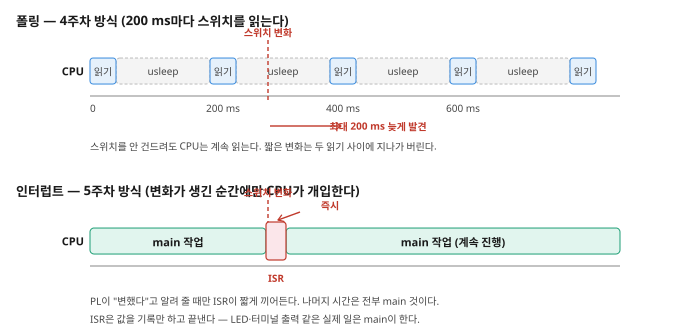
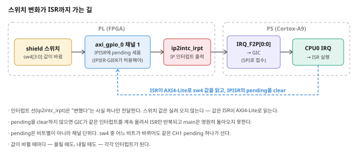

# 제1장 인터럽트 (1) — PL의 이벤트를 PS로: AXI GPIO 인터럽트

**SoC 설계** · 5주차 1교시(W5_S1) | Vivado/Vitis 2023.2 · Windows 11 · Digilent Cora Z7-07S

---

4주차까지 PS가 PL의 상태를 알아내는 방법은 하나였다 — **직접 읽어 보는 것**이다. 4주차 마지막 코드를 다시 보자.

```c
while (1) {
    u32 sw = XGpio_DiscreteRead(&gpio2, CH_IN) & 0xF;
    XGpio_DiscreteWrite(&gpio2, CH_OUT, sw);
    xil_printf("btn=%d sw=%d\n\r", btn, sw);
    usleep(200000);            /* ← 0.2초 쉬고 다시 읽는다 */
}
```

이 방식을 **폴링**(polling)이라고 한다. 스위치를 하루 종일 건드리지 않아도 CPU는 0.2초마다 꼬박꼬박 읽는다. 반대로 0.2초보다 짧게 스쳐 간 변화는 **아예 못 보고 지나간다.** 이번 장에서는 방향을 뒤집는다 — PS가 묻는 대신, **PL이 알린다.**

> **4주차와 무엇이 다른가**
> ```text
>            폴링 (4주차)                        인터럽트 (이번 장)
>   PS ──"바뀌었니?"──▶ PL   (0.2초마다)    PS는 main 일을 한다
>   PS ◀──"아니"────── PL                  PL ──"바뀌었다!"──▶ PS  (바뀐 순간에만)
>   (안 바뀌어도 계속 묻는다)                (물어보는 코드가 아예 없다)
> ```

이번 장의 흐름은 다음과 같다.

> **새 프로젝트 만들기 → AXI GPIO 2채널 + 인터럽트 출력 켜기** → **PS의 `IRQ_F2P` 켜고 연결** → **XDC Import · Bitstream · Export** → **ISR 작성: 스위치 변화마다 4비트 카운터**

---

## 이번 주에 쓰는 하드웨어

4주차 2교시에서 shield에 배선한 **스위치 4개·LED 4개를 그대로 쓴다.** 배선을 풀지 않았다면 보드에 그대로 꽂아 두면 되고, 핀 배정도 4주차와 같은 파일을 쓴다.

```text
AXI GPIO 하나, 2채널
  채널 1 (입력  4비트) = sw4[3:0]   ← shield 스위치 4개
  채널 2 (출력  4비트) = led4[3:0]  → shield LED 4개
  + 인터럽트 출력(ip2intc_irpt) → PS의 IRQ_F2P
```

> **프로젝트를 새로 만든다.** 4주차 프로젝트를 복사해서 이어 갈 수도 있지만, Vivado 조작을 한 번 더 익히는 것이 이번 주 연습의 목적이므로 **처음부터 다시 만든다.** 4주차와 달라지는 부분은 AXI GPIO가 **1개**(4주차는 2개)이고, 거기에 **인터럽트 출력**이 붙는다는 점이다. 보드 버튼(`btn`)과 RGB LED(`led0`)는 이번 주에 쓰지 않으므로 넣지 않는다.

---

## 학습 목표

- 폴링과 인터럽트의 차이를 CPU가 쓰는 시간과 놓치는 이벤트의 관점에서 설명한다.
- PL의 이벤트가 PS의 ISR까지 도달하는 경로(`IPISR` → `ip2intc_irpt` → `IRQ_F2P` → GIC → CPU0)를 순서대로 설명한다.
- AXI GPIO를 2채널로 구성하고 `Enable Interrupt`를 켠다.
- PS의 `Fabric Interrupts`(`IRQ_F2P`)를 켜고 `ip2intc_irpt`를 연결한다.
- AXI GPIO의 인터럽트 레지스터(`GIER`/`IPIER`/`IPISR`)의 역할과 올바른 초기화 순서를 설명한다.
- ISR을 작성하고 `XSetupInterruptSystem()`으로 GIC에 등록한다.
- ISR은 짧게 유지하고 실제 작업(LED·터미널 출력)은 main으로 분리하는 이유를 설명한다.
- pending을 clear하지 않으면 무슨 일이 벌어지는지 설명한다.
- AXI GPIO의 인터럽트가 **비트별이 아니라 채널 단위**이고 **값이 바뀔 때마다** 발생한다는 것을 실험으로 확인한다.

---

## 1.1 폴링의 한계

폴링에는 서로 맞바꿀 수 없는 두 가지 문제가 같이 있다.



**그림 1-1** 위는 폴링(4주차 방식), 아래는 인터럽트(이번 장). 폴링에서는 스위치 변화가 두 번의 읽기 **사이**에 일어나면 다음 읽기까지 발견되지 않는다. 인터럽트에서는 변화가 생긴 순간에만 ISR이 짧게 끼어들고, 나머지 시간은 전부 main의 것이다.

- **주기를 길게 하면** CPU는 한가해지지만 반응이 느려지고, 짧은 변화를 놓친다.
- **주기를 짧게 하면** 반응은 빨라지지만 CPU가 읽기만 하다 끝난다. 그 시간에 다른 일을 할 수 없다.

4주차 코드의 `usleep(200000)`은 이 저울에서 한쪽을 고른 값이다. 그리고 진짜 문제는 **작업이 둘 이상일 때** 드러난다. 스위치도 감시하고 센서도 읽고 통신도 해야 한다면, 폴링 주기를 서로 어떻게 끼워 맞춰야 할까? 인터럽트는 이 질문 자체를 없앤다 — 각 장치가 자기 일이 생겼을 때 알리고, CPU는 알림이 올 때까지 다른 일을 한다.

---

## 1.2 인터럽트가 지나가는 길

스위치를 하나 올리는 순간부터 우리가 쓴 C 함수가 실행되기까지, 신호는 다음 경로를 지난다.



**그림 1-2** `sw4` 변화 → AXI GPIO 채널1의 `IPISR`에 pending → `ip2intc_irpt` 출력 → PS의 `IRQ_F2P[0:0]` → GIC → CPU0 → ISR. 파란 점선은 ISR이 **AXI4-Lite로 되돌아가** 실제 값을 읽고 pending을 clear하는 경로다.

이 그림에서 꼭 가져갈 것이 두 개 있다.

**첫째, 인터럽트 선은 값을 전달하지 않는다.** `ip2intc_irpt`는 선 한 개다. "무언가 변했다"는 사실만 전달한다. 스위치가 `0b0010`인지 `0b1000`인지는 실려 오지 않는다. 그래서 ISR은 **4주차에 쓴 것과 똑같은 AXI4-Lite 경로로** `GPIO_DATA`를 읽어 값을 확인한다. 인터럽트는 데이터 경로를 대체하는 것이 아니라, 데이터 경로를 **언제 쓸지 알려 주는** 별도의 통로다.

**둘째, pending은 반드시 지워야 한다.** `IPISR`에 선 pending 비트는 하드웨어가 알아서 내려 주지 않는다. ISR에서 clear하지 않으면 ISR을 끝내고 나오는 순간 GIC가 "아직 인터럽트가 걸려 있다"고 판단해 ISR을 다시 부른다. 그러면 main으로는 영원히 돌아오지 못한다 — 보드가 멈춘 것처럼 보이는 전형적인 원인이다.

### 용어

| 용어 | 전체 이름 | 의미 |
|---|---|---|
| IRQ | Interrupt Request | 하드웨어가 CPU에 "처리해 달라"고 요청하는 신호 |
| ISR | Interrupt Service Routine | 인터럽트가 발생했을 때 CPU가 실행하는 함수 |
| GIC | Generic Interrupt Controller | 여러 곳에서 온 인터럽트 요청을 받아, 허용 여부·우선순위를 확인하고 CPU에 전달하는 하드웨어 |
| pending | — | "이 인터럽트가 아직 처리되지 않았다"고 표시된 상태 |
| PPI | Private Peripheral Interrupt | CPU 코어에 전용으로 붙은 주변장치의 인터럽트 (2장의 Private Timer가 여기 속한다) |
| SPI | Shared Peripheral Interrupt | 여러 CPU가 공유할 수 있는 주변장치 인터럽트. **`IRQ_F2P`로 들어오는 PL 인터럽트가 여기 속한다** |
| `IRQ_F2P` | Fabric to PS interrupt | PL(fabric)에서 PS로 들어가는 인터럽트 입력 포트 |

> **SPI가 두 가지 뜻으로 쓰인다.** 여기서 SPI는 Shared Peripheral Interrupt이고, 통신 규격인 SPI(Serial Peripheral Interface)와는 아무 관계가 없다. 인터럽트를 이야기하는 문맥에서만 이 뜻으로 쓴다.

---

## 1.3 프로젝트 만들기와 PS 올리기

여기까지는 4주차 1교시와 똑같은 순서다. 막히는 곳이 있으면 4주차 본문을 참고한다.

1. `File → Project → New…` → Project name을 **`lab03`** 으로 준다. 짧은 로컬 경로에 만든다.
2. Board 선택 단계에서 **Cora Z7-07S**를 고른다.
3. `Flow Navigator → IP INTEGRATOR → Create Block Design` → 이름은 기본값 `design_1`.
4. `Add IP`(+) → **ZYNQ7 Processing System** 추가.
5. 캔버스 위 배너의 **`Run Block Automation`** → `Apply Board Preset` 체크된 채로 `OK`.

> **프로젝트 이름을 `lab03`으로 하는 이유.** 4주차에 `lab01`·`lab02b`를 만들었으니 이 과목의 세 번째 Vivado 프로젝트다. 그리고 이 프로젝트 하나를 **이번 주 1교시와 2교시가 함께 쓴다** — 그래서 `lab01`처럼 교시 번호를 붙이면 오히려 혼란스럽다.

---

## 1.4 `M AXI GP0` 켜기

PS 블록을 더블클릭해 `Re-customize IP` 창을 연다. **`PS-PL Configuration`** 페이지에서 `GP Master AXI Interface` 아래 **`M AXI GP0 interface`** 를 체크한다. 4주차 1교시에서 했던 것과 같다.

`OK`로 닫으면 PS 블록에 `M_AXI_GP0` 포트가 생긴다. (`IRQ_F2P`는 1.6절에서 켠다 — 지금 한꺼번에 켜도 되지만, 두 스위치의 역할을 구분하기 위해 나눠서 진행한다.)

---

## 1.5 AXI GPIO — 2채널과 인터럽트 출력

### 1.5.1 IP 추가와 채널 설정

`Add IP`(+) → "AXI GPIO" 검색 → 캔버스에 추가한다. 인스턴스 이름은 `axi_gpio_0`이다. 더블클릭해 `Re-customize IP` 창을 열고 `IP Configuration` 탭에서 다음과 같이 설정한다.

| 구역 | 항목 | 설정 |
|---|---|---|
| `GPIO`(채널 1) | `All Inputs` | 체크 — shield 스위치 |
| `GPIO`(채널 1) | `GPIO Width` | `4` |
| `GPIO`(채널 1) | `Enable Dual Channel` | 체크 |
| `GPIO 2`(채널 2) | `All Outputs` | 체크 — shield LED |
| `GPIO 2`(채널 2) | `GPIO Width` | `4` |
| (창 아래쪽) | **`Enable Interrupt`** | **체크** |

앞의 다섯 줄은 4주차 2교시의 `axi_gpio_1`과 같다. **마지막 `Enable Interrupt`가 이번 주에 새로 추가되는 항목이다.**


**그림 1-3** `IP Configuration` 한 화면에 채널 1(`All Inputs`·Width 4), 채널 2(`All Outputs`·Width 4), 그리고 `Enable Interrupt` 체크가 함께 보인다. 📷 *캡처 대기*

`OK`로 닫으면 블록 오른쪽에 **`ip2intc_irpt`** 출력 핀이 새로 생긴다. 이름 그대로 "IP에서 인터럽트 컨트롤러로" 가는 선이다.

> **체크박스 하나가 하드웨어를 바꾼다.** 이 체크는 단순한 소프트웨어 설정이 아니다. AXI GPIO IP 안에 `GIER`/`IPIER`/`IPISR` 레지스터와 변화 감지 회로가 실제로 **합성되어 들어간다.** 그래서 비트스트림과 `.xsa`를 반드시 새로 만들어야 하고, 반영 여부는 1.8절에서 `xparameters.h`로 직접 확인한다.

### 1.5.2 Run Connection Automation

캔버스 위 **`Run Connection Automation`** 배너를 클릭한다. 왼쪽 트리에서 `axi_gpio_0` 아래 `GPIO`/`GPIO2`는 **체크하지 않고, `S_AXI`만 체크**한다.

`OK`를 누르면 4주차와 같이 **`ps7_0_axi_periph`**(AXI Interconnect)와 **`rst_ps7_0_50M`**(Processor System Reset)이 자동으로 추가된다. 둘 다 설정을 건드릴 필요가 없다.

> **`GPIO`/`GPIO2`는 왜 체크하지 않는가.** 켜면 Vivado가 채널을 보드 프리셋 핀에 자동 연결해 버린다. 우리는 shield 핀에 연결해야 하므로, 버스 연결(`S_AXI`)만 자동화하고 외부 핀은 다음 절에서 직접 정한다.

### 1.5.3 Make External — 멤버 신호 방식

`axi_gpio_0`의 `GPIO`·`GPIO2` 옆의 **`+`를 눌러 펼친다.** 안에 있는 **멤버 신호** `gpio_io_i[3:0]`(채널1, 입력)과 `gpio2_io_o[3:0]`(채널2, 출력)이 나온다. 인터페이스가 아니라 **이 멤버 신호를 각각 우클릭 → `Make External`** 하고 이름을 붙인다.

| Make External 할 핀 | 이름 | 합성 후 top 포트 |
|---|---|---|
| `gpio_io_i[3:0]` (채널1, shield 스위치) | `sw4` | `sw4[3:0]` |
| `gpio2_io_o[3:0]` (채널2, shield LED) | `led4` | `led4[3:0]` |

> **왜 인터페이스가 아니라 멤버 신호를 내보내는가.** 4주차 2교시에서 다룬 차이다. `GPIO` 인터페이스를 통째로 내보내면 살아 있는 멤버에 맞춰 **접미사가 자동으로 붙어** `sw4_tri_i[3:0]`가 되고, 멤버 신호를 직접 내보내면 **입력한 이름 그대로** `sw4[3:0]`가 된다. 회로는 완전히 같지만 **XDC가 이 이름과 정확히 일치해야** 하므로, 헷갈릴 일이 없는 멤버 신호 방식을 쓴다. 1.7절에서 Import할 XDC도 이 이름을 전제로 작성되어 있다.

---

## 1.6 PS의 `IRQ_F2P` 켜고 연결하기

PL이 인터럽트를 내보낼 준비가 됐으니, 이제 PS가 그걸 받을 입구를 열어야 한다. 1.4절에서 `M AXI GP0`을 켰던 것과 같은 성격의 작업이다.

PS를 더블클릭 → 왼쪽 `Page Navigator`에서 **`Interrupts`** 페이지로 이동한다.


**그림 1-4** `Interrupts` 페이지에서 **`Fabric Interrupts`** 를 체크하고, 그 아래 `PL-PS Interrupt Ports`를 펼쳐 **`IRQ_F2P[15:0]`** 를 체크한다. 두 단계를 모두 해야 한다 — 상위 `Fabric Interrupts`만 켜면 포트가 생기지 않는다. 📷 *캡처 대기*

`OK`로 닫으면 PS 블록의 **왼쪽**에 `IRQ_F2P[0:0]` 입력 포트가 생긴다.

> **왜 `[15:0]`을 켰는데 `[0:0]`으로 보이는가.** `IRQ_F2P`는 최대 16개의 PL 인터럽트를 받을 수 있는 포트다. Vivado는 실제로 연결된 비트 수에 맞춰 폭을 표시하므로, 지금은 소스가 하나뿐이라 `[0:0]`이다. 소스가 둘 이상이 되면 여러 선을 하나의 버스로 묶어 주는 **`Concat`** IP가 필요해진다 — 이번 장은 필요 없고, 과제에서 다룬다.

이제 `axi_gpio_0`의 `ip2intc_irpt` 핀에 마우스를 올려 연필 모양이 되면, 드래그해서 PS의 `IRQ_F2P[0:0]`에 **직접 연결**한다. AXI 버스에 쓴 `Run Connection Automation`은 이 선에는 쓰지 않는다 — 단순한 신호 선 하나이므로 손으로 잇는다.

![완성된 블록 디자인 — ip2intc_irpt가 IRQ_F2P[0:0]에 연결됨](img/w5s1_03.png)

**그림 1-5** 완성된 `design_1`. PS, `ps7_0_axi_periph`, `rst_ps7_0_50M`, `axi_gpio_0`, 그리고 `ip2intc_irpt` → `IRQ_F2P[0:0]` 연결선. 이 선 하나가 그림 1-2에서 PL과 PS의 경계를 넘던 그 화살표다. 📷 *캡처 대기*

`Address Editor` 탭을 열어 베이스 주소를 확인한다. `/axi_gpio_0/S_AXI`가 **`0x4120_0000`**(Range `64K`)에 배정되어 있고, 슬레이브가 하나뿐이라 **한 줄**이다 — 4주차 2교시에서 두 줄을 비교했던 것과 대비된다. 코드에서는 이 주소를 직접 쓰지 않고 `XPAR_AXI_GPIO_0_BASEADDR` 매크로로 받으므로, 값이 다르게 배정돼도 코드는 그대로 동작한다.

---

## 1.7 Wrapper·XDC Import·Bitstream

1. 캔버스 우클릭 → `Validate Design`(F6). 경고 없이 통과해야 한다.
2. Block Design 저장(`Ctrl+S`).
3. `Sources → design_1` 우클릭 → **`Create HDL Wrapper…`** → 기본값 **"Let Vivado manage wrapper and auto-update"** 로 둔다.
4. 생성된 `design_1_wrapper.v`를 열어 top 포트 이름을 확인한다. **`sw4`, `led4`가 접미사 없이 그대로 보여야 한다**(1.5.3절에서 멤버 신호를 내보냈기 때문이다). 이 이름이 다음 단계의 XDC와 일치해야 한다.
5. **XDC Import.** 핀 8개를 손으로 입력하는 대신, `Sources` 패널의 `+` → `Add Sources` → `Add or create constraints` → `Add Files`로 [`LAB01/xdc/cora_z7_07s_week05.xdc`](LAB01/xdc/cora_z7_07s_week05.xdc)를 추가한다.

이 파일의 내용은 4주차 2교시에서 Import한 것과 **같은 8핀**이다 — shield 배선이 바뀌지 않았으니 핀도 그대로다.

| 신호 | 패키지 핀 |
|---|---|
| `sw4[0..3]` | U15, K18, J18, G15 |
| `led4[0..3]` | T14, V17, R17, N18 |

6. `Run Synthesis` → 완료되면 `Open Synthesized Design` → `Layout → I/O Planning`에서 핀이 실제로 배정됐는지 확인한다.

> **`get_ports`에 이름이 없다는 경고가 나오면** XDC의 포트 이름과 래퍼에서 확인한 실제 이름이 다른 것이다. 인터페이스를 Make External 했다면 `sw4_tri_i`/`led4_tri_o`가 되므로, XDC 파일의 이름을 그쪽으로 고치거나 Make External을 멤버 신호 방식으로 다시 한다.

7. `Generate Bitstream`.
8. `File → Export → Export Hardware…` → **`Include bitstream`** 선택 → `Finish`.

> **참고: 이 하드웨어를 스크립트로 만들 수도 있다.** [`LAB01/build_lab03_reference.tcl`](LAB01/build_lab03_reference.tcl)은 1.3~1.7절의 결과와 같은 프로젝트를 한 번에 만들어 `.xsa`까지 뽑는다. 수업에서는 **손으로 만드는 것이 연습**이므로 쓰지 않는다. 설계가 망가져서 되돌릴 시간이 없을 때, 또는 조교가 결과를 검증할 때 쓴다.

---

## 1.8 Vitis — Platform과 Application

### 1.8.1 Platform 만들기

Vitis Unified IDE를 열고 `Open Workspace`로 5주차 `vitis_workspace` 폴더를 연다. `Embedded Development → Create Platform Component`.

- Component name: **`w5_platform`**
- Flow: `Hardware Design` → `Browse`로 **`lab03`의 `design_1_wrapper.xsa`**
- OS and Processor: `standalone` / `ps7_cortexa9_0`

`FLOW → Build`로 Platform을 빌드한다.

> **이 Platform 하나를 2교시에서도 쓴다.** 2교시의 PS 타이머는 PS 안에 이미 들어 있는 블록이라 Vivado를 다시 열 필요가 없다. 그래서 5주차는 **Platform 하나에 Application 둘**이 된다 — 4주차에 LAB마다 Platform을 새로 만들었던 것과 비교해 보자.

### 1.8.2 체크박스가 실제로 반영됐는지 확인하기

Platform 빌드가 끝나면, 1.5.1절의 `Enable Interrupt`가 정말 하드웨어에 반영됐는지 **눈으로 확인할 수 있다.** BSP가 생성한 `xparameters.h`를 연다.

```text
w5_platform/ps7_cortexa9_0/standalone_ps7_cortexa9_0/bsp/include/xparameters.h
```

```c
/* Definitions for peripheral AXI_GPIO_0 */
#define XPAR_AXI_GPIO_0_BASEADDR 0x41200000
#define XPAR_AXI_GPIO_0_INTERRUPT_PRESENT 0x1     /* ← 이 값이 핵심 */
#define XPAR_AXI_GPIO_0_IS_DUAL 0x1
#define XPAR_AXI_GPIO_0_GPIO_WIDTH 0x4
```


**그림 1-6** `XPAR_AXI_GPIO_0_INTERRUPT_PRESENT`가 `0x1`이다. 4주차 플랫폼에서 같은 줄을 열어 보면 `0x0`이다 — Vivado의 체크박스 하나가 하드웨어를 지나 소프트웨어 헤더까지 전달되는 과정을 한 줄로 볼 수 있는 지점이다. 📷 *캡처 대기*

`0x0`이거나 이 줄이 없다면 1.5.1절의 `Enable Interrupt`가 빠진 것이다. 코드를 쓰기 전에 여기서 잡는 것이 훨씬 빠르다.

### 1.8.3 Application 만들기

`Create Embedded Application` → `Empty Application (C)`.

- Component name: **`lab01_app`**
- Platform: **`w5_platform`**
- Domain: `standalone_ps7_cortexa9_0`

`src` 우클릭 → `Import → Files…` → [`LAB01/src/sw_irq_counter.c`](LAB01/src/sw_irq_counter.c)를 가져온다.

---

## 1.9 AXI GPIO의 인터럽트 레지스터

4주차 1교시에서 본 데이터·방향 레지스터(`+0x0`~`+0xC`) 뒤쪽에, 인터럽트용 레지스터가 세 개 더 있다. 오프셋은 IP 스펙(Xilinx PG144)에 고정되어 있다.

| 레지스터 | 오프셋 | 역할 |
|---|---|---|
| `GIER` (Global Interrupt Enable) | `+0x11C` | 이 IP의 인터럽트 출력 전체를 켜는 **대문** |
| `IPISR` (IP Interrupt Status) | `+0x120` | 채널별 pending 표시. **여기에 써서 clear한다** |
| `IPIER` (IP Interrupt Enable) | `+0x128` | 채널별로 인터럽트를 허용하는 **개별 문** |

`IPISR`/`IPIER`의 비트 배치는 채널 단위다.

| 비트 | 마스크 매크로 | 대상 |
|---|---|---|
| bit 0 | `XGPIO_IR_CH1_MASK` (`0x1`) | 채널 1 — `sw4` |
| bit 1 | `XGPIO_IR_CH2_MASK` (`0x2`) | 채널 2 — `led4`(출력이므로 쓰지 않는다) |

> **비트별이 아니라 채널 단위다.** `sw4[0]`이 바뀌어도, `sw4[3]`이 바뀌어도, 세워지는 것은 똑같은 `XGPIO_IR_CH1_MASK` 하나다. "어느 스위치가 바뀌었는지"는 pending만 보고는 알 수 없고, ISR이 `GPIO_DATA`를 읽어 값을 봐야 안다. 이것이 1.2절에서 말한 "인터럽트 선은 값을 전달하지 않는다"의 구체적인 결과다.

### 초기화 순서

문 두 개(`IPIER`, `GIER`)를 여는 순서가 중요하다.

```text
① 남아 있던 pending을 clear        XGpio_InterruptClear()
② GIC에 ISR 등록                   XSetupInterruptSystem()
③ 채널 인터럽트 허용 (개별 문)      XGpio_InterruptEnable()
④ IP 인터럽트 출력 허용 (대문)      XGpio_InterruptGlobalEnable()
```

②를 ③·④보다 먼저 하는 이유는 분명하다. 문을 먼저 열면, ISR이 등록되기 전에 인터럽트가 도착할 수 있다. 그러면 CPU는 등록되지 않은 핸들러로 뛰어가게 된다. **받을 준비를 먼저 하고 문을 연다.**

①이 필요한 이유는, 전원을 켠 직후나 이전 실행의 잔재로 이미 pending이 서 있을 수 있기 때문이다.

### 쓸 함수들

| 함수 | 역할 |
|---|---|
| `XGpio_LookupConfig(베이스주소)` | IP의 설정 정보(인터럽트 번호 포함)를 찾아 온다 |
| `XSetupInterruptSystem(...)` | GIC를 초기화하고 ISR을 인터럽트 번호에 연결한다 |
| `XGpio_InterruptEnable(&gpio, 마스크)` | `IPIER` — 채널별 허용 |
| `XGpio_InterruptGlobalEnable(&gpio)` | `GIER` — IP 전체 출력 허용 |
| `XGpio_InterruptClear(&gpio, 마스크)` | `IPISR` clear — **ISR에서 반드시 호출** |
| `XGpio_InterruptGetStatus(&gpio)` | `IPISR` 읽기 — 어느 채널이 pending인지. 이번 코드에서는 생략했다 |

> **`XGpio_InterruptGetStatus()`를 왜 생략했나.** 우리는 채널 1 하나만 인터럽트로 허용했으므로, ISR이 불렸다는 것 자체가 곧 "채널 1이 변했다"는 뜻이다. 채널 2까지 허용했거나 여러 IP가 같은 ISR을 공유한다면 그때 "누가 불렀는지" 확인하는 코드가 필요해진다.

> **인터럽트 번호를 손으로 쓰지 않는다.** `IRQ_F2P[0]`이 GIC에서 몇 번 인터럽트인지(Zynq-7000에서는 61번) 외워서 적을 필요가 없다. `XGpio_LookupConfig()`가 돌려주는 구조체의 `IntrId`·`IntrParent`를 `XSetupInterruptSystem()`에 그대로 넘기면 된다. 이 값들은 Vivado 설계에서 생성된 것이므로, 설계가 바뀌면 자동으로 따라 바뀐다.

---

## 1.10 코드 — ISR은 짧게, 일은 main이

전체 파일은 [`LAB01/src/sw_irq_counter.c`](LAB01/src/sw_irq_counter.c)에 있다. 핵심은 ISR과 main의 역할 분담이다.

### 세 개의 공유 변수와 ISR

```c
XGpio gpio;

volatile int flag  = 0;   /* 인터럽트가 생겼다는 표시 */
volatile int count = 0;   /* 4비트 카운터, 0~15       */
volatile int sw    = 0;   /* 그 순간의 스위치 값      */

void sw_isr(void *ref)
{
    sw    = XGpio_DiscreteRead(&gpio, 1);   /* 채널 1 = sw4 */
    count = (count + 1) & 0xF;
    flag  = 1;

    XGpio_InterruptClear(&gpio, XGPIO_IR_CH1_MASK);   /* 꼭 지운다 */
}
```

ISR이 하는 일은 **기록 세 줄과 clear 한 줄**, 전부다. LED에 쓰지도 않고 `xil_printf`도 부르지 않는다.

> **`volatile`이 왜 필요한가.** `flag`는 ISR이 바꾸고 main이 읽는다. 그런데 컴파일러는 main의 `while(1)` 안에서 `flag`를 바꾸는 코드를 찾을 수 없으므로, "이 값은 안 변하니 한 번만 읽어 두고 쓰자"고 최적화해 버릴 수 있다. 그러면 main은 ISR이 세운 `flag`를 영원히 보지 못한다. `volatile`은 "매번 메모리에서 다시 읽어라"라는 지시다. **ISR과 main이 함께 쓰는 변수에는 빠짐없이 붙인다.**

> **`void *ref`는 무엇인가.** ISR의 형식이 정해져 있어서 받는 인자다. 이 코드에서는 쓰지 않는다 — `gpio`를 전역 변수로 두었기 때문에 ISR이 그냥 갖다 쓸 수 있다.

### main

```c
XGpio_Initialize(&gpio, XPAR_AXI_GPIO_0_BASEADDR);
XGpio_SetDataDirection(&gpio, 1, 0xF);   /* 채널 1: 입력 */
XGpio_SetDataDirection(&gpio, 2, 0x0);   /* 채널 2: 출력 */

cfg = XGpio_LookupConfig(XPAR_AXI_GPIO_0_BASEADDR);
XSetupInterruptSystem(&gpio, (void *)sw_isr, cfg->IntrId, cfg->IntrParent,
                      XINTERRUPT_DEFAULT_PRIORITY);
XGpio_InterruptEnable(&gpio, XGPIO_IR_CH1_MASK);
XGpio_InterruptGlobalEnable(&gpio);

while (1) {
    if (flag == 1) {
        flag = 0;
        XGpio_DiscreteWrite(&gpio, 2, count);   /* 카운터 → LED 4개 */
        xil_printf("count = %2d, sw = %d\n\r", count, sw);
    }
}
```

main은 `flag`가 섰는지만 본다. **스위치를 읽는 코드가 main에 한 줄도 없다** — 4주차와 비교하면 이 점이 가장 크게 달라진 부분이다.

> **왜 ISR에서 바로 LED를 쓰고 출력하지 않는가.** 지금 규모에서는 그렇게 해도 동작한다. 하지만 ISR이 실행되는 동안 CPU는 main으로 돌아가지 못하고, 같은 우선순위의 다른 인터럽트도 기다려야 한다. `xil_printf` 한 줄은 115200 baud에서 약 2 ms가 걸리는데, 인터럽트가 그보다 자주 들어오면 시스템이 밀리기 시작한다. **ISR은 "무슨 일이 있었는지 적어 두고 즉시 나온다", 실제 처리는 main이 한다** — 2장에서 이 규칙이 왜 타협 불가능한지 1 ms 타이머로 직접 확인한다.

---

## 1.11 실행과 관찰

`FLOW → Build` → 보드 연결 → `Run`. PuTTY(COM 포트, 115200)를 열어 둔다.

shield 스위치를 하나 올려 본다.


**그림 1-7** 스위치를 건드리지 않는 동안에는 **출력이 한 줄도 나오지 않는다.** 4주차에는 가만히 둬도 0.2초마다 한 줄씩 찍혔다 — 이 차이가 폴링과 인터럽트의 차이다. 스위치를 움직이면 그 순간 `count = 1, sw = 2`처럼 한 줄이 찍히고, `count` 값이 shield LED 4개에 2진수로 나타난다. 📷 *캡처 대기*

### 카운터는 예상대로 오르지 않는다

스위치를 한 번 올렸다 내렸는데 카운터가 2 늘고, 어떤 때는 3~4가 뛴다. 고장이 아니다. 이유가 두 개 겹쳐 있다.

**첫째, 인터럽트는 값이 "바뀔 때마다" 발생한다.** 올릴 때 한 번, 내릴 때 또 한 번이다. 슬라이드 스위치를 올렸다 내리면 이벤트가 2개인 것이 정상이다.

**둘째, 접점 바운스(bounce)가 있다.** 기계식 스위치는 접점이 붙는 순간 수 밀리초 동안 수십 번 붙고 떨어진다. 사람 손으로는 한 번 움직였지만 PL은 그 떨림을 전부 "변화"로 감지한다. 폴링은 0.2초마다 한 번만 읽었기 때문에 이 떨림이 통째로 안 보였다 — 인터럽트로 바꾸자 하드웨어의 실제 모습이 드러난 것이다.

이걸 어떻게 다룰지가 이번 장 과제다.

---

## 1.12 정리

| 키워드 | 내용 |
|---|---|
| 폴링의 한계 | 안 바뀌어도 계속 읽고, 주기보다 짧은 변화는 놓친다. 작업이 여러 개면 주기를 맞추기 어렵다 |
| 인터럽트 경로 | `IPISR` pending → `ip2intc_irpt` → `IRQ_F2P` → GIC → CPU0 → ISR |
| 인터럽트 선은 값을 나르지 않는다 | "변했다"만 전달. 값은 ISR이 AXI4-Lite로 읽는다 |
| `Enable Interrupt` | AXI GPIO IP의 체크박스. 켜면 `ip2intc_irpt` 출력과 인터럽트 레지스터가 합성되어 들어간다 |
| `Fabric Interrupts`/`IRQ_F2P` | PS가 PL 인터럽트를 받는 입구. `M AXI GP0`과 같은 성격의 스위치 |
| 멤버 신호 Make External | 접미사 없이 `sw4[3:0]`/`led4[3:0]`. XDC 이름과 맞추기 쉽다 |
| XDC Import | 핀이 많을 때 파일로 관리. 포트 이름이 정확히 일치해야 적용된다 |
| `GIER`/`IPIER`/`IPISR` | 대문(+0x11C) / 개별 문(+0x128) / pending(+0x120) |
| 초기화 순서 | pending clear → ISR 등록 → 채널 enable → global enable |
| pending clear | ISR에서 반드시. 빠뜨리면 ISR이 무한 반복되고 main은 못 돌아온다 |
| 채널 단위 인터럽트 | 채널 안의 어느 비트가 바뀌어도 pending은 하나 |
| ISR은 짧게 | 기록만 하고 나온다. LED·출력은 main이 |
| `volatile` | ISR과 main이 공유하는 변수에는 반드시 붙인다 |
| `INTERRUPT_PRESENT` | `xparameters.h`에서 `0x1`인지 확인 — 체크박스가 반영됐다는 증거 |

---

## 과제 — 다음 시간 전까지

1. **스위치를 올릴 때만 카운터가 1 증가하도록 고친다.** ISR에서 읽은 현재 값과 직전 값을 비교하면 어느 비트가 어느 방향으로 바뀌었는지 알 수 있다. 상승 변화(0→1)가 있을 때만 카운터를 올리도록 수정하고, 올렸다 내렸을 때 카운터가 정확히 1만 오르는지 확인한다.
2. **바운스를 줄여 본다.** 1번을 적용해도 바운스 때문에 여전히 여러 번 세질 수 있다. 마지막 이벤트로부터 일정 시간(예: 20 ms) 안에 들어온 이벤트를 무시하는 방법을 생각해 보고, **그 "시간"을 ISR 안에서 어떻게 알 수 있을지** 고민해 온다. (2장의 타이머가 바로 이 문제를 푸는 도구다.)
3. **인터럽트 소스가 둘이 되면 무엇이 필요한가.** 이 설계에 AXI GPIO를 하나 더 추가해 보드 버튼(`btn`)에도 인터럽트를 붙이려 한다고 하자. `ip2intc_irpt`가 두 개가 되는데 PS의 `IRQ_F2P`는 하나다. Vivado IP 카탈로그에서 **`Concat`**(`xlconcat`)을 찾아보고 어떻게 쓰면 될지 조사해 온다. (구현은 하지 않아도 된다.)
4. `XGpio_InterruptClear()` 한 줄을 주석 처리하고 실행해 본다. **무슨 일이 일어나는지 관찰하고 이유를 설명한다.** (확인한 뒤에는 주석을 되돌린다.)

## 다음 시간 예고 — 제2장

- 이번 장은 **"이벤트가 생겼을 때"** 인터럽트였다. 다음 장은 **"시간이 되었을 때"** 인터럽트다 — Cortex-A9 **Private Timer**로 1 ms마다 인터럽트를 만든다.
- 그 1 ms를 tick으로 삼아, 주기가 다른 작업 셋(50 ms·500 ms·1000 ms)을 하나의 main 루프에서 돌리는 **잡 스케줄러**를 만든다. 4주차의 `usleep(200000)`으로는 할 수 없던 일이다.
- **Vivado 작업이 없다.** Private Timer는 PS 안에 이미 들어 있어서, 이번 장에서 만든 `lab03` 하드웨어와 `w5_platform`을 **그대로 재사용**한다 — Application만 하나 더 만든다.

---

*SoC 설계 · 5주차 1교시(W5_S1) | Vivado/Vitis 2023.2 · Windows · Cora Z7-07S*
