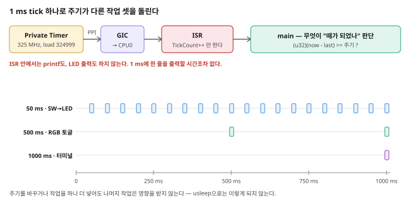

# 제2장 인터럽트 (2) — PS 타이머와 1 ms 잡 스케줄러

**SoC 설계** · 5주차 2교시(W5_S2) | Vivado/Vitis 2023.2 · Windows 11 · Digilent Cora Z7-07S

---

1장의 인터럽트는 **"이벤트가 생겼을 때"** 발생했다. 스위치를 언제 움직일지는 아무도 모르고, PL이 그 순간을 알려 줬다. 이번 장의 인터럽트는 **"시간이 되었을 때"** 발생한다 — 1 ms마다 정확히, 아무 일이 없어도.

시간 인터럽트가 왜 따로 필요한가. 4주차 코드를 마지막으로 한 번 더 보자.

```c
while (1) {
    /* ... 스위치 읽고 LED 쓰고 출력하고 ... */
    usleep(200000);
}
```

여기에 요구사항을 하나 얹어 보자. **LED는 50 ms마다 갱신하고, 터미널 출력은 1초에 한 번만 하고 싶다.** `usleep` 하나로 이걸 어떻게 하는가? 그리고 세 번째 작업이 500 ms 주기로 필요해지면? 이번 장은 이 문제에 대한 표준적인 답 — **하나의 빠른 tick을 만들고, 무엇을 할 때가 되었는지는 main이 판단하는** 구조 — 를 만든다.

> **이번 장은 Vivado 작업이 없다.** Cortex-A9 Private Timer는 PS의 CPU 코어 안에 이미 들어 있는 블록이다. 켤 체크박스도, 연결할 선도 없다. 1장에서 만든 `lab03` 하드웨어와 `w5_platform`을 **그대로 재사용**하고, Application만 하나 더 만든다.

이번 장의 흐름은 다음과 같다.

> **`usleep`의 한계 → Private Timer와 PPI → 로드값 계산(324999) → Platform 재사용, Application 추가** → **1 ms tick + 잡 스케줄러** → **일부러 고장내 보기**

---

## 학습 목표

- `usleep()`으로 주기 작업을 만들 때 생기는 세 가지 문제(블로킹·주기 혼재·누적 오차)를 설명한다.
- Cortex-A9 Private Timer의 위치를 설명하고, 그 인터럽트가 **PPI**임을 1장의 **SPI**(`IRQ_F2P`)와 구분한다.
- Private Timer의 클럭이 CPU 클럭의 절반임을 BSP 파일에서 확인하고, 1 ms에 필요한 로드값을 직접 계산한다.
- 하드웨어가 바뀌지 않았을 때 Vitis Platform을 재사용하고 Application만 추가한다.
- `XScuTimer`를 auto-reload 모드로 초기화해 1 ms 주기 인터럽트를 만든다.
- tick 하나로 주기가 다른 작업 여러 개를 돌리는 잡 스케줄러를 작성한다.
- ISR을 짧게 유지해야 하는 이유를 **실제로 고장을 재현해서** 설명한다.

---

## 2.1 `usleep()`의 세 가지 문제

```c
job_a();          /* 50 ms마다 하고 싶다  */
job_b();          /* 500 ms마다 하고 싶다 */
usleep(50000);
```

`job_b`를 500 ms마다 하려면 카운터를 하나 두고 열 번째마다 부르는 식으로 직접 세야 한다. 작업이 셋, 넷으로 늘고 주기가 서로 배수가 아니면 이 계산은 금방 엉킨다. 문제를 정리하면 세 가지다.

**① 블로킹.** `usleep(50000)`이 도는 50 ms 동안 CPU는 아무 일도 못 한다. 그사이 스위치가 눌려도, 데이터가 도착해도 반응할 수 없다.

**② 주기가 섞인다.** 모든 작업이 하나의 `usleep` 주기에 종속된다. 가장 짧은 주기에 맞춰 루프를 돌리고, 나머지는 손으로 세는 수밖에 없다.

**③ 누적 오차(drift).** 실제 루프 한 바퀴는 `50 ms + job_a 실행시간 + job_b 실행시간`이다. `usleep`은 "50 ms를 쉰다"는 뜻이지 "50 ms마다 돌아온다"는 뜻이 아니다. 그래서 반복할수록 시각이 뒤로 밀린다. 특히 `xil_printf`처럼 실행시간이 길고 일정하지 않은 작업이 섞이면 오차가 눈에 보일 만큼 쌓인다.

타이머 인터럽트는 세 문제를 한꺼번에 없앤다. 타이머는 **CPU가 무엇을 하고 있든 상관없이** 독립적으로 시간을 세기 때문에, 작업이 얼마나 오래 걸렸든 tick은 정확히 1 ms 간격으로 올라간다(③ 해결). CPU는 쉬지 않고 main을 돌 수 있고(①), 각 작업은 자기 주기를 tick 수로만 따지면 되므로 서로 독립적이다(②).

---

## 2.2 Cortex-A9 Private Timer — PPI로 들어오는 인터럽트

Zynq-7000의 각 Cortex-A9 코어에는 **전용 타이머**(Private Timer)가 하나씩 붙어 있다. 코어 전용이므로 다른 코어나 PL과 공유하지 않고, PS 안에 있으므로 PL에 아무것도 놓지 않아도 쓸 수 있다.

1장의 인터럽트와 나란히 놓고 보면 차이가 분명해진다.

| | 1장 — AXI GPIO | 2장 — Private Timer |
|---|---|---|
| 인터럽트를 만드는 곳 | **PL** 안의 IP | **PS** 안, CPU 코어에 붙어 있음 |
| 무엇이 계기인가 | 입력 값의 변화 | 정해진 시간의 경과 |
| GIC까지 가는 경로 | `ip2intc_irpt` → `IRQ_F2P` → GIC | 코어에서 GIC로 직접 |
| GIC에서의 분류 | **SPI** (Shared Peripheral Interrupt) | **PPI** (Private Peripheral Interrupt) |
| Vivado에서 할 일 | `Enable Interrupt` + `Fabric Interrupts` | **없음** |
| 드라이버 | `XGpio` | `XScuTimer` |

이 대비가 이번 장에서 얻을 가장 중요한 그림이다. **GIC는 두 종류의 인터럽트를 같은 방식으로 CPU에 전달한다.** 우리 코드 쪽에서 보면 ISR을 등록하고 pending을 지우는 절차가 1장과 똑같다 — 달라지는 것은 드라이버 이름과, 인터럽트가 어디서 출발했는지뿐이다.

> **`XScuTimer`의 `Scu`는 오해를 부른다.** SCU(Snoop Control Unit)는 코어 간 캐시 일관성을 관리하는 별개의 블록이고, Private Timer는 그 안에 들어 있지 않다. 드라이버 이름이 그렇게 붙어 있을 뿐이니, "SCU를 건드리는 것"으로 생각하지 않아도 된다.

> **PS에는 다른 타이머도 있다.** TTC(Triple Timer Counter)는 PS의 주변장치로 세 채널을 가지고 있고, 이쪽은 Zynq 설정 화면에서 켜야 쓸 수 있다. 이번 장에서 Private Timer를 고른 이유가 바로 그 차이다 — **Vivado를 다시 열 필요가 없다.**

---

## 2.3 타이머 클럭과 로드값 — 왜 324999인가

Private Timer는 LOAD 레지스터에 넣은 값에서 **0까지 내려 세고**, 0에 닿는 순간 인터럽트를 발생시킨다. 그러므로 원하는 주기를 만들려면 두 가지를 알아야 한다: 타이머가 **몇 Hz로 세는지**, 그리고 **몇 번 세야 하는지**.

### 타이머는 CPU 클럭의 절반으로 센다

외워서 쓸 값이 아니다. 이 플랫폼의 BSP가 직접 적어 두고 있다. 다음 파일을 열어 본다.

```text
w5_platform/ps7_cortexa9_0/standalone_ps7_cortexa9_0/bsp/include/xtimer_config.h
```

```c
#define XSLEEPTIMER_BASEADDRESS 0xf8f00600
#define XSLEEPTIMER_IS_SCUTIMER
#define XSLEEPTIMER_FREQ        XPAR_CPU_CORE_CLOCK_FREQ_HZ/2
```

BSP는 `usleep()`을 구현할 때 **이 Private Timer를 쓰고 있고**(베이스 주소 `0xf8f00600`이 그것이다), 그 주파수를 `CPU 클럭 ÷ 2`로 잡고 있다. 그리고 CPU 클럭은 `xparameters.h`에 있다.

```c
#define XPAR_CPU_CORE_CLOCK_FREQ_HZ 650000000
```


**그림 2-1** `XPAR_CPU_CORE_CLOCK_FREQ_HZ = 650000000`(650 MHz)과 `XSLEEPTIMER_FREQ = .../2`. 따라서 이 보드의 Private Timer는 **325 MHz**로 센다. 📷 *캡처 대기*

> **Cora Z7-07S의 CPU는 650 MHz다.** Zynq-7000 계열 자료에서 흔히 보이는 667 MHz가 아니다. 보드 프리셋(Run Block Automation에서 적용한 것)이 이 값을 정한다. 다른 보드로 옮기면 이 숫자가 달라지므로, **숫자를 옮겨 적지 말고 매크로로 계산하는 습관**이 중요하다.

### 로드값 계산

1 ms 동안 325 MHz로 세면 `325,000,000 ÷ 1000 = 325,000`번이다. 타이머는 LOAD에서 0까지 세므로 실제 세는 횟수는 `LOAD + 1`이다. 따라서

```text
LOAD + 1 = 325,000   →   LOAD = 324,999
```

이 값을 코드 맨 위에 하나만 정의해 두고 쓴다.

```c
#define LOAD_1MS   324999      /* 325 MHz / 1000 - 1 */
```

> **이 숫자는 이 보드에서만 맞다.** 다른 보드로 옮기면 CPU 클럭이 달라지므로 `324999`도 달라진다. 그래서 **어디서 나온 숫자인지 주석으로 남겨 두는 것**이 중요하다. 나중에 여러 보드를 함께 쓰게 되면 `(XPAR_CPU_CORE_CLOCK_FREQ_HZ / 2 / 1000) - 1`처럼 매크로로 계산하게 만들어 두면 보드가 바뀌어도 고칠 것이 없다.

> **프리스케일러.** `XScuTimer_SetPrescaler()`로 입력 클럭을 `1/(값+1)`로 더 나눌 수 있다. 이번에는 `0`(나누지 않음)을 쓴다. LOAD가 32비트이므로 325 MHz에서 만들 수 있는 최대 주기는 약 13초다 — 1 ms에는 프리스케일러가 필요 없다. 더 긴 주기가 필요할 때 쓰는 장치다.

---

## 2.4 Vitis — Platform은 재사용, Application만 추가

1장에서 만든 `w5_platform`을 **그대로 쓴다.** 새로 만들지 않는다.

> **4주차와 대비해 보자.** 4주차에는 LAB01과 LAB02의 하드웨어가 달라서(AXI GPIO가 1개 → 2개) Platform을 두 개 만들어야 했고, Application을 만들 때 어느 Platform을 고르는지 주의해야 했다. 5주차는 **두 LAB이 완전히 같은 하드웨어**(`lab03`)를 쓰므로 Platform이 하나면 된다. **하드웨어가 바뀌었을 때만 Platform을 새로 만든다** — 이것이 Platform과 Application을 나누어 놓은 이유다.

`Create Embedded Application` → `Empty Application (C)`.

- Component name: **`lab02_app`**
- Platform: **`w5_platform`** (1장에서 만든 것)
- Domain: `standalone_ps7_cortexa9_0`

`src` 우클릭 → `Import → Files…` → [`LAB02/src/timer_scheduler.c`](LAB02/src/timer_scheduler.c)를 가져온다.

> **타이머 드라이버는 이미 들어 있다.** standalone BSP는 PS 주변장치 드라이버를 모두 포함하므로, `xscutimer.h`를 쓰려고 BSP 설정을 바꿀 필요가 없다. 1장에서 만든 플랫폼에 이미 있다 — 직접 확인해 보려면 `.../bsp/include/xscutimer.h`가 있는지 보면 된다. 1장의 AXI GPIO는 PL의 IP라서 Vivado 설계에 있어야만 드라이버가 생겼지만, PS 주변장치는 칩에 항상 있으므로 항상 포함된다.

---

## 2.5 `XScuTimer` 초기화 순서

| 함수 | 역할 |
|---|---|
| `XScuTimer_LookupConfig(베이스주소)` | 설정 정보(인터럽트 번호 포함)를 찾아온다 |
| `XScuTimer_CfgInitialize(&t, cfg, cfg->BaseAddr)` | 드라이버 인스턴스 초기화 |
| `XSetupInterruptSystem(...)` | GIC에 ISR 등록 (1장과 **같은 함수**) |
| `XScuTimer_SetPrescaler(&t, 0)` | 입력 클럭 분주 (이번엔 분주 없음) |
| `XScuTimer_LoadTimer(&t, 324999)` | LOAD 레지스터에 주기 설정 |
| `XScuTimer_EnableAutoReload(&t)` | 0에 닿으면 LOAD를 자동 재적재 |
| `XScuTimer_EnableInterrupt(&t)` | 타이머의 인터럽트 출력 허용 |
| `XScuTimer_Start(&t)` | 카운트 시작 |
| `XScuTimer_ClearInterruptStatus(&t)` | (ISR에서) 상태 clear — **필수** |
| `XScuTimer_IsExpired(&t)` | (ISR에서) 정말 만료 때문에 불렸는지 확인 — 이번 코드에서는 생략했다 |

> **`XScuTimer_IsExpired()`를 왜 생략했나.** 이 ISR은 타이머 인터럽트 하나에만 연결되어 있으므로, 불렸다는 것 자체가 곧 "타이머가 만료됐다"는 뜻이다. 하나의 ISR이 여러 원인을 함께 처리해야 할 때 비로소 "누가 불렀는지" 확인하는 코드가 필요해진다. 1장의 ISR에서 `XGpio_InterruptGetStatus()`를 생략한 것도 같은 이유다.

순서의 원칙은 1장과 같다. **받을 준비를 먼저 하고 문을 연다.**

```text
① LookupConfig → CfgInitialize        드라이버 준비
② XSetupInterruptSystem               ISR 등록    ← Start보다 먼저
③ SetPrescaler → LoadTimer            주기 설정
④ EnableAutoReload → EnableInterrupt  자동 재적재·인터럽트 허용
⑤ Start                               카운트 시작 ← 여기서부터 인터럽트가 온다
```

②를 ⑤보다 뒤에 두면, ISR이 등록되기 전에 타이머가 만료될 수 있다.

> **auto-reload를 빼면 어떻게 되는가.** 타이머는 LOAD에서 0까지 한 번 세고, 인터럽트를 한 번 발생시키고 **멈춘다.** tick은 1로 끝이다. auto-reload를 켜면 0에 닿는 순간 하드웨어가 LOAD 값을 다시 집어넣으므로, 소프트웨어가 아무것도 하지 않아도 1 ms마다 tick이 계속 올라간다. 2.8절에서 이걸 실제로 빼 보고 확인한다.

> **`XScuTimer_ClearInterruptStatus()`는 1장의 `XGpio_InterruptClear()`와 같은 역할이다.** 타이머의 이벤트 플래그를 지우지 않으면 ISR을 나오는 즉시 다시 불린다. 드라이버와 레지스터 이름은 다르지만 규칙은 하나다 — **pending은 ISR이 지운다.**

---

## 2.6 1 ms tick과 잡 스케줄러

### ISR은 오직 tick만 센다

```c
volatile int tick = 0;      /* 1 ms마다 1 증가, 그 외엔 아무것도 안 한다 */

void timer_isr(void *ref)
{
    XScuTimer_ClearInterruptStatus(&timer);   /* 꼭 지운다 */
    tick = tick + 1;
}
```

1초에 1000번 실행되는 함수다. 이보다 짧게 만들 수 없을 만큼 짧아야 한다. 1장의 ISR과 마찬가지로 `volatile`과 pending clear가 빠지면 안 된다.

### main이 "때가 되었는지" 판단한다



**그림 2-2** 타이머 → GIC → ISR(`tick++`) → main. main은 각 작업마다 "마지막으로 실행한 tick"을 기억하고, 지금 tick과의 차이가 주기를 넘었는지만 본다. 아래 세 줄은 같은 1초 동안 세 작업이 각자의 주기로 실행되는 모습이다.

이번 실습의 작업 세 개는 다음과 같다.

| 주기 | 하는 일 | 쓰는 LED |
|---|---|---|
| 50 ms | 스위치 `sw4[2:0]`을 읽어 LED에 출력 | `led4[2:0]` |
| 500 ms | LED 하나를 토글 (1초에 한 번 깜빡) | `led4[3]` |
| 1000 ms | 터미널에 상태 한 줄 | — |

LED 4개를 두 작업이 **나눠 쓴다.** 아래 세 비트는 스위치를 따라가고, 맨 위 비트 하나는 타이머가 살아 있다는 표시로 깜빡인다.

```c
#define SW_BITS    0x7    /* led4[2:0] ← 스위치 */
#define BEAT_BIT   0x8    /* led4[3]   ← 500 ms 하트비트 */

int t50 = 0, t500 = 0, t1000 = 0;   /* 각 작업이 마지막으로 실행된 tick */
int led = 0;                        /* 지금 LED 4개가 보여주는 값 */

while (1) {
    /* 50 ms마다: sw4[2:0] → led4[2:0] */
    if (tick - t50 >= 50) {
        t50 = tick;
        sw  = XGpio_DiscreteRead(&gpio, 1);
        led = (led & BEAT_BIT) | (sw & SW_BITS);
        XGpio_DiscreteWrite(&gpio, 2, led);
    }

    /* 500 ms마다: led4[3] 토글 */
    if (tick - t500 >= 500) {
        t500 = tick;
        led = led ^ BEAT_BIT;
        XGpio_DiscreteWrite(&gpio, 2, led);
    }

    /* 1000 ms마다: 터미널 한 줄 */
    if (tick - t1000 >= 1000) {
        t1000 = tick;
        xil_printf("t = %d s, sw = %d\n\r", tick / 1000, sw);
    }
}
```

> **왜 `led` 변수를 따로 두는가.** `XGpio_DiscreteWrite(&gpio, 2, 값)`은 채널 2의 **4비트를 한꺼번에** 덮어쓴다. 50 ms 작업이 스위치 값만 그대로 쓰면 `led4[3]`이 0이 되어 하트비트가 지워지고, 500 ms 작업이 하트비트만 쓰면 스위치 표시가 지워진다. 그래서 **지금 LED가 보여주는 값을 `led`에 기억해 두고, 각 작업은 자기 비트만 바꿔서 전체를 다시 쓴다.** 하나의 출력 레지스터를 여러 작업이 공유할 때 늘 나오는 문제이고, 해법도 늘 이 형태다.
>
> `led = (led & BEAT_BIT) | (sw & SW_BITS);` 를 풀어 읽으면 — `led & BEAT_BIT`는 "하트비트 비트만 남기고 나머지는 버림", `sw & SW_BITS`는 "스위치 아래 3비트만 남기고 나머지는 버림", `|`는 "둘을 합침"이다.

`if` 한 덩어리가 작업 하나다. **작업을 추가하려면 `if`를 하나 더 쓰고, 주기를 바꾸려면 숫자만 고친다.** 어느 쪽도 다른 작업에 영향을 주지 않는다 — 2.1절에서 본 `usleep`의 ② 문제가 사라졌다.

> **`tick - t50 >= 50`을 읽는 법.** `tick`은 지금 시각, `t50`은 이 작업을 마지막으로 한 시각이다. 둘의 차이가 50(=50 ms)을 넘었으면 할 때가 된 것이고, 하고 나서 `t50 = tick`으로 시각을 새로 적어 둔다. 세 작업이 각자 자기 변수만 보므로 서로 간섭하지 않는다.

> **참고 — 실제 제품에서는 한 가지를 더 챙긴다.** `tick`은 정수이므로 아주 오래(수십 일) 돌면 값이 넘쳐서 이 비교가 깨질 수 있다. 실무에서는 `unsigned`로 두고 뺄셈으로 비교하는 관용구를 쓴다. 이번 실습 시간 안에는 문제가 되지 않으니 지금은 위 형태로 충분하다.

---

## 2.7 실행과 관찰

`FLOW`의 `Component`가 **`lab02_app`** 인지 확인하고 `Build` → 보드 연결 → `Run`. PuTTY(115200)를 열어 둔다.


**그림 2-3** `t = 1 s`, `t = 2 s`, `t = 3 s` … 가 **1초에 정확히 한 줄씩** 출력된다. 📷 *캡처 대기*

세 가지를 동시에 확인한다.

1. **`t = N s` 줄이 초시계와 맞는지 먼저 확인한다.** 이것이 2.3절에서 계산한 로드값(324999)이 맞았다는 증거다. 2배 빠르거나 2배 느리면 타이머 클럭이 325 MHz가 아니라는 뜻이므로 로드값을 조정해야 한다.
2. **맨 위 LED(`led4[3]`)가 1초에 한 번 깜빡인다** — 500 ms마다 토글이니 켜졌다 꺼지는 한 주기가 1초다. 스위치를 하나도 건드리지 않아도 계속 깜빡인다는 점이 중요하다: 타이머는 다른 일과 무관하게 혼자 돌고 있다는 증거다.
3. **스위치를 움직이면 아래 LED 3개(`led4[2:0]`)가 즉시 따라온다** — 50 ms 주기라 사람 눈에는 즉시로 보인다. 4주차의 200 ms와 체감 차이를 비교해 본다. 그런데도 **터미널은 여전히 1초에 한 줄만** 나온다. LED가 20배 더 자주 갱신되는데 출력은 조용하다 — 주기가 서로 독립적이라는 증거다.

---

## 2.8 일부러 고장내 보기

"ISR은 짧게"라는 규칙은 설명을 듣는 것보다 한 번 깨뜨려 보는 편이 확실하다. 아래 실험은 각각 **한 군데만** 고치고, 확인한 뒤에는 반드시 되돌린다.

### 실험 1 — ISR에 출력문을 넣는다

```c
void timer_isr(void *ref)
{
    XScuTimer_ClearInterruptStatus(&timer);
    tick = tick + 1;
    xil_printf("tick\n\r");        /* ← 이 한 줄을 추가 */
}
```

결과: 시스템이 사실상 멈춘다. `led4[3]`도 깜빡이지 않고, 스위치를 움직여도 LED가 반응하지 않는다.

이유는 산수로 나온다. 115200 baud에서 한 문자를 보내는 데 약 87 µs가 걸린다. `tick\n\r`은 6문자니 약 **520 µs**다. **tick 주기가 1 ms인데 ISR 하나가 그 절반을 출력에 쓴다면** 남는 시간이 거의 없고, 조금만 더 길어지면 ISR을 끝내기도 전에 다음 인터럽트가 기다리게 된다. CPU는 ISR을 벗어나지 못하고 main은 실행되지 못한다.

> ISR에 넣어도 되는 일과 안 되는 일을 가르는 기준은 "인터럽트 주기보다 충분히 짧은가"다. 1 ms 주기에서는 변수 몇 개 대입이 한계다. 1장의 ISR이 세 줄만 적고 나온 이유도 같다.

### 실험 2 — auto-reload를 뺀다

`XScuTimer_EnableAutoReload(&timer);` 한 줄을 주석 처리한다.

결과: 시작 메시지는 나오지만 그 뒤로 아무 일도 일어나지 않는다. `t = 1 s` 줄도, LED 깜빡임도 없다. 타이머가 한 번 만료되고 멈췄으므로 `tick`이 1에서 더 올라가지 않고, 세 작업 모두 "아직 때가 안 됐다"고 판단하기 때문이다.

### 실험 3 — main의 작업을 무겁게 만든다

이번에는 ISR이 아니라 **50 ms 작업 안에** `xil_printf("sw job\n\r");`를 넣는다.

결과: 터미널이 초당 20줄씩 쏟아진다. 그런데 **시스템은 멈추지 않는다.** `led4[3]`은 여전히 1초에 한 번 정확히 깜빡이고, 스위치도 반응한다.

이 대비가 이번 장의 결론이다. **같은 무게의 일을 ISR에 두면 시스템이 정지하고, main에 두면 느려질 뿐이다.** tick은 타이머가 세는 것이라 main이 무엇을 하든 정확히 올라가고 있기 때문이다. 이제 `t = N s` 줄의 간격이 여전히 1초인지 초시계로 확인해 보면, 출력이 쏟아지는 동안에도 시간 기준은 흐트러지지 않았다는 것을 볼 수 있다.

---

## 2.9 정리

| 키워드 | 내용 |
|---|---|
| `usleep`의 문제 | 블로킹 / 여러 주기를 섞기 어려움 / 실행시간이 쌓여 누적 오차 |
| Private Timer | Cortex-A9 코어에 붙은 전용 타이머. PS 안에 있어 Vivado 작업이 없다 |
| PPI vs SPI | Private Timer는 PPI(코어 전용), 1장의 PL 인터럽트는 `IRQ_F2P`를 통한 SPI |
| `XScuTimer`의 `Scu` | 이름과 달리 SCU 블록이 아니다. APU의 타이머다 |
| 타이머 클럭 | CPU 클럭의 1/2. 이 보드는 650 MHz → **325 MHz** (`xtimer_config.h`에서 확인) |
| 로드값 | `클럭/주기 - 1`. 1 ms → `325000000/1000 - 1 = 324999` |
| auto-reload | 없으면 한 번만 만료되고 멈춘다. 켜면 하드웨어가 알아서 재적재 |
| Platform 재사용 | 하드웨어가 안 바뀌면 Platform 하나에 Application 여러 개 |
| tick 스케줄러 | ISR은 tick만 세고, main이 `tick - t마지막 >= 주기`로 판단한다 |
| 작업 추가 | `if` 한 덩어리가 작업 하나. 주기를 바꾸려면 숫자만 고친다 |
| 출력 공유 | 한 채널을 여러 작업이 나눠 쓸 때는 현재 값을 변수에 기억해 두고 자기 비트만 바꿔 쓴다 |
| ISR 길이 | 인터럽트 주기보다 충분히 짧아야 한다. 1 ms 주기에서 `xil_printf`는 시스템을 세운다 |
| ISR vs main | 같은 무게의 일을 ISR에 두면 정지, main에 두면 느려질 뿐 — tick은 그래도 정확하다 |

---

## 과제 — 다음 주 전까지

이번 과제는 5주차 두 장을 **하나의 프로그램으로 합치는** 것이다. 하드웨어는 `lab03` 그대로이고, Platform도 `w5_platform` 그대로다 — **Application만 새로 만든다**(`homework_app`).

### 요구사항

1. `lab03`/`w5_platform`에 Empty Application (C) `homework_app`을 만들고 `main.c`를 **직접 작성**한다.
2. 인터럽트를 **두 개** 등록한다: 1장의 AXI GPIO 인터럽트(`sw4` 변화)와 2장의 Private Timer 인터럽트(1 ms).
3. 1 ms tick을 이용해 **1장 과제 2의 바운스 문제를 해결한다.** GPIO ISR에서 현재 tick을 읽어, 마지막으로 인정한 이벤트로부터 **20 ms 이내**에 들어온 이벤트는 무시한다. (이것이 소프트웨어 디바운스의 가장 기본적인 형태다.)
4. 인정된 이벤트에 대해서만 4비트 카운터를 올리고, 그 값을 `led4`에 출력한다.
5. 1초마다 터미널에 인정된 이벤트 수와 **무시한 이벤트 수**를 함께 출력한다. 스위치를 한 번 움직였을 때 두 숫자가 각각 얼마나 늘어나는지 관찰한다.

### 확인해 볼 것

- **인터럽트가 두 개인데 Vivado에서 `Concat`이 필요하지 않다. 왜인가?** 1장 과제 3에서는 필요하다고 했다. 2.2절의 표를 보고 설명할 수 있어야 한다 — 두 인터럽트가 GIC에 도달하는 **경로가 애초에 다르다**는 점이 핵심이다.
- GPIO ISR과 타이머 ISR 중 어느 쪽이 더 자주 실행되는가? 둘이 동시에 걸리면 어떻게 되는가?
- 20 ms를 5 ms, 100 ms로 바꿔 보고 각각 어떤 문제가 생기는지 확인한다. (너무 짧으면? 너무 길면?)
- ISR에서 `tick`을 읽는 것은 안전한가? 두 ISR이 같은 변수를 건드리는 부분이 어디인지 짚어 본다.

## 다음 주 예고

> **6주차 내용은 아직 확정되지 않았다.** 확정되면 이 절을 채운다. 5주차가 남겨 둔 실마리는 다음 두 가지다.
>
> - 인터럽트 소스가 둘 이상인 PL 설계 — `Concat`으로 여러 `ip2intc_irpt`를 `IRQ_F2P`에 묶는 방법(1장 과제 3).
> - 1 ms tick은 주기 작업의 기반이 된다 — 센서를 일정 주기로 읽거나, 시간 기준이 필요한 처리로 확장할 수 있다.

---

*SoC 설계 · 5주차 2교시(W5_S2) | Vivado/Vitis 2023.2 · Windows · Cora Z7-07S*
